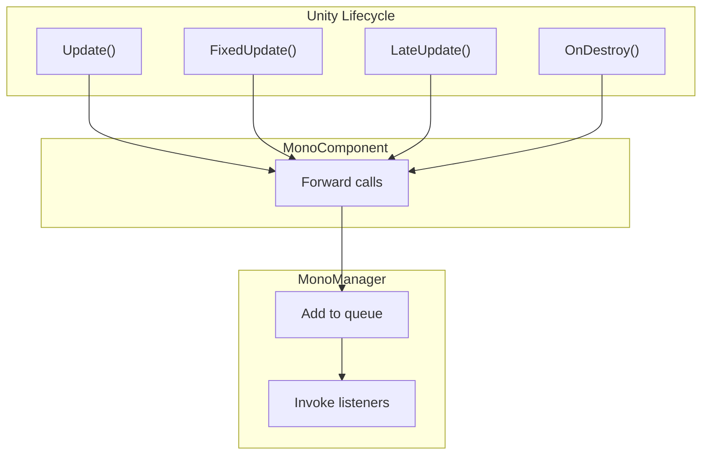

# MonoManager

MonoManager is the core manager of the GameFrameX Mono component, responsible for managing all lifecycle event listeners.

## Overview

MonoManager inherits from `GameFrameworkModule` and implements `IMonoManager` interface. It provides centralized management of all MonoBehaviour lifecycle events, allowing developers to subscribe to lifecycle events from any location without the need to create additional MonoBehaviour scripts.

## Core Functions

### 1. Listener Registration

MonoManager provides the following listener registration methods:

| Method | Description |
|--------|-------------|
| `AddUpdateListener` | Register Update event listener |
| `AddFixedUpdateListener` | Register FixedUpdate event listener |
| `AddLateUpdateListener` | Register LateUpdate event listener |
| `AddDestroyListener` | Register OnDestroy event listener |
| `AddOnApplicationFocusListener` | Register OnApplicationFocus event listener |
| `AddOnApplicationPauseListener` | Register OnApplicationPause event listener |

### 2. Listener Removal

Corresponding removal methods:

| Method | Description |
|--------|-------------|
| `RemoveUpdateListener` | Remove Update event listener |
| `RemoveFixedUpdateListener` | Remove FixedUpdate event listener |
| `RemoveLateUpdateListener` | Remove LateUpdate event listener |
| `RemoveDestroyListener` | Remove OnDestroy event listener |
| `RemoveOnApplicationFocusListener` | Remove OnApplicationFocus event listener |
| `RemoveOnApplicationPauseListener` | Remove OnApplicationPause event listener |

## Internal Implementation

### Data Structure

MonoManager uses `LinkedList<T>` to store listeners, providing the following advantages:
- O(1) time complexity for adding and removing elements
- No memory allocation during resize (unlike List<T>)
- Efficient traversal

### Thread Safety

All listener operations use `lock` for thread safety:

```csharp
public void AddUpdateListener(Action<float, float> action)
{
    lock (Lock)
    {
        _updateQueue.AddLast(action);
    }
}
```

### Exception Isolation

Each listener invocation is wrapped in try-catch to ensure one listener's exception does not affect others:

```csharp
private static void QueueInvoking(LinkedList<Action<float, float>> list, ...)
{
    lock (Lock)
    {
        foreach (var action in list)
        {
            try
            {
                action.Invoke(elapseSeconds, fixedElapseSeconds);
            }
            catch (Exception e)
            {
                Log.Error(e);
            }
        }
    }
}
```

## Lifecycle Binding

MonoManager is bound to Unity's lifecycle through MonoComponent:



## Singleton Instance

MonoManager uses singleton pattern, accessed via `MonoManager.Instance`:

```csharp
// Get singleton instance
var manager = MonoManager.Instance;

// Register listener
manager.AddUpdateListener(OnUpdate);

private void OnUpdate(float elapse, float realElapse)
{
    // Logic
}
```

## Related Links

- [MonoComponent](monocomponent.md) - Unity component interface
- [Event Types](event-types.md) - All event types information
- [Event Args](event-args.md) - Event parameter classes
