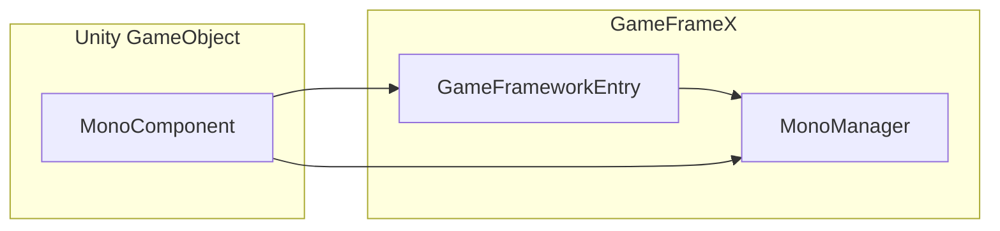

# MonoComponent

MonoComponent is the Unity component wrapper for MonoManager, providing a Unity-friendly interface.

## Overview

MonoComponent inherits from `GameFrameworkComponent` and provides all lifecycle event subscription/removal methods that MonoManager offers, while integrating seamlessly with the Unity component system.

## Component Features

### 1. Automatic Initialization

MonoComponent automatically initializes MonoManager in `Awake()`:

```csharp
protected override void Awake()
{
    base.Awake();
    m_MonoManager = GameFrameworkEntry.GetModule<IMonoManager>();
}
```

### 2. Attribute Configuration

Uses Unity attributes for editor configuration:

```csharp
[DisallowMultipleComponent]
[AddComponentMenu("GameFrameX/Mono")]
public class MonoComponent : GameFrameworkComponent
```

- `[DisallowMultipleComponent]`: Prevents multiple MonoComponent instances on the same GameObject
- `[AddComponentMenu]`: Adds menu item in Unity's Add Component menu

### 3. Automatic Lifecycle Binding

Automatically binds to Unity's lifecycle methods and forwards to MonoManager:

```csharp
private void Update()
{
    m_MonoManager?.OnUpdate(Time.deltaTime, Time.unscaledDeltaTime);
}

private void FixedUpdate()
{
    m_MonoManager?.OnFixedUpdate(Time.fixedDeltaTime, Time.fixedUnscaledDeltaTime);
}

private void LateUpdate()
{
    m_MonoManager?.OnLateUpdate(Time.deltaTime, Time.fixedUnscaledDeltaTime);
}

private void OnDestroy()
{
    m_MonoManager?.OnDestroy();
}
```

## API Reference

### Listener Registration Methods

| Method | Description |
|--------|-------------|
| `AddUpdateListener(Action<float, float>)` | Subscribe to Update event |
| `AddFixedUpdateListener(Action<float, float>)` | Subscribe to FixedUpdate event |
| `AddLateUpdateListener(Action<float, float>)` | Subscribe to LateUpdate event |
| `AddDestroyListener(Action)` | Subscribe to OnDestroy event |
| `AddOnApplicationFocusListener(Action<bool>)` | Subscribe to OnApplicationFocus event |
| `AddOnApplicationPauseListener(Action<bool>)` | Subscribe to OnApplicationPause event |

### Listener Removal Methods

| Method | Description |
|--------|-------------|
| `RemoveUpdateListener(Action<float, float>)` | Unsubscribe from Update event |
| `RemoveFixedUpdateListener(Action<float, float>)` | Unsubscribe from FixedUpdate event |
| `RemoveLateUpdateListener(Action<float, float>)` | Unsubscribe from LateUpdate event |
| `RemoveDestroyListener(Action)` | Unsubscribe from OnDestroy event |
| `RemoveOnApplicationFocusListener(Action<bool>)` | Unsubscribe from OnApplicationFocus event |
| `RemoveOnApplicationPauseListener(Action<bool>)` | Unsubscribe from OnApplicationPause event |

## Usage Example

```csharp
public class MyClass : MonoBehaviour
{
    private MonoComponent _monoComponent;

    private void Awake()
    {
        _monoComponent = GetComponent<MonoComponent>();
    }

    private void OnEnable()
    {
        _monoComponent.AddUpdateListener(OnUpdate);
        _monoComponent.AddOnApplicationPauseListener(OnPause);
    }

    private void OnDisable()
    {
        _monoComponent.RemoveUpdateListener(OnUpdate);
        _monoComponent.RemoveOnApplicationPauseListener(OnPause);
    }

    private void OnUpdate(float elapsed, float realElapsed)
    {
        // Logic
    }

    private void OnPause(bool isPaused)
    {
        // Pause logic
    }
}
```

## Relationship with MonoManager



MonoComponent provides a wrapper layer. The underlying work is done by MonoManager obtained through GameFrameworkEntry.

## Related Links

- [MonoManager](mono-manager.md) - Core manager implementation
- [Event Types](event-types.md) - All event types information
- [Event Args](event-args.md) - Event parameter classes
