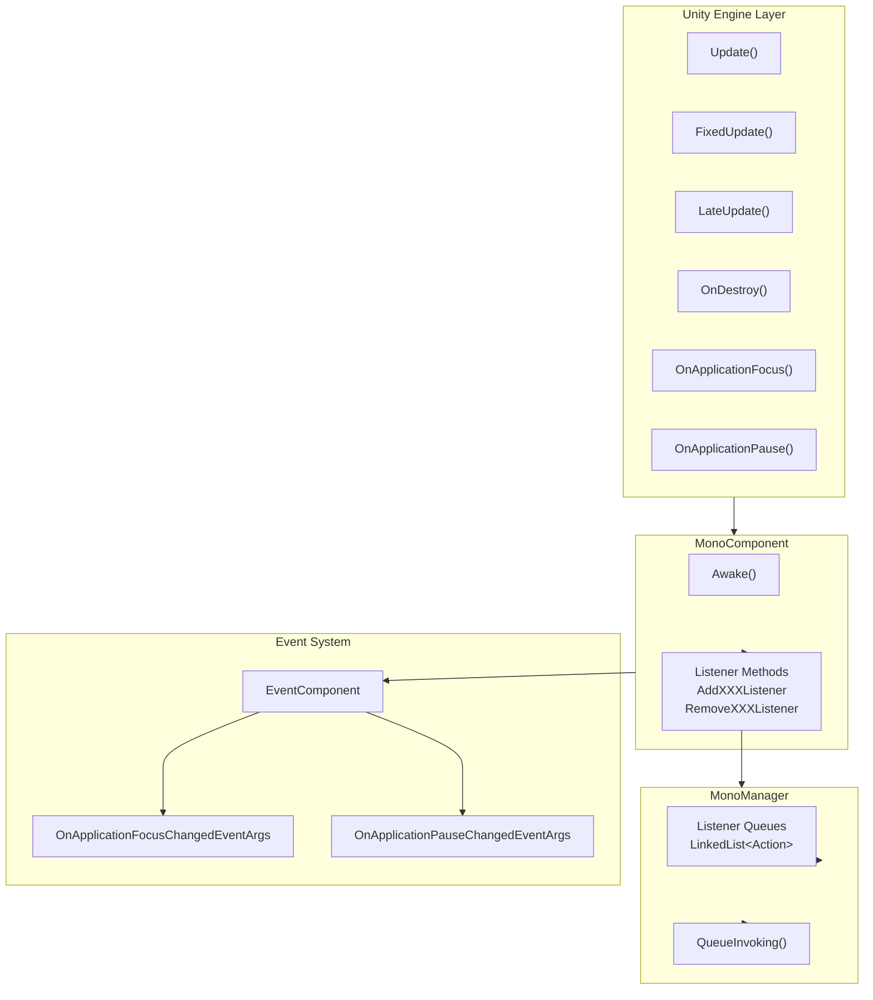

# FAQ

This document compiles common questions and answers when using GameFrameX Unity Mono lifecycle component.

## Overview

Mono lifecycle component is one of the core modules of the GameFrameX framework, used to uniformly manage various MonoBehaviour lifecycle events in Unity, including Update, FixedUpdate, LateUpdate, OnDestroy, OnApplicationFocus, and OnApplicationPause. This document aims to help developers quickly resolve common issues encountered during usage.

## Dependency Issues

### Q1: Compilation error - cannot find GameFrameX.Runtime namespace

**Problem Description:**
After adding Mono component to the project, compilation shows errors similar to:
```
The type or namespace name 'Runtime' does not exist in the namespace 'GameFrameX'
```

**Cause Analysis:**
Mono component depends on GameFrameX core runtime library. This library is the foundation of the entire GameFrameX framework and must be installed first.

**Solution:**
Install the `com.alianblank.gameframex.unity.runtime` package. Install by adding dependency to project's `manifest.json`:

```json
{
  "dependencies": {
    "com.alianblank.gameframex.unity.runtime": "https://github.com/GameFrameX/com.alianblank.gameframex.unity.runtime.git"
  }
}
```

> Source: [README.md](https://github.com/GameFrameX/com.gameframex.unity.mono/blob/main/README.md#L42)

---

### Q2: Compilation error - cannot find Event component

**Problem Description:**
The following error appears during compilation:
```
The type or namespace name 'Event' does not exist in the namespace 'GameFrameX'
```

**Cause Analysis:**
MonoComponent publishes game events through EventComponent when `OnApplicationFocus` and `OnApplicationPause` events are triggered. Therefore, Event component needs to be installed.

**Solution:**
Install Event component package:

```json
{
  "dependencies": {
    "com.alianblank.gameframex.unity.event": "https://github.com/GameFrameX/com.alianblank.gameframex.unity.event.git"
  }
}
```

> Source: [README.md](https://github.com/GameFrameX/com.gameframex.unity.mono/blob/main/README.md#L42)

---

## Usage Issues

### Q3: How to register Update listener?

**Problem Description:**
Developer wants to execute specific logic every frame but doesn't want to create additional MonoBehaviour script.

**Solution:**
Use listener methods provided by MonoComponent. First ensure MonoComponent exists in the scene (usually created automatically by GameFramework), then register listener through this component:

```csharp
// Get MonoComponent instance (via Unity component or GameEntry)
var monoComponent = GameEntry.GetComponent<MonoComponent>();

// Register Update listener
monoComponent.AddUpdateListener(OnGameUpdate);

// Define callback method
private void OnGameUpdate(float elapseSeconds, float realElapseSeconds)
{
    // elapseSeconds: elapsed time
    // realElapseSeconds: real elapsed time
    Debug.Log($"Update called, elapsed: {elapseSeconds}");
}

// Important: Remove listener when no longer needed
monoComponent.RemoveUpdateListener(OnGameUpdate);
```

> Source: [MonoComponent.cs](https://github.com/GameFrameX/com.gameframex.unity.mono/blob/main/Runtime/Mono/MonoComponent.cs#L186-L210)

---

### Q4: What's the difference between Update, FixedUpdate, and LateUpdate?

**Problem Description:**
These three methods all have corresponding listeners. Developer is not sure which one to choose.

**Technical Explanation:**
- **Update**: Called once per frame, call interval is not fixed, affected by frame rate. Suitable for most game logic.
- **FixedUpdate**: Called at fixed time intervals (default 0.02 seconds, i.e., 50 times/second). Suitable for physics-related logic.
- **LateUpdate**: Called after all Update calls complete. Suitable for camera follow and other logic that needs to execute after other updates.

**Usage Suggestions:**
- Normal game logic → Use Update
- Physics calculation related → Use FixedUpdate
- Camera follow, UI update, etc. → Use LateUpdate

```csharp
// Update example - execute every frame
monoComponent.AddUpdateListener((elapsed, realElapsed) => {
    // Main game logic
});

// FixedUpdate example - execute at fixed interval
monoComponent.AddFixedUpdateListener((elapsed, fixedElapsed) => {
    // Physics logic
});

// LateUpdate example - execute last
monoComponent.AddLateUpdateListener((elapsed, fixedElapsed) => {
    // Camera follow etc.
});
```

> Source: [MonoManager.cs](https://github.com/GameFrameX/com.gameframex.unity.mono/blob/main/Runtime/Mono/MonoManager.cs#L63-L76)

---

### Q5: What happens if listener is passed as null?

**Problem Description:**
Developer accidentally passed null when registering listener and wants to know what happens.

**Code Behavior:**
Looking at the source code, the system checks for null parameters and throws an exception:

```csharp
public void AddUpdateListener(Action<float, float> fun)
{
    if (fun == null)
    {
        Log.Fatal(nameof(fun) + "is invalid.");
        return;
    }
    _monoManager.AddUpdateListener(fun);
}
```

Passing null in MonoComponent logs a fatal message and returns directly without throwing an exception. Passing null in MonoManager throws `ArgumentNullException`.

> Source: [MonoComponent.cs](https://github.com/GameFrameX/com.gameframex.unity.mono/blob/main/Runtime/Mono/MonoComponent.cs#L188-L195)
> Source: [MonoManager.cs](https://github.com/GameFrameX/com.gameframex.unity.mono/blob/main/Runtime/Mono/MonoManager.cs#L176-L187)

---

### Q6: How to listen to application pause/resume events?

**Problem Description:**
Developer needs to execute specific operations when player switches to background or resumes game.

**Solution:**
Use `OnApplicationPause` listener:

```csharp
// Register pause listener
monoComponent.AddOnApplicationPauseListener(OnApplicationPauseChanged);

// Callback method
private void OnApplicationPauseChanged(bool isPaused)
{
    if (isPaused)
    {
        Debug.Log("Game paused");
        // Save game data
    }
    else
    {
        Debug.Log("Game resumed");
        // Restore game state
    }
}
```

Similarly, you can use `OnApplicationFocusListener` to listen for focus changes:

```csharp
monoComponent.AddOnApplicationFocusListener(OnApplicationFocusChanged);

private void OnApplicationFocusChanged(bool hasFocus)
{
    Debug.Log($"Application focus: {hasFocus}");
}
```

> Source: [MonoComponent.cs](https://github.com/GameFrameX/com.gameframex.unity.mono/blob/main/Runtime/Mono/MonoComponent.cs#L246-L270)

---

### Q7: Why recommended to use MonoComponent instead of directly using MonoManager?

**Problem Description:**
Developer can directly get MonoManager through `GameFrameworkEntry.GetModule<IMonoManager>()`. Why use MonoComponent?

**Design Explanation:**
MonoComponent inherits from Unity's MonoBehaviour with the following advantages:

1. **Automatic lifecycle binding**: MonoComponent automatically binds to Unity's lifecycle methods (Update, OnDestroy, etc.), no manual calls needed.
2. **Seamless integration with GameFramework**: MonoComponent is part of GameFramework's component system, easily accessible through GameEntry.
3. **Editor-friendly**: MonoComponent has `[DisallowMultipleComponent]` and `[AddComponentMenu("GameFrameX/Mono")]` attributes, easy to find and manage in Unity Editor.

```csharp
// Get MonoComponent through GameEntry
var monoComponent = GameEntry.GetComponent<MonoComponent>();

// Or get directly on GameObject in scene
var monoComponent = someGameObject.GetComponent<MonoComponent>();
```

> Source: [MonoComponent.cs](https://github.com/GameFrameX/com.gameframex.unity.mono/blob/main/Runtime/Mono/MonoComponent.cs#L42-L70)

---

## Lifecycle Management Issues

### Q8: What happens if listeners are not removed?

**Problem Description:**
Developer forgot to remove listeners when switching scenes or destroying objects and wants to know what problems will occur.

**Possible Consequences:**
1. **Memory leaks**: Objects referenced by listeners cannot be garbage collected.
2. **Null reference exceptions**: Listener callbacks try to access already destroyed objects.
3. **Logic errors**: Expired listeners may execute incorrect game logic.

**Best Practices:**
Always remove listeners at appropriate times, for example:

```csharp
public class MyController : MonoBehaviour
{
    private MonoComponent _monoComponent;

    private void OnEnable()
    {
        _monoComponent = GameEntry.GetComponent<MonoComponent>();
        _monoComponent.AddUpdateListener(OnUpdate);
        _monoComponent.AddDestroyListener(OnDestroy);
    }

    private void OnDisable()
    {
        if (_monoComponent != null)
        {
            _monoComponent.RemoveUpdateListener(OnUpdate);
            _monoComponent.RemoveDestroyListener(OnDestroy);
        }
    }

    private void OnUpdate(float elapse, float realElapse) { }
    private void OnDestroy() { }
}
```

---

### Q9: Is MonoManager thread safe?

**Problem Description:**
Developer uses listeners in multi-threaded environment and wants to know if there are thread safety issues.

**Technical Explanation:**
Yes, MonoManager is thread safe. All listener add and remove operations use `lock` for protection:

```csharp
public void AddUpdateListener(Action<float, float> action)
{
    if (action == null)
    {
        throw new ArgumentNullException(nameof(action));
    }

    lock (Lock)
    {
        _updateQueue.AddLast(action);
    }
}
```

However, note that listener callback execution is invoked from Unity's main thread, so you don't need to worry about thread safety issues in callbacks.

> Source: [MonoManager.cs](https://github.com/GameFrameX/com.gameframex.unity.mono/blob/main/Runtime/Mono/MonoManager.cs#L364-L380)

---

## Event System Issues

### Q10: How to listen to application status changes through event system?

**Problem Description:**
In addition to listener callbacks, developer also wants to respond to application status changes through event system.

**Solution:**
MonoComponent publishes game events when triggering OnApplicationFocus and OnApplicationPause. You can respond by subscribing to these events:

```csharp
// Subscribe to events
EventComponent eventComponent = GameEntry.GetComponent<EventComponent>();
eventComponent.Subscribe<OnApplicationFocusChangedEventArgs>(OnFocusChanged);
eventComponent.Subscribe<OnApplicationPauseChangedEventArgs>(OnPauseChanged);

// Event handling methods
private void OnFocusChanged(object sender, OnApplicationFocusChangedEventArgs e)
{
    Debug.Log($"Focus changed: {e.IsFocus}");
}

private void OnPauseChanged(object sender, OnApplicationPauseChangedEventArgs e)
{
    Debug.Log($"Pause status: {e.IsPause}");
}

// Unsubscribe
eventComponent.Unsubscribe<OnApplicationFocusChangedEventArgs>(OnFocusChanged);
eventComponent.Unsubscribe<OnApplicationPauseChangedEventArgs>(OnPauseChanged);
```

> Source: [OnApplicationFocusChangedEventArgs.cs](https://github.com/GameFrameX/com.gameframex.unity.mono/blob/main/Runtime/EventArgs/OnApplicationFocusChangedEventArgs.cs#L40-L87)

---

## Installation Issues

### Q11: How to install Mono component?

**Problem Description:**
First-time user of this plugin, unsure how to correctly install.

**Solution:**
There are three installation methods to choose from:

**Method 1: Installation via manifest.json (Recommended)**
Add dependency in project's `Packages/manifest.json`:

```json
{
  "dependencies": {
    "com.gameframex.unity.mono": "https://github.com/GameFrameX/com.gameframex.unity.mono.git"
  }
}
```

**Method 2: Via Unity Package Manager**
1. Open Unity Editor
2. Go to Window → Package Manager
3. Click + button, select "Add package from git URL"
4. Enter: `https://github.com/GameFrameX/com.gameframex.unity.mono.git`

**Method 3: Direct Download**
Directly download from GitHub, copy content to Unity project's `Packages` directory, system will automatically recognize and load.

> Source: [README.md](https://github.com/GameFrameX/com.gameframex.unity.mono/blob/main/README.md#L44-L51)

---

## Architecture Diagram

The following diagram shows Mono component's internal architecture and event flow:



**Diagram Explanation:**
1. Unity Engine's lifecycle methods automatically call into MonoComponent
2. MonoComponent exposes public listener methods for external calls
3. MonoManager internally uses thread-safe LinkedList to store listeners
4. OnApplicationFocus and OnApplicationPause events are also published to Event system

---

## Related Links

- [Overview](../1-overview.1-introduction)
- [Installation Guide](../2-installation.1-installation-methods)
- [Quick Start](../3-getting-started.1-basic-usage)
- [MonoManager Details](../4-core-components.1-monomanager)
- [MonoComponent Details](../4-core-components.2-monocomponent)
- [Event Types](../5-events.1-event-types)
- [Event Args](../5-events.2-event-args)
