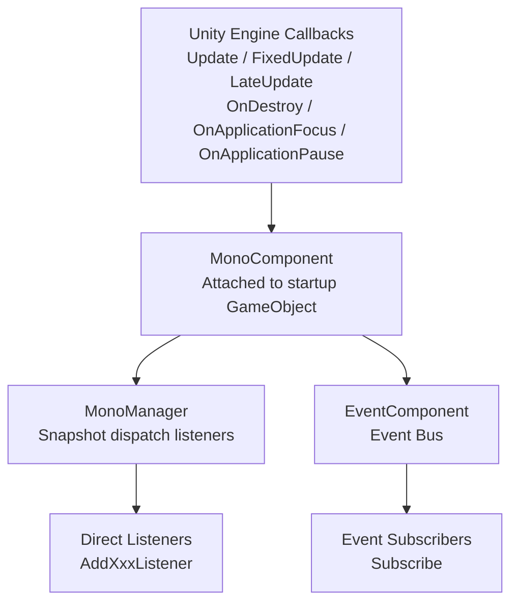

# Mono Component Package Introduction

`com.gameframex.unity.mono` is the Mono lifecycle component package under the GameFrameX framework. It is used to uniformly register Unity `MonoBehaviour` callbacks such as `Update`, `FixedUpdate`, `LateUpdate`, `OnDestroy`, `OnApplicationFocus`, and `OnApplicationPause` into a global listener list, allowing the business side to subscribe to these events without inheriting from `MonoBehaviour`. The package uses a two-level collaboration between `MonoComponent` (attached to the GameFramework startup GameObject) and `MonoManager` (the actual dispatcher), and forwards focus/pause events to the `EventComponent` event bus.

## Quick Start

### 1. Install the Package

Edit the Unity project's `Packages/manifest.json` and add the following to `dependencies`:

```json
"com.gameframex.unity.mono": "1.1.1"
```

If the GameFrameX UPM registry has not been configured yet, you also need to declare `scopedRegistries` (`scopes: ["com.gameframex"]`) and point it to `https://gameframex.upm.alianblank.uk`. See `README.zh-CN.md` for a complete example.

The only dependency is `com.gameframex.unity.event` 1.1.0.

### 2. Attach MonoComponent

Attach `MonoComponent` to the GameFramework startup GameObject (at the same level as `EventComponent`, `BaseComponent`, etc.). This component uses reflection in `Awake` to find the `MonoManager` implementation class, and obtains the `EventComponent` in `Start` for forwarding focus/pause events.

```csharp
// MonoComponent class declaration and component menu path
[DisallowMultipleComponent]
[AddComponentMenu("GameFrameX/Mono")]
public sealed class MonoComponent : GameFrameworkComponent
```

Source: [MonoComponent.cs#L42-L44](https://github.com/GameFrameX/com.gameframex.unity.mono/blob/main/Runtime/Mono/MonoComponent.cs#L42-L44)

### 3. Register Lifecycle Listeners

Get the component in any script first, then register callbacks:

```csharp
var monoComponent = GameEntry.GetComponent<MonoComponent>();

private void OnUpdate(float elapseSeconds, float realElapseSeconds) { /* every frame */ }
private void OnFixedUpdate(float elapseSeconds, float realElapseSeconds) { /* physics step */ }
private void OnLateUpdate(float elapseSeconds, float realElapseSeconds) { /* end of frame */ }
private void OnDestroyCallback() { /* component destroyed */ }
private void OnApplicationFocus(bool isFocus) { /* focus changed */ }
private void OnApplicationPause(bool isPause) { /* pause changed */ }

monoComponent.AddUpdateListener(OnUpdate);
monoComponent.AddFixedUpdateListener(OnFixedUpdate);
monoComponent.AddLateUpdateListener(OnLateUpdate);
monoComponent.AddDestroyListener(OnDestroyCallback);
monoComponent.AddOnApplicationFocusListener(OnApplicationFocus);
monoComponent.AddOnApplicationPauseListener(OnApplicationPause);
```

The `elapseSeconds` parameter of `Update / FixedUpdate / LateUpdate` callbacks is the scaled delta time, and `realElapseSeconds` is the unscaled real delta time, both defined on the `IMonoManager` interface.

Source: [IMonoManager.cs](https://github.com/GameFrameX/com.gameframex.unity.mono/blob/main/Runtime/Mono/IMonoManager.cs)

### 4. Focus/Pause Event Bus Subscription (Optional)

When `MonoComponent` receives Unity focus/pause callbacks, in addition to invoking the direct listeners, it also dispatches events to `EventComponent`, allowing the business side to subscribe via the event bus:

```csharp
var eventComponent = GameEntry.GetComponent<EventComponent>();
eventComponent.Subscribe(OnApplicationFocusChangedEventArgs.EventId, OnFocusChanged);
eventComponent.Subscribe(OnApplicationPauseChangedEventArgs.EventId, OnPauseChanged);

private void OnFocusChanged(object sender, GameEventArgs e)
{
    var args = (OnApplicationFocusChangedEventArgs)e;
    if (args.IsFocus) { /* gained focus */ }
}
private void OnPauseChanged(object sender, GameEventArgs e)
{
    var args = (OnApplicationPauseChangedEventArgs)e;
    if (args.IsPause) { /* entered pause */ }
}
```

The events are fired by `MonoComponent.OnApplicationFocus / OnApplicationPause` via `EventComponent.Fire`.

Source: [MonoComponent.cs#L111-L141](https://github.com/GameFrameX/com.gameframex.unity.mono/blob/main/Runtime/Mono/MonoComponent.cs#L111-L141)

## How It Works at a Glance

The entire package has only two main chains: `Unity Callback → MonoComponent → MonoManager → Business Listener`, and `Unity Callback → MonoComponent → EventComponent → Event Subscriber`.



## Next Steps

- For details on registering and removing listeners and thread safety notes, see [README.zh-CN.md](https://github.com/GameFrameX/com.gameframex.unity.mono/blob/main/README.zh-CN.md)
- For interface signatures and default implementations, see [IMonoManager.cs](https://github.com/GameFrameX/com.gameframex.unity.mono/blob/main/Runtime/Mono/IMonoManager.cs) and [MonoManager.cs](https://github.com/GameFrameX/com.gameframex.unity.mono/blob/main/Runtime/Mono/MonoManager.cs)
- For event argument definitions, see [OnApplicationFocusChangedEventArgs.cs](https://github.com/GameFrameX/com.gameframex.unity.mono/blob/main/Runtime/EventArgs/OnApplicationFocusChangedEventArgs.cs) and [OnApplicationPauseChangedEventArgs.cs](https://github.com/GameFrameX/com.gameframex.unity.mono/blob/main/Runtime/EventArgs/OnApplicationPauseChangedEventArgs.cs)
- For Inspector customization, see [MonoComponentInspector.cs](https://github.com/GameFrameX/com.gameframex.unity.mono/blob/main/Editor/Inspector/MonoComponentInspector.cs)
- For unit test references, see [UnitTests.cs](https://github.com/GameFrameX/com.gameframex.unity.mono/blob/main/Tests/UnitTests.cs)