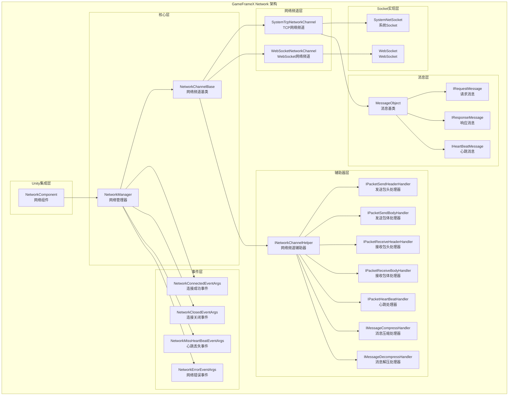
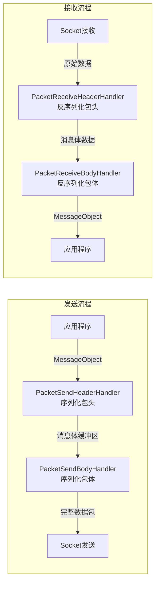
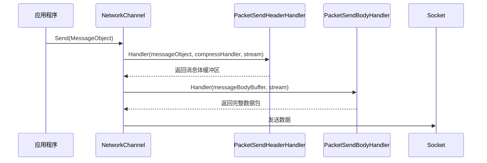
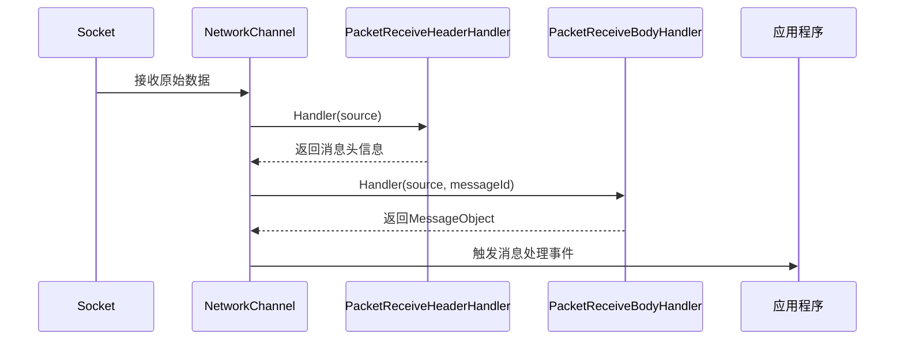
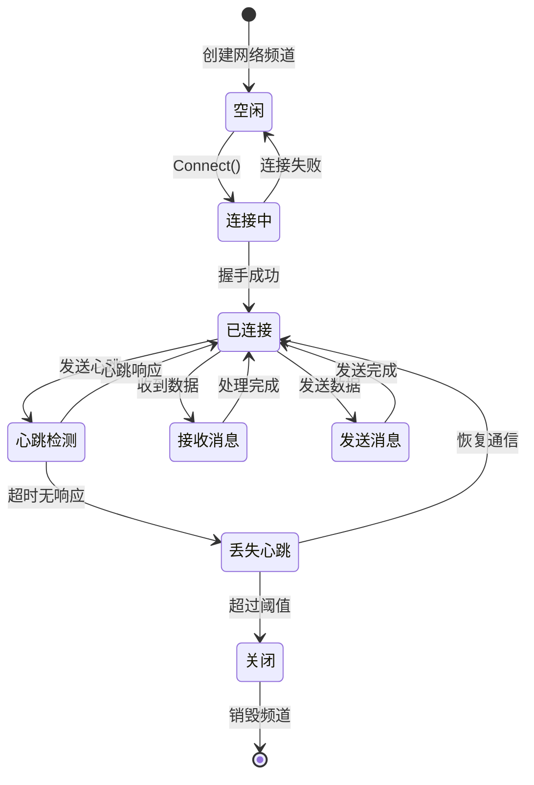
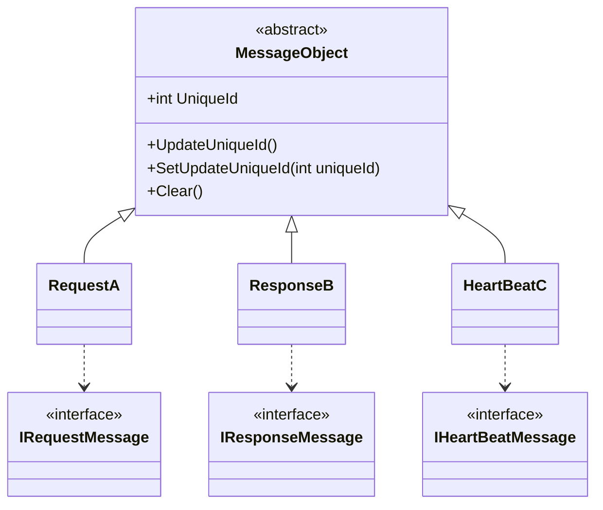
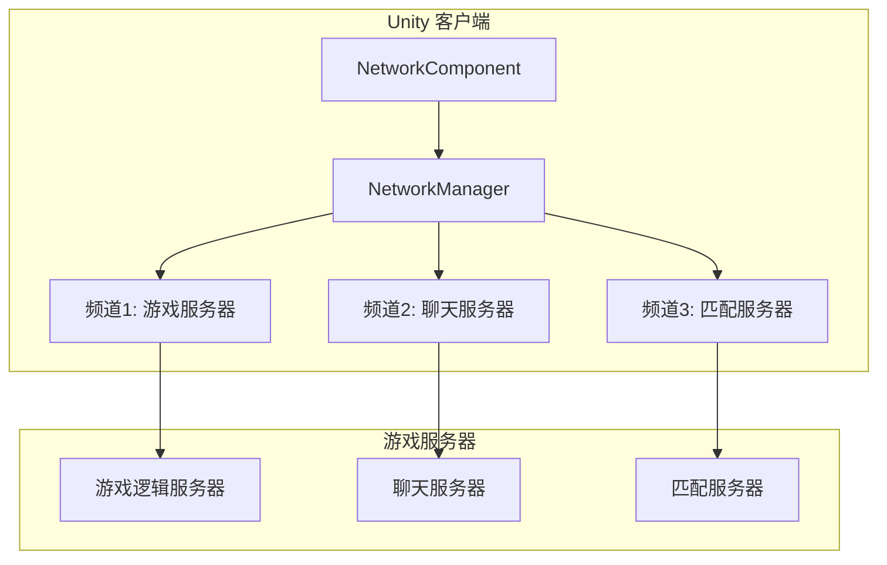

# 概述

GameFrameX Network 长connectNetwork Component是 GameFrameX 框架的核心网络模块，为 Unity 游戏provides可靠的长connect通信能力。该组件supports TCP 和 WebSocket 两种传输协议，Implements了完整的Heartbeat Mechanism、RPC Remote Procedure Call、Message Compression等功能。

> Source: [README.md](https://github.com/GameFrameX/com.gameframex.unity.network/blob/main/README.md#L1-L9)

## Overview

GameFrameX Network 长connectNetwork Component是专门为 Unity 游戏设计的高性能网络通信库。作为 GameFrameX 框架的核心组件之一，它provides了稳定、可靠的长connect网络通信能力，suitable for各类需要与Server进行实时数据交互的游戏场景。

该组件adopts模块化设计，将网络connect的各个方面（connectManages、消息serialize、Heartbeat Check、事件通知等）解耦为独立的组件，开发者可以根据实际需求灵活configuration和扩展。

## Architecture



### 核心组件Description

#### 1. NetworkManager（网络Manages器）

NetworkManager 是整个Network Component的核心，responsible forManages所有的Network Channel（NetworkChannel）。它Inherits from GameFrameworkModule，是 GameFrameX 框架的标准模块Implements。

```csharp
public sealed partial class NetworkManager : GameFrameworkModule, INetworkManager
{
    private readonly Dictionary<string, NetworkChannelBase> m_NetworkChannels;
}
```

> Source: [NetworkManager.cs](https://github.com/GameFrameX/com.gameframex.unity.network/blob/main/Runtime/Network/Network/NetworkManager.cs#L37-L63)

**主要Responsibility：**
- Creates和destroyNetwork Channel
- Manages多个concurrent网络connect
- 触发网络相关事件
- 轮询update所有Network Channel状态

#### 2. NetworkChannel（Network Channel）

Network Channel代表一个独立的网络connect。每个频道都有唯一的名称，supports TCP 和 WebSocket 两种Implements：

- **SystemTcpNetworkChannel**：基于 System.Net.Sockets 的 TCP connectImplements
- **WebSocketNetworkChannel**：基于 WebSocket 的connectImplements（suitable for WebGL 平台）

```csharp
#if (ENABLE_GAME_FRAME_X_WEB_SOCKET && UNITY_WEBGL) || FORCE_ENABLE_GAME_FRAME_X_WEB_SOCKET
    NetworkChannelBase networkChannel = new WebSocketNetworkChannel(channelName, networkChannelHelper, rpcTimeout);
#else
    NetworkChannelBase networkChannel = new SystemTcpNetworkChannel(channelName, networkChannelHelper, rpcTimeout);
#endif
```

> Source: [NetworkManager.cs](https://github.com/GameFrameX/com.gameframex.unity.network/blob/main/Runtime/Network/Network/NetworkManager.cs#L212-L216)

#### 3. 消息process管道

消息processadopts分层管道设计，每层responsible for特定的功能：



#### 4. Event System

Network ComponentthroughEvent System通知Applicationconnect状态的变化：

| 事件 | Description | Usage |
|------|------|------|
| NetworkConnected | connectsuccess事件 | 触发时机：success建立网络connect |
| NetworkClosed | connectClosed事件 | 触发时机：网络connect被Closed |
| NetworkMissHeartBeat | 心跳丢失事件 | 触发时机：连续Heartbeat Lost达到阈值 |
| NetworkError | 网络error事件 | 触发时机：发生网络error |

## Features

### 1. 多通道supports

NetworkManager supports同时Manages多个Network Channel，每个频道可以独立connect到不同的Server：

```csharp
// 创建多个网络频道
var channel1 = networkManager.CreateNetworkChannel("GameServer", helper1, 5000);
var channel2 = networkManager.CreateNetworkChannel("ChatServer", helper2, 3000);
```

> Source: [NetworkManager.cs](https://github.com/GameFrameX/com.gameframex.unity.network/blob/main/Runtime/Network/Network/NetworkManager.cs#L196-L223)

### 2. RPC Remote Procedure Call

组件supports RPC 风格的请求-响应模式，through Task Implementsasynchronous等待：

```csharp
// 发送 RPC 请求并等待响应
Task<TResult> Call<TResult>(MessageObject messageObject, bool isIgnoreErrorCode = false) where TResult : MessageObject, IResponseMessage;
```

> Source: [INetworkChannel.cs](https://github.com/GameFrameX/com.gameframex.unity.network/blob/main/Runtime/Network/Interface/INetworkChannel.cs#L235-L241)

### 3. Heartbeat Mechanism

内置Heartbeat Check机制，used for检测connect是否仍然存活：

- **默认心跳间隔**：30秒
- **默认允许丢失次数**：10次
- **supports焦点心跳**：Application失去焦点时是否continuesend心跳

```csharp
/// <summary>
/// 默认心跳间隔
/// </summary>
private const float DefaultHeartBeatInterval = 30f;

/// <summary>
/// 默认心跳丢失断开次数
/// </summary>
private const int DefaultMissHeartBeatCountByClose = 10;
```

> Source: [NetworkManager.NetworkChannelBase.cs](https://github.com/GameFrameX/com.gameframex.unity.network/blob/main/Runtime/Network/Network/NetworkManager.NetworkChannelBase.cs#L50-L57)

### 4. Message Compression

supports自定义Message Compressionprocess器，减少网络带宽占用：

```csharp
public interface IMessageCompressHandler
{
    byte[] Compress(byte[] data);
}

public interface IMessageDecompressHandler
{
    byte[] Decompress(byte[] data);
}
```

> Source: [IMessageCompressHandler.cs](https://github.com/GameFrameX/com.gameframex.unity.network/blob/main/Runtime/Network/Interface/IMessageCompressHandler.cs)

### 5. Unity 集成

through NetworkComponent 组件，可以方便地在 Unity 场景中Uses网络功能：

```csharp
[DisallowMultipleComponent]
[AddComponentMenu("GameFrameX/Network")]
public sealed class NetworkComponent : GameFrameworkComponent
{
    [SerializeField] private int m_rpcTimeout = 5000;
    [SerializeField] private bool m_FocusHeartbeat = false;
}
```

> Source: [NetworkComponent.cs](https://github.com/GameFrameX/com.gameframex.unity.network/blob/main/Runtime/Network/NetworkComponent.cs#L39-L68)

## 数据流程

### 消息send流程



### 消息receive流程



### connect生命周期



## Message Types体系

所有网络消息都Inherits自 MessageObject 基类：



> Source: [MessageObject.cs](https://github.com/GameFrameX/com.gameframex.unity.network/blob/main/Runtime/Network/Base/MessageObject.cs#L1-L56)

## Uses场景

### 典型游戏网络架构



### 适用场景

1. **实时游戏通信**：玩家动作synchronize、状态update
2. **多人在线游戏**：房间Manages、玩家列表、聊天功能
3. **数据持久化**：游戏存档云端synchronize
4. **实时排行榜**：分数上传、排名查询
5. **匹配系统**：玩家匹配、对战房间Creates

## Platform Support

| 平台 | supports情况 | Description |
|------|----------|------|
| Windows | ✅ 完全supports | TCP + WebSocket |
| macOS | ✅ 完全supports | TCP + WebSocket |
| Linux | ✅ 完全supports | TCP + WebSocket |
| Android | ✅ 完全supports | TCP + WebSocket |
| iOS | ✅ 完全supports | TCP + WebSocket |
| WebGL | ⚠️ 部分supports | 仅 WebSocket |

## 版本information

Current Version：2.5.0

该组件adopts MIT 许可证与 Apache License 2.0 双许可证分发。

> Source: [CHANGELOG.md](https://github.com/GameFrameX/com.gameframex.unity.network/blob/main/CHANGELOG.md#L1-L22)

## Related Links

- [Installation Guide](./2-installation)
- [Getting Started](./3-getting-started)
- [网络Manages器](./4-core-concepts.1-network-manager)
- [Network Channel](./4-core-concepts.2-network-channel)
- [Message Types](./4-core-concepts.3-message-types)
- [数据包process器](./4-core-concepts.4-packet-handlers)
- [Heartbeat Mechanism](./5-heartbeat)
- [Event System](./6-events)
- [Message Compression](./7-message-compression)
- [RPCRemote Procedure Call](./8-rpc)
- [Edit器configuration](./9-editor-configuration)
- [Troubleshooting](./10-troubleshooting)
