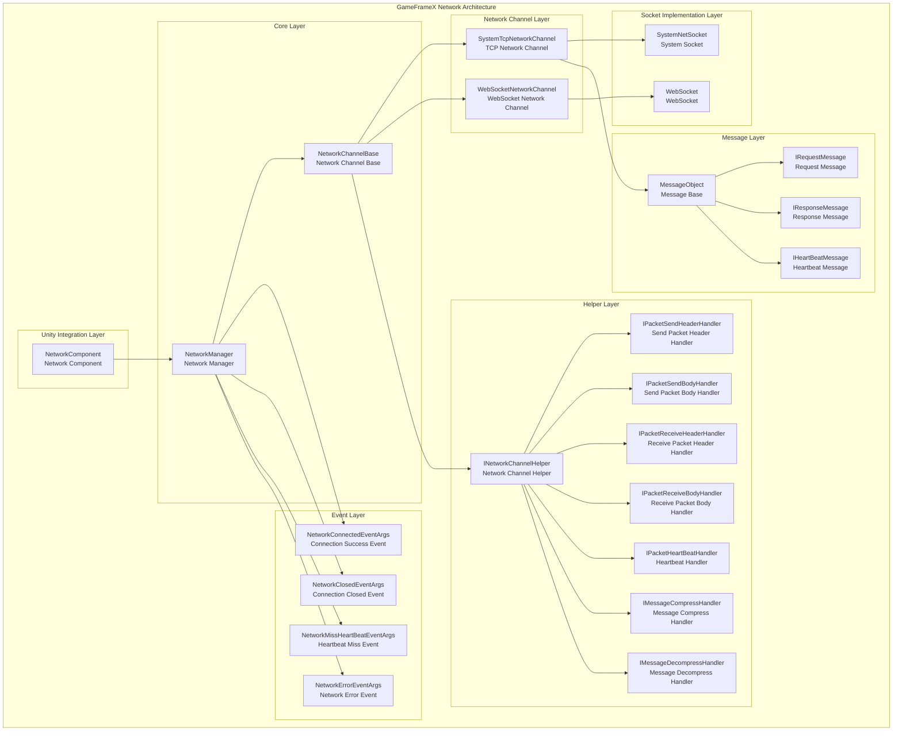
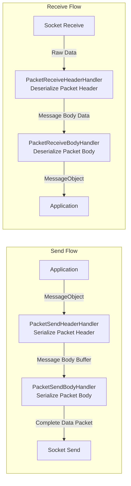
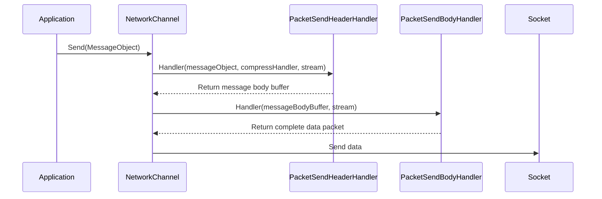
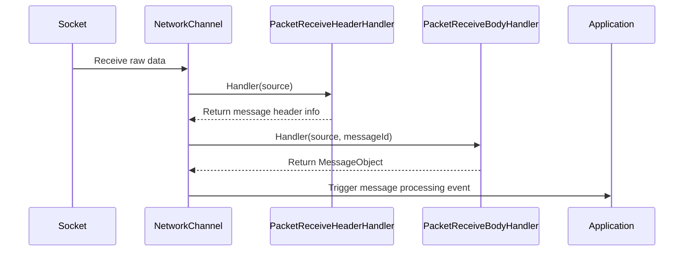
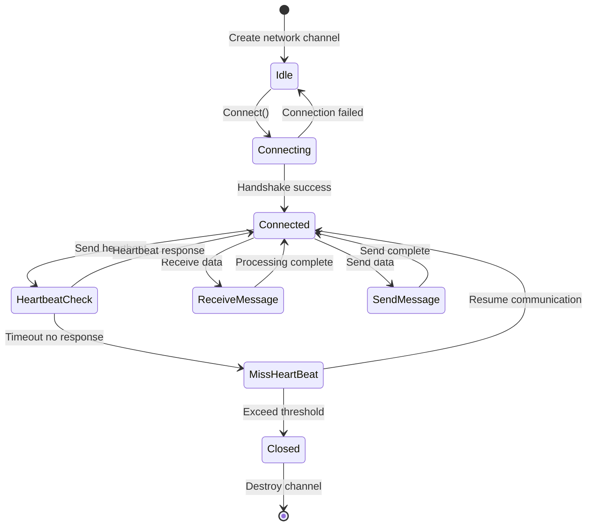
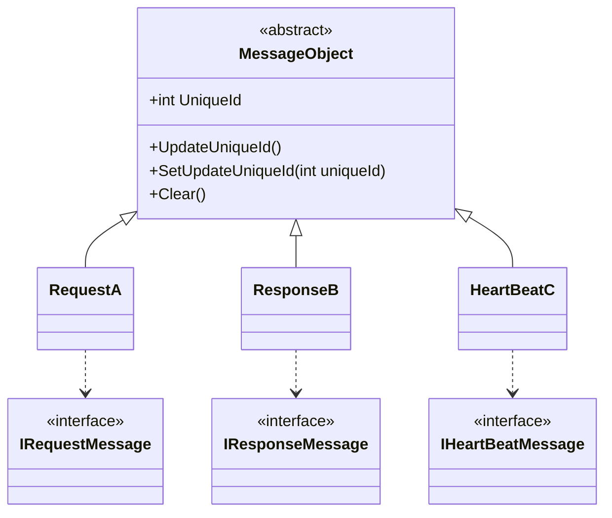
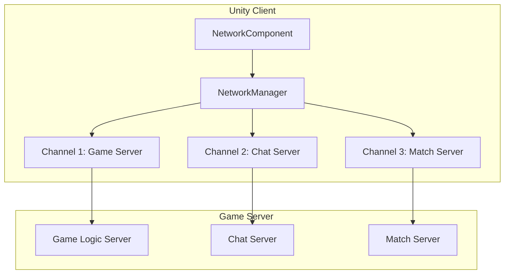

# Overview

GameFrameX Network long-connection Network component is the core network module of the GameFrameX framework, providing reliable long-connection communication capability for Unity games. This component supports TCP and WebSocket two transport protocols, implementing complete Heartbeat Mechanism, RPC Remote Procedure Call, Message Compression, and other features.

> Source: [README.md](https://github.com/GameFrameX/com.gameframex.unity.network/blob/main/README.md#L1-L9)

## Overview

GameFrameX Network long-connection Network component is a high-performance network communication library specifically designed for Unity games. As one of the core components of the GameFrameX framework, it provides stable, reliable long-connection network communication capability, suitable for various game scenarios that require real-time data interaction with the server.

This component adopts modular design, decoupling various aspects of network connection (connection management, message serialization, heartbeat check, event notifications, etc.) into independent components. Developers can flexibly configure and extend according to actual needs.

## Architecture



### Core Component Description

#### 1. NetworkManager

NetworkManager is the core of the entire Network component, responsible for managing all Network Channels. It inherits from GameFrameworkModule and is a standard module implementation of the GameFrameX framework.

```csharp
public sealed partial class NetworkManager : GameFrameworkModule, INetworkManager
{
    private readonly Dictionary<string, NetworkChannelBase> m_NetworkChannels;
}
```

> Source: [NetworkManager.cs](https://github.com/GameFrameX/com.gameframex.unity.network/blob/main/Runtime/Network/Network/NetworkManager.cs#L37-L63)

**Main Responsibilities:**
- Create and destroy Network Channels
- Manage multiple concurrent network connections
- Trigger network-related events
- Poll and update all Network Channel states

#### 2. NetworkChannel

Network Channel represents an independent network connection. Each channel has a unique name and supports TCP and WebSocket implementations:

- **SystemTcpNetworkChannel**: TCP connection implementation based on System.Net.Sockets
- **WebSocketNetworkChannel**: Connection implementation based on WebSocket (suitable for WebGL platform)

```csharp
#if (ENABLE_GAME_FRAME_X_WEB_SOCKET && UNITY_WEBGL) || FORCE_ENABLE_GAME_FRAME_X_WEB_SOCKET
    NetworkChannelBase networkChannel = new WebSocketNetworkChannel(channelName, networkChannelHelper, rpcTimeout);
#else
    NetworkChannelBase networkChannel = new SystemTcpNetworkChannel(channelName, networkChannelHelper, rpcTimeout);
#endif
```

> Source: [NetworkManager.cs](https://github.com/GameFrameX/com.gameframex.unity.network/blob/main/Runtime/Network/Network/NetworkManager.cs#L212-L216)

#### 3. Message Processing Pipeline

Message processing adopts layered pipeline design, each layer responsible for specific functions:



#### 4. Event System

Network component notifies applications of connection status changes through Event System:

| Event | Description | Trigger Timing |
|------|------|------|
| NetworkConnected | Connection success event | When network connection is successfully established |
| NetworkClosed | Connection closed event | When network connection is closed |
| NetworkMissHeartBeat | Heartbeat miss event | When consecutive heartbeat misses reach threshold |
| NetworkError | Network error event | When a network error occurs |

## Features

### 1. Multi-Channel Support

NetworkManager supports managing multiple Network Channels simultaneously, each channel can independently connect to different servers:

```csharp
// Create multiple network channels
var channel1 = networkManager.CreateNetworkChannel("GameServer", helper1, 5000);
var channel2 = networkManager.CreateNetworkChannel("ChatServer", helper2, 3000);
```

> Source: [NetworkManager.cs](https://github.com/GameFrameX/com.gameframex.unity.network/blob/main/Runtime/Network/Network/NetworkManager.cs#L196-L223)

### 2. RPC Remote Procedure Call

The component supports RPC-style request-response mode, implementing asynchronous waiting through Task:

```csharp
// Send RPC request and wait for response
Task<TResult> Call<TResult>(MessageObject messageObject, bool isIgnoreErrorCode = false) where TResult : MessageObject, IResponseMessage;
```

> Source: [INetworkChannel.cs](https://github.com/GameFrameX/com.gameframex.unity.network/blob/main/Runtime/Network/Interface/INetworkChannel.cs#L235-L241)

### 3. Heartbeat Mechanism

Built-in heartbeat check mechanism, used for detecting if connection is still alive:

- **Default heartbeat interval**: 30 seconds
- **Default allowed miss count**: 10 times
- **Focus heartbeat support**: Whether to continue sending heartbeat when application loses focus

```csharp
/// <summary>
/// Default heartbeat interval
/// </summary>
private const float DefaultHeartBeatInterval = 30f;

/// <summary>
/// Default heartbeat miss count to close
/// </summary>
private const int DefaultMissHeartBeatCountByClose = 10;
```

> Source: [NetworkManager.NetworkChannelBase.cs](https://github.com/GameFrameX/com.gameframex.unity.network/blob/main/Runtime/Network/Network/NetworkManager.NetworkChannelBase.cs#L50-L57)

### 4. Message Compression

Supports custom message compression processor to reduce network bandwidth consumption:

```csharp
public interface IMessageCompressHandler
{
    byte[] Compress(byte[] data);
}

public interface IMessageDecompressHandler
{
    byte[] Decompress(byte[] data);
}
```

> Source: [IMessageCompressHandler.cs](https://github.com/GameFrameX/com.gameframex.unity.network/blob/main/Runtime/Network/Interface/IMessageCompressHandler.cs)

### 5. Unity Integration

Through NetworkComponent component, network functions can be conveniently used in Unity scenes:

```csharp
[DisallowMultipleComponent]
[AddComponentMenu("GameFrameX/Network")]
public sealed class NetworkComponent : GameFrameworkComponent
{
    [SerializeField] private int m_rpcTimeout = 5000;
    [SerializeField] private bool m_FocusHeartbeat = false;
}
```

> Source: [NetworkComponent.cs](https://github.com/GameFrameX/com.gameframex.unity.network/blob/main/Runtime/Network/NetworkComponent.cs#L39-L68)

## Data Flow

### Message Send Flow



### Message Receive Flow



### Connection Lifecycle



## Message Types System

All network messages inherit from the MessageObject base class:



> Source: [MessageObject.cs](https://github.com/GameFrameX/com.gameframex.unity.network/blob/main/Runtime/Network/Base/MessageObject.cs#L1-L56)

## Usage Scenarios

### Typical Game Network Architecture



### Applicable Scenarios

1. **Real-time game communication**: Player action sync, status update
2. **Multiplayer online games**: Room management, player list, chat functionality
3. **Data persistence**: Game save cloud sync
4. **Real-time leaderboard**: Score upload, ranking query
5. **Match system**: Player match, battle room creation

## Platform Support

| Platform | Support Status | Description |
|------|----------|------|
| Windows | ✅ Full support | TCP + WebSocket |
| macOS | ✅ Full support | TCP + WebSocket |
| Linux | ✅ Full support | TCP + WebSocket |
| Android | ✅ Full support | TCP + WebSocket |
| iOS | ✅ Full support | TCP + WebSocket |
| WebGL | ⚠️ Partial support | WebSocket only |

## Version Information

Current Version: 2.5.0

This component is distributed under dual license of MIT and Apache License 2.0.

> Source: [CHANGELOG.md](https://github.com/GameFrameX/com.gameframex.unity.network/blob/main/CHANGELOG.md#L1-L22)

## Related Links

- [Installation Guide](./02.installation.md)
- [Getting Started](./03.getting-started.md)
- [Network Manager](./04.network-manager.md)
- [Network Channel](./05.network-channel.md)
- [Message Types](./06.message-types.md)
- [Packet Handlers](./07.packet-handlers.md)
- [Event System](./08.events.md)
- [Heartbeat Mechanism](./09.heartbeat.md)
- [Message Compression](./10.message-compression.md)
- [RPC Remote Procedure Call](./11.rpc.md)
- [Editor Configuration](./12.editor-configuration.md)
- [Troubleshooting](./13.troubleshooting.md)