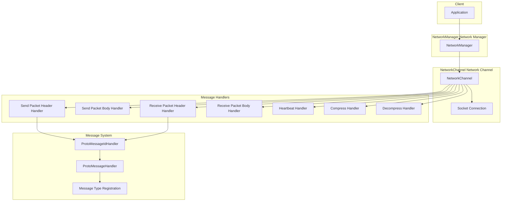
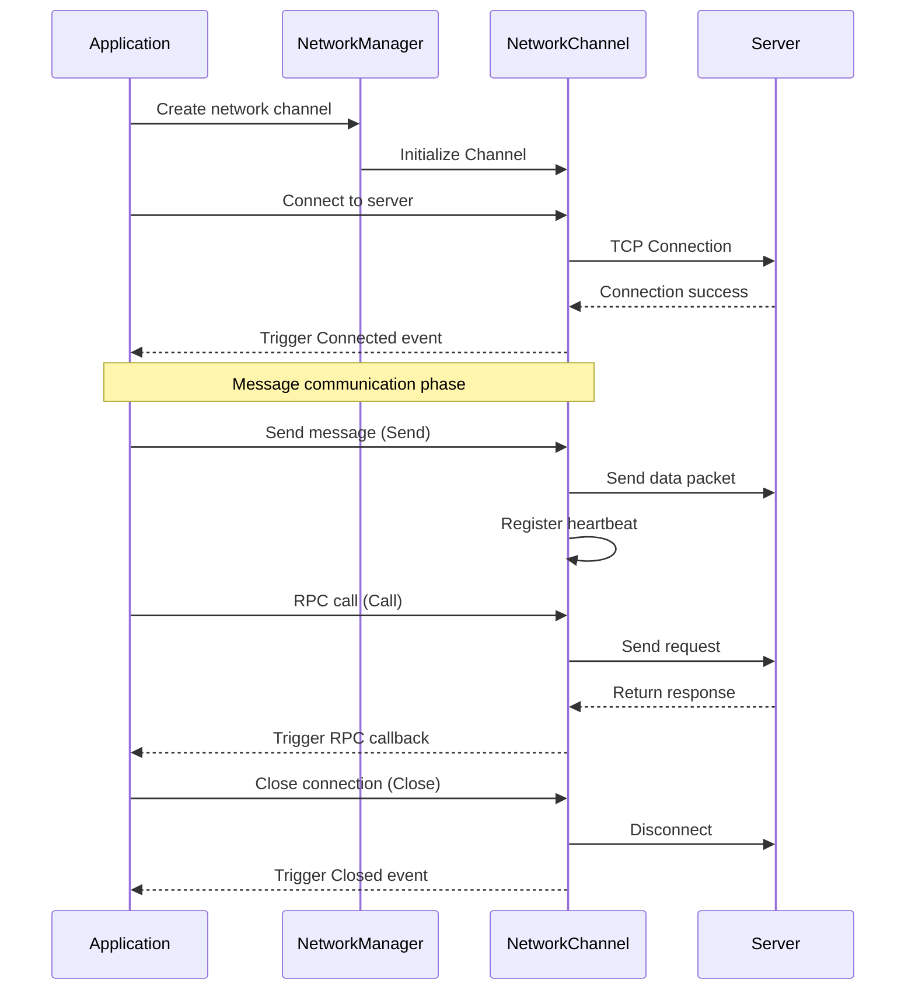
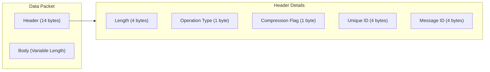

# Getting Started

This document will help you quickly get started with the GameFrameX Network Network Component, understand its core concepts, and start building your network application.

## Overview

GameFrameX Network is the core Network component of the GameFrameX game framework, providing TCP long-connection functionality and supporting:
- TCP-based reliable connection
- Protocol Buffers message serialization
- RPC remote procedure call
- Heartbeat check and automatic reconnection
- Message compression and decompression

## Core Architecture



## Basic Usage Flow



## Define Message Types

First, you need to define your request and response message types. Messages must inherit from the `MessageObject` class:

### Request Message

```csharp
using GameFrameX.Network.Runtime;
using ProtoBuf;

namespace MyGame.Network.Messages
{
    /// <summary>
    /// Login request message
    /// </summary>
    [MessageTypeHandler(1001)]  // Message ID, cannot be duplicate
    [ProtoContract]
    public class C2G_LoginRequest : MessageObject, IRequestMessage
    {
        /// <summary>
        /// Username
        /// </summary>
        [ProtoMember(1)]
        public string UserName { get; set; }

        /// <summary>
        /// Password
        /// </summary>
        [ProtoMember(2)]
        public string Password { get; set; }
    }
}
```

> Source: [MessageObject.cs](https://github.com/GameFrameX/com.gameframex.unity.network/blob/main/Runtime/Network/Base/MessageObject.cs#L15-L56)
> Source: [MessageTypeHandlerAttribute.cs](https://github.com/GameFrameX/com.gameframex.unity.network/blob/main/Runtime/Network/Base/MessageTypeHandlerAttribute.cs#L10-L27)

### Response Message

```csharp
using GameFrameX.Network.Runtime;
using ProtoBuf;

namespace MyGame.Network.Messages
{
    /// <summary>
    /// Login response message
    /// </summary>
    [MessageTypeHandler(1002)]  // Corresponding response message ID
    [ProtoContract]
    public class G2C_LoginResponse : MessageObject, IResponseMessage
    {
        /// <summary>
        /// Error code, 0 means success
        /// </summary>
        [ProtoMember(1)]
        public int ErrorCode { get; set; }

        /// <summary>
        /// Player ID
        /// </summary>
        [ProtoMember(2)]
        public long PlayerId { get; set; }

        /// <summary>
        /// Player name
        /// </summary>
        [ProtoMember(3)]
        public string PlayerName { get; set; }
    }
}
```

> Source: [IResponseMessage.cs](https://github.com/GameFrameX/com.gameframex.unity.network/blob/main/Runtime/Network/Base/IResponseMessage.cs#L1-L13)

### Heartbeat Message

```csharp
using GameFrameX.Network.Runtime;
using ProtoBuf;

namespace MyGame.Network.Messages
{
    /// <summary>
    /// Heartbeat message
    /// </summary>
    [MessageTypeHandler(1)]  // Heartbeat message ID
    [ProtoContract]
    public class HeartBeatMessage : MessageObject, IHeartBeatMessage
    {
        /// <summary>
        /// Timestamp
        /// </summary>
        [ProtoMember(1)]
        public long Timestamp { get; set; }
    }
}
```

## Create Message Handlers

Use the `MessageHandlerAttribute` to register message processing functions:

```csharp
using GameFrameX.Network.Runtime;
using GameFrameX.Runtime;

namespace MyGame.Network.Handlers
{
    /// <summary>
    /// Login message handler
    /// </summary>
    public class LoginMessageHandler : MonoBehaviour
    {
        /// <summary>
        /// Handle login response
        /// </summary>
        /// <param name="message">Login response message</param>
        [MessageHandler(typeof(G2C_LoginResponse), nameof(OnLoginResponse))]
        private void OnLoginResponse(G2C_LoginResponse message)
        {
            if (message.ErrorCode == 0)
            {
                Debug.Log($"Login successful! Player ID: {message.PlayerId}, Name: {message.PlayerName}");
            }
            else
            {
                Debug.LogError($"Login failed, error code: {message.ErrorCode}");
            }
        }
    }
}
```

> Source: [MessageHandlerAttribute.cs](https://github.com/GameFrameX/com.gameframex.unity.network/blob/main/Runtime/Network/Base/MessageHandlerAttribute.cs#L1-L60)

## Initialize Network Component

### Step 1: Initialize Message Types

When the application starts, you need to initialize the message type map:

```csharp
using GameFrameX.Network.Runtime;
using GameFrameX.Runtime;
using System.Reflection;

public class GameEntry : MonoBehaviour
{
    public void Awake()
    {
        // Initialize message ID mapping
        ProtoMessageIdHandler.Init(typeof(GameEntry).Assembly);
    }
}
```

> Source: [ProtoMessageIdHandler.cs](https://github.com/GameFrameX/com.gameframex.unity.network/blob/main/Runtime/Network/Network/ProtoMessageIdHandler.cs#L107-L168)

### Step 2: Create Network Channel

```csharp
using GameFrameX.Network.Runtime;
using GameFrameX.Runtime;

// Get network manager
var networkManager = GameEntry.GetComponent<NetworkManager>();

// Create network channel
// Parameters:
 // - channelName: Channel name, used to identify different connections
 // - networkChannelHelper: Network channel helper
 // - rpcTimeout: RPC timeout (milliseconds), minimum value 3000
var networkChannel = networkManager.CreateNetworkChannel(
    "GameServer",
    new DefaultNetworkChannelHelper(),
    30000  // 30 seconds timeout
);

// Set heartbeat interval (unit: seconds)
networkChannel.HeartBeatInterval = 30f;

// Reset heartbeat timer when receiving message
networkChannel.ResetHeartBeatElapseSecondsWhenReceivePacket = true;
```

> Source: [NetworkManager.cs](https://github.com/GameFrameX/com.gameframex.unity.network/blob/main/Runtime/Network/Network/NetworkManager.cs#L196-L223)

### Step 3: Subscribe to Network Events

```csharp
using GameFrameX.Network.Runtime;
using GameFrameX.Runtime;

// Get network manager
var networkManager = GameEntry.GetComponent<NetworkManager>();

// Subscribe to connection success event
networkManager.NetworkConnected += OnNetworkConnected;

// Subscribe to connection closed event
networkManager.NetworkClosed += OnNetworkClosed;

// Subscribe to heartbeat miss event
networkManager.NetworkMissHeartBeat += OnNetworkMissHeartBeat;

// Subscribe to network error event
networkManager.NetworkError += OnNetworkError;

private void OnNetworkConnected(object sender, NetworkConnectedEventArgs e)
{
    Debug.Log($"Network connection successful: {e.NetworkChannel.Name}");
    // You can handle logic after successful connection here
}

private void OnNetworkClosed(object sender, NetworkClosedEventArgs e)
{
    Debug.Log($"Network connection closed: {e.NetworkChannel.Name}, reason: {e.Reason}, error code: {e.ErrorCode}");
    // You can handle reconnection logic here
}

private void OnNetworkMissHeartBeat(object sender, NetworkMissHeartBeatEventArgs e)
{
    Debug.LogWarning($"Heartbeat missed: {e.NetworkChannel.Name}, miss count: {e.MissCount}");
}

private void OnNetworkError(object sender, NetworkErrorEventArgs e)
{
    Debug.LogError($"Network error: {e.NetworkChannel.Name}, error code: {e.ErrorCode}, error message: {e.ErrorMessage}");
}
```

> Source: [NetworkConnectedEventArgs.cs](https://github.com/GameFrameX/com.gameframex.unity.network/blob/main/Runtime/EventArgs/NetworkConnectedEventArgs.cs#L40-L98)

### Step 4: Connect to Server

```csharp
using System;

// Create Uri
var address = new Uri("tcp://127.0.0.1:8888");

// Get network channel and connect
var networkChannel = networkManager.GetNetworkChannel("GameServer");
networkChannel.Connect(address, "User data");
```

> Source: [INetworkChannel.cs](https://github.com/GameFrameX/com.gameframex.unity.network/blob/main/Runtime/Network/Interface/INetworkChannel.cs#L207-L212)

## Send Message

### One-way Send (No need to wait for response)

```csharp
using MyGame.Network.Messages;

// Create message object
var request = new C2G_LoginRequest
{
    UserName = "player1",
    Password = "123456"
};

// Send message
networkChannel.Send(request);
```

> Source: [INetworkChannel.cs](https://github.com/GameFrameX/com.gameframex.unity.network/blob/main/Runtime/Network/Interface/INetworkChannel.cs#L228-L233)

### RPC Call (Wait for response)

```csharp
using MyGame.Network.Messages;
using System.Threading.Tasks;

// Create request message
var request = new C2G_LoginRequest
{
    UserName = "player1",
    Password = "123456"
};

// Send RPC request and wait for response
var response = await networkChannel.Call<G2C_LoginResponse>(request);

// Handle response
if (response.ErrorCode == 0)
{
    Debug.Log($"Login successful, player ID: {response.PlayerId}");
}
else
{
    Debug.LogError($"Login failed, error code: {response.ErrorCode}");
}
```

> Source: [INetworkChannel.cs](https://github.com/GameFrameX/com.gameframex.unity.network/blob/main/Runtime/Network/Interface/INetworkChannel.cs#L235-L242)

### RPC Call Ignoring Error Code

```csharp
// When isIgnoreErrorCode = true, even if the server returns an error code, no exception will be thrown
var response = await networkChannel.Call<G2C_LoginResponse>(request, isIgnoreErrorCode: true);
```

## Close Connection

```csharp
// Close network channel
// Parameters: close reason, error code
networkChannel.Close("User actively closed", 0);

// Or destroy through manager
networkManager.DestroyNetworkChannel("GameServer");
```

> Source: [INetworkChannel.cs](https://github.com/GameFrameX/com.gameframex.unity.network/blob/main/Runtime/Network/Interface/INetworkChannel.cs#L221-L226)

## Complete Example

The following is a complete client example, showing the full flow from connection to sending messages:

```csharp
using GameFrameX.Network.Runtime;
using GameFrameX.Runtime;
using MyGame.Network.Messages;
using System;
using System.Threading.Tasks;
using UnityEngine;

public class NetworkExample : MonoBehaviour
{
    private NetworkManager _networkManager;
    private INetworkChannel _channel;

    private void Start()
    {
        // 1. Initialize message type mapping
        ProtoMessageIdHandler.Init(typeof(NetworkExample).Assembly);

        // 2. Get network manager
        _networkManager = GameEntry.GetComponent<NetworkManager>();

        // 3. Subscribe to network events
        _networkManager.NetworkConnected += OnConnected;
        _networkManager.NetworkClosed += OnClosed;
        _networkManager.NetworkMissHeartBeat += OnMissHeartBeat;
        _networkManager.NetworkError += OnError;

        // 4. Create network channel
        _channel = _networkManager.CreateNetworkChannel(
            "GameServer",
            new DefaultNetworkChannelHelper(),
            30000
        );

        // 5. Set heartbeat
        _channel.HeartBeatInterval = 30f;
        _channel.ResetHeartBeatElapseSecondsWhenReceivePacket = true;

        // 6. Connect to server
        _channel.Connect(new Uri("tcp://127.0.0.1:8888"));
    }

    private async void Login(string userName, string password)
    {
        if (_channel == null || !_channel.Connected)
        {
            Debug.LogError("Not connected to server");
            return;
        }

        var request = new C2G_LoginRequest
        {
            UserName = userName,
            Password = password
        };

        try
        {
            var response = await _channel.Call<G2C_LoginResponse>(request);
            if (response.ErrorCode == 0)
            {
                Debug.Log($"Login successful! Player ID: {response.PlayerId}");
            }
            else
            {
                Debug.LogError($"Login failed, error code: {response.ErrorCode}");
            }
        }
        catch (Exception ex)
        {
            Debug.LogError($"RPC call failed: {ex.Message}");
        }
    }

    private void OnConnected(object sender, NetworkConnectedEventArgs e)
    {
        Debug.Log($"Connected to: {e.NetworkChannel.Name}");
    }

    private void OnClosed(object sender, NetworkClosedEventArgs e)
    {
        Debug.Log($"Connection closed: {e.Reason}");
    }

    private void OnMissHeartBeat(object sender, NetworkMissHeartBeatEventArgs e)
    {
        Debug.LogWarning($"Heartbeat miss count: {e.MissCount}");
    }

    private void OnError(object sender, NetworkErrorEventArgs e)
    {
        Debug.LogError($"Network error: {e.ErrorMessage}");
    }

    private void OnDestroy()
    {
        if (_channel != null)
        {
            _channel.Close("Client destroyed");
        }
    }
}
```

## Message Protocol Format

The Network component uses a custom binary protocol format, containing a 14-byte packet header:



| Field | Length | Description |
|------|------|------|
| PacketLength | 4 bytes | Total length of the data packet (network byte order) |
| OperationType | 1 byte | Operation type: 1=heartbeat, 4=normal message |
| ZipFlag | 1 byte | Compression flag: 0=not compressed, 1=compressed |
| UniqueId | 4 bytes | Message unique ID, used for RPC matching |
| MessageId | 4 bytes | Message type ID |

> Source: [DefaultPacketSendHeaderHandler.cs](https://github.com/GameFrameX/com.gameframex.unity.network/blob/main/Runtime/Network/Helper/DefaultPacketSendHeaderHandler.cs#L38-L44)

## Configuration Options

### NetworkChannel Configuration

You can configure the following options through the `INetworkChannel` interface:

| Property | Type | Default | Description |
|------|------|--------|------|
| HeartBeatInterval | float | 30f | Heartbeat send interval (seconds) |
| ResetHeartBeatElapseSecondsWhenReceivePacket | bool | true | Whether to reset heartbeat timer when receiving message |
| PacketSendHeaderHandler | IPacketSendHeaderHandler | DefaultPacketSendHeaderHandler | Send packet header handler |
| PacketSendBodyHandler | IPacketSendBodyHandler | - | Send packet body handler |
| PacketReceiveHeaderHandler | IPacketReceiveHeaderHandler | DefaultPacketReceiveHeaderHandler | Receive packet header handler |
| PacketReceiveBodyHandler | IPacketReceiveBodyHandler | - | Receive packet body handler |
| MessageCompressHandler | IMessageCompressHandler | - | Message compression handler |
| MessageDecompressHandler | IMessageDecompressHandler | - | Message decompression handler |

> Source: [INetworkChannel.cs](https://github.com/GameFrameX/com.gameframex.unity.network/blob/main/Runtime/Network/Interface/INetworkChannel.cs#L42-L132)

## Related Links

- [Overview](./01.overview.md) - Learn more about the overall design of the Network component
- [Installation](./02.installation.md) - Install and configure the Network component
- [Network Manager](./04.network-manager.md) - NetworkManager detailed API
- [Network Channel](./05.network-channel.md) - NetworkChannel detailed API
- [Message Types](./06.message-types.md) - Message types system details
- [Packet Handlers](./07.packet-handlers.md) - Data packet processing mechanism
- [Event System](./08.events.md) - Network event system
- [Message Compression](./10.message-compression.md) - Message compression configuration
- [RPC Remote Procedure Call](./11.rpc.md) - RPC call mechanism
- [Troubleshooting](./13.troubleshooting.md) - Troubleshooting and solutions