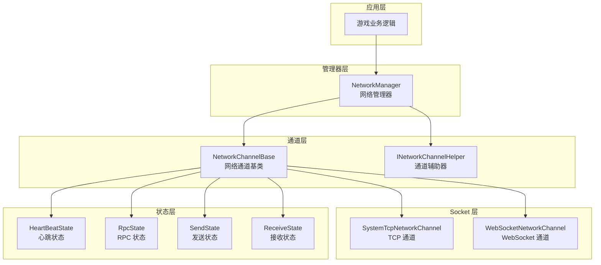
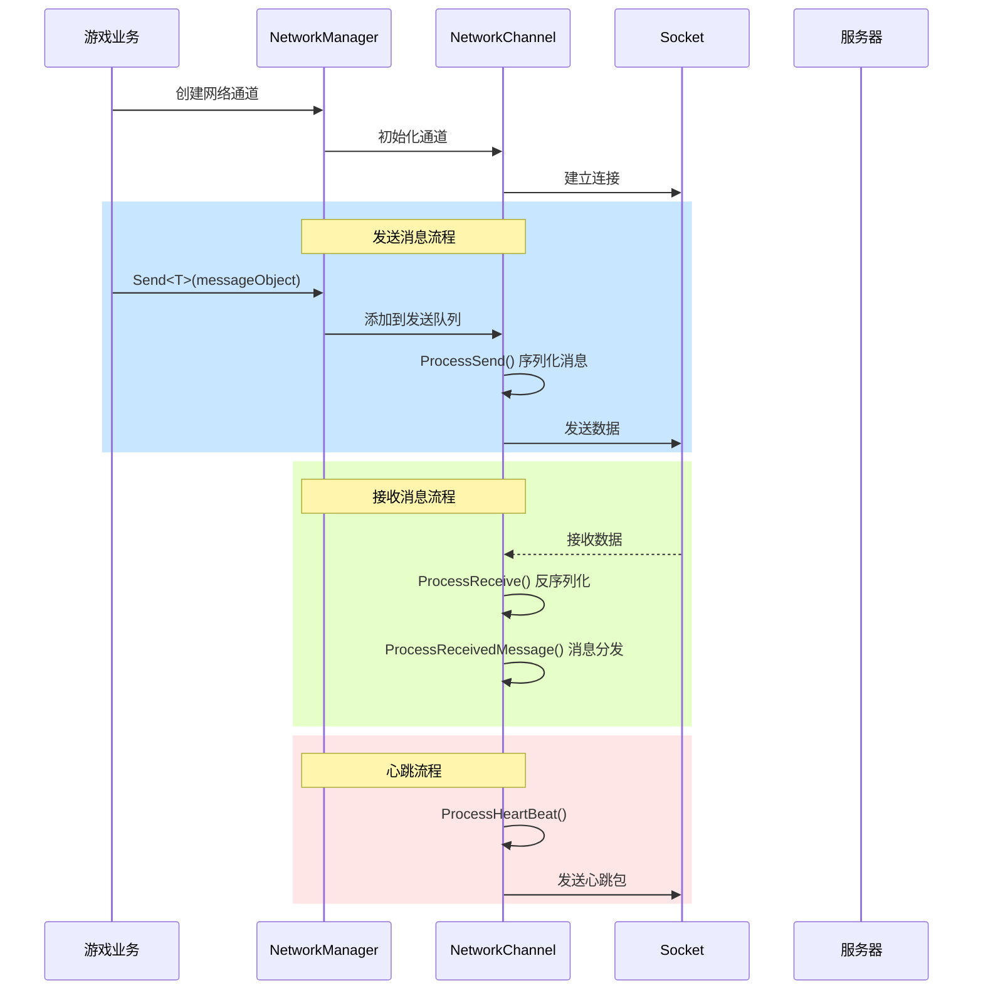
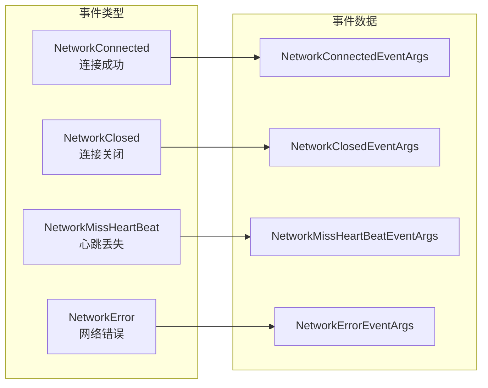

# 网络Manages器

NetworkManager 是 GameFrameX 网络模块的核心组件，responsible for统一Manages游戏中的所有网络connect通道。它provides了Network ChannelCreates与destroy、connect状态Manages、Heartbeat Check、RPC Remote Procedure Call等Core Features。

## 概述

网络Manages器作为 GameFrameX 框架的网络层核心，扮演着connect游戏Client与Server的关键角色。其设计理念是provides一个统一、简洁且强大的网络抽象层，让开发者可以专注于业务逻辑而不必关心Low-level Network通信细节。

### Core Responsibilities

NetworkManager 的主要Responsibilityincluding：

1. **多通道Manages**：supports同时维护多个独立的网络通道，每个通道可以connect到不同的Server
2. **connect生命周期**：Manages网络connect的建立、保持和Closed过程
3. **Heartbeat Check**：through定时send心跳包检测connect健康状态，自动process断开connect
4. **RPC 调度**：封装远程过程调用的请求/响应机制，supportsasynchronous等待Server返回
5. **事件通知**：throughEvent System向Business Layer通知网络状态变化

### 设计理念

NetworkManager adopts了以下设计原则：

- **模块化设计**：将网络通道、心跳、RPC 等功能分离为独立状态类，便于维护和扩展
- **事件驱动**：Uses事件机制解耦网络状态变化与业务process
- **统一接口**：through INetworkChannel 接口抽象不同的网络Implements（TCP/WebSocket）
- **自动Manages**：在游戏主循环中自动update所有网络通道，减少手动轮询负担

## 架构

NetworkManager adopts分层Architecture Design，从上到下分为以下几个层次：



### 组件Description

| 组件 | Description |
|------|------|
| NetworkManager | 网络Manages器主类，responsible forManages所有网络通道的生命周期 |
| NetworkChannelBase | 网络通道Abstract Base Class，封装 Socket 操作和消息process逻辑 |
| INetworkChannelHelper | 通道辅助器接口，responsible for消息的serialize和反serialize |
| HeartBeatState | 心跳状态类，Manages心跳计时和丢失计数 |
| RpcState | RPC 状态类，Manages等待响应的 RPC 请求和超时process |
| SendState | send状态类，Manages待Send Message队列 |
| ReceiveState | receive状态类，Managesreceive缓冲区和数据包parse |

### 消息process流程



## Core Features

### 网络通道Manages

NetworkManager Uses字典结构存储所有网络通道，supportsthrough通道名称进行快速检索：

```csharp
// 创建网络通道
INetworkChannel channel = networkManager.CreateNetworkChannel("MainServer", channelHelper, 30000);

// 检查通道是否存在
if (networkManager.HasNetworkChannel("MainServer"))
{
    // 获取通道
    INetworkChannel channel = networkManager.GetNetworkChannel("MainServer");
}

// 获取所有通道
INetworkChannel[] channels = networkManager.GetAllNetworkChannels();

// 销毁通道
networkManager.DestroyNetworkChannel("MainServer");
```

> Source: [NetworkManager.cs](https://github.com/GameFrameX/com.gameframex.unity.network/blob/main/Runtime/Network/Network/NetworkManager.cs#L203-L247)

### connectManages

网络通道supportsconnect到远程Server，并provides完善的connect状态Manages：

```csharp
// 连接到服务器
channel.Connect(new Uri("tcp://127.0.0.1:8888"), userData);

// 关闭连接
channel.Close("主动关闭");
```

> Source: [NetworkManager.NetworkChannelBase.cs](https://github.com/GameFrameX/com.gameframex.unity.network/blob/main/Runtime/Network/Network/NetworkManager.NetworkChannelBase.cs#L638-L756)

### RPC Remote Procedure Call

NetworkManager provides了基于 Task 的asynchronous RPC 调用机制，supports等待Server响应：

```csharp
// 发送 RPC 请求并等待响应
var request = new C2S_LoginRequest { Username = "test", Password = "123" };
var response = await channel.Call<C2S_LoginResponse>(request);

// 设置 RPC 回调
channel.SetRPCStartHandler((sender, msg) => { 
    Debug.Log($"RPC 开始: {msg.GetType().Name}");
});

channel.SetRPCEndHandler((sender, msg) => { 
    Debug.Log($"RPC 结束: {msg.GetType().Name}");
});

channel.SetRPCErrorHandler((sender, msg) => { 
    Debug.Log($"RPC 错误: {msg.GetType().Name}");
});
```

> Source: [NetworkManager.RpcState.cs](https://github.com/GameFrameX/com.gameframex.unity.network/blob/main/Runtime/Network/Network/NetworkManager.RpcState.cs#L125-L144)

### Heartbeat Check

网络通道内置Heartbeat Check机制，当Heartbeat Lost达到阈值时自动断开connect：

```csharp
// 设置心跳间隔（秒）
channel.HeartBeatInterval = 30f;

// 设置收到消息时重置心跳计时
channel.ResetHeartBeatElapseSecondsWhenReceivePacket = true;

// 设置失去焦点时是否发送心跳
networkManager.SetFocusHeartbeat(true);
```

> Source: [NetworkManager.NetworkChannelBase.cs](https://github.com/GameFrameX/com.gameframex.unity.network/blob/main/Runtime/Network/Network/NetworkManager.NetworkChannelBase.cs#L293-L311)

## Event System

NetworkManager provides了完整的Event System，used for通知网络状态变化：



### 事件TypeDescription

| 事件 | Description | Event Arguments |
|------|------|----------|
| NetworkConnected | successconnect到Server时触发 | NetworkConnectedEventArgs |
| NetworkClosed | connectClosed时触发 | NetworkClosedEventArgs |
| NetworkMissHeartBeat | 心跳丢失时触发 | NetworkMissHeartBeatEventArgs |
| NetworkError | 发生网络error时触发 | NetworkErrorEventArgs |

### 事件订阅示例

```csharp
// 订阅连接成功事件
networkManager.NetworkConnected += OnNetworkConnected;

// 订阅连接关闭事件
networkManager.NetworkClosed += OnNetworkClosed;

// 订阅心跳丢失事件
networkManager.NetworkMissHeartBeat += OnNetworkMissHeartBeat;

// 订阅网络错误事件
networkManager.NetworkError += OnNetworkError;

private void OnNetworkConnected(object sender, NetworkConnectedEventArgs e)
{
    Debug.Log($"连接成功: {e.NetworkChannel.Name}");
}

private void OnNetworkClosed(object sender, NetworkClosedEventArgs e)
{
    Debug.Log($"连接关闭: {e.NetworkChannel.Name}, 原因: {e.Reason}, 错误码: {e.ErrorCode}");
}

private void OnNetworkMissHeartBeat(object sender, NetworkMissHeartBeatEventArgs e)
{
    Debug.Log($"心跳丢失次数: {e.MissHeartBeatCount}");
}

private void OnNetworkError(object sender, NetworkErrorEventArgs e)
{
    Debug.Log($"网络错误: {e.ErrorCode}, 消息: {e.ErrorMessage}");
}
```

> Source: [NetworkConnectedEventArgs.cs](https://github.com/GameFrameX/com.gameframex.unity.network/blob/main/Runtime/EventArgs/NetworkConnectedEventArgs.cs)

## 数据包process器

NetworkManager through可插拔的process器机制process数据包的send和receive：

```csharp
// 注册发送头处理器
channel.RegisterHandler(new DefaultPacketSendHeaderHandler());

// 注册发送体处理器
channel.RegisterHandler(new DefaultPacketSendBodyHandler());

// 注册接收头处理器
channel.RegisterHandler(new DefaultPacketReceiveHeaderHandler());

// 注册接收体处理器
channel.RegisterHandler(new DefaultPacketReceiveBodyHandler());

// 注册心跳处理器
channel.RegisterHeartBeatHandler(new DefaultPacketHeartBeatHandler());
```

> Source: [INetworkChannel.cs](https://github.com/GameFrameX/com.gameframex.unity.network/blob/main/Runtime/Network/Interface/INetworkChannel.cs#L100-L174)

### Message Compression

supportsMessage Compression以减少网络传输数据量：

```csharp
// 注册消息压缩处理器
channel.RegisterMessageCompressHandler(new DefaultMessageCompressHandler());

// 注册消息解压处理器
channel.RegisterMessageDecompressHandler(new DefaultMessageDecompressHandler());
```

## Configuration Options

### NetworkManager configuration

NetworkManager 本身作为 GameFrameworkModule 工作，无需直接configuration。所有configurationthroughCreates网络通道时指定。

### NetworkChannel configuration

| 选项 | Type | Default | Description |
|------|------|--------|------|
| HeartBeatInterval | float | 30.0 | 心跳send间隔（秒） |
| ResetHeartBeatElapseSecondsWhenReceivePacket | bool | false | 收到消息时是否reset心跳计时 |
| MissHeartBeatCountByClose | int | 10 | Heartbeat Lost次数阈值，超过则断开connect |

> Source: [NetworkManager.NetworkChannelBase.cs](https://github.com/GameFrameX/com.gameframex.unity.network/blob/main/Runtime/Network/Network/NetworkManager.NetworkChannelBase.cs#L52-L77)

## API Reference

### `NetworkManager` 类

Inherits自 `GameFrameworkModule`，是网络模块的主入口。

#### Property

| Property | Type | Description |
|------|------|------|
| NetworkChannelCount | int | get网络通道数量 |

#### 事件

| 事件 | Description |
|------|------|
| NetworkConnected | 网络connectsuccess事件 |
| NetworkClosed | 网络connectClosed事件 |
| NetworkMissHeartBeat | 心跳丢失事件 |
| NetworkError | 网络error事件 |

#### Method

### `HasNetworkChannel(channelName: string): bool`

Check if exists指定名称的网络通道。

**Parameters：**
- `channelName` (string): Network Channel名称

**返回：** Whether existsNetwork Channel

---

### `GetNetworkChannel(channelName: string): INetworkChannel`

get指定名称的网络通道。

**Parameters：**
- `channelName` (string): Network Channel名称

**返回：** 网络通道接口，如果不存在则返回 null

---

### `CreateNetworkChannel(channelName: string, networkChannelHelper: INetworkChannelHelper, rpcTimeout: int): INetworkChannel`

Creates新的网络通道。

**Parameters：**
- `channelName` (string): Network Channel名称
- `networkChannelHelper` (INetworkChannelHelper): Network Channel辅助器
- `rpcTimeout` (int): RPC 超时时间（毫秒），最小值 3000

**返回：** Creates的网络通道

**Exception：**
- `GameFrameworkException`: 当通道已存在时抛出

---

### `DestroyNetworkChannel(channelName: string): bool`

destroy指定的网络通道。

**Parameters：**
- `channelName` (string): Network Channel名称

**返回：** 是否destroysuccess

---

### `SetFocusHeartbeat(hasFocus: bool): void`

set是否在Application失去焦点时send心跳包。

**Parameters：**
- `hasFocus` (bool): 是否在获得焦点时send心跳

---

### `INetworkChannel` 接口

网络通道接口，定义网络通道的核心操作。

#### Property

| Property | Type | Description |
|------|------|------|
| Name | string | get通道名称 |
| Socket | INetworkSocket | get Socket 对象 |
| Connected | bool | get是否Connected |
| AddressFamily | AddressFamily | get地址Type |
| SendPacketCount | int | get待Send Message数量 |
| SentPacketCount | int | get已Send Message数量 |
| ReceivedPacketCount | int | get已Receive Message数量 |
| HeartBeatInterval | float | get或set心跳间隔 |
| HeartBeatElapseSeconds | float | get心跳流逝时间 |
| MissHeartBeatCount | int | getHeartbeat Lost次数 |

#### Method

### `Connect(address: Uri, userData: object): void`

connect到远程Server。

**Parameters：**
- `address` (Uri): Server地址
- `userData` (object): 用户自定义数据

---

### `Send<T>(messageObject: T): void` 

向ServerSend Message。

**Parameters：**
- `messageObject` (T): 消息对象，必须Inherits自 MessageObject

---

### `Call<TResult>(messageObject: MessageObject, isIgnoreErrorCode: bool): Task<TResult>`

send RPC 请求并等待响应。

**Parameters：**
- `messageObject` (MessageObject): 请求消息
- `isIgnoreErrorCode` (bool): 是否忽略error码

**返回：** 响应消息的 Task

---

### `Close(reason: string, code: ushort): void`

Closed网络通道。

**Parameters：**
- `reason` (string): Closed原因
- `code` (ushort): error码

---

### `RegisterHandler(handler: IPacketSendHeaderHandler): void`

register数据包send头process器。

---

### `RegisterHeartBeatHandler(handler: IPacketHeartBeatHandler): void`

register心跳process器。

---

### `SetRPCErrorHandler(handler: EventHandler<MessageObject>): void`

set RPC Error Handling函数。

---

### `SetRPCStartHandler(handler: EventHandler<MessageObject>): void`

set RPC 开始process函数。

---

### `SetRPCEndHandler(handler: EventHandler<MessageObject>): void`

set RPC 结束process函数。

---

## Related Links

- [Network Channel](./4-core-concepts.2-network-channel) - 详细了解网络通道的Implements
- [Message Types](./4-core-concepts.3-message-types) - 了解消息对象的定义
- [数据包process器](./4-core-concepts.4-packet-handlers) - 了解数据包的serialize和process
- [Heartbeat Mechanism](./5-heartbeat) - Learn more aboutHeartbeat Check机制
- [Event System](./6-events) - 了解Event System的Uses
- [Message Compression](./7-message-compression) - 了解Message Compression功能
- [RPC Remote Procedure Call](./8-rpc) - Learn more about RPC 机制
