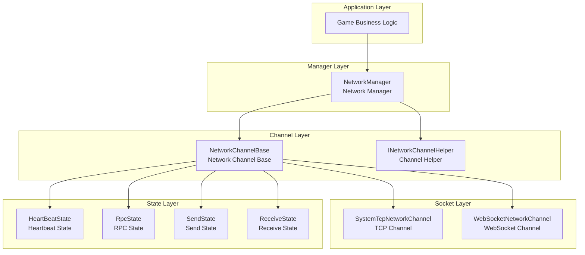
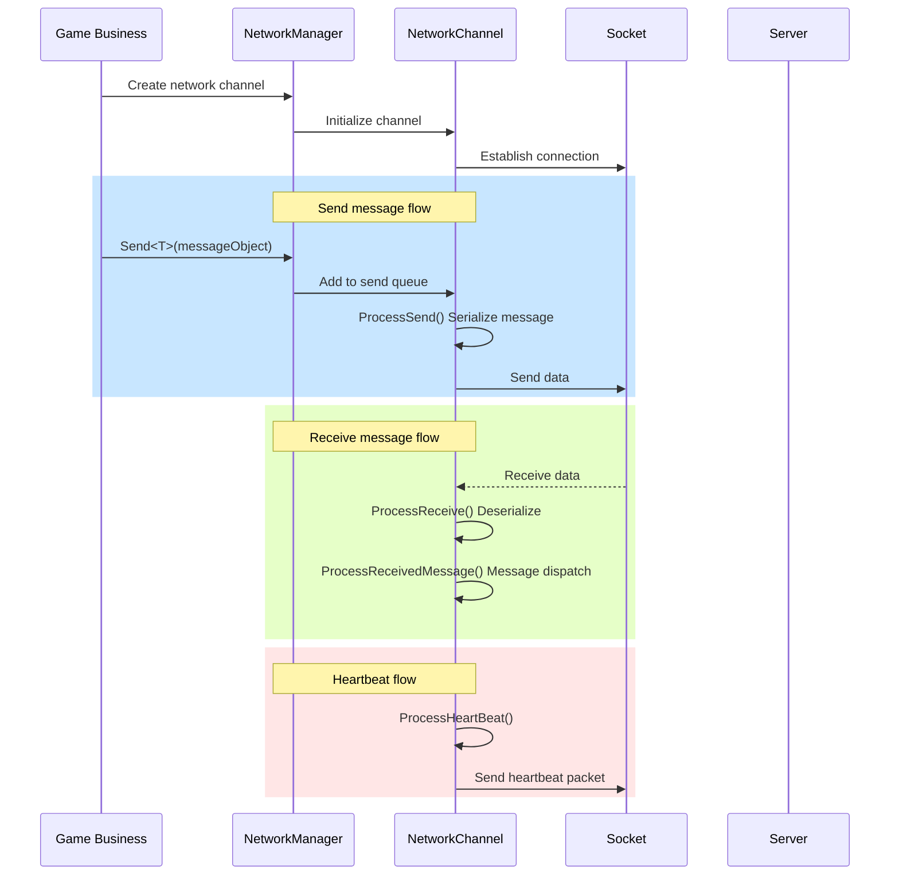
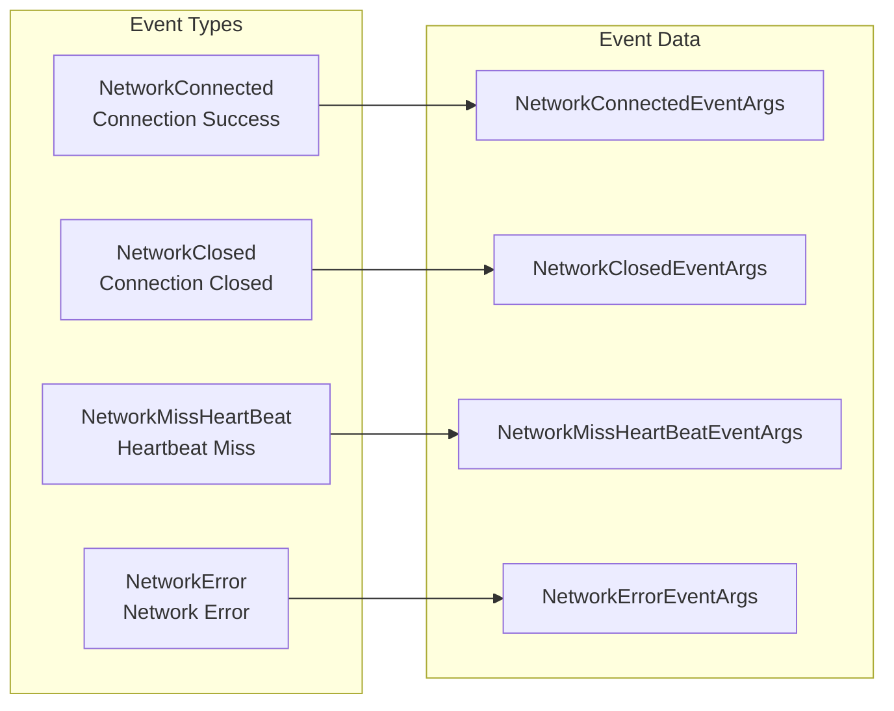

# NetworkManager

NetworkManager is the core component of the GameFrameX network module, responsible for managing all network connection channels in the game. It provides core features such as Network Channel creation and destruction, connection state management, Heartbeat Check, and RPC Remote Procedure Call.

## Overview

The Network Manager serves as the core of the network layer for the GameFrameX framework, playing a key role in connecting game clients and servers. Its design philosophy is to provide a unified, simple yet powerful network abstraction layer, allowing developers to focus on business logic without worrying about low-level network communication details.

### Core Responsibilities

The main responsibilities of NetworkManager include:

1. **Multi-Channel Management**: Supports maintaining multiple independent network channels simultaneously, with each channel connecting to different servers
2. **Connection Lifecycle**: Manages the establishment, maintenance, and closure of network connections
3. **Heartbeat Check**: Detects connection health status through periodic heartbeat packet transmission, automatically processing connection disconnections
4. **RPC Scheduling**: Encapsulates remote procedure call request/response mechanisms, supporting asynchronous waiting for server responses
5. **Event Notifications**: Notifies the business layer of network state changes through the Event System

### Design Philosophy

NetworkManager adopts the following design principles:

- **Modular Design**: Separates network channels, heartbeat, RPC and other functions into independent state classes for easy maintenance and extension
- **Event-Driven**: Uses event mechanisms to decouple network state changes from business processing
- **Unified Interface**: Abstracts different network implementations (TCP/WebSocket) through the INetworkChannel interface
- **Automatic Management**: Automatically updates all network channels in the game's main loop, reducing manual polling overhead

## Architecture

NetworkManager adopts a layered architecture design, consisting of the following layers from top to bottom:



### Component Description

| Component | Description |
|------|------|
| NetworkManager | Network Manager main class, responsible for managing the lifecycle of all network channels |
| NetworkChannelBase | Network Channel abstract base class, encapsulating Socket operations and message processing logic |
| INetworkChannelHelper | Channel Helper interface, responsible for message serialization and deserialization |
| HeartBeatState | Heartbeat State class, managing heartbeat timing and miss counting |
| RpcState | RPC State class, managing pending RPC requests and timeout processing |
| SendState | Send State class, managing pending send message queues |
| ReceiveState | Receive State class, managing receive buffers and packet parsing |

### Message Processing Flow



## Core Features

### Network Channel Management

NetworkManager uses a dictionary structure to store all network channels, supporting fast retrieval through channel names:

```csharp
// Create network channel
INetworkChannel channel = networkManager.CreateNetworkChannel("MainServer", channelHelper, 30000);

// Check if channel exists
if (networkManager.HasNetworkChannel("MainServer"))
{
    // Get channel
    INetworkChannel channel = networkManager.GetNetworkChannel("MainServer");
}

// Get all channels
INetworkChannel[] channels = networkManager.GetAllNetworkChannels();

// Destroy channel
networkManager.DestroyNetworkChannel("MainServer");
```

> Source: [NetworkManager.cs](https://github.com/GameFrameX/com.gameframex.unity.network/blob/main/Runtime/Network/Network/NetworkManager.cs#L203-L247)

### Connection Management

Network channels support connecting to remote servers and provide complete connection state management:

```csharp
// Connect to server
channel.Connect(new Uri("tcp://127.0.0.1:8888"), userData);

// Close connection
channel.Close("User-initiated close");
```

> Source: [NetworkManager.NetworkChannelBase.cs](https://github.com/GameFrameX/com.gameframex.unity.network/blob/main/Runtime/Network/Network/NetworkManager.NetworkChannelBase.cs#L638-L756)

### RPC Remote Procedure Call

NetworkManager provides a Task-based asynchronous RPC call mechanism, supporting waiting for server responses:

```csharp
// Send RPC request and wait for response
var request = new C2S_LoginRequest { Username = "test", Password = "123" };
var response = await channel.Call<C2S_LoginResponse>(request);

// Set RPC callbacks
channel.SetRPCStartHandler((sender, msg) => {
    Debug.Log($"RPC started: {msg.GetType().Name}");
});

channel.SetRPCEndHandler((sender, msg) => {
    Debug.Log($"RPC ended: {msg.GetType().Name}");
});

channel.SetRPCErrorHandler((sender, msg) => {
    Debug.Log($"RPC error: {msg.GetType().Name}");
});
```

> Source: [NetworkManager.RpcState.cs](https://github.com/GameFrameX/com.gameframex.unity.network/blob/main/Runtime/Network/Network/NetworkManager.RpcState.cs#L125-L144)

### Heartbeat Check

Network channels have built-in heartbeat check mechanism that automatically disconnects the connection when heartbeat miss count reaches the threshold:

```csharp
// Set heartbeat interval (seconds)
channel.HeartBeatInterval = 30f;

// Reset heartbeat timer when receiving message
channel.ResetHeartBeatElapseSecondsWhenReceivePacket = true;

// Set whether to send heartbeat when focus is lost
networkManager.SetFocusHeartbeat(true);
```

> Source: [NetworkManager.NetworkChannelBase.cs](https://github.com/GameFrameX/com.gameframex.unity.network/blob/main/Runtime/Network/Network/NetworkManager.NetworkChannelBase.cs#L293-L311)

## Event System

NetworkManager provides a complete Event System for notifying network state changes:



### Event Type Description

| Event | Description | Event Arguments |
|------|------|----------|
| NetworkConnected | Triggered when network connection is successfully established | NetworkConnectedEventArgs |
| NetworkClosed | Triggered when connection is closed | NetworkClosedEventArgs |
| NetworkMissHeartBeat | Triggered when heartbeat is missed | NetworkMissHeartBeatEventArgs |
| NetworkError | Triggered when a network error occurs | NetworkErrorEventArgs |

### Event Subscription Example

```csharp
// Subscribe to connection success event
networkManager.NetworkConnected += OnNetworkConnected;

// Subscribe to connection closed event
networkManager.NetworkClosed += OnNetworkClosed;

// Subscribe to heartbeat miss event
networkManager.NetworkMissHeartBeat += OnNetworkMissHeartBeat;

// Subscribe to network error event
networkManager.NetworkError += OnNetworkError;

private void OnNetworkConnected(object sender, NetworkConnectedEventArgs e)
{
    Debug.Log($"Connection successful: {e.NetworkChannel.Name}");
}

private void OnNetworkClosed(object sender, NetworkClosedEventArgs e)
{
    Debug.Log($"Connection closed: {e.NetworkChannel.Name}, reason: {e.Reason}, error code: {e.ErrorCode}");
}

private void OnNetworkMissHeartBeat(object sender, NetworkMissHeartBeatEventArgs e)
{
    Debug.Log($"Heartbeat miss count: {e.MissHeartBeatCount}");
}

private void OnNetworkError(object sender, NetworkErrorEventArgs e)
{
    Debug.Log($"Network error: {e.ErrorCode}, message: {e.ErrorMessage}");
}
```

> Source: [NetworkConnectedEventArgs.cs](https://github.com/GameFrameX/com.gameframex.unity.network/blob/main/Runtime/EventArgs/NetworkConnectedEventArgs.cs)

## Packet Processors

NetworkManager processes packet sending and receiving through a pluggable processor mechanism:

```csharp
// Register send header handler
channel.RegisterHandler(new DefaultPacketSendHeaderHandler());

// Register send body handler
channel.RegisterHandler(new DefaultPacketSendBodyHandler());

// Register receive header handler
channel.RegisterHandler(new DefaultPacketReceiveHeaderHandler());

// Register receive body handler
channel.RegisterHandler(new DefaultPacketReceiveBodyHandler());

// Register heartbeat handler
channel.RegisterHeartBeatHandler(new DefaultPacketHeartBeatHandler());
```

> Source: [INetworkChannel.cs](https://github.com/GameFrameX/com.gameframex.unity.network/blob/main/Runtime/Network/Interface/INetworkChannel.cs#L100-L174)

### Message Compression

Supports message compression to reduce network transmission data volume:

```csharp
// Register message compression handler
channel.RegisterMessageCompressHandler(new DefaultMessageCompressHandler());

// Register message decompression handler
channel.RegisterMessageDecompressHandler(new DefaultMessageDecompressHandler());
```

## Configuration Options

### NetworkManager Configuration

NetworkManager itself works as a GameFrameworkModule and does not require direct configuration. All configuration is specified when creating network channels.

### NetworkChannel Configuration

| Option | Type | Default | Description |
|------|------|--------|------|
| HeartBeatInterval | float | 30.0 | Heartbeat send interval (seconds) |
| ResetHeartBeatElapseSecondsWhenReceivePacket | bool | false | Whether to reset heartbeat timer when receiving message |
| MissHeartBeatCountByClose | int | 10 | Heartbeat miss count threshold, connection will be closed when exceeded |

> Source: [NetworkManager.NetworkChannelBase.cs](https://github.com/GameFrameX/com.gameframex.unity.network/blob/main/Runtime/Network/Network/NetworkManager.NetworkChannelBase.cs#L52-L77)

## API Reference

### `NetworkManager` Class

Inherits from `GameFrameworkModule` and is the main entry point of the network module.

#### Property

| Property | Type | Description |
|------|------|------|
| NetworkChannelCount | int | Gets the number of network channels |

#### Events

| Event | Description |
|------|------|
| NetworkConnected | Network connection success event |
| NetworkClosed | Network connection closed event |
| NetworkMissHeartBeat | Heartbeat miss event |
| NetworkError | Network error event |

#### Methods

### `HasNetworkChannel(channelName: string): bool`

Checks if a network channel with the specified name exists.

**Parameters:**
- `channelName` (string): Network Channel name

**Returns:** Whether the Network Channel exists

---

### `GetNetworkChannel(channelName: string): INetworkChannel`

Gets the network channel with the specified name.

**Parameters:**
- `channelName` (string): Network Channel name

**Returns:** Network channel interface, returns null if it does not exist

---

### `CreateNetworkChannel(channelName: string, networkChannelHelper: INetworkChannelHelper, rpcTimeout: int): INetworkChannel`

Creates a new network channel.

**Parameters:**
- `channelName` (string): Network Channel name
- `networkChannelHelper` (INetworkChannelHelper): Network Channel helper
- `rpcTimeout` (int): RPC timeout (milliseconds), minimum value is 3000

**Returns:** The created network channel

**Exception:**
- `GameFrameworkException`: Thrown when the channel already exists

---

### `DestroyNetworkChannel(channelName: string): bool`

Destroys the specified network channel.

**Parameters:**
- `channelName` (string): Network Channel name

**Returns:** Whether destruction was successful

---

### `SetFocusHeartbeat(hasFocus: bool): void`

Sets whether to send heartbeat packets when the application loses focus.

**Parameters:**
- `hasFocus` (bool): Whether to send heartbeat when focus is gained

---

### `INetworkChannel` Interface

Network channel interface, defining core operations of network channels.

#### Properties

| Property | Type | Description |
|------|------|------|
| Name | string | Gets the channel name |
| Socket | INetworkSocket | Gets the Socket object |
| Connected | bool | Gets whether it is connected |
| AddressFamily | AddressFamily | Gets the address type |
| SendPacketCount | int | Gets the number of pending send messages |
| SentPacketCount | int | Gets the number of sent messages |
| ReceivedPacketCount | int | Gets the number of received messages |
| HeartBeatInterval | float | Gets or sets the heartbeat interval |
| HeartBeatElapseSeconds | float | Gets the elapsed heartbeat time |
| MissHeartBeatCount | int | Gets the heartbeat miss count |

#### Methods

### `Connect(address: Uri, userData: object): void`

Connects to a remote server.

**Parameters:**
- `address` (Uri): Server address
- `userData` (object): User-defined data

---

### `Send<T>(messageObject: T): void`

Sends a message to the server.

**Parameters:**
- `messageObject` (T): Message object, must inherit from MessageObject

---

### `Call<TResult>(messageObject: MessageObject, isIgnoreErrorCode: bool): Task<TResult>`

Sends an RPC request and waits for response.

**Parameters:**
- `messageObject` (MessageObject): Request message
- `isIgnoreErrorCode` (bool): Whether to ignore error codes

**Returns:** Task of the response message

---

### `Close(reason: string, code: ushort): void`

Closes the network channel.

**Parameters:**
- `reason` (string): Close reason
- `code` (ushort): Error code

---

### `RegisterHandler(handler: IPacketSendHeaderHandler): void`

Registers a packet send header processor.

---

### `RegisterHeartBeatHandler(handler: IPacketHeartBeatHandler): void`

Registers a heartbeat processor.

---

### `SetRPCErrorHandler(handler: EventHandler<MessageObject>): void`

Sets the RPC error handler function.

---

### `SetRPCStartHandler(handler: EventHandler<MessageObject>): void`

Sets the RPC start handler function.

---

### `SetRPCEndHandler(handler: EventHandler<MessageObject>): void`

Sets the RPC end handler function.

---

## Related Links

- [Network Channel](./05.network-channel.md) - Learn more about network channel implementation
- [Message Types](./06.message-types.md) - Learn about message object definitions
- [Packet Handlers](./07.packet-handlers.md) - Learn about packet serialization and processing
- [Heartbeat Mechanism](./09.heartbeat.md) - Learn more about heartbeat check mechanism
- [Event System](./08.events.md) - Learn about Event System usage
- [Message Compression](./10.message-compression.md) - Learn about message compression functionality
- [RPC Remote Procedure Call](./11.rpc.md) - Learn more about RPC mechanism