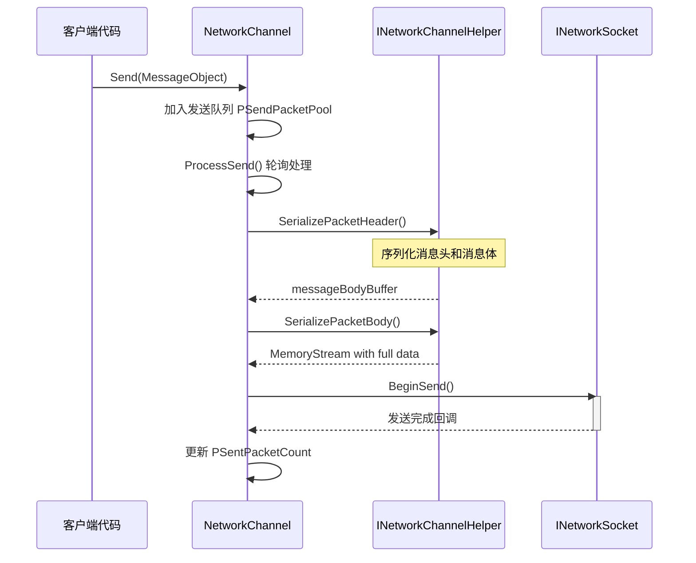
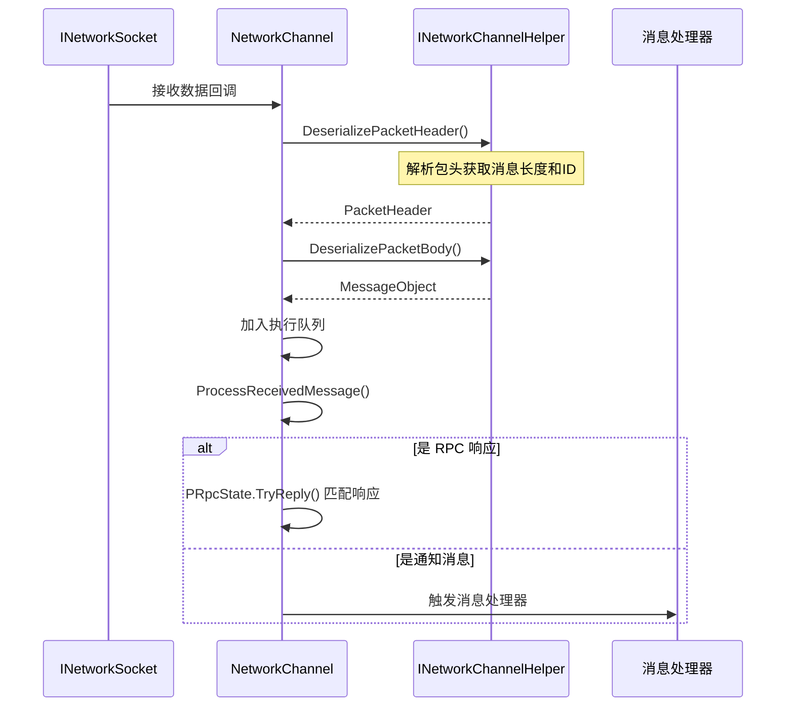
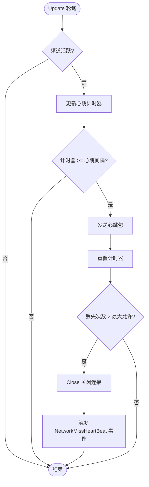

# Network Channel

Network Channel（Network Channel）是 GameFrameX 网络框架中的核心组件，responsible forManages与远程Server的单一connect。它封装了 Socket 通信、消息serialize/反serialize、Heartbeat Check、RPC 调用等完整功能，使开发者能够方便地进行网络通信开发。

## 概述

在 GameFrameX 网络框架中，每个Network Channel代表一个独立的网络connect。框架supportsCreates多个频道同时connect不同的Server，每个频道维护自己的connect状态、send队列、receive队列和心跳状态。

Network Channel的设计adopts了分层架构：

- **Interface Layer**：定义 `INetworkChannel` 接口，抽象所有网络操作
- **基类层**：provides `NetworkChannelBase` Abstract Base Class，Implements通用逻辑
- **Implementation Layer**：including `SystemTcpNetworkChannel`（TCP connect）和 `WebSocketNetworkChannel`（WebSocket connect）
- **Auxiliary Layer**：through `INetworkChannelHelper` 委托消息的serialize和反serialize

### Core Features

Network Channelprovides以下Core Features：

1. **connectManages**：建立和维护与远程Server的connect
2. **消息send**：将 MessageObject serialize为网络数据并send
3. **消息receive**：receive网络数据并反serialize为 MessageObject
4. **Heartbeat Mechanism**：定期send心跳包检测connect状态
5. **RPC 调用**：supports请求-响应模式的远程过程调用
6. **Message Compression**：supportsMessage Compression以减少网络传输量
7. **事件通知**：throughEvent System通知connect状态变更

## 架构

```mermaid
graph TD
    subgraph "外部调用"
        NetworkComponent
        GameLogic
    end
    
    subgraph "NetworkManager"
        Manager[网络管理器]
    end
    
    subgraph "网络频道层"
        INetworkChannel[INetworkChannel 接口]
        BaseChannel[NetworkChannelBase 基类]
        TcpChannel[SystemTcpNetworkChannel]
        WsChannel[WebSocketNetworkChannel]
    end
    
    subgraph "处理器层"
        SendHeader[IPacketSendHeaderHandler]
        SendBody[IPacketSendBodyHandler]
        RecvHeader[IPacketReceiveHeaderHandler]
        RecvBody[IPacketReceiveBodyHandler]
        HeartBeat[IPacketHeartBeatHandler]
        Compress[IMessageCompressHandler]
        Decompress[IMessageDecompressHandler]
    end
    
    subgraph "辅助层"
        Helper[INetworkChannelHelper]
        DefaultHelper[DefaultNetworkChannelHelper]
    end
    
    subgraph "底层网络"
        Socket[INetworkSocket]
    end
    
    NetworkComponent --> Manager
    Manager --> INetworkChannel
    INetworkChannel <|-- BaseChannel
    BaseChannel --> TcpChannel
    BaseChannel --> WsChannel
    BaseChannel --> Helper
    BaseChannel --> SendHeader
    BaseChannel --> SendBody
    BaseChannel --> RecvHeader
    BaseChannel --> RecvBody
    BaseChannel --> HeartBeat
    BaseChannel --> Compress
    BaseChannel --> Decompress
    Helper <|.. DefaultHelper
    TcpChannel --> Socket
    WsChannel --> Socket
```

### 组件Description

| 组件 | Description |
|------|------|
| `INetworkChannel` | Network Channel接口，定义所有网络操作 |
| `NetworkChannelBase` | Abstract Base Class，Implements通用逻辑和状态Manages |
| `SystemTcpNetworkChannel` | 基于 System.Net.Sockets 的 TCP Implements |
| `WebSocketNetworkChannel` | 基于 WebSocket 的connectImplements |
| `INetworkChannelHelper` | 消息serialize/反serialize辅助器接口 |
| `DefaultNetworkChannelHelper` | 默认Implements，自动registerprocess器 |

## 消息process流程

### send流程

当Client调用 `Send` MethodSend Message时，Network Channel按照以下流程process：



> Source: [NetworkManager.NetworkChannelBase.cs](https://github.com/GameFrameX/com.gameframex.unity.network/blob/main/Runtime/Network/Network/NetworkManager.NetworkChannelBase.cs#L779-L822)

### receive流程

receive到网络数据时，Network Channel按照以下流程process：



> Source: [NetworkManager.NetworkChannelBase.cs](https://github.com/GameFrameX/com.gameframex.unity.network/blob/main/Runtime/Network/Network/NetworkManager.NetworkChannelBase.cs#L392-L430)

## Heartbeat Mechanism

Network Channel内置Heartbeat Mechanism，used for检测connect是否仍然有效。



> Source: [NetworkManager.NetworkChannelBase.cs](https://github.com/GameFrameX/com.gameframex.unity.network/blob/main/Runtime/Network/Network/NetworkManager.NetworkChannelBase.cs#L436-L479)

### 心跳configuration

| Property | Default | Description |
|------|--------|------|
| `HeartBeatInterval` | 30秒 | 心跳send间隔 |
| `MissHeartBeatCountByClose` | 10 | Heartbeat Lost次数阈值，超过后自动断开 |
| `ResetHeartBeatElapseSecondsWhenReceivePacket` | false | 收到消息时是否reset心跳计时器 |

## Usage Examples

### Creates频道

```csharp
// 通过 NetworkComponent 创建网络频道
var networkChannel = networkComponent.CreateNetworkChannel(
    "GameServer", 
    new DefaultNetworkChannelHelper()
);
```

> Source: [NetworkComponent.cs](https://github.com/GameFrameX/com.gameframex.unity.network/blob/main/Runtime/Network/NetworkComponent.cs#L176-L180)

### connectServer

```csharp
// 连接到远程服务器
var channel = networkComponent.GetNetworkChannel("GameServer");
channel.Connect(new Uri("tcp://127.0.0.1:8888"));
```

> Source: [NetworkManager.NetworkChannelBase.cs](https://github.com/GameFrameX/com.gameframex.unity.network/blob/main/Runtime/Network/Network/NetworkManager.NetworkChannelBase.cs#L638-L706)

### Send Message

```csharp
// 发送消息（异步无返回）
var message = new C2S_LoginMessage 
{ 
    Username = "player1", 
    Password = "password" 
};
channel.Send(message);

// 发送 RPC 请求（等待响应）
var response = await channel.Call<S2C_LoginResponse>(new C2S_LoginMessage 
{ 
    Username = "player1", 
    Password = "password" 
});
```

> Source: [NetworkManager.NetworkChannelBase.cs](https://github.com/GameFrameX/com.gameframex.unity.network/blob/main/Runtime/Network/Network/NetworkManager.NetworkChannelBase.cs#L765-L771)

### configuration心跳

```csharp
// 设置心跳间隔为 15 秒
channel.HeartBeatInterval = 15f;

// 设置丢失 5 次心跳后断开
MissHeartBeatCountByClose = 5;

// 收到消息时重置心跳计时器
channel.ResetHeartBeatElapseSecondsWhenReceivePacket = true;
```

> Source: [NetworkManager.NetworkChannelBase.cs](https://github.com/GameFrameX/com.gameframex.unity.network/blob/main/Runtime/Network/Network/NetworkManager.NetworkChannelBase.cs#L290-L297)

### registerMessage Handlers

```csharp
// 在 DefaultNetworkChannelHelper.Initialize 中自动注册所有处理器
// 开发者可以通过继承 INetworkChannelChannelHelper 自定义处理器注册逻辑

// 注册自定义心跳处理器
channel.RegisterHeartBeatHandler(new CustomHeartBeatHandler());
```

> Source: [DefaultNetworkChannelHelper.cs](https://github.com/GameFrameX/com.gameframex.unity.network/blob/main/Runtime/Network/Helper/DefaultNetworkChannelHelper.cs#L40-L107)

### Closed频道

```csharp
// 关闭网络频道
channel.Close("主动关闭", (ushort)NetworkErrorCode.Normal);
```

> Source: [NetworkManager.NetworkChannelBase.cs](https://github.com/GameFrameX/com.gameframex.unity.network/blob/main/Runtime/Network/Network/NetworkManager.NetworkChannelBase.cs#L714-L756)

## INetworkChannel 接口参考

### connectManages

| Method | Description |
|------|------|
| `Connect(Uri address, object userData = null)` | connect到远程Server |
| `Close(string reason, ushort code = 0)` | Closed网络connect |
| `Send<T>(T messageObject) where T : MessageObject` | Send Message |
| `Call<TResult>(MessageObject messageObject, bool isIgnoreErrorCode = false)` | send RPC 请求并等待响应 |

### Property

| Property | Type | Description |
|------|------|------|
| `Name` | string | get频道名称 |
| `Connected` | bool | get是否Connected |
| `AddressFamily` | AddressFamily | get地址Type（IPv4/IPv6） |
| `Socket` | INetworkSocket | getLow-level Socket |
| `SendPacketCount` | int | get待Send Message数量 |
| `SentPacketCount` | int | get已Send Message总数 |
| `ReceivedPacketCount` | int | get已Receive Message总数 |
| `HeartBeatInterval` | float | get或set心跳间隔（秒） |
| `HeartBeatElapseSeconds` | float | get心跳流逝时间 |
| `MissHeartBeatCount` | int | getHeartbeat Lost次数 |

### process器Manages

| Method | Description |
|------|------|
| `RegisterHandler(IPacketSendHeaderHandler)` | registersend包头process器 |
| `RegisterHandler(IPacketSendBodyHandler)` | registersend包体process器 |
| `RegisterHandler(IPacketReceiveHeaderHandler)` | registerreceive包头process器 |
| `RegisterHandler(IPacketReceiveBodyHandler)` | registerreceive包体process器 |
| `RegisterHeartBeatHandler(IPacketHeartBeatHandler)` | register心跳process器 |
| `RegisterMessageCompressHandler(IMessageCompressHandler)` | registerMessage Compressionprocess器 |
| `RegisterMessageDecompressHandler(IMessageDecompressHandler)` | register消息decompressprocess器 |

### RPC 回调set

| Method | Description |
|------|------|
| `SetRPCErrorCodeHandler(EventHandler<MessageObject>)` | set RPC error码回调 |
| `SetRPCErrorHandler(EventHandler<MessageObject>)` | set RPC error回调 |
| `SetRPCStartHandler(EventHandler<MessageObject>)` | set RPC 开始回调 |
| `SetRPCEndHandler(EventHandler<MessageObject>)` | set RPC 结束回调 |

> Source: [INetworkChannel.cs](https://github.com/GameFrameX/com.gameframex.unity.network/blob/main/Runtime/Network/Interface/INetworkChannel.cs)

## INetworkChannelHelper 接口参考

`INetworkChannelHelper` 是Network Channel的辅助器接口，responsible for消息的serialize和反serialize。

| Method | Description |
|------|------|
| `Initialize(INetworkChannel)` | Initialize辅助器 |
| `Shutdown()` | Closed并cleanup辅助器 |
| `PrepareForConnecting()` | connect前准备工作 |
| `SendHeartBeat()` | send心跳消息 |
| `SerializePacketHeader<T>()` | serialize消息头 |
| `SerializePacketBody()` | serialize消息体 |
| `DeserializePacketHeader()` | 反serialize消息头 |
| `DeserializePacketBody()` | 反serialize消息体 |

> Source: [INetworkChannelHelper.cs](https://github.com/GameFrameX/com.gameframex.unity.network/blob/main/Runtime/Network/Interface/INetworkChannelHelper.cs)

## Related Links

- [网络Manages器](./4-core-concepts.1-network-manager)
- [Message Types](./4-core-concepts.3-message-types)
- [数据包process器](./4-core-concepts.4-packet-handlers)
- [Heartbeat Mechanism](./5-heartbeat)
- [Event System](./6-events)
- [Message Compression](./7-message-compression)
- [RPC Remote Procedure Call](./8-rpc)
