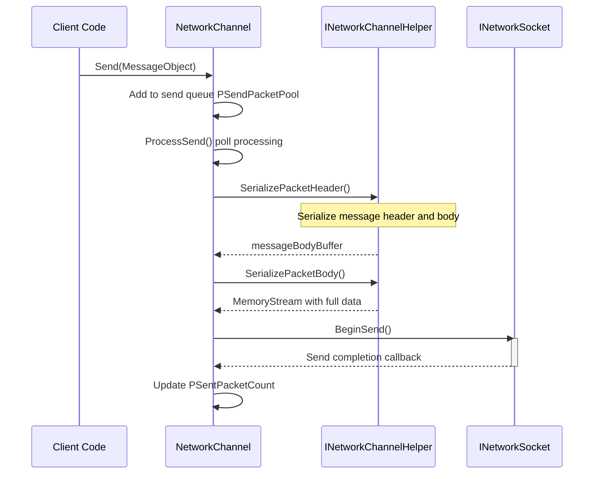
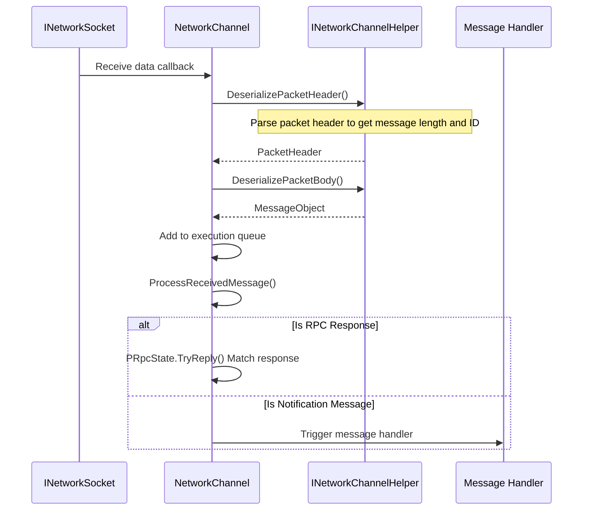
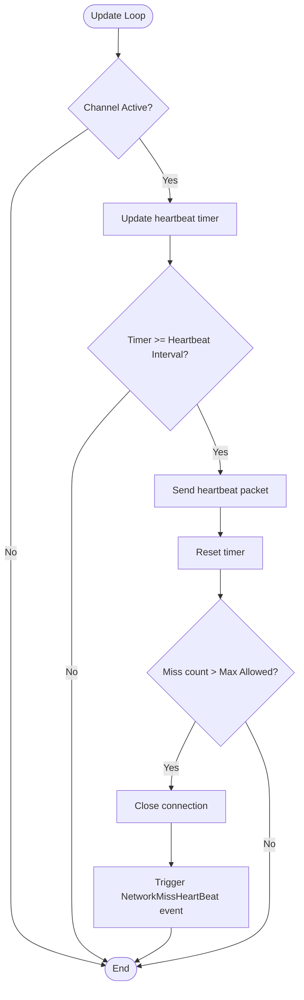

# Network Channel

Network Channel is the core component in the GameFrameX network framework, responsible for managing a single connection with a remote server. It encapsulates complete functionality including Socket communication, message serialization/deserialization, Heartbeat Check, and RPC calls, enabling developers to easily perform network communication development.

## Overview

In the GameFrameX network framework, each Network Channel represents an independent network connection. The framework supports creating multiple channels simultaneously connecting to different servers, with each channel maintaining its own connection state, send queue, receive queue, and heartbeat state.

Network Channel design adopts a layered architecture:

- **Interface Layer**: Defines the `INetworkChannel` interface, abstracting all network operations
- **Base Class Layer**: Provides the `NetworkChannelBase` abstract base class, implementing common logic
- **Implementation Layer**: Includes `SystemTcpNetworkChannel` (TCP connection) and `WebSocketNetworkChannel` (WebSocket connection)
- **Auxiliary Layer**: Delegates message serialization and deserialization through `INetworkChannelHelper`

### Core Features

Network Channel provides the following core features:

1. **Connection Management**: Establishes and maintains connections with remote servers
2. **Message Sending**: Serializes MessageObject into network data and sends it
3. **Message Receiving**: Receives network data and deserializes it into MessageObject
4. **Heartbeat Mechanism**: Periodically sends heartbeat packets to detect connection status
5. **RPC Calls**: Supports request-response mode remote procedure calls
6. **Message Compression**: Supports message compression to reduce network transmission volume
7. **Event Notifications**: Notifies connection state changes through the Event System

## Architecture

```mermaid
graph TD
    subgraph "External Calls"
        NetworkComponent
        GameLogic
    end

    subgraph "NetworkManager"
        Manager[Network Manager]
    end

    subgraph "Network Channel Layer"
        INetworkChannel[INetworkChannel Interface]
        BaseChannel[NetworkChannelBase Base Class]
        TcpChannel[SystemTcpNetworkChannel]
        WsChannel[WebSocketNetworkChannel]
    end

    subgraph "Handler Layer"
        SendHeader[IPacketSendHeaderHandler]
        SendBody[IPacketSendBodyHandler]
        RecvHeader[IPacketReceiveHeaderHandler]
        RecvBody[IPacketReceiveBodyHandler]
        HeartBeat[IPacketHeartBeatHandler]
        Compress[IMessageCompressHandler]
        Decompress[IMessageDecompressHandler]
    end

    subgraph "Auxiliary Layer"
        Helper[INetworkChannelHelper]
        DefaultHelper[DefaultNetworkChannelHelper]
    end

    subgraph "Low-level Network"
        Socket[INetworkSocket]
    end

    NetworkComponent --> Manager
    Manager --> INetworkChannel
    INetworkChannel <|-- BaseChannel
    BaseChannel --> TcpChannel
    BaseChannel --> WsChannel
    BaseChannel --> Helper
    BaseChannel --> SendHeader
    BaseChannel --> SendBody
    BaseChannel --> RecvHeader
    BaseChannel --> RecvBody
    BaseChannel --> HeartBeat
    BaseChannel --> Compress
    BaseChannel --> Decompress
    Helper <|.. DefaultHelper
    TcpChannel --> Socket
    WsChannel --> Socket
```

### Component Description

| Component | Description |
|------|------|
| `INetworkChannel` | Network Channel interface, defining all network operations |
| `NetworkChannelBase` | Abstract base class, implementing common logic and state management |
| `SystemTcpNetworkChannel` | TCP implementation based on System.Net.Sockets |
| `WebSocketNetworkChannel` | Connection implementation based on WebSocket |
| `INetworkChannelHelper` | Message serialization/deserialization helper interface |
| `DefaultNetworkChannelHelper` | Default implementation, automatically registering processors |

## Message Processing Flow

### Send Flow

When the client calls the `Send` method to send a message, Network Channel processes it according to the following flow:



> Source: [NetworkManager.NetworkChannelBase.cs](https://github.com/GameFrameX/com.gameframex.unity.network/blob/main/Runtime/Network/Network/NetworkManager.NetworkChannelBase.cs#L779-L822)

### Receive Flow

When network data is received, Network Channel processes it according to the following flow:



> Source: [NetworkManager.NetworkChannelBase.cs](https://github.com/GameFrameX/com.gameframex.unity.network/blob/main/Runtime/Network/Network/NetworkManager.NetworkChannelBase.cs#L392-L430)

## Heartbeat Mechanism

Network Channel has a built-in Heartbeat Mechanism for detecting whether the connection is still valid.



> Source: [NetworkManager.NetworkChannelBase.cs](https://github.com/GameFrameX/com.gameframex.unity.network/blob/main/Runtime/Network/Network/NetworkManager.NetworkChannelBase.cs#L436-L479)

### Heartbeat Configuration

| Property | Default | Description |
|------|--------|------|
| `HeartBeatInterval` | 30 seconds | Heartbeat send interval |
| `MissHeartBeatCountByClose` | 10 | Heartbeat miss count threshold, auto-disconnect after exceeding |
| `ResetHeartBeatElapseSecondsWhenReceivePacket` | false | Whether to reset heartbeat timer when receiving message |

## Usage Examples

### Create Channel

```csharp
// Create network channel through NetworkComponent
var networkChannel = networkComponent.CreateNetworkChannel(
    "GameServer",
    new DefaultNetworkChannelHelper()
);
```

> Source: [NetworkComponent.cs](https://github.com/GameFrameX/com.gameframex.unity.network/blob/main/Runtime/Network/NetworkComponent.cs#L176-L180)

### Connect to Server

```csharp
// Connect to remote server
var channel = networkComponent.GetNetworkChannel("GameServer");
channel.Connect(new Uri("tcp://127.0.0.1:8888"));
```

> Source: [NetworkManager.NetworkChannelBase.cs](https://github.com/GameFrameX/com.gameframex.unity.network/blob/main/Runtime/Network/Network/NetworkManager.NetworkChannelBase.cs#L638-L706)

### Send Message

```csharp
// Send message (asynchronous, no response)
var message = new C2S_LoginMessage
{
    Username = "player1",
    Password = "password"
};
channel.Send(message);

// Send RPC request (wait for response)
var response = await channel.Call<S2C_LoginResponse>(new C2S_LoginMessage
{
    Username = "player1",
    Password = "password"
});
```

> Source: [NetworkManager.NetworkChannelBase.cs](https://github.com/GameFrameX/com.gameframex.unity.network/blob/main/Runtime/Network/Network/NetworkManager.NetworkChannelBase.cs#L765-L771)

### Configure Heartbeat

```csharp
// Set heartbeat interval to 15 seconds
channel.HeartBeatInterval = 15f;

// Disconnect after missing 5 heartbeats
MissHeartBeatCountByClose = 5;

// Reset heartbeat timer when receiving message
channel.ResetHeartBeatElapseSecondsWhenReceivePacket = true;
```

> Source: [NetworkManager.NetworkChannelBase.cs](https://github.com/GameFrameX/com.gameframex.unity.network/blob/main/Runtime/Network/Network/NetworkManager.NetworkChannelBase.cs#L290-L297)

### Register Message Handlers

```csharp
// All handlers are automatically registered in DefaultNetworkChannelHelper.Initialize
// Developers can customize handler registration logic by inheriting INetworkChannelChannelHelper

// Register custom heartbeat handler
channel.RegisterHeartBeatHandler(new CustomHeartBeatHandler());
```

> Source: [DefaultNetworkChannelHelper.cs](https://github.com/GameFrameX/com.gameframex.unity.network/blob/main/Runtime/Network/Helper/DefaultNetworkChannelHelper.cs#L40-L107)

### Close Channel

```csharp
// Close network channel
channel.Close("User-initiated close", (ushort)NetworkErrorCode.Normal);
```

> Source: [NetworkManager.NetworkChannelBase.cs](https://github.com/GameFrameX/com.gameframex.unity.network/blob/main/Runtime/Network/Network/NetworkManager.NetworkChannelBase.cs#L714-L756)

## INetworkChannel Interface Reference

### Connection Management

| Method | Description |
|------|------|
| `Connect(Uri address, object userData = null)` | Connect to remote server |
| `Close(string reason, ushort code = 0)` | Close network connection |
| `Send<T>(T messageObject) where T : MessageObject` | Send message |
| `Call<TResult>(MessageObject messageObject, bool isIgnoreErrorCode = false)` | Send RPC request and wait for response |

### Properties

| Property | Type | Description |
|------|------|------|
| `Name` | string | Get channel name |
| `Connected` | bool | Get whether connected |
| `AddressFamily` | AddressFamily | Get address type (IPv4/IPv6) |
| `Socket` | INetworkSocket | Get low-level Socket |
| `SendPacketCount` | int | Get number of pending send messages |
| `SentPacketCount` | int | Get total number of sent messages |
| `ReceivedPacketCount` | int | Get total number of received messages |
| `HeartBeatInterval` | float | Get or set heartbeat interval (seconds) |
| `HeartBeatElapseSeconds` | float | Get heartbeat elapsed time |
| `MissHeartBeatCount` | int | Get heartbeat miss count |

### Processor Management

| Method | Description |
|------|------|
| `RegisterHandler(IPacketSendHeaderHandler)` | Register send packet header processor |
| `RegisterHandler(IPacketSendBodyHandler)` | Register send packet body processor |
| `RegisterHandler(IPacketReceiveHeaderHandler)` | Register receive packet header processor |
| `RegisterHandler(IPacketReceiveBodyHandler)` | Register receive packet body processor |
| `RegisterHeartBeatHandler(IPacketHeartBeatHandler)` | Register heartbeat processor |
| `RegisterMessageCompressHandler(IMessageCompressHandler)` | Register message compression processor |
| `RegisterMessageDecompressHandler(IMessageDecompressHandler)` | Register message decompression processor |

### RPC Callback Settings

| Method | Description |
|------|------|
| `SetRPCErrorCodeHandler(EventHandler<MessageObject>)` | Set RPC error code callback |
| `SetRPCErrorHandler(EventHandler<MessageObject>)` | Set RPC error callback |
| `SetRPCStartHandler(EventHandler<MessageObject>)` | Set RPC start callback |
| `SetRPCEndHandler(EventHandler<MessageObject>)` | Set RPC end callback |

> Source: [INetworkChannel.cs](https://github.com/GameFrameX/com.gameframex.unity.network/blob/main/Runtime/Network/Interface/INetworkChannel.cs)

## INetworkChannelHelper Interface Reference

`INetworkChannelHelper` is the helper interface for Network Channel, responsible for message serialization and deserialization.

| Method | Description |
|------|------|
| `Initialize(INetworkChannel)` | Initialize helper |
| `Shutdown()` | Close and clean up helper |
| `PrepareForConnecting()` | Pre-connection preparation work |
| `SendHeartBeat()` | Send heartbeat message |
| `SerializePacketHeader<T>()` | Serialize message header |
| `SerializePacketBody()` | Serialize message body |
| `DeserializePacketHeader()` | Deserialize message header |
| `DeserializePacketBody()` | Deserialize message body |

> Source: [INetworkChannelHelper.cs](https://github.com/GameFrameX/com.gameframex.unity.network/blob/main/Runtime/Network/Interface/INetworkChannelHelper.cs)

## Related Links

- [Network Manager](./04.network-manager.md) - Learn more about network manager
- [Message Types](./06.message-types.md) - Learn about message object definitions
- [Packet Handlers](./07.packet-handlers.md) - Learn about packet serialization and processing
- [Heartbeat Mechanism](./09.heartbeat.md) - Learn more about heartbeat check mechanism
- [Event System](./08.events.md) - Learn about Event System usage
- [Message Compression](./10.message-compression.md) - Learn about message compression functionality
- [RPC Remote Procedure Call](./11.rpc.md) - Learn more about RPC mechanism