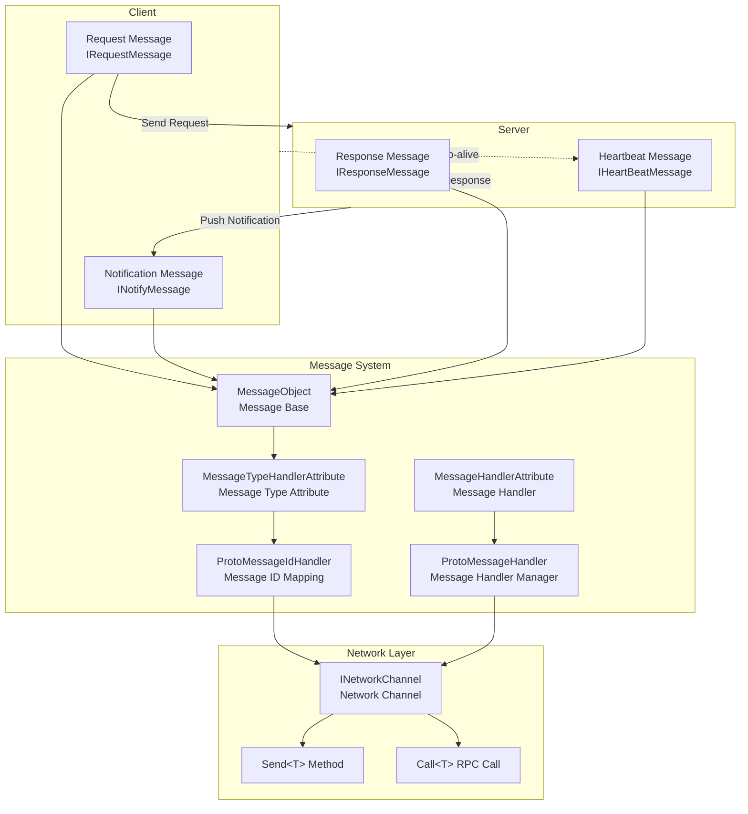
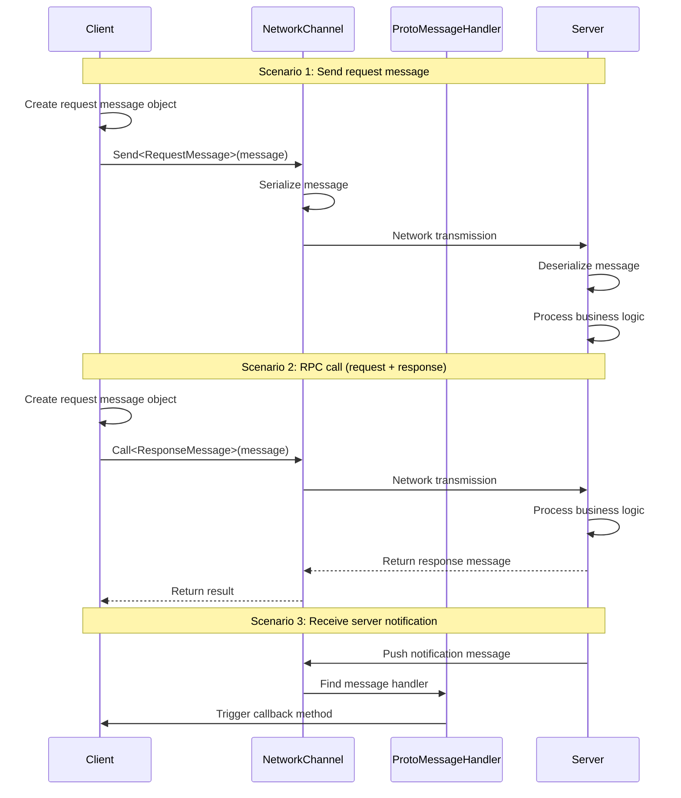

# Message Types

Message Types is a system in the GameFrameX network framework used for defining data structures for communication between client and server. Through Message Types, developers can define request messages, response messages, notification messages, and heartbeat messages to implement reliable network communication.

## Overview

The GameFrameX network framework adopts a message-based communication mode, where all network transmitted data is encapsulated as message objects. The framework provides a complete Message Types system supporting:

- **Request Message**: Requests sent by client to server
- **Response Message**: Server's response to client requests
- **Notification Message**: Messages actively pushed by server to client
- **Heartbeat Message**: Lightweight messages used to keep connections alive

The Message Types system is built on the `MessageObject` base class, supporting JSON and Protobuf serialization methods. Combined with `MessageTypeHandlerAttribute`, it can assign a unique message ID to each message type.

## Architecture



### Message Flow



## Core Concepts

### MessageObject - Message Base Class

All network messages must inherit from the `MessageObject` base class. This class provides unique ID generation and serialization support.

> Source: [MessageObject.cs](https://github.com/GameFrameX/com.gameframex.unity.network/blob/main/Runtime/Network/Base/MessageObject.cs#L1-L56)

```csharp
public class MessageObject : IReference
{
    /// <summary>
    /// Message unique ID
    /// </summary>
    public int UniqueId { get; private set; }

    protected MessageObject()
    {
        UpdateUniqueId();
    }

    /// <summary>
    /// Update unique ID
    /// </summary>
    public void UpdateUniqueId()
    {
        UniqueId = Utility.IdGenerator.GetNextUniqueIntId();
    }

    /// <summary>
    /// Clear references
    /// </summary>
    public virtual void Clear()
    {
    }
}
```

### Message Type Interfaces

The framework defines four core interfaces to distinguish different types of messages:

| Interface | Usage | Description |
|------|------|------|
| `IRequestMessage` | Request message | Requests sent by client to server |
| `IResponseMessage` | Response message | Server's response to client, containing ErrorCode property |
| `INotifyMessage` | Notification message | Messages actively pushed by server to client |
| `IHeartBeatMessage` | Heartbeat message | Lightweight messages used to keep connections alive |

> Source: [IRequestMessage.cs](https://github.com/GameFrameX/com.gameframex.unity.network/blob/main/Runtime/Network/Base/IRequestMessage.cs#L1-L9)
> Source: [IResponseMessage.cs](https://github.com/GameFrameX/com.gameframex.unity.network/blob/main/Runtime/Network/Base/IResponseMessage.cs#L1-L13)
> Source: [INotifyMessage.cs](https://github.com/GameFrameX/com.gameframex.unity.network/blob/main/Runtime/Network/Base/INotifyMessage.cs#L1-L9)
> Source: [IHeartBeatMessage.cs](https://github.com/GameFrameX/com.gameframex.unity.network/blob/main/Runtime/Network/Base/IHeartBeatMessage.cs#L1-L9)

### MessageTypeHandlerAttribute - Message Type Attribute

Used to mark the unique ID of message classes. This attribute is the core of the message ID mapping system. Combined with `ProtoMessageIdHandler`, it implements bidirectional mapping between message IDs and types.

> Source: [MessageTypeHandlerAttribute.cs](https://github.com/GameFrameX/com.gameframex.unity.network/blob/main/Runtime/Network/Base/MessageTypeHandlerAttribute.cs#L1-L27)

### MessageHandlerAttribute - Message Handlers

Used to mark callback methods that process specific message types. Through this attribute, developers can declaratively register message handlers.

> Source: [MessageHandlerAttribute.cs](https://github.com/GameFrameX/com.gameframex.unity.network/blob/main/Runtime/Network/Base/MessageHandlerAttribute.cs#L1-L196)

## Usage Examples

### Define Request Message

Define a request message sent by client to server:

```csharp
using GameFrameX.Network.Runtime;

#if ENABLE_GAME_FRAME_X_PROTOBUF
using ProtoBuf;
#endif

#if ENABLE_GAME_FRAME_X_PROTOBUF
[ProtoContract]
#endif
[MessageTypeHandler(1)]  // Message ID is 1
public class C2S_LoginRequest : MessageObject, IRequestMessage
{
#if ENABLE_GAME_FRAME_X_PROTOBUF
    [ProtoMember(1)]
#endif
    public string UserName { get; set; }

#if ENABLE_GAME_FRAME_X_PROTOBUF
    [ProtoMember(2)]
#endif
    public string Password { get; set; }
}
```

### Define Response Message

Define a response message returned by server to client:

```csharp
#if ENABLE_GAME_FRAME_X_PROTOBUF
[ProtoContract]
#endif
[MessageTypeHandler(101)]  // Message ID is 101
public class S2C_LoginResponse : MessageObject, IResponseMessage
{
#if ENABLE_GAME_FRAME_X_PROTOBUF
    [ProtoMember(1)]
#endif
    public int ErrorCode { get; set; }

#if ENABLE_GAME_FRAME_X_PROTOBUF
    [ProtoMember(2)]
#endif
    public string Token { get; set; }

#if ENABLE_GAME_FRAME_X_PROTOBUF
    [ProtoMember(3)]
#endif
    public long UserId { get; set; }
}
```

### Define Notification Message

Define a notification message actively pushed by server to client:

```csharp
#if ENABLE_GAME_FRAME_X_PROTOBUF
[ProtoContract]
#endif
[MessageTypeHandler(201)]  // Message ID is 201
public class S2C_NoticeNotify : MessageObject, INotifyMessage
{
#if ENABLE_GAME_FRAME_X_PROTOBUF
    [ProtoMember(1)]
#endif
    public string Title { get; set; }

#if ENABLE_GAME_FRAME_X_PROTOBUF
    [ProtoMember(2)]
#endif
    public string Content { get; set; }
}
```

### Define Heartbeat Message

Define a heartbeat message used to keep connection alive:

```csharp
#if ENABLE_GAME_FRAME_X_PROTOBUF
[ProtoContract]
#endif
[MessageTypeHandler(10001)]  // Message ID is 10001
public class HeartBeatMessage : MessageObject, IHeartBeatMessage
{
#if ENABLE_GAME_FRAME_X_PROTOBUF
    [ProtoMember(1)]
#endif
    public long Timestamp { get; set; }
}
```

### Register Message Handlers

Use `MessageHandlerAttribute` to register message handlers to receive server-pushed messages:

```csharp
public class NetworkMessageHandler : IMessageHandler
{
    public void Register()
    {
        ProtoMessageHandler.Add(this);
    }

    [MessageHandler(typeof(S2C_LoginResponse), nameof(OnLoginResponse))]
    private void OnLoginResponse(S2C_LoginResponse message)
    {
        if (message.ErrorCode == 0)
        {
            UnityEngine.Debug.Log($"Login successful! UserId: {message.UserId}");
        }
        else
        {
            UnityEngine.Debug.LogError($"Login failed! ErrorCode: {message.ErrorCode}");
        }
    }

    [MessageHandler(typeof(S2C_NoticeNotify), nameof(OnNoticeNotify))]
    private void OnNoticeNotify(S2C_NoticeNotify message)
    {
        UnityEngine.Debug.Log($"Received notification: {message.Title} - {message.Content}");
    }
}
```

### Send Message

Send messages through `INetworkChannel`:

```csharp
// Send normal request message
var loginRequest = new C2S_LoginRequest
{
    UserName = "player1",
    Password = "password123"
};
networkChannel.Send(loginRequest);

// Send RPC request and wait for response
var loginRequest2 = new C2S_LoginRequest
{
    UserName = "player1",
    Password = "password123"
};
var response = await networkChannel.Call<S2C_LoginResponse>(loginRequest2);
if (response.ErrorCode == 0)
{
    UnityEngine.Debug.Log($"RPC call successful! Token: {response.Token}");
}
```

> Source: [INetworkChannel.cs](https://github.com/GameFrameX/com.gameframex.unity.network/blob/main/Runtime/Network/Interface/INetworkChannel.cs#L228-L241)

## ProtoMessageIdHandler - Message ID Mapping Manager

`ProtoMessageIdHandler` is responsible for managing the mapping relationship between all message types and message IDs. When the program starts, you need to call the `Init` method to scan and register all message types.

> Source: [ProtoMessageIdHandler.cs](https://github.com/GameFrameX/com.gameframex.unity.network/blob/main/Runtime/Network/Network/ProtoMessageIdHandler.cs#L1-L170)

### Initialize Message ID Mapping

```csharp
// Call when program starts
var assembly = typeof(C2S_LoginRequest).Assembly;
ProtoMessageIdHandler.Init(assembly);
```

The `Init` method automatically scans all types in the assembly with `MessageTypeHandlerAttribute`, and adds them to the corresponding mapping dictionaries based on the interfaces they implement:

- Implements `IRequestMessage` → add to request message dictionary
- Implements `IResponseMessage` → add to response message dictionary
- Implements `INotifyMessage` → add to response message dictionary (notification messages are also received through the response message channel)
- Implements `IHeartBeatMessage` → add to heartbeat message list

## ProtoMessageHandler - Message Handler Manager

`ProtoMessageHandler` is responsible for managing message handler registration and invocation.

> Source: [ProtoMessageHandler.cs](https://github.com/GameFrameX/com.gameframex.unity.network/blob/main/Runtime/Network/Network/ProtoMessageHandler.cs#L1-L144)

### Register Message Handlers

```csharp
var messageHandler = new NetworkMessageHandler();
ProtoMessageHandler.Add(messageHandler);
```

### Remove Message Handlers

```csharp
ProtoMessageHandler.Remove(messageHandler);
```

## API Reference

### MessageObject

Base class for all messages.

**Properties:**
| Property | Type | Description |
|------|------|------|
| UniqueId | int | Message unique identifier |

**Methods:**
| Method | Return Type | Description |
|------|----------|------|
| UpdateUniqueId() | void | Update the unique ID of the message |
| SetUpdateUniqueId(int uniqueId) | void | Set the unique ID of the message |
| Clear() | void | Clean up reference resources |

### MessageTypeHandlerAttribute

Used to mark message classes and assign unique message IDs.

**Constructor:**
```csharp
public MessageTypeHandlerAttribute(int messageId)
```

**Properties:**
| Property | Type | Description |
|------|------|------|
| MessageId | int | Unique ID of the message |

### MessageHandlerAttribute

Used to mark message processing methods.

**Constructor:**
```csharp
public MessageHandlerAttribute(Type message, string invokeMethodName)
```

**Parameters:**
- `message` (Type): Message type that inherits from MessageObject and implements INotifyMessage
- `invokeMethodName` (string): Name of the method that processes the message

### ProtoMessageHandler

Manages message handler registration and invocation.

**Methods:**
| Method | Description |
|------|------|
| Add(IMessageHandler) | Register message handlers |
| Remove(IMessageHandler) | Remove message handlers |

### ProtoMessageIdHandler

Manages bidirectional mapping between message IDs and types.

**Methods:**
| Method | Return Type | Description |
|------|----------|------|
| Init(Assembly) | void | Initialize message ID mapping |
| GetReqTypeById(int) | Type | Get request type by message ID |
| GetReqMessageIdByType(Type) | int | Get request message ID by type |
| GetRespTypeById(int) | Type | Get response type by message ID |
| GetRespMessageIdByType(Type) | int | Get response message ID by type |
| IsHeartbeat(Type) | bool | Check if it is a heartbeat message type |

### INetworkChannel

Network channel interface, provides message sending functionality.

**Methods:**
| Method | Description |
|------|------|
| Send<T>(T messageObject) | Send message to server |
| Call<TResult>(MessageObject, bool) | Send RPC request and wait for response |

## Related Links

- [Network Manager](./04.network-manager.md) - Learn how to use NetworkManager to create and manage network connections
- [Network Channel](./05.network-channel.md) - Learn more about network channel configuration and message processing
- [Packet Handlers](./07.packet-handlers.md) - Learn about packet processing flow
- [Heartbeat Mechanism](./09.heartbeat.md) - Learn about how heartbeat messages work
- [Event System](./08.events.md) - Learn about network event processing
- [RPC Remote Procedure Call](./11.rpc.md) - Learn about detailed RPC call usage