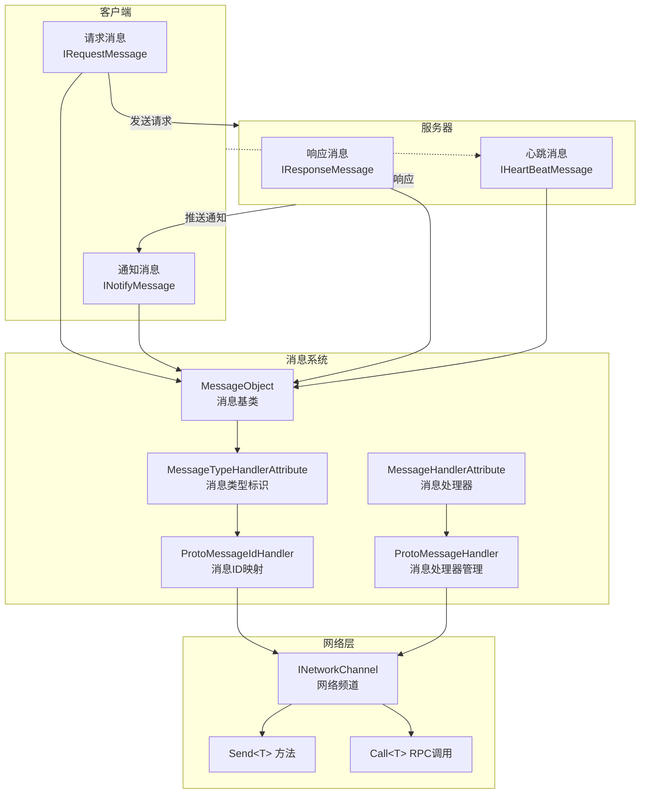
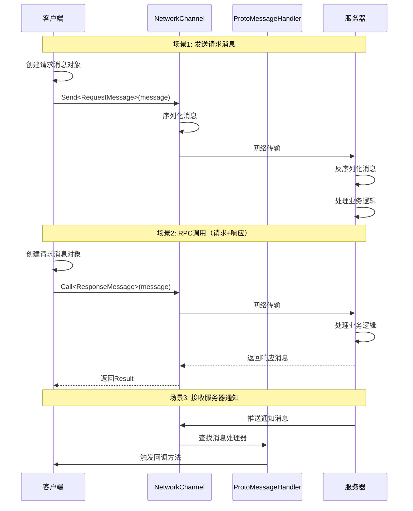

# Message Types

Message Types是 GameFrameX 网络框架中used for定义Client与Server之间通信数据结构的系统。throughMessage Types，开发者可以定义请求消息、响应消息、通知消息和心跳消息，以Implements可靠的网络通信。

## 概述

GameFrameX 网络框架adopts基于消息的通信模式，所有网络传输的数据都被封装为消息对象。框架provides了一套完整的Message Types体系，supports：

- **请求消息 (Request)**：Clientsend给Server的请求
- **响应消息 (Response)**：Server对Client请求的回应
- **通知消息 (Notify)**：Server主动推送给Client的消息
- **心跳消息 (HeartBeat)**：used for保持connect活跃的轻量级消息

Message Types系统基于 `MessageObject` 基类构建，supports JSON 和 Protobuf 两种serialize方式，配合 `MessageTypeHandlerAttribute` 可以为每种消息分配唯一的消息 ID。

## 架构



### 消息流转流程



## Core Concepts

### MessageObject - 消息基类

所有网络消息都必须Inherits `MessageObject` 基类。该类provides了唯一 ID 生成和serializesupports。

> Source: [MessageObject.cs](https://github.com/GameFrameX/com.gameframex.unity.network/blob/main/Runtime/Network/Base/MessageObject.cs#L1-L56)

```csharp
public class MessageObject : IReference
{
    /// <summary>
    /// 消息唯一编号
    /// </summary>
    public int UniqueId { get; private set; }

    protected MessageObject()
    {
        UpdateUniqueId();
    }

    /// <summary>
    /// 更新唯一编码
    /// </summary>
    public void UpdateUniqueId()
    {
        UniqueId = Utility.IdGenerator.GetNextUniqueIntId();
    }

    /// <summary>
    /// 清理引用
    /// </summary>
    public virtual void Clear()
    {
    }
}
```

### Message Types接口

框架定义了四个核心接口来区分不同Type的消息：

| 接口 | Usage | Description |
|------|------|------|
| `IRequestMessage` | 请求消息 | Clientsend给Server的请求 |
| `IResponseMessage` | 响应消息 | Server返回给Client的响应，contains ErrorCode Property |
| `INotifyMessage` | 通知消息 | Server主动推送给Client的消息 |
| `IHeartBeatMessage` | 心跳消息 | used for保持connect活跃的轻量级消息 |

> Source: [IRequestMessage.cs](https://github.com/GameFrameX/com.gameframex.unity.network/blob/main/Runtime/Network/Base/IRequestMessage.cs#L1-L9)
> Source: [IResponseMessage.cs](https://github.com/GameFrameX/com.gameframex.unity.network/blob/main/Runtime/Network/Base/IResponseMessage.cs#L1-L13)
> Source: [INotifyMessage.cs](https://github.com/GameFrameX/com.gameframex.unity.network/blob/main/Runtime/Network/Base/INotifyMessage.cs#L1-L9)
> Source: [IHeartBeatMessage.cs](https://github.com/GameFrameX/com.gameframex.unity.network/blob/main/Runtime/Network/Base/IHeartBeatMessage.cs#L1-L9)

### MessageTypeHandlerAttribute - Message Types标识

used for标记消息类的唯一 ID。该Property是消息IDmap系统的核心，配合 `ProtoMessageIdHandler` Implements消息ID与Type的双向map。

> Source: [MessageTypeHandlerAttribute.cs](https://github.com/GameFrameX/com.gameframex.unity.network/blob/main/Runtime/Network/Base/MessageTypeHandlerAttribute.cs#L1-L27)

### MessageHandlerAttribute - Message Handlers

used for标记process特定Message Types的回调Method。through该Property，开发者可以声明式地registerMessage Handlers。

> Source: [MessageHandlerAttribute.cs](https://github.com/GameFrameX/com.gameframex.unity.network/blob/main/Runtime/Network/Base/MessageHandlerAttribute.cs#L1-L196)

## Usage Examples

### 定义请求消息

定义一个Clientsend给Server的请求消息：

```csharp
using GameFrameX.Network.Runtime;

#if ENABLE_GAME_FRAME_X_PROTOBUF
using ProtoBuf;
#endif

#if ENABLE_GAME_FRAME_X_PROTOBUF
[ProtoContract]
#endif
[MessageTypeHandler(1)]  // 消息ID为1
public class C2S_LoginRequest : MessageObject, IRequestMessage
{
#if ENABLE_GAME_FRAME_X_PROTOBUF
    [ProtoMember(1)]
#endif
    public string UserName { get; set; }

#if ENABLE_GAME_FRAME_X_PROTOBUF
    [ProtoMember(2)]
#endif
    public string Password { get; set; }
}
```

### 定义响应消息

定义Server返回给Client的响应消息：

```csharp
#if ENABLE_GAME_FRAME_X_PROTOBUF
[ProtoContract]
#endif
[MessageTypeHandler(101)]  // 消息ID为101
public class S2C_LoginResponse : MessageObject, IResponseMessage
{
#if ENABLE_GAME_FRAME_X_PROTOBUF
    [ProtoMember(1)]
#endif
    public int ErrorCode { get; set; }

#if ENABLE_GAME_FRAME_X_PROTOBUF
    [ProtoMember(2)]
#endif
    public string Token { get; set; }

#if ENABLE_GAME_FRAME_X_PROTOBUF
    [ProtoMember(3)]
#endif
    public long UserId { get; set; }
}
```

### 定义通知消息

定义Server主动推送给Client的通知消息：

```csharp
#if ENABLE_GAME_FRAME_X_PROTOBUF
[ProtoContract]
#endif
[MessageTypeHandler(201)]  // 消息ID为201
public class S2C_NoticeNotify : MessageObject, INotifyMessage
{
#if ENABLE_GAME_FRAME_X_PROTOBUF
    [ProtoMember(1)]
#endif
    public string Title { get; set; }

#if ENABLE_GAME_FRAME_X_PROTOBUF
    [ProtoMember(2)]
#endif
    public string Content { get; set; }
}
```

### 定义心跳消息

定义used for保持connect活跃的心跳消息：

```csharp
#if ENABLE_GAME_FRAME_X_PROTOBUF
[ProtoContract]
#endif
[MessageTypeHandler(10001)]  // 消息ID为10001
public class HeartBeatMessage : MessageObject, IHeartBeatMessage
{
#if ENABLE_GAME_FRAME_X_PROTOBUF
    [ProtoMember(1)]
#endif
    public long Timestamp { get; set; }
}
```

### registerMessage Handlers

Uses `MessageHandlerAttribute` registerMessage Handlers来receiveServer推送的消息：

```csharp
public class NetworkMessageHandler : IMessageHandler
{
    public void Register()
    {
        ProtoMessageHandler.Add(this);
    }

    [MessageHandler(typeof(S2C_LoginResponse), nameof(OnLoginResponse))]
    private void OnLoginResponse(S2C_LoginResponse message)
    {
        if (message.ErrorCode == 0)
        {
            UnityEngine.Debug.Log($"登录成功! UserId: {message.UserId}");
        }
        else
        {
            UnityEngine.Debug.LogError($"登录失败! ErrorCode: {message.ErrorCode}");
        }
    }

    [MessageHandler(typeof(S2C_NoticeNotify), nameof(OnNoticeNotify))]
    private void OnNoticeNotify(S2C_NoticeNotify message)
    {
        UnityEngine.Debug.Log($"收到通知: {message.Title} - {message.Content}");
    }
}
```

### Send Message

through `INetworkChannel` Send Message：

```csharp
// 发送普通请求消息
var loginRequest = new C2S_LoginRequest
{
    UserName = "player1",
    Password = "password123"
};
networkChannel.Send(loginRequest);

// 发送RPC请求并等待响应
var loginRequest2 = new C2S_LoginRequest
{
    UserName = "player1",
    Password = "password123"
};
var response = await networkChannel.Call<S2C_LoginResponse>(loginRequest2);
if (response.ErrorCode == 0)
{
    UnityEngine.Debug.Log($"RPC调用成功! Token: {response.Token}");
}
```

> Source: [INetworkChannel.cs](https://github.com/GameFrameX/com.gameframex.unity.network/blob/main/Runtime/Network/Interface/INetworkChannel.cs#L228-L241)

## ProtoMessageIdHandler - 消息IDmapManages

`ProtoMessageIdHandler` responsible forManages所有Message Types与消息ID之间的map关系。在程序start时，需要调用 `Init` Method来扫描并register所有Message Types。

> Source: [ProtoMessageIdHandler.cs](https://github.com/GameFrameX/com.gameframex.unity.network/blob/main/Runtime/Network/Network/ProtoMessageIdHandler.cs#L1-L170)

### Initialize消息IDmap

```csharp
// 在程序启动时调用
var assembly = typeof(C2S_LoginRequest).Assembly;
ProtoMessageIdHandler.Init(assembly);
```

`Init` Method会自动扫描程序集中所有带有 `MessageTypeHandlerAttribute` 的Type，并根据其Implements的接口将其add到对应的map字典中：

- Implements `IRequestMessage` → add到请求消息字典
- Implements `IResponseMessage` → add到响应消息字典
- Implements `INotifyMessage` → add到响应消息字典（通知消息也through响应消息通道receive）
- Implements `IHeartBeatMessage` → add到心跳消息列表

## ProtoMessageHandler - Message HandlersManages

`ProtoMessageHandler` responsible forManagesMessage Handlers的register和调用。

> Source: [ProtoMessageHandler.cs](https://github.com/GameFrameX/com.gameframex.unity.network/blob/main/Runtime/Network/Network/ProtoMessageHandler.cs#L1-L144)

### registerMessage Handlers

```csharp
var messageHandler = new NetworkMessageHandler();
ProtoMessageHandler.Add(messageHandler);
```

### removeMessage Handlers

```csharp
ProtoMessageHandler.Remove(messageHandler);
```

## API Reference

### MessageObject

所有消息的基类。

**Property：**
| Property | Type | Description |
|------|------|------|
| UniqueId | int | 消息唯一标识符 |

**Method：**
| Method | Return Type | Description |
|------|----------|------|
| UpdateUniqueId() | void | update消息的唯一ID |
| SetUpdateUniqueId(int uniqueId) | void | set消息的唯一ID |
| Clear() | void | cleanup引用资源 |

### MessageTypeHandlerAttribute

used for标记消息类并分配唯一消息ID。

**构造函数：**
```csharp
public MessageTypeHandlerAttribute(int messageId)
```

**Property：**
| Property | Type | Description |
|------|------|------|
| MessageId | int | 消息的唯一ID |

### MessageHandlerAttribute

used for标记消息processMethod。

**构造函数：**
```csharp
public MessageHandlerAttribute(Type message, string invokeMethodName)
```

**Parameters：**
- `message` (Type): Inherits自 MessageObject 并Implements INotifyMessage 的Message Types
- `invokeMethodName` (string): Process message的Method名称

### ProtoMessageHandler

ManagesMessage Handlers的register和调用。

**Method：**
| Method | Description |
|------|------|
| Add(IMessageHandler) | registerMessage Handlers |
| Remove(IMessageHandler) | removeMessage Handlers |

### ProtoMessageIdHandler

Manages消息ID与Type的双向map。

**Method：**
| Method | Return Type | Description |
|------|----------|------|
| Init(Assembly) | void | Initialize消息IDmap |
| GetReqTypeById(int) | Type | 根据消息IDget请求Type |
| GetReqMessageIdByType(Type) | int | 根据Typeget请求消息ID |
| GetRespTypeById(int) | Type | 根据消息IDget响应Type |
| GetRespMessageIdByType(Type) | int | 根据Typeget响应消息ID |
| IsHeartbeat(Type) | bool | 判断是否为心跳Message Types |

### INetworkChannel

Network Channel接口，provides消息send功能。

**Method：**
| Method | Description |
|------|------|
| Send<T>(T messageObject) | Send Message到Server |
| Call<TResult>(MessageObject, bool) | sendRPC请求并等待响应 |

## Related Links

- [网络Manages器](./4-core-concepts.1-network-manager) - 了解如何Uses NetworkManager Creates和Manages网络connect
- [Network Channel](./4-core-concepts.2-network-channel) - Learn more aboutNetwork Channel的configuration和消息process
- [数据包process器](./4-core-concepts.4-packet-handlers) - 了解数据包的process流程
- [Heartbeat Mechanism](./5-heartbeat) - 了解心跳消息的工作原理
- [Event System](./6-events) - 了解网络事件process
- [RPC Remote Procedure Call](./8-rpc) - 了解 RPC 调用的详细用法
