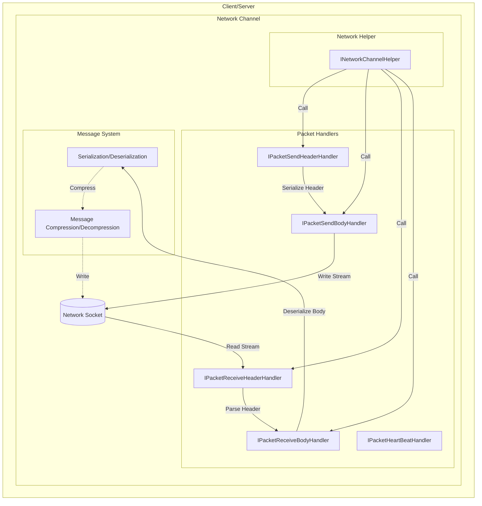
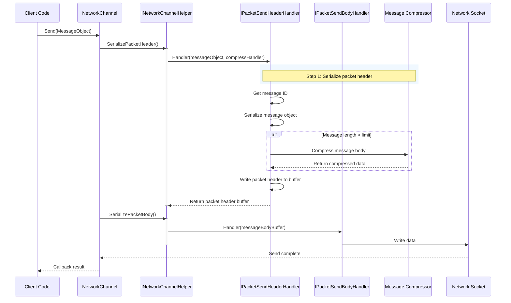
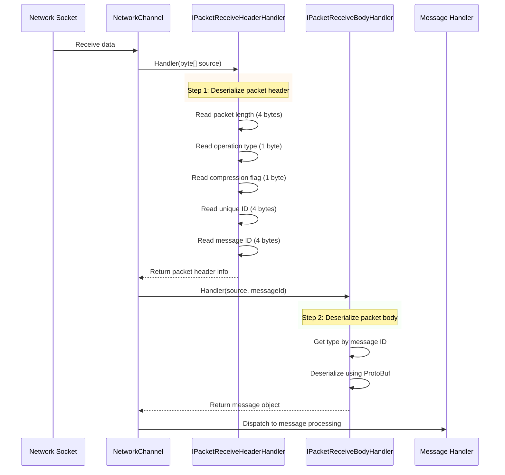

# Packet Handlers

Packet handlers are core components of the GameFrameX network library, responsible for network message serialization and deserialization operations. They convert application layer message objects into network byte streams (when sending), and convert received byte streams back into message objects (when receiving).

## Overview

In network communication, data needs to undergo specific format processing before it can be transmitted over the network. Packet handlers are the key components that bear this responsibility. They define the structure and parsing method of network messages, allowing developers to focus on business logic without worrying about low-level network communication details.

The GameFrameX network library provides five types of packet handlers:
- **Send Packet Header Handler**: Responsible for serializing message header information
- **Send Packet Body Handler**: Responsible for serializing message body content
- **Receive Packet Header Handler**: Responsible for deserializing message header information
- **Receive Packet Body Handler**: Responsible for deserializing message body content
- **Heartbeat Packet Handler**: Responsible for processing heartbeat check related logic

## Architecture



The diagram above shows the core position of packet handlers in network communication. They are invoked through the Network Helper (INetworkChannelHelper) to complete message serialization and deserialization work.

## Message Send Flow

When the client needs to send a message, packet handlers process the message object in a specific sequence:



The send flow is divided into two main phases:
1. **Packet Header Serialization**: The send packet header handler is called first. It gets the type information (message ID) of the message, serializes the message object into a byte array, decides whether to compress based on configuration, then writes packet header information (packet length, operation type, compression flag, unique ID, message ID)
2. **Packet Body Serialization**: The send packet body handler writes the processed packet body data to the target stream

## Message Receive Flow

When data is received from the network, packet handlers process the byte stream in reverse, converting it into message objects:



The receive flow is also divided into two phases:
1. **Packet Header Deserialization**: The receive packet header handler parses packet length, operation type, compression flag, unique ID, and message ID from the byte stream
2. **Packet Body Deserialization**: The receive packet body handler finds the corresponding message type by message ID and deserializes it into a message object using ProtoBuf

## Interface Definitions

### IPacketHandler

Marker interface, all packet handlers need to implement this interface:

```csharp
namespace GameFrameX.Network.Runtime
{
    public interface IPacketHandler
    {
    }
}
```
> Source: [IPacketHandler.cs](https://github.com/GameFrameX/com.gameframex.unity.network/blob/main/Runtime/Network/Interface/IPacketHandler.cs#L3-L5)

### IPacketSendHeaderHandler

Send packet header handler interface, responsible for serializing message headers:

```csharp
public interface IPacketSendHeaderHandler
{
    /// Message packet header length
    ushort PacketHeaderLength { get; }

    /// Get network message packet protocol number
    int Id { get; }

    /// Get network message packet length
    uint PacketLength { get; }

    /// Whether to compress message content
    bool IsZip { get; }

    /// Enable compression when message length exceeds this value. This value only takes effect when a compressor is set
    uint LimitCompressLength { get; }

    /// Process message
    bool Handler<T>(T messageObject, IMessageCompressHandler messageCompressHandler,
        MemoryStream destination, out byte[] messageBodyBuffer) where T : MessageObject;
}
```
> Source: [IPacketSendHeaderHandler.cs](https://github.com/GameFrameX/com.gameframex.unity.network/blob/main/Runtime/Network/Interface/IPacketSendHeaderHandler.cs#L8-L45)

### IPacketSendBodyHandler

Send packet body handler interface, responsible for writing message body to target stream:

```csharp
public interface IPacketSendBodyHandler
{
    /// Process message body
    bool Handler(byte[] messageBodyBuffer, MemoryStream destination);
}
```
> Source: [IPacketSendBodyHandler.cs](https://github.com/GameFrameX/com.gameframex.unity.network/blob/main/Runtime/Network/Interface/IPacketSendBodyHandler.cs#L39-L48)

### IPacketReceiveHeaderHandler

Receive packet header handler interface, responsible for deserializing message headers:

```csharp
public interface IPacketReceiveHeaderHandler
{
    /// Get network message packet length
    uint PacketLength { get; }

    /// Message packet header length
    ushort PacketHeaderLength { get; }

    /// Get network message packet protocol number
    int Id { get; }

    /// Message unique ID
    int UniqueId { get; }

    /// Message operation type
    byte OperationType { get; }

    /// Compression flag
    byte ZipFlag { get; }

    /// Message packet processing
    bool Handler(object source);
}
```
> Source: [IPacketReceiveHeaderHandler.cs](https://github.com/GameFrameX/com.gameframex.unity.network/blob/main/Runtime/Network/Interface/IPacketReceiveHeaderHandler.cs#L37-L75)

### IPacketReceiveBodyHandler

Receive packet body handler interface, responsible for deserializing message bodies:

```csharp
public interface IPacketReceiveBodyHandler
{
    /// Network message packet processing function
    bool Handler<T>(byte[] source, int messageId, out T messageObject) where T : MessageObject;
}
```
> Source: [IPacketReceiveBodyHandler.cs](https://github.com/GameFrameX/com.gameframex.unity.network/blob/main/Runtime/Network/Interface/IPacketReceiveBodyHandler.cs#L6-L15)

### IPacketHeartBeatHandler

Heartbeat packet handler interface, responsible for heartbeat message generation and processing:

```csharp
public interface IPacketHeartBeatHandler
{
    /// Interval between heartbeats
    float HeartBeatInterval { get; }

    /// Number of heartbeat misses to trigger network disconnect
    int MissHeartBeatCountByClose { get; }

    /// Handler
    MessageObject Handler();
}
```
> Source: [IPacketHeartBeatHandler.cs](https://github.com/GameFrameX/com.gameframex.unity.network/blob/main/Runtime/Network/Interface/IPacketHeartBeatHandler.cs#L6-L23)

## Default Implementations

### DefaultPacketSendHeaderHandler

Default send packet header handler implementation provides complete packet header serialization logic:

```csharp
public class DefaultPacketSendHeaderHandler : IPacketSendHeaderHandler, IPacketHandler
{
    private const int NetPacketLength = sizeof(uint);
    private const int NetCmdIdLength = sizeof(int);
    private const int NetOperationTypeLength = sizeof(byte);
    private const int NetZipFlagLength = sizeof(byte);
    private const int NetUniqueIdLength = sizeof(int);

    public ushort PacketHeaderLength { get; }
    public int Id { get; private set; }
    public uint PacketLength { get; private set; }
    public bool IsZip { get; private set; }
    public virtual uint LimitCompressLength { get; } = 512;

    private int m_Offset;
    private readonly byte[] m_CachedByte;

    public DefaultPacketSendHeaderHandler()
    {
        PacketHeaderLength = NetPacketLength + NetOperationTypeLength +
            NetZipFlagLength + NetUniqueIdLength + NetCmdIdLength;
        m_CachedByte = new byte[PacketHeaderLength];
    }

    public bool Handler<T>(T messageObject, IMessageCompressHandler messageCompressHandler,
        MemoryStream destination, out byte[] messageBodyBuffer) where T : MessageObject
    {
        m_Offset = 0;
        var messageType = messageObject.GetType();
        Id = ProtoMessageIdHandler.GetReqMessageIdByType(messageType);
        messageBodyBuffer = SerializerHelper.Serialize(messageObject);

        // Decide whether to compress based on length
        if (messageCompressHandler != null && messageBodyBuffer.Length > LimitCompressLength)
        {
            IsZip = true;
            messageBodyBuffer = messageCompressHandler.Handler(messageBodyBuffer);
        }
        else
        {
            IsZip = false;
        }

        var messageLength = messageBodyBuffer.Length;
        PacketLength = (uint)(PacketHeaderLength + messageLength);

        // Write packet header data
        m_CachedByte.WriteUInt(PacketLength, ref m_Offset);
        m_CachedByte.WriteByte((byte)(ProtoMessageIdHandler.IsHeartbeat(messageType) ? 1 : 4), ref m_Offset);
        m_CachedByte.WriteByte((byte)(IsZip ? 1 : 0), ref m_Offset);
        m_CachedByte.WriteInt(messageObject.UniqueId, ref m_Offset);
        m_CachedByte.WriteInt(Id, ref m_Offset);
        destination.Write(m_CachedByte, 0, PacketHeaderLength);
        return true;
    }
}
```
> Source: [DefaultPacketSendHeaderHandler.cs](https://github.com/GameFrameX/com.gameframex.unity.network/blob/main/Runtime/Network/Helper/DefaultPacketSendHeaderHandler.cs#L11-L114)

### DefaultPacketReceiveHeaderHandler

Default receive packet header handler implementation provides complete packet header parsing logic:

```csharp
public sealed class DefaultPacketReceiveHeaderHandler : IPacketReceiveHeaderHandler, IPacketHandler
{
    public uint PacketLength { get; private set; }
    public int Id { get; private set; }
    public int UniqueId { get; private set; }
    public byte OperationType { get; private set; }
    public byte ZipFlag { get; private set; }
    public ushort PacketHeaderLength { get; } = 14; // 4+1+1+4+4

    public bool Handler(object source)
    {
        byte[] reader = source as byte[];
        if (reader == null)
        {
            return false;
        }

        int offset = 0;
        PacketLength = reader.ReadUInt(ref offset);
        OperationType = reader.ReadByte(ref offset);
        ZipFlag = reader.ReadByte(ref offset);
        UniqueId = reader.ReadInt(ref offset);
        Id = reader.ReadInt(ref offset);
        return true;
    }
}
```
> Source: [DefaultPacketReceiveHeaderHandler.cs](https://github.com/GameFrameX/com.gameframex.unity.network/blob/main/Runtime/Network/Helper/DefaultPacketReceiveHeaderHandler.cs#L9-L64)

### DefaultPacketSendBodyHandler

Default send packet body handler, writes message body to target stream:

```csharp
public sealed class DefaultPacketSendBodyHandler : IPacketSendBodyHandler, IPacketHandler
{
    public bool Handler(byte[] messageBodyBuffer, MemoryStream destination)
    {
        destination.Write(messageBodyBuffer, 0, messageBodyBuffer.Length);
        return true;
    }
}
```
> Source: [DefaultPacketSendBodyHandler.cs](https://github.com/GameFrameX/com.gameframex.unity.network/blob/main/Runtime/Network/Helper/DefaultPacketSendBodyHandler.cs#L9-L16)

### DefaultPacketReceiveBodyHandler

Default receive packet body handler, deserializes messages using ProtoBuf:

```csharp
public sealed class DefaultPacketReceiveBodyHandler : IPacketReceiveBodyHandler, IPacketHandler
{
    public bool Handler<T>(byte[] source, int messageId, out T messageObject) where T : MessageObject
    {
        var messageType = ProtoMessageIdHandler.GetRespTypeById(messageId);
        messageObject = (T)SerializerHelper.Deserialize(source, messageType);
        return true;
    }
}
```
> Source: [DefaultPacketReceiveBodyHandler.cs](https://github.com/GameFrameX/com.gameframex.unity.network/blob/main/Runtime/Network/Helper/DefaultPacketReceiveBodyHandler.cs#L9-L17)

### BasePacketHeartBeatHandler

Default heartbeat packet handler base class:

```csharp
public class BasePacketHeartBeatHandler : IPacketHeartBeatHandler, IPacketHandler
{
    public virtual float HeartBeatInterval
    {
        get { return 5; }
    }

    public virtual int MissHeartBeatCountByClose { get; } = 5;

    public virtual MessageObject Handler()
    {
        throw new System.NotImplementedException();
    }
}
```
> Source: [DefaultPacketHeartBeatHandler.cs](https://github.com/GameFrameX/com.gameframex.unity.network/blob/main/Runtime/Network/Helper/DefaultPacketHeartBeatHandler.cs#L7-L26)

## Custom Packet Handlers

If the default handlers cannot meet your needs, developers can create custom packet handlers. Custom handlers need to implement the corresponding interface and inherit the `IPacketHandler` marker interface.

### Create Custom Receive Packet Header Handler

```csharp
using UnityEngine;
using GameFrameX.Network.Runtime;
using GameFrameX.Runtime;

[UnityEngine.Scripting.Preserve]
public sealed class CustomPacketReceiveHeaderHandler : IPacketReceiveHeaderHandler, IPacketHandler
{
    public uint PacketLength { get; private set; }
    public ushort PacketHeaderLength { get; } = 14;
    public int Id { get; private set; }
    public int UniqueId { get; private set; }
    public byte OperationType { get; private set; }
    public byte ZipFlag { get; private set; }

    public bool Handler(object source)
    {
        // Custom parsing logic
        byte[] reader = source as byte[];
        if (reader == null || reader.Length < PacketHeaderLength)
        {
            return false;
        }

        // Custom parsing implementation...
        return true;
    }
}
```

### Create Custom Heartbeat Packet Handler

```csharp
using UnityEngine;
using GameFrameX.Network.Runtime;

[UnityEngine.Scripting.Preserve]
public sealed class CustomHeartBeatHandler : BasePacketHeartBeatHandler
{
    // Set heartbeat interval to 10 seconds
    public override float HeartBeatInterval => 10;

    // Disconnect after missing 5 heartbeats
    public override int MissHeartBeatCountByClose => 5;

    public override MessageObject Handler()
    {
        // Return custom heartbeat message object
        return new C2SHeartBeat();
    }
}
```

## Configuration Options

The behavior of packet handlers can be configured through the following options:

| Configuration Item | Type | Default | Description |
|--------|------|--------|------|
| LimitCompressLength | uint | 512 | Enable message compression when length exceeds this value |
| HeartBeatInterval | float | 5.0 | Heartbeat packet send interval (seconds) |
| MissHeartBeatCountByClose | int | 5 | Heartbeat miss count limit, connection will be closed when exceeded |

## Related Links

- [Network Manager](./04.network-manager.md)
- [Network Channel](./05.network-channel.md)
- [Message Types](./06.message-types.md)
- [Heartbeat Mechanism](./09.heartbeat.md)
- [Message Compression](./10.message-compression.md)