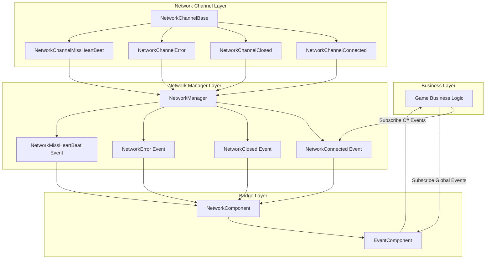
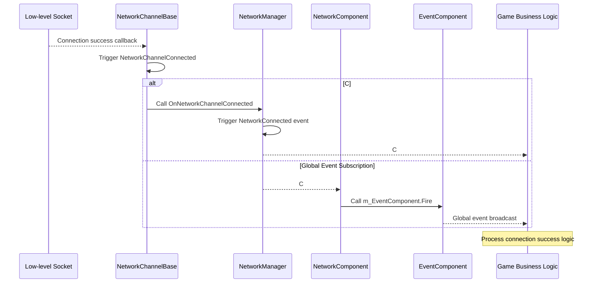

# Event System

GameFrameX Unity Network module provides a complete Event System for notifying network connection status changes, errors occurring, and heartbeat misses and other key network events. This Event System adopts a two-layer architecture, supporting both native C# events and the GameFrameX global Event System.

## Overview

The network Event System is one of the core components of the GameFrameX Unity Network module. It decouples network logic from business logic, allowing developers to flexibly respond to various network state changes. The Event System design follows these principles:

- **Decoupled Design**: Network layer notifies upper layers of state changes through events. Business layer processes network states by subscribing to events
- **Dual Support**: Supports both native C# event delegates and GameFrameX global Event System
- **Object Reuse**: Uses object pool technology to manage Event Arguments, reducing memory allocation overhead

The Event System is particularly important in game development because it allows you to add features like disconnection reconnection, offline prompts, and heartbeat exception handling without modifying the network core code.

## Architecture

GameFrameX Unity Network's Event System adopts a two-layer architecture design. This design balances ease of use and flexibility.



### Architecture Description

**Network Channel Layer (NetworkChannelBase)** is the source of network events. When the low-level Socket connection succeeds, disconnects, encounters errors, or detects heartbeat misses, NetworkChannelBase triggers the corresponding Action delegates.

**Network Manager Layer (NetworkManager)** subscribes to internal events from NetworkChannelBase, then converts them into public C# events. This layer is the main interface developers interact with directly.

**Bridge Layer (NetworkComponent)** acts as a bridge between the C# Event System and the GameFrameX global Event System. It provides both direct C# event subscription methods and global event subscription capabilities through EventComponent.

## Event Types

GameFrameX Unity Network module defines four core network events, each with a corresponding EventArgs class to carry event-related data.

### NetworkConnectedEventArgs - Connection Success Event

This event is triggered when a network connection is successfully established. This event is one of the most commonly used network events, typically used to trigger subsequent operations such as game login or getting server time.

```csharp
using GameFrameX.Network.Runtime;

// Event argument property description
public sealed class NetworkConnectedEventArgs : GameEventArgs
{
    // Event unique identifier
    public static readonly string EventId = typeof(NetworkConnectedEventArgs).FullName;

    // Gets the network connection success event ID
    public override string Id => EventId;

    // Gets the network channel - the channel object that triggered this event
    public INetworkChannel NetworkChannel { get; private set; }

    // Gets user-defined data - the userData parameter passed to the Connect method
    public object UserData { get; private set; }
}
```

> Source: [NetworkConnectedEventArgs.cs](https://github.com/GameFrameX/com.gameframex.unity.network/blob/main/Runtime/EventArgs/NetworkConnectedEventArgs.cs#L41-L97)

### NetworkClosedEventArgs - Connection Closed Event

This event is triggered when a network connection is closed. This event carries the close reason and error code, which can be used to determine whether it was a normal close or an exception disconnection.

```csharp
public sealed class NetworkClosedEventArgs : GameEventArgs
{
    // Event unique identifier
    public static readonly string EventId = typeof(NetworkClosedEventArgs).FullName;

    // Gets the network channel
    public INetworkChannel NetworkChannel { get; private set; }

    // Gets the close reason
    // Possible values: Normal, Timeout, Dispose, ConnectClose, ConnectAddressError, ConnectAddressExceptionError, MissHeartBeat
    public string Reason { get; private set; }

    // Gets the error code
    public ushort ErrorCode { get; private set; }
}
```

> Source: [NetworkClosedEventArgs.cs](https://github.com/GameFrameX/com.gameframex.unity.network/blob/main/Runtime/EventArgs/NetworkClosedEventArgs.cs#L41-L103)

### NetworkErrorEventArgs - Network Error Event

This event is triggered when a network error occurs. This event provides rich error information, including application layer error codes and low-level Socket error codes.

```csharp
public sealed class NetworkErrorEventArgs : GameEventArgs
{
    // Event unique identifier
    public static readonly string EventId = typeof(NetworkErrorEventArgs).FullName;

    // Gets the network channel
    public INetworkChannel NetworkChannel { get; private set; }

    // Gets the application layer error code
    // Enum values: Unknown, AddressFamilyError, SocketError, ConnectError, SendError, ReceiveError, SerializeError, DeserializePacketHeaderError, DeserializePacketError, MissHeartBeatError, DisposeError
    public NetworkErrorCode ErrorCode { get; private set; }

    // Gets the underlying Socket error code
    public SocketError SocketErrorCode { get; private set; }

    // Gets the error message
    public string ErrorMessage { get; private set; }
}
```

> Source: [NetworkErrorEventArgs.cs](https://github.com/GameFrameX/com.gameframex.unity.network/blob/main/Runtime/EventArgs/NetworkErrorEventArgs.cs#L42-L116)

### NetworkMissHeartBeatEventArgs - Heartbeat Miss Event

This event is triggered when heartbeat packets are missed a certain number of times. This event can be used to implement more granular disconnection reconnection logic. For example, prompt the user when the network is unstable after missing 3 heartbeats.

```csharp
public sealed class NetworkMissHeartBeatEventArgs : GameEventArgs
{
    // Event unique identifier
    public static readonly string EventId = typeof(NetworkMissHeartBeatEventArgs).FullName;

    // Gets the network channel
    public INetworkChannel NetworkChannel { get; private set; }

    // Gets the number of heartbeat packets missed
    // When the miss count exceeds MissHeartBeatCountByClose (default 10 times), the connection will be automatically closed
    public int MissCount { get; private set; }
}
```

> Source: [NetworkMissHeartBeatEventArgs.cs](https://github.com/GameFrameX/com.gameframex.unity.network/blob/main/Runtime/EventArgs/NetworkMissHeartBeatEventArgs.cs#L41-L97)

## Event Flow

The complete flow of network events involves collaboration of multiple components. Understanding this flow helps you better use the Event System to build reliable network functionality.



### Event Trigger Timing

| Event Type | Trigger Timing | Subsequent Actions |
|---------|---------|---------|
| NetworkConnected | After successfully establishing TCP connection | Can send login request or get server time |
| NetworkClosed | When connection is disconnected (normal/exception) | Clean up resources, trigger reconnection logic |
| NetworkError | When a network error occurs | Record logs, may trigger connection disconnect |
| NetworkMissHeartBeat | When heartbeat packet is missed | Update UI prompts, may trigger connection disconnect |

## Usage Examples

### Method 1: Use Native C# Events

Native C# events are the most direct event subscription method, suitable for simple network event processing scenarios.

```csharp
using GameFrameX.Network.Runtime;
using UnityEngine;

public class NetworkExample : MonoBehaviour
{
    private INetworkManager networkManager;
    private INetworkChannel channel;

    private void Start()
    {
        // Get network manager
        networkManager = GameFrameworkEntry.GetModule<INetworkManager>();

        // Subscribe to network events
        networkManager.NetworkConnected += OnNetworkConnected;
        networkManager.NetworkClosed += OnNetworkClosed;
        networkManager.NetworkError += OnNetworkError;
        networkManager.NetworkMissHeartBeat += OnNetworkMissHeartBeat;

        // Create network channel
        var helper = new DefaultNetworkChannelHelper();
        channel = networkManager.CreateNetworkChannel("GameServer", helper, 5000);

        // Connect to server
        channel.Connect(new Uri("tcp://127.0.0.1:8888"));
    }

    private void OnNetworkConnected(object sender, NetworkConnectedEventArgs e)
    {
        Debug.Log($"Connection successful! Channel: {e.NetworkChannel.Name}, User data: {e.UserData}");
    }

    private void OnNetworkClosed(object sender, NetworkClosedEventArgs e)
    {
        Debug.Log($"Connection closed! Reason: {e.Reason}, Error code: {e.ErrorCode}");
    }

    private void OnNetworkError(object sender, NetworkErrorEventArgs e)
    {
        Debug.LogError($"Network error! Error code: {e.ErrorCode}, Socket error: {e.SocketErrorCode}, Message: {e.ErrorMessage}");
    }

    private void OnNetworkMissHeartBeat(object sender, NetworkMissHeartBeatEventArgs e)
    {
        Debug.LogWarning($"Heartbeat missed! Count: {e.MissCount}");
    }

    private void OnDestroy()
    {
        // Unsubscribe from events
        if (networkManager != null)
        {
            networkManager.NetworkConnected -= OnNetworkConnected;
            networkManager.NetworkClosed -= OnNetworkClosed;
            networkManager.NetworkError -= OnNetworkError;
            networkManager.NetworkMissHeartBeat -= OnNetworkMissHeartBeat;
        }
    }
}
```

> Source: [NetworkManager.cs](https://github.com/GameFrameX/com.gameframex.unity.network/blob/main/Runtime/Network/Network/NetworkManager.cs#L261-L311)

### Method 2: Use NetworkComponent to Subscribe to Global Events

NetworkComponent provides integration with GameFrameX EventComponent. You can process network state changes by subscribing to global events. This method is more suitable for scenarios requiring cross-module communication.

```csharp
using GameFrameX.Event.Runtime;
using GameFrameX.Network.Runtime;
using UnityEngine;

public class GlobalEventExample : MonoBehaviour
{
    private EventComponent eventComponent;

    private void Start()
    {
        // Get event component
        eventComponent = GameEntry.GetComponent<EventComponent>();

        // Subscribe to global events
        eventComponent.Subscribe(NetworkConnectedEventArgs.EventId, OnNetworkConnected);
        eventComponent.Subscribe(NetworkClosedEventArgs.EventId, OnNetworkClosed);
        eventComponent.Subscribe(NetworkErrorEventArgs.EventId, OnNetworkError);
        eventComponent.Subscribe(NetworkMissHeartBeatEventArgs.EventId, OnNetworkMissHeartBeat);
    }

    private void OnNetworkConnected(object sender, GameEventArgs e)
    {
        var args = e as NetworkConnectedEventArgs;
        Debug.Log($"Global event - Connection successful! Channel: {args.NetworkChannel.Name}");
    }

    private void OnNetworkClosed(object sender, GameEventArgs e)
    {
        var args = e as NetworkClosedEventArgs;
        Debug.Log($"Global event - Connection closed! Reason: {args.Reason}");
    }

    private void OnNetworkError(object sender, GameEventArgs e)
    {
        var args = e as NetworkErrorEventArgs;
        Debug.LogError($"Global event - Network error: {args.ErrorMessage}");
    }

    private void OnNetworkMissHeartBeat(object sender, GameEventArgs e)
    {
        var args = e as NetworkMissHeartBeatEventArgs;
        Debug.LogWarning($"Global event - Heartbeat miss count: {args.MissCount}");
    }

    private void OnDestroy()
    {
        // Unsubscribe from global events
        if (eventComponent != null)
        {
            eventComponent.Unsubscribe(NetworkConnectedEventArgs.EventId, OnNetworkConnected);
            eventComponent.Unsubscribe(NetworkClosedEventArgs.EventId, OnNetworkClosed);
            eventComponent.Unsubscribe(NetworkErrorEventArgs.EventId, OnNetworkError);
            eventComponent.Unsubscribe(NetworkMissHeartBeatEventArgs.EventId, OnNetworkMissHeartBeat);
        }
    }
}
```

> Source: [NetworkComponent.cs](https://github.com/GameFrameX/com.gameframex.unity.network/blob/main/Runtime/Network/NetworkComponent.cs#L196-L214)

### Method 3: Use NetworkComponent Event Properties

NetworkComponent also directly exposes event properties identical to NetworkManager, making it convenient to subscribe directly through Inspector or scripts in the Unity Editor.

```csharp
public class DirectSubscribeExample : MonoBehaviour
{
    private NetworkComponent networkComponent;

    private void Start()
    {
        // Subscribe directly from NetworkComponent
        networkComponent = GetComponent<NetworkComponent>();
        networkComponent.NetworkConnected += OnConnected;
        networkComponent.NetworkClosed += OnClosed;
    }

    private void OnConnected(object sender, NetworkConnectedEventArgs e)
    {
        Debug.Log("Connection successful");
    }

    private void OnClosed(object sender, NetworkClosedEventArgs e)
    {
        Debug.Log($"Connection closed: {e.Reason}");
    }
}
```

> Source: [NetworkComponent.cs](https://github.com/GameFrameX/com.gameframex.unity.network/blob/main/Runtime/Network/NetworkComponent.cs#L109-L112)

## Error Code Reference

### NetworkCloseReason - Close Reason

| Constant | Description |
|-----|------|
| Normal | Normal close |
| Timeout | Timeout close |
| Dispose | Resource release close |
| ConnectClose | Connection close |
| ConnectAddressError | Connection address error close |
| ConnectAddressExceptionError | Connection address exception error close |
| MissHeartBeat | Heartbeat miss close |

> Source: [NetworkErrorCode.cs](https://github.com/GameFrameX/com.gameframex.unity.network/blob/main/Runtime/Network/Base/NetworkErrorCode.cs#L34-L74)

### NetworkErrorCode - Error Code

| Value | Description |
|---|------|
| Unknown | Unknown error |
| AddressFamilyError | Address family error |
| SocketError | Socket error |
| ConnectError | Connection error |
| SendError | Send error |
| ReceiveError | Receive error |
| SerializeError | Serialization error |
| DeserializePacketHeaderError | Message packet header deserialization error |
| DeserializePacketError | Message packet deserialization error |
| MissHeartBeatError | Heartbeat miss error |
| DisposeError | Resource release error |

> Source: [NetworkErrorCode.cs](https://github.com/GameFrameX/com.gameframex.unity.network/blob/main/Runtime/Network/Base/NetworkErrorCode.cs#L76-L137)

## Best Practices

### Event Subscription Suggestions

1. **Subscribe at the appropriate place**: Subscribe to events when the game starts or the network module initializes, and unsubscribe when the game ends or when switching scenes
2. **Use weak references**: In some scenarios, consider using weak reference patterns to avoid memory leaks
3. **Exception handling**: Add appropriate exception handling in event processing callbacks to prevent a single event processing error from affecting the entire system
4. **Avoid time-consuming operations**: Avoid time-consuming operations in event callbacks. If complex logic needs to be processed, consider using message queues for asynchronous processing

### Disconnection Reconnection Example

The following is an example of implementing disconnection reconnection using the Event System:

```csharp
public class ReconnectExample : MonoBehaviour
{
    private INetworkManager networkManager;
    private int reconnectAttempts = 0;
    private const int MaxReconnectAttempts = 3;
    private string serverAddress = "tcp://127.0.0.1:8888";

    private void Start()
    {
        networkManager = GameFrameworkEntry.GetModule<INetworkManager>();
        networkManager.NetworkClosed += OnNetworkClosed;
        networkManager.NetworkConnected += OnNetworkConnected;

        Connect();
    }

    private void Connect()
    {
        var helper = new DefaultNetworkChannelHelper();
        var channel = networkManager.CreateNetworkChannel("GameServer", helper, 5000);
        channel.Connect(new Uri(serverAddress));
    }

    private void OnNetworkConnected(object sender, NetworkConnectedEventArgs e)
    {
        reconnectAttempts = 0;
        Debug.Log("Connection successful, starting game");
    }

    private void OnNetworkClosed(object sender, NetworkClosedEventArgs e)
    {
        // Check if reconnection is needed
        if (e.Reason != NetworkCloseReason.Normal && reconnectAttempts < MaxReconnectAttempts)
        {
            reconnectAttempts++;
            Debug.Log($"Connection disconnected, attempting to reconnect in {reconnectAttempts} seconds...");
            Invoke(nameof(Connect), 3f);
        }
    }
}
```

## Related Links

- [Network Manager](./04.network-manager.md) - Learn about the complete NetworkManager API
- [Network Channel](./05.network-channel.md) - Learn about network channel concepts and usage
- [Heartbeat Mechanism](./09.heartbeat.md) - Learn about how heartbeat check works
- [RPC Remote Procedure Call](./11.rpc.md) - Learn about RPC calls and event coordination usage
- [Event System (GameFrameX Core)](https://github.com/GameFrameX/com.gameframex.unity.event) - Learn more about GameFrameX global Event System