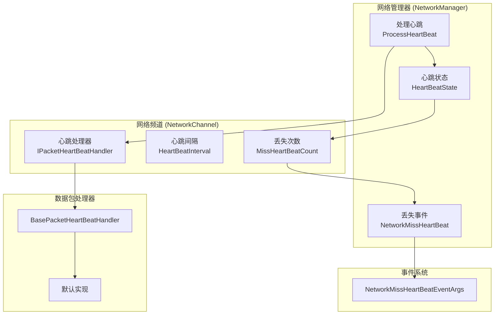
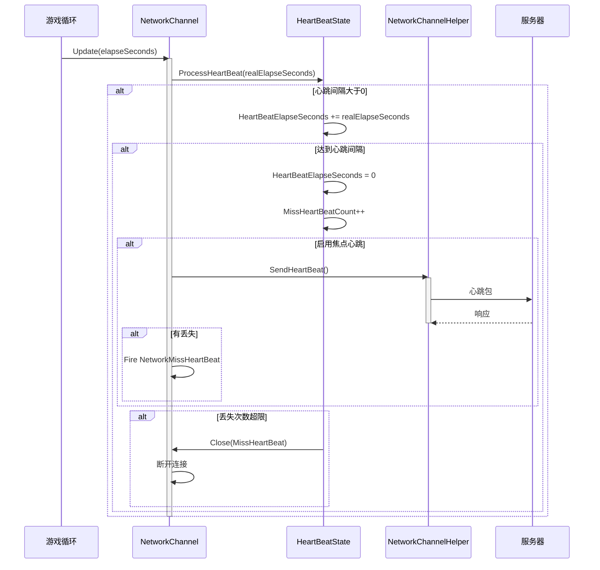

# Heartbeat Mechanism

Heartbeat Mechanism是网络通信中used for检测connect存活状态的重要功能。through定期send心跳包，可and时发现网络中断或对端不可达的情况，从而采取相应的process措施。

## 概述

GameFrameX 网络模块provides了一套完整的Heartbeat Mechanism，主要including以下功能：

1. **定期Heartbeat Check**：Client按Fixed Interval向Serversend心跳包
2. **丢失检测**：Server端检测心跳丢失次数，Threshold Exceeded时主动断开connect
3. **应用焦点控制**：supports根据Application是否获得焦点来控制心跳send
4. **事件通知**：心跳丢失时触发事件，便于上层逻辑process

Heartbeat Mechanism的核心设计理念是：**保活（Keep-Alive）**。在长connect通信中，由于 TCP 协议的半Closed特性，connect双方可能无法及时感知对端已经离线。Heartbeat Mechanismthrough定期交换轻量级消息，ensure双方都能及时发现connect状态Exception。

## Architecture Design

Heartbeat Mechanism涉及多个核心组件，协同completeconnect保活功能：



### 组件Responsibility

| 组件 | Responsibility | 关键Property/Method |
|------|------|--------------|
| `HeartBeatState` | Manages心跳状态数据 | `HeartBeatElapseSeconds`、`MissHeartBeatCount`、`Reset()` |
| `IPacketHeartBeatHandler` | 定义心跳Message Handlers接口 | `HeartBeatInterval`、`MissHeartBeatCountByClose`、`Handler()` |
| `BasePacketHeartBeatHandler` | 心跳process器的默认Implements | 默认心跳间隔5秒，丢失5次触发断开 |
| `ProcessHeartBeat()` | 核心心跳process逻辑 | 检测超时、send心跳、触发断开 |
| `NetworkMissHeartBeatEventArgs` | 心跳丢失Event Arguments | `NetworkChannel`、`MissCount` |

## 核心流程

Heartbeat Mechanism的核心process流程如下：



### process步骤详解

1. **时间累加**：每帧update时，将时间增量累加到心跳流逝时间
2. **send判断**：当流逝时间超过心跳间隔时，触发心跳send
3. **消息send**：调用 `IPacketHeartBeatHandler.Handler()` get心跳消息并send
4. **丢失计数**：send心跳后，增加丢失计数
5. **事件触发**：如果存在丢失，触发 `NetworkMissHeartBeat` 事件
6. **断开判断**：当丢失次数Threshold Exceeded时，Closedconnect

## Usage Examples

### 基础configuration

在CreatesNetwork Channel时，心跳process器会自动register：

```csharp
// 创建网络频道时会自动使用默认的心跳处理器
var networkChannel = networkManager.CreateNetworkChannel("GameServer", networkChannelHelper, 5000);

// 默认配置：
// - 心跳间隔：30秒
// - 丢失阈值：10次
```
> Source: [NetworkManager.NetworkChannelBase.cs](https://github.com/GameFrameX/com.gameframex.unity.network/blob/main/Runtime/Network/Network/NetworkManager.NetworkChannelBase.cs#L52-L57)

### 自定义心跳process器

可以throughImplements `IPacketHeartBeatHandler` 接口来自定义心跳行为：

```csharp
using GameFrameX.Network.Runtime;

// 自定义心跳处理器
public class CustomHeartBeatHandler : BasePacketHeartBeatHandler
{
    // 自定义心跳间隔：10秒
    public override float HeartBeatInterval => 10f;
    
    // 自定义丢失阈值：3次
    public override int MissHeartBeatCountByClose => 3;
    
    public override MessageObject Handler()
    {
        // 返回自定义的心跳消息对象
        return new HeartBeatMessage();
    }
}

// 注册自定义处理器
networkChannel.RegisterHeartBeatHandler(new CustomHeartBeatHandler());
```
> Source: [BasePacketHeartBeatHandler.cs](https://github.com/GameFrameX/com.gameframex.unity.network/blob/main/Runtime/Network/Helper/DefaultPacketHeartBeatHandler.cs#L7-L26)

### 监听心跳丢失事件

可以订阅 `NetworkMissHeartBeat` 事件来process心跳丢失情况：

```csharp
// 在 NetworkComponent 或初始化代码中订阅事件
m_NetworkManager.NetworkMissHeartBeat += OnNetworkMissHeartBeat;

private void OnNetworkMissHeartBeat(object sender, NetworkMissHeartBeatEventArgs eventArgs)
{
    var channelName = eventArgs.NetworkChannel.Name;
    var missCount = eventArgs.MissCount;
    
    Log.Warning($"心跳丢失！频道：{channelName}，丢失次数：{missCount}");
    
    // 可以在这里实现重连逻辑或其他处理
    if (missCount >= 5)
    {
        // 丢失次数过多，准备断开连接
    }
}
```
> Source: [NetworkMissHeartBeatEventArgs.cs](https://github.com/GameFrameX/com.gameframex.unity.network/blob/main/Runtime/EventArgs/NetworkMissHeartBeatEventArgs.cs#L41-L97)

### 应用焦点控制

可以through `NetworkComponent` configuration是否在应用失去焦点时send心跳：

```csharp
// 在 NetworkComponent 的 Inspector 面板中：
// - 勾选 "Focus Send Heartbeat"：应用获得焦点时发送心跳
// - 不勾选：应用失去焦点时也会继续发送心跳（默认行为）

// 或者通过代码动态控制：
m_NetworkManager.SetFocusHeartbeat(true);  // 获得焦点时发送
m_NetworkManager.SetFocusHeartbeat(false); // 失去焦点时也发送
```
> Source: [NetworkComponent.cs](https://github.com/GameFrameX/com.gameframex.unity.network/blob/main/Runtime/Network/NetworkComponent.cs#L65-L91)

### Receive Messagereset心跳

默认情况下，收到任何消息包都会reset心跳流逝时间。如果需要禁用此行为：

```csharp
// 禁用收到消息时重置心跳
networkChannel.ResetHeartBeatElapseSecondsWhenReceivePacket = false;

// 启用收到消息时重置心跳（默认）
networkChannel.ResetHeartBeatElapseSecondsWhenReceivePacket = true;
```
> Source: [INetworkChannel.cs](https://github.com/GameFrameX/com.gameframex.unity.network/blob/main/Runtime/Network/Interface/INetworkChannel.cs#L79-L82)

## Configuration Options

### 心跳相关Property

| Property | Type | Default | Description |
|------|------|--------|------|
| `HeartBeatInterval` | float | 30秒 | 心跳send间隔，单位：秒 |
| `MissHeartBeatCount` | int | 10 | 丢失多少次心跳后断开connect |
| `ResetHeartBeatElapseSecondsWhenReceivePacket` | bool | false | 收到消息时是否reset心跳流逝时间 |
| `PFocusHeartbeat` | bool | true | 是否在应用获得焦点时send心跳 |

### IPacketHeartBeatHandler configuration

| Property | Type | Default | Description |
|------|------|--------|------|
| `HeartBeatInterval` | float | 5秒 | 心跳process器的心跳间隔 |
| `MissHeartBeatCountByClose` | int | 5 | 心跳process器定义的断开阈值 |

### 焦点心跳configuration

| configuration项 | Type | Default | Description |
|--------|------|--------|------|
| `m_FocusHeartbeat` | bool | false | NetworkComponent 上的serializeField |

## API Reference

### `IPacketHeartBeatHandler`

心跳Message Handlers接口。

```csharp
public interface IPacketHeartBeatHandler
{
    /// <summary>
    /// 每次心跳的间隔
    /// </summary>
    float HeartBeatInterval { get; }

    /// <summary>
    /// 几次心跳丢失。触发断开网络
    /// </summary>
    int MissHeartBeatCountByClose { get; }

    /// <summary>
    /// 处理器，返回心跳消息对象
    /// </summary>
    MessageObject Handler();
}
```

> Source: [IPacketHeartBeatHandler.cs](https://github.com/GameFrameX/com.gameframex.unity.network/blob/main/Runtime/Network/Interface/IPacketHeartBeatHandler.cs#L1-L24)

### `INetworkChannel`

Network Channel接口中的心跳相关Property和Method：

```csharp
// 获取或设置当收到消息包时是否重置心跳流逝时间
bool ResetHeartBeatElapseSecondsWhenReceivePacket { get; set; }

// 获取丢失心跳的次数
int MissHeartBeatCount { get; }

// 获取或设置心跳间隔时长，以秒为单位
float HeartBeatInterval { get; set; }

// 获取心跳等待时长，以秒为单位
float HeartBeatElapseSeconds { get; }

// 获取心跳消息处理器
IPacketHeartBeatHandler PacketHeartBeatHandler { get; }

// 注册网络消息心跳处理函数
void RegisterHeartBeatHandler(IPacketHeartBeatHandler handler);
```

> Source: [INetworkChannel.cs](https://github.com/GameFrameX/com.gameframex.unity.network/blob/main/Runtime/Network/Interface/INetworkChannel.cs#L79-L174)

### `INetworkManager`

网络Manages器接口中的心跳相关Method：

```csharp
/// <summary>
/// 网络心跳包丢失事件
/// </summary>
event EventHandler<NetworkMissHeartBeatEventArgs> NetworkMissHeartBeat;

/// <summary>
/// 设置是否在应用程序获得焦点时发送心跳包
/// </summary>
void SetFocusHeartbeat(bool hasFocus);
```

> Source: [INetworkManager.cs](https://github.com/GameFrameX/com.gameframex.unity.network/blob/main/Runtime/Network/Interface/INetworkManager.cs#L57-L113)

### `HeartBeatState`

心跳状态Manages类：

```csharp
public sealed class HeartBeatState
{
    /// <summary>
    /// 心跳间隔时长
    /// </summary>
    public float HeartBeatElapseSeconds { get; set; }

    /// <summary>
    /// 心跳丢失次数
    /// </summary>
    public int MissHeartBeatCount { get; set; }

    /// <summary>
    /// 重置心跳数据=>保活
    /// </summary>
    /// <param name="resetHeartBeatElapseSeconds">是否重置心跳流逝时长</param>
    public void Reset(bool resetHeartBeatElapseSeconds);
}
```

> Source: [NetworkManager.HeartBeatState.cs](https://github.com/GameFrameX/com.gameframex.unity.network/blob/main/Runtime/Network/Network/NetworkManager.HeartBeatState.cs#L39-L82)

### `NetworkMissHeartBeatEventArgs`

心跳丢失Event Arguments：

```csharp
public sealed class NetworkMissHeartBeatEventArgs : GameEventArgs
{
    /// <summary>
    /// 网络心跳包丢失事件编号
    /// </summary>
    public static readonly string EventId;

    /// <summary>
    /// 获取网络频道
    /// </summary>
    public INetworkChannel NetworkChannel { get; }

    /// <summary>
    /// 获取心跳包已丢失次数
    /// </summary>
    public int MissCount { get; }

    /// <summary>
    /// 创建网络心跳包丢失事件
    /// </summary>
    public static NetworkMissHeartBeatEventArgs Create(INetworkChannel networkChannel, int missCount);
}
```

> Source: [NetworkMissHeartBeatEventArgs.cs](https://github.com/GameFrameX/com.gameframex.unity.network/blob/main/Runtime/EventArgs/NetworkMissHeartBeatEventArgs.cs#L41-L97)

## 设计考量

### 为什么需要Heartbeat Mechanism？

1. **TCP 半Closed问题**：TCP connect的一方可以独立Closed写端而保持读端打开，这种情况下无法through底层 socket error来感知connect断开
2. **NAT 超时**：大多数 NAT 设备会在connectIdle一段时间后清除状态，导致外网无法Access内网主机
3. **Server负载**：Server需要及时cleanup无效connect以release资源

### 为什么需要应用焦点控制？

在移动端或浏览器环境中，当应用失去焦点时（如切换到后台、接听电话），网络通信可能变得不可靠或被系统挂起。此时：
- continuesend心跳会造成无效网络请求
- 可能导致电池电量消耗
- 可能触发Server不必要的断开重连

through `Focus Send Heartbeat` 功能，可以在应用获得焦点时立即send心跳，restore正常检测。

### 心跳间隔的set建议

- **游戏Client**：建议 5-30 秒，过短会增加Server负载，过长则影响断开检测的及时性
- **高可靠性场景**：可set 3-5 秒，快速检测connect状态
- **低流量场景**：可set 30-60 秒，减少网络开销

## Related Links

- [网络Manages器](./4-core-concepts.1-network-manager)
- [Network Channel](./4-core-concepts.2-network-channel)
- [Message Types](./4-core-concepts.3-message-types)
- [数据包process器](./4-core-concepts.4-packet-handlers)
- [Event System](./6-events)
- [RPC Remote Procedure Call](./8-rpc)
