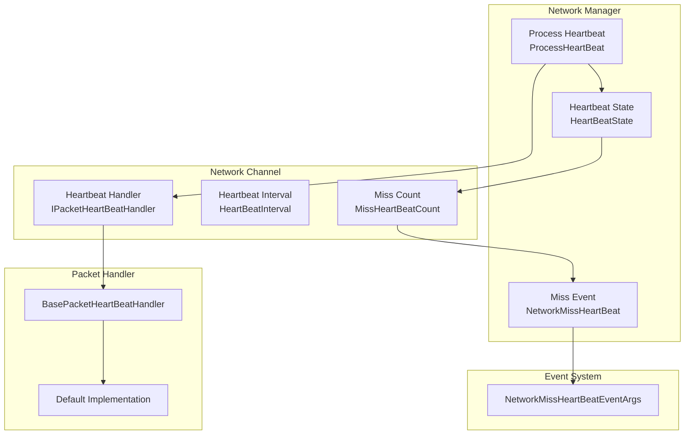
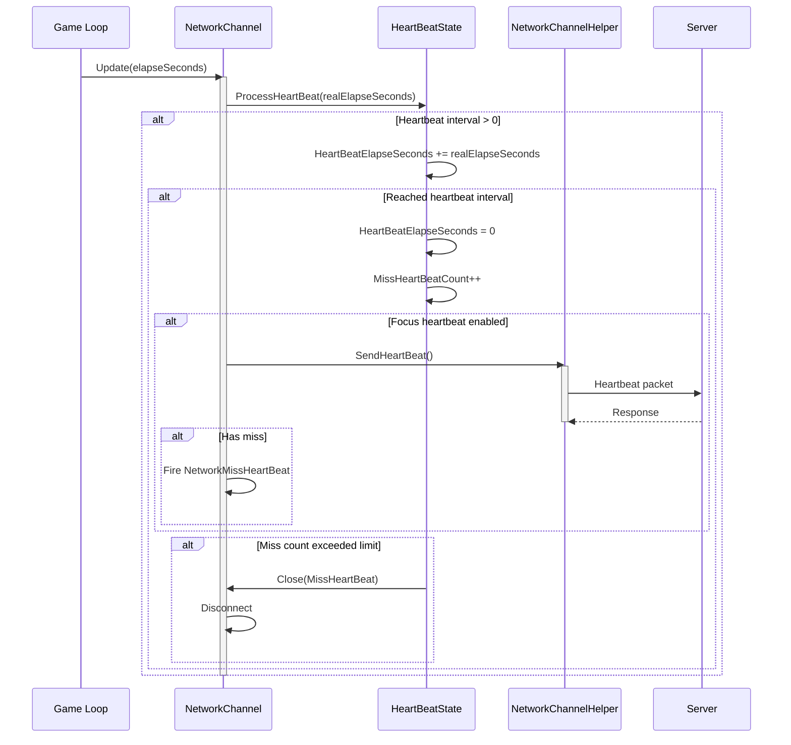

# Heartbeat Mechanism

Heartbeat Mechanism is an important feature in network communication used for detecting connection survival status. Through periodic heartbeat packet transmission, network interruptions or unreachable peer situations can be detected in a timely manner, allowing appropriate processing measures to be taken.

## Overview

GameFrameX network module provides a complete Heartbeat Mechanism, mainly including the following functions:

1. **Periodic Heartbeat Check**: Client sends heartbeat packets to server at fixed intervals
2. **Miss Detection**: Server detects heartbeat miss count, proactively disconnects when threshold is exceeded
3. **Application Focus Control**: Supports controlling heartbeat sending based on whether the application has focus
4. **Event Notification**: Triggers events when heartbeats are missed, facilitating upper layer logic processing

The core design concept of Heartbeat Mechanism is: **Keep-Alive**. In long-connection communication, due to the half-closed nature of the TCP protocol, both connection parties may not be able to timely perceive that the peer has gone offline. Heartbeat Mechanism ensures both parties can promptly discover connection state exceptions through periodic lightweight message exchanges.

## Architecture Design

Heartbeat Mechanism involves multiple core components working together to complete connection keep-alive functionality:



### Component Responsibilities

| Component | Responsibility | Key Property/Method |
|------|------|--------------|
| `HeartBeatState` | Manages heartbeat state data | `HeartBeatElapseSeconds`, `MissHeartBeatCount`, `Reset()` |
| `IPacketHeartBeatHandler` | Defines heartbeat message handler interface | `HeartBeatInterval`, `MissHeartBeatCountByClose`, `Handler()` |
| `BasePacketHeartBeatHandler` | Default implementation of heartbeat processor | Default heartbeat interval 5 seconds, disconnect after 5 misses |
| `ProcessHeartBeat()` | Core heartbeat processing logic | Detect timeout, send heartbeat, trigger disconnect |
| `NetworkMissHeartBeatEventArgs` | Heartbeat miss event arguments | `NetworkChannel`, `MissCount` |

## Core Flow

The core processing flow of Heartbeat Mechanism is as follows:



### Processing Steps Detail

1. **Time Accumulation**: During each frame update, add the time increment to the heartbeat elapsed time
2. **Send Decision**: When the elapsed time exceeds the heartbeat interval, trigger heartbeat sending
3. **Message Send**: Call `IPacketHeartBeatHandler.Handler()` to get heartbeat message and send it
4. **Miss Counting**: After sending heartbeat, increment the miss count
5. **Event Trigger**: If there is a miss, trigger the `NetworkMissHeartBeat` event
6. **Disconnect Decision**: When the miss count threshold is exceeded, close the connection

## Usage Examples

### Basic Configuration

When creating a Network Channel, the heartbeat processor is automatically registered:

```csharp
// When creating a network channel, the default heartbeat processor is automatically used
var networkChannel = networkManager.CreateNetworkChannel("GameServer", networkChannelHelper, 5000);

// Default configuration:
// - Heartbeat interval: 30 seconds
// - Miss threshold: 10 times
```
> Source: [NetworkManager.NetworkChannelBase.cs](https://github.com/GameFrameX/com.gameframex.unity.network/blob/main/Runtime/Network/Network/NetworkManager.NetworkChannelBase.cs#L52-L57)

### Custom Heartbeat Processor

You can customize heartbeat behavior by implementing the `IPacketHeartBeatHandler` interface:

```csharp
using GameFrameX.Network.Runtime;

// Custom heartbeat processor
public class CustomHeartBeatHandler : BasePacketHeartBeatHandler
{
    // Custom heartbeat interval: 10 seconds
    public override float HeartBeatInterval => 10f;

    // Custom miss threshold: 3 times
    public override int MissHeartBeatCountByClose => 3;

    public override MessageObject Handler()
    {
        // Return custom heartbeat message object
        return new HeartBeatMessage();
    }
}

// Register custom processor
networkChannel.RegisterHeartBeatHandler(new CustomHeartBeatHandler());
```
> Source: [BasePacketHeartBeatHandler.cs](https://github.com/GameFrameX/com.gameframex.unity.network/blob/main/Runtime/Network/Helper/DefaultPacketHeartBeatHandler.cs#L7-L26)

### Listen for Heartbeat Miss Events

You can subscribe to `NetworkMissHeartBeat` events to process heartbeat miss situations:

```csharp
// Subscribe to events in NetworkComponent or initialization code
m_NetworkManager.NetworkMissHeartBeat += OnNetworkMissHeartBeat;

private void OnNetworkMissHeartBeat(object sender, NetworkMissHeartBeatEventArgs eventArgs)
{
    var channelName = eventArgs.NetworkChannel.Name;
    var missCount = eventArgs.MissCount;

    Log.Warning($"Heartbeat missed! Channel: {channelName}, Miss count: {missCount}");

    // You can implement reconnection logic or other processing here
    if (missCount >= 5)
    {
        // Too many misses, prepare to disconnect
    }
}
```
> Source: [NetworkMissHeartBeatEventArgs.cs](https://github.com/GameFrameX/com.gameframex.unity.network/blob/main/Runtime/EventArgs/NetworkMissHeartBeatEventArgs.cs#L41-L97)

### Application Focus Control

You can configure whether to send heartbeats when the application loses focus through `NetworkComponent`:

```csharp
// In NetworkComponent Inspector panel:
// - Check "Focus Send Heartbeat": Send heartbeat when application has focus
// - Uncheck: Continue sending heartbeat even when application loses focus (default behavior)

// Or dynamically control via code:
m_NetworkManager.SetFocusHeartbeat(true);  // Send when has focus
m_NetworkManager.SetFocusHeartbeat(false); // Send even when lost focus
```
> Source: [NetworkComponent.cs](https://github.com/GameFrameX/com.gameframex.unity.network/blob/main/Runtime/Network/NetworkComponent.cs#L65-L91)

### Receive Message Reset Heartbeat

By default, receiving any message packet resets the heartbeat elapsed time. If you need to disable this behavior:

```csharp
// Disable heartbeat reset when receiving messages
networkChannel.ResetHeartBeatElapseSecondsWhenReceivePacket = false;

// Enable heartbeat reset when receiving messages (default)
networkChannel.ResetHeartBeatElapseSecondsWhenReceivePacket = true;
```
> Source: [INetworkChannel.cs](https://github.com/GameFrameX/com.gameframex.unity.network/blob/main/Runtime/Network/Interface/INetworkChannel.cs#L79-L82)

## Configuration Options

### Heartbeat-related Properties

| Property | Type | Default | Description |
|------|------|--------|------|
| `HeartBeatInterval` | float | 30 seconds | Heartbeat send interval, unit: seconds |
| `MissHeartBeatCount` | int | 10 | Number of missed heartbeats before disconnecting |
| `ResetHeartBeatElapseSecondsWhenReceivePacket` | bool | false | Whether to reset heartbeat elapsed time when receiving message |
| `PFocusHeartbeat` | bool | true | Whether to send heartbeat when application has focus |

### IPacketHeartBeatHandler Configuration

| Property | Type | Default | Description |
|------|------|--------|------|
| `HeartBeatInterval` | float | 5 seconds | Heartbeat interval of the heartbeat processor |
| `MissHeartBeatCountByClose` | int | 5 | Disconnect threshold defined by the heartbeat processor |

### Focus Heartbeat Configuration

| Configuration Item | Type | Default | Description |
|--------|------|--------|------|
| `m_FocusHeartbeat` | bool | false | Serialized field on NetworkComponent |

## API Reference

### `IPacketHeartBeatHandler`

Heartbeat message handler interface.

```csharp
public interface IPacketHeartBeatHandler
{
    /// <summary>
    /// Interval between heartbeats
    /// </summary>
    float HeartBeatInterval { get; }

    /// <summary>
    /// Number of heartbeat misses to trigger network disconnect
    /// </summary>
    int MissHeartBeatCountByClose { get; }

    /// <summary>
    /// Handler, returns heartbeat message object
    /// </summary>
    MessageObject Handler();
}
```

> Source: [IPacketHeartBeatHandler.cs](https://github.com/GameFrameX/com.gameframex.unity.network/blob/main/Runtime/Network/Interface/IPacketHeartBeatHandler.cs#L1-L24)

### `INetworkChannel`

Heartbeat-related properties and methods in the Network Channel interface:

```csharp
// Get or set whether to reset heartbeat elapsed time when receiving message packet
bool ResetHeartBeatElapseSecondsWhenReceivePacket { get; set; }

// Get the number of missed heartbeats
int MissHeartBeatCount { get; }

// Get or set heartbeat interval duration in seconds
float HeartBeatInterval { get; set; }

// Get heartbeat wait duration in seconds
float HeartBeatElapseSeconds { get; }

// Get heartbeat message handler
IPacketHeartBeatHandler PacketHeartBeatHandler { get; }

// Register network message heartbeat processing function
void RegisterHeartBeatHandler(IPacketHeartBeatHandler handler);
```

> Source: [INetworkChannel.cs](https://github.com/GameFrameX/com.gameframex.unity.network/blob/main/Runtime/Network/Interface/INetworkChannel.cs#L79-L174)

### `INetworkManager`

Heartbeat-related methods in the network manager interface:

```csharp
/// <summary>
/// Network heartbeat packet miss event
/// </summary>
event EventHandler<NetworkMissHeartBeatEventArgs> NetworkMissHeartBeat;

/// <summary>
/// Set whether to send heartbeat packets when the application has focus
/// </summary>
void SetFocusHeartbeat(bool hasFocus);
```

> Source: [INetworkManager.cs](https://github.com/GameFrameX/com.gameframex.unity.network/blob/main/Runtime/Network/Interface/INetworkManager.cs#L57-L113)

### `HeartBeatState`

Heartbeat state management class:

```csharp
public sealed class HeartBeatState
{
    /// <summary>
    /// Heartbeat interval duration
    /// </summary>
    public float HeartBeatElapseSeconds { get; set; }

    /// <summary>
    /// Heartbeat miss count
    /// </summary>
    public int MissHeartBeatCount { get; set; }

    /// <summary>
    /// Reset heartbeat data => Keep-alive
    /// </summary>
    /// <param name="resetHeartBeatElapseSeconds">Whether to reset heartbeat elapsed time</param>
    public void Reset(bool resetHeartBeatElapseSeconds);
}
```

> Source: [NetworkManager.HeartBeatState.cs](https://github.com/GameFrameX/com.gameframex.unity.network/blob/main/Runtime/Network/Network/NetworkManager.HeartBeatState.cs#L39-L82)

### `NetworkMissHeartBeatEventArgs`

Heartbeat miss event arguments:

```csharp
public sealed class NetworkMissHeartBeatEventArgs : GameEventArgs
{
    /// <summary>
    /// Network heartbeat packet miss event ID
    /// </summary>
    public static readonly string EventId;

    /// <summary>
    /// Gets the network channel
    /// </summary>
    public INetworkChannel NetworkChannel { get; }

    /// <summary>
    /// Gets the number of heartbeat packets missed
    /// </summary>
    public int MissCount { get; }

    /// <summary>
    /// Creates network heartbeat packet miss event
    /// </summary>
    public static NetworkMissHeartBeatEventArgs Create(INetworkChannel networkChannel, int missCount);
}
```

> Source: [NetworkMissHeartBeatEventArgs.cs](https://github.com/GameFrameX/com.gameframex.unity.network/blob/main/Runtime/EventArgs/NetworkMissHeartBeatEventArgs.cs#L41-L97)

## Design Considerations

### Why is Heartbeat Mechanism Needed?

1. **TCP Half-Close Issue**: One party of a TCP connection can independently close the write end while keeping the read end open. In this case, connection disconnection cannot be perceived through underlying socket errors
2. **NAT Timeout**: Most NAT devices clear states after a connection has been idle for a period of time, preventing external networks from accessing internal hosts
3. **Server Load**: Server needs to timely clean up invalid connections to release resources

### Why is Application Focus Control Needed?

In mobile or browser environments, when an application loses focus (such as switching to background or receiving a phone call), network communication may become unreliable or be suspended by the system. At this time:
- Continuing to send heartbeats will cause invalid network requests
- May cause battery power consumption
- May trigger unnecessary server-side disconnection and reconnection

Through the `Focus Send Heartbeat` feature, heartbeats can be sent immediately when the application gains focus, restoring normal detection.

### Heartbeat Interval Setting Recommendations

- **Game Client**: Recommended 5-30 seconds, too short will increase server load, too long will affect the timeliness of disconnect detection
- **High Reliability Scenarios**: Can set 3-5 seconds for rapid connection state detection
- **Low Traffic Scenarios**: Can set 30-60 seconds to reduce network overhead

## Related Links

- [Network Manager](./04.network-manager.md)
- [Network Channel](./05.network-channel.md)
- [Message Types](./06.message-types.md)
- [Packet Handlers](./07.packet-handlers.md)
- [Event System](./08.events.md)
- [RPC Remote Procedure Call](./11.rpc.md)