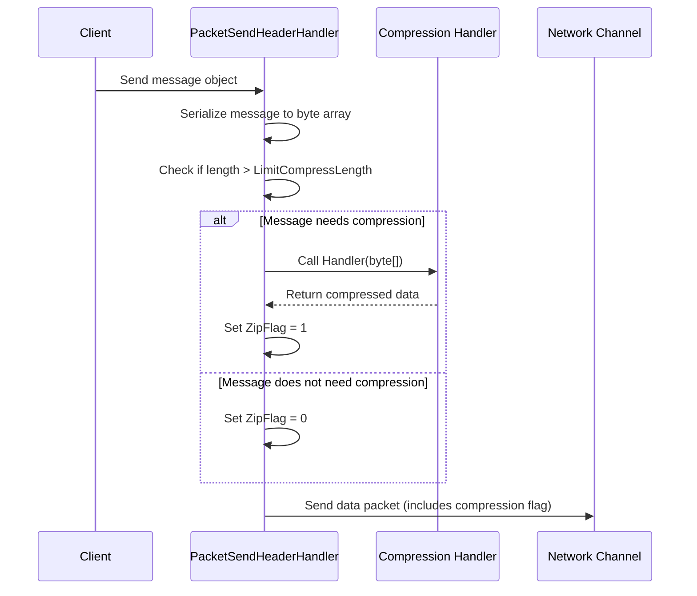
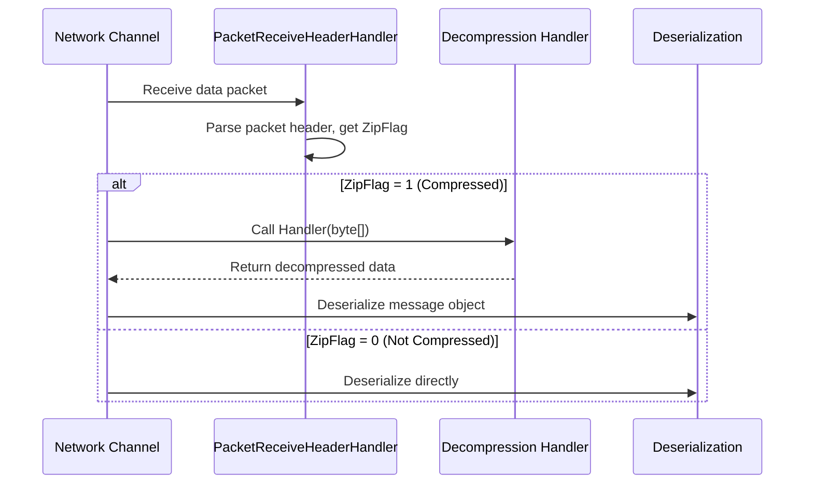

# Message Compression

Message Compression is used to compress message payloads during network transmission to reduce network bandwidth consumption and transmission time.

## Overview

GameFrameX Network provides an extensible Message Compression mechanism, using GZIP compression algorithm by default. The compression system adopts a threshold strategy, only compressing messages that exceed a specified size to avoid unnecessary compression processing for small messages.

### Core Features

- **Automatic Compression**: Automatically determines whether compression is needed when sending messages
- **Automatic Decompression**: Automatically decompresses based on compression flag when receiving messages
- **Extensible Interface**: Supports custom compression algorithms
- **Threshold Control**: Configures compression enable threshold through `LimitCompressLength`

## Architecture

```mermaid
flowchart TD
    subgraph Send["Message Send Flow"]
        S1[Serialize Message] --> S2{Message Length > LimitCompressLength?}
        S2 -->|Yes| S3[Call Compression Handler]
        S2 -->|No| S4[No Compression]
        S3 --> S5[Set Compression Flag]
        S5 --> S6[Add Packet Header and Send]
        S4 --> S6
    end

    subgraph Receive["Message Receive Flow"]
        R1[Receive Data Packet] --> R2[Parse Packet Header]
        R2 --> R3{ZipFlag = 1?}
        R3 -->|Yes| R4[Call Decompression Handler]
        R3 -->|No| R5[Direct Deserialize]
        R4 --> R6[Deserialize Message]
        R5 --> R6
    end

    subgraph Handlers["Compression Handlers"]
        H1[IMessageCompressHandler]
        H2[IMessageDecompressHandler]
        H3[DefaultMessageCompressHandler]
        H4[DefaultMessageDecompressHandler]
    end

    H1 <|.. H3
    H2 <|.. H4
    S3 -->|Call| H3
    R4 -->|Call| H4
```

## Core Components

### Interface Definitions

#### IMessageCompressHandler

Message compression processor interface, defines methods for compressing message data.

> Source: [IMessageCompressHandler.cs](https://github.com/GameFrameX/com.gameframex.unity.network/blob/main/Runtime/Network/Interface/IMessageCompressHandler.cs#L6-L14)

```csharp
public interface IMessageCompressHandler
{
    /// <summary>
    /// Compression processing
    /// </summary>
    /// <param name="message">Uncompressed message content</param>
    /// <returns>Compressed byte array</returns>
    byte[] Handler(byte[] message);
}
```

#### IMessageDecompressHandler

Message decompression handler interface, defines methods for decompressing compressed messages.

> Source: [IMessageDecompressHandler.cs](https://github.com/GameFrameX/com.gameframex.unity.network/blob/main/Runtime/Network/Interface/IMessageDecompressHandler.cs#L6-L14)

```csharp
public interface IMessageDecompressHandler
{
    /// <summary>
    /// Decompression processing
    /// </summary>
    /// <param name="message">Compressed message content</param>
    /// <returns>Decompressed byte array</returns>
    byte[] Handler(byte[] message);
}
```

### Default Implementations

#### DefaultMessageCompressHandler

Default message compression processor, uses GZIP compression algorithm.

> Source: [DefaultMessageCompressHandler.cs](https://github.com/GameFrameX/com.gameframex.unity.network/blob/main/Runtime/Network/Helper/DefaultMessageCompressHandler.cs#L9-L20)

```csharp
[UnityEngine.Scripting.Preserve]
public sealed class DefaultMessageCompressHandler : IMessageCompressHandler, IPacketHandler
{
    public byte[] Handler(byte[] message)
    {
        return ZipHelper.Compress(message);
    }
}
```

#### DefaultMessageDecompressHandler

Default message decompression processor, uses GZIP decompression algorithm.

> Source: [DefaultMessageDecompressHandler.cs](https://github.com/GameFrameX/com.gameframex.unity.network/blob/main/Runtime/Network/Helper/DefaultMessageDecompressHandler.cs#L9-L20)

```csharp
[UnityEngine.Scripting.Preserve]
public sealed class DefaultMessageDecompressHandler : IMessageDecompressHandler, IPacketHandler
{
    public byte[] Handler(byte[] message)
    {
        return ZipHelper.Decompress(message);
    }
}
```

## Compression Flow Details

### Message Compression Flow When Sending



The core logic of the send flow is in `DefaultPacketSendHeaderHandler`:

> Source: [DefaultPacketSendHeaderHandler.cs#L83-L97](https://github.com/GameFrameX/com.gameframex.unity.network/blob/main/Runtime/Network/Helper/DefaultPacketSendHeaderHandler.cs#L83-L97)

```csharp
public bool Handler<T>(T messageObject, IMessageCompressHandler messageCompressHandler,
    MemoryStream destination, out byte[] messageBodyBuffer) where T : MessageObject
{
    var messageType = messageObject.GetType();
    Id = ProtoMessageIdHandler.GetReqMessageIdByType(messageType);
    messageBodyBuffer = SerializerHelper.Serialize(messageObject);

    if (messageCompressHandler != null && messageBodyBuffer.Length > LimitCompressLength)
    {
        IsZip = true;
        messageBodyBuffer = messageCompressHandler.Handler(messageBodyBuffer);
    }
    else
    {
        IsZip = false;
    }
    // ... subsequent processing
}
```

### Message Decompression Flow When Receiving

When network data packets are received, the network channel determines whether decompression is needed based on the `ZipFlag` flag in the packet header:



TCP network channel decompression implementation:

> Source: [NetworkManager.SystemTcpNetworkChannel.cs#L225-L230](https://github.com/GameFrameX/com.gameframex.unity.network/blob/main/Runtime/Network/Network/SystemSocket/NetworkManager.SystemTcpNetworkChannel.cs#L225-L230)

```csharp
if (PReceiveState.PacketHeader.ZipFlag != 0)
{
    // Decompress
    GameFrameworkGuard.NotNull(MessageDecompressHandler, nameof(MessageDecompressHandler));
    buffer = MessageDecompressHandler.Handler(buffer);
}
```

## Automatic Registration Mechanism

Message compression processors are marked through the `IPacketHandler` interface and automatically registered to network channels using reflection.

> Source: [DefaultNetworkChannelHelper.cs#L91-L100](https://github.com/GameFrameX/com.gameframex.unity.network/blob/main/Runtime/Network/Helper/DefaultNetworkChannelHelper.cs#L91-L100)

```csharp
// Reflection registration of message compression handlers
var messageCompressHandlerBaseType = typeof(IMessageCompressHandler);
var messageDecompressHandlerBaseType = typeof(IMessageDecompressHandler);

foreach (var type in types)
{
    // ...
    else if (type.IsImplWithInterface(messageCompressHandlerBaseType))
    {
        var handler = (IMessageCompressHandler)Activator.CreateInstance(type);
        m_NetworkChannel.RegisterMessageCompressHandler(handler);
    }
    else if (type.IsImplWithInterface(messageDecompressHandlerBaseType))
    {
        var handler = (IMessageDecompressHandler)Activator.CreateInstance(type);
        m_NetworkChannel.RegisterMessageDecompressHandler(handler);
    }
}
```

## Usage Examples

### Use Default Compression Processor

By default, the system automatically registers `DefaultMessageCompressHandler` and `DefaultMessageDecompressHandler`, requiring no manual configuration:

```csharp
// Messages will be automatically compressed
// Only compressed when message body size exceeds LimitCompressLength (default 512 bytes)
networkChannel.Send(new TestMessage { Data = "Hello World" });
```

### Custom Compression Processor

If you need to use other compression algorithms (such as LZ4, Zstd), you can create custom processors:

```csharp
// Custom compression handler example
public class LZ4CompressHandler : IMessageCompressHandler, IPacketHandler
{
    public byte[] Handler(byte[] message)
    {
        // Use LZ4 algorithm to compress
        return LZ4.Compress(message);
    }
}

public class LZ4DecompressHandler : IMessageDecompressHandler, IPacketHandler
{
    public byte[] Handler(byte[] message)
    {
        // Use LZ4 algorithm to decompress
        return LZ4.Decompress(message);
    }
}
```

Custom processors will be automatically discovered and registered by the system, provided that:
1. Implement `IMessageCompressHandler` or `IMessageDecompressHandler` interface
2. Implement `IPacketHandler` interface (used for marking automatic registration)
3. Placed in an assembly (will be scanned by reflection)

### Disable Compression

If Message Compression is not needed, you can not add compression processors to the assembly, or manually set the processor to null:

> Source: [NetworkManager.NetworkChannelBase.cs#L496-L502](https://github.com/GameFrameX/com.gameframex.unity.network/blob/main/Runtime/Network/Network/NetworkManager.NetworkChannelBase.cs#L496-L502)

```csharp
// Setting to null can disable compression
networkChannel.RegisterMessageCompressHandler(null);
networkChannel.RegisterMessageDecompressHandler(null);
```

## Configuration Options

### LimitCompressLength

Compression threshold configuration, controls when to enable compression for messages exceeding a certain size.

> Source: [DefaultPacketSendHeaderHandler.cs#L66-L69](https://github.com/GameFrameX/com.gameframex.unity.network/blob/main/Runtime/Network/Helper/DefaultPacketSendHeaderHandler.cs#L66-L69)

| Property | Type | Default | Description |
|------|------|--------|------|
| LimitCompressLength | uint | 512 | Enable compression when message body exceeds this length (bytes) |

### Modify Default Threshold

To modify the compression threshold, you can inherit `DefaultPacketSendHeaderHandler`:

```csharp
public class CustomPacketSendHeaderHandler : DefaultPacketSendHeaderHandler
{
    // Set compression threshold to 1024 bytes
    public override uint LimitCompressLength { get; } = 1024;
}
```

## Packet Header Structure

The message packet header contains a compression flag to indicate whether the message body has been compressed:

| Field | Length | Description |
|------|------|------|
| PacketLength | 4 bytes | Total data packet length |
| OperationType | 1 byte | Operation type (1=heartbeat, 4=normal message) |
| **ZipFlag** | **1 byte** | **Compression flag (0=not compressed, 1=compressed)** |
| UniqueId | 4 bytes | Message unique ID |
| Id | 4 bytes | Message protocol number |

> Source: [DefaultPacketSendHeaderHandler.cs#L30-L31](https://github.com/GameFrameX/com.gameframex.unity.network/blob/main/Runtime/Network/Helper/DefaultPacketSendHeaderHandler.cs#L30-L31)

## API Reference

### IMessageCompressHandler

```csharp
byte[] Handler(byte[] message)
```

**Parameters:**
- `message` (byte[]): Original uncompressed message byte array

**Returns:** Compressed byte array

**Throws:**
- Empty implementation may return null

### IMessageDecompressHandler

```csharp
byte[] Handler(byte[] message)
```

**Parameters:**
- `message` (byte[]): Compressed message byte array

**Returns:** Decompressed original byte array

### INetworkChannel

```csharp
void RegisterMessageCompressHandler(IMessageCompressHandler handler)
```

Register message compression processor.

```csharp
void RegisterMessageDecompressHandler(IMessageDecompressHandler handler)
```

Register message decompression processor.

```csharp
IMessageCompressHandler MessageCompressHandler { get; }
```

Get the currently configured compression processor.

```csharp
IMessageDecompressHandler MessageDecompressHandler { get; }
```

Get the currently configured decompression processor.

## Related Links

- [Network Manager](./04.network-manager.md) - Network manager overview
- [Network Channel](./05.network-channel.md) - Network channel configuration
- [Packet Handlers](./07.packet-handlers.md) - Packet handler details
- [Heartbeat Mechanism](./09.heartbeat.md) - Heartbeat and compression flags
- [Event System](./08.events.md) - Network event processing