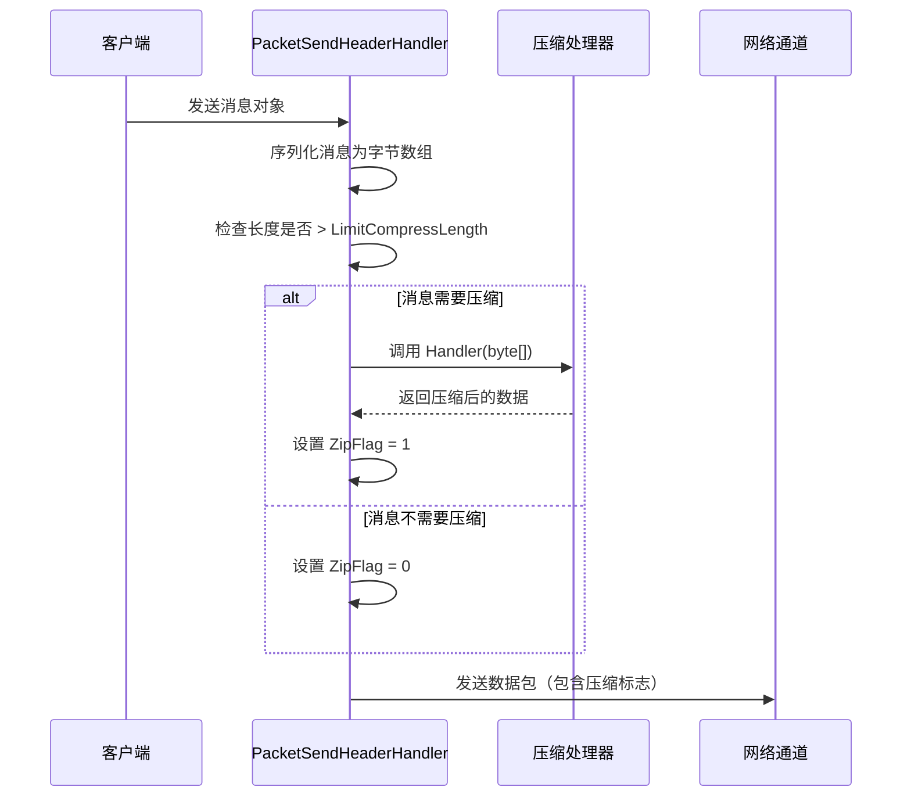
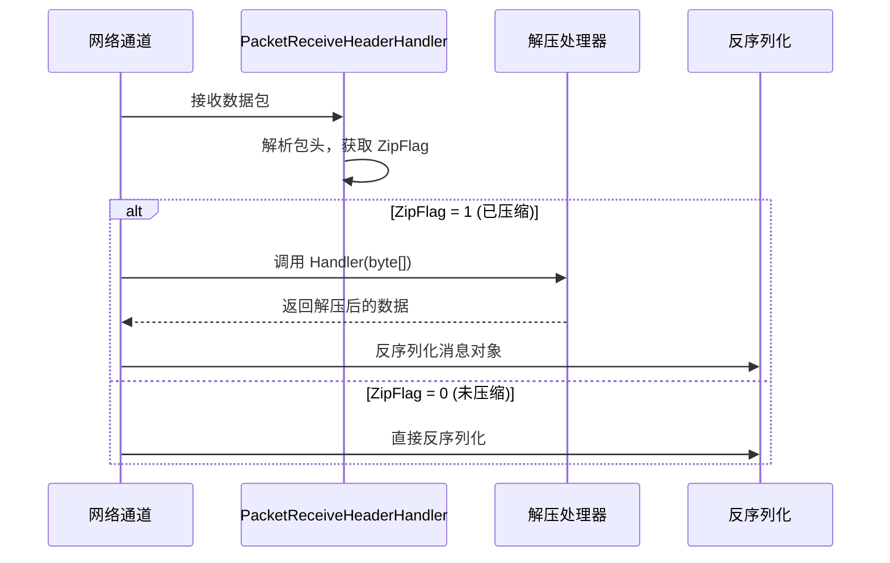

# Message Compression

Message Compression功能used for在网络传输过程中对消息 payload 进行compress，以减少网络带宽消耗和传输时间。

## 概述

GameFrameX Network provides了可扩展的Message Compression机制，默认Uses GZIP compress算法。compress系统adopts阈值策略，只对超过指定大小的消息进行compress，避免对小消息进行不必要的compressprocess。

### Core Features

- **自动compress**：消息send时自动判断是否需要compress
- **自动decompress**：Receive Message时根据compress标志自动decompress
- **可扩展接口**：supports自定义compress算法
- **阈值控制**：through `LimitCompressLength` configurationcompress启用阈值

## Architecture

```mermaid
flowchart TD
    subgraph Send["消息发送流程"]
        S1[序列化消息] --> S2{消息长度 > LimitCompressLength?}
        S2 -->|是| S3[调用压缩处理器]
        S2 -->|否| S4[不压缩]
        S3 --> S5[设置压缩标志]
        S5 --> S6[添加包头并发送]
        S4 --> S6
    end

    subgraph Receive["消息接收流程"]
        R1[接收数据包] --> R2[解析包头]
        R2 --> R3{ZipFlag = 1?}
        R3 -->|是| R4[调用解压处理器]
        R3 -->|否| R5[直接反序列化]
        R4 --> R6[反序列化消息]
        R5 --> R6
    end

    subgraph Handlers["压缩处理器"]
        H1[IMessageCompressHandler]
        H2[IMessageDecompressHandler]
        H3[DefaultMessageCompressHandler]
        H4[DefaultMessageDecompressHandler]
    end

    H1 <|.. H3
    H2 <|.. H4
    S3 -->|调用| H3
    R4 -->|调用| H4
```

## 核心组件

### Interface Definitions

#### IMessageCompressHandler

Message Compressionprocess器接口，定义compress消息数据的Method。

> Source: [IMessageCompressHandler.cs](https://github.com/GameFrameX/com.gameframex.unity.network/blob/main/Runtime/Network/Interface/IMessageCompressHandler.cs#L6-L14)

```csharp
public interface IMessageCompressHandler
{
    /// <summary>
    /// 压缩处理
    /// </summary>
    /// <param name="message">消息未压缩内容</param>
    /// <returns>压缩后的字节数组</returns>
    byte[] Handler(byte[] message);
}
```

#### IMessageDecompressHandler

消息decompress器接口，定义decompresscompress消息的Method。

> Source: [IMessageDecompressHandler.cs](https://github.com/GameFrameX/com.gameframex.unity.network/blob/main/Runtime/Network/Interface/IMessageDecompressHandler.cs#L6-L14)

```csharp
public interface IMessageDecompressHandler
{
    /// <summary>
    /// 解压处理
    /// </summary>
    /// <param name="message">消息压缩内容</param>
    /// <returns>解压后的字节数组</returns>
    byte[] Handler(byte[] message);
}
```

### 默认Implements

#### DefaultMessageCompressHandler

默认的Message Compressionprocess器，Uses GZIP compress算法。

> Source: [DefaultMessageCompressHandler.cs](https://github.com/GameFrameX/com.gameframex.unity.network/blob/main/Runtime/Network/Helper/DefaultMessageCompressHandler.cs#L9-L20)

```csharp
[UnityEngine.Scripting.Preserve]
public sealed class DefaultMessageCompressHandler : IMessageCompressHandler, IPacketHandler
{
    public byte[] Handler(byte[] message)
    {
        return ZipHelper.Compress(message);
    }
}
```

#### DefaultMessageDecompressHandler

默认的消息decompressprocess器，Uses GZIP decompress算法。

> Source: [DefaultMessageDecompressHandler.cs](https://github.com/GameFrameX/com.gameframex.unity.network/blob/main/Runtime/Network/Helper/DefaultMessageDecompressHandler.cs#L9-L20)

```csharp
[UnityEngine.Scripting.Preserve]
public sealed class DefaultMessageDecompressHandler : IMessageDecompressHandler, IPacketHandler
{
    public byte[] Handler(byte[] message)
    {
        return ZipHelper.Decompress(message);
    }
}
```

## compress流程详解

### 消息send时的compress流程



send流程的核心逻辑在 `DefaultPacketSendHeaderHandler` 中：

> Source: [DefaultPacketSendHeaderHandler.cs#L83-L97](https://github.com/GameFrameX/com.gameframex.unity.network/blob/main/Runtime/Network/Helper/DefaultPacketSendHeaderHandler.cs#L83-L97)

```csharp
public bool Handler<T>(T messageObject, IMessageCompressHandler messageCompressHandler, 
    MemoryStream destination, out byte[] messageBodyBuffer) where T : MessageObject
{
    var messageType = messageObject.GetType();
    Id = ProtoMessageIdHandler.GetReqMessageIdByType(messageType);
    messageBodyBuffer = SerializerHelper.Serialize(messageObject);
    
    if (messageCompressHandler != null && messageBodyBuffer.Length > LimitCompressLength)
    {
        IsZip = true;
        messageBodyBuffer = messageCompressHandler.Handler(messageBodyBuffer);
    }
    else
    {
        IsZip = false;
    }
    // ... 后续处理
}
```

### 消息receive时的decompress流程

当receive到网络数据包时，网络通道根据包头中的 `ZipFlag` 标志判断是否需要decompress：



TCP 网络通道的decompressImplements：

> Source: [NetworkManager.SystemTcpNetworkChannel.cs#L225-L230](https://github.com/GameFrameX/com.gameframex.unity.network/blob/main/Runtime/Network/Network/SystemSocket/NetworkManager.SystemTcpNetworkChannel.cs#L225-L230)

```csharp
if (PReceiveState.PacketHeader.ZipFlag != 0)
{
    // 解压
    GameFrameworkGuard.NotNull(MessageDecompressHandler, nameof(MessageDecompressHandler));
    buffer = MessageDecompressHandler.Handler(buffer);
}
```

## 自动register机制

Message Compressionprocess器through `IPacketHandler` 接口标记，利用反射自动register到网络通道中。

> Source: [DefaultNetworkChannelHelper.cs#L91-L100](https://github.com/GameFrameX/com.gameframex.unity.network/blob/main/Runtime/Network/Helper/DefaultNetworkChannelHelper.cs#L91-L100)

```csharp
// 反射注册消息压缩处理器
var messageCompressHandlerBaseType = typeof(IMessageCompressHandler);
var messageDecompressHandlerBaseType = typeof(IMessageDecompressHandler);

foreach (var type in types)
{
    // ... 
    else if (type.IsImplWithInterface(messageCompressHandlerBaseType))
    {
        var handler = (IMessageCompressHandler)Activator.CreateInstance(type);
        m_NetworkChannel.RegisterMessageCompressHandler(handler);
    }
    else if (type.IsImplWithInterface(messageDecompressHandlerBaseType))
    {
        var handler = (IMessageDecompressHandler)Activator.CreateInstance(type);
        m_NetworkChannel.RegisterMessageDecompressHandler(handler);
    }
}
```

## Usage Examples

### Uses默认compressprocess器

默认情况下，系统会自动register `DefaultMessageCompressHandler` 和 `DefaultMessageDecompressHandler`，无需手动configuration：

```csharp
// 消息会自动进行压缩处理
// 仅当消息体大小超过 LimitCompressLength (默认512字节) 时才会压缩
networkChannel.Send(new TestMessage { Data = "Hello World" });
```

### 自定义compressprocess器

如果需要Uses其他compress算法（如 LZ4、Zstd），可以Creates自定义process器：

```csharp
// 自定义压缩处理器示例
public class LZ4CompressHandler : IMessageCompressHandler, IPacketHandler
{
    public byte[] Handler(byte[] message)
    {
        // 使用 LZ4 算法压缩
        return LZ4.Compress(message);
    }
}

public class LZ4DecompressHandler : IMessageDecompressHandler, IPacketHandler
{
    public byte[] Handler(byte[] message)
    {
        // 使用 LZ4 算法解压
        return LZ4.Decompress(message);
    }
}
```

自定义process器会自动被系统发现并register，前提是：
1. Implements `IMessageCompressHandler` 或 `IMessageDecompressHandler` 接口
2. Implements `IPacketHandler` 接口（used for标记自动register）
3. 放置在程序集中（会被反射扫描到）

### 禁用compress

如果不需要Message Compression，可以不addcompressprocess器到程序集中，或者手动将process器set为 null：

> Source: [NetworkManager.NetworkChannelBase.cs#L496-L502](https://github.com/GameFrameX/com.gameframex.unity.network/blob/main/Runtime/Network/Network/NetworkManager.NetworkChannelBase.cs#L496-L502)

```csharp
// 设置为 null 可禁用压缩
networkChannel.RegisterMessageCompressHandler(null);
networkChannel.RegisterMessageDecompressHandler(null);
```

## Configuration Options

### LimitCompressLength

compress阈值configuration，控制消息超过多大小时启用compress。

> Source: [DefaultPacketSendHeaderHandler.cs#L66-L69](https://github.com/GameFrameX/com.gameframex.unity.network/blob/main/Runtime/Network/Helper/DefaultPacketSendHeaderHandler.cs#L66-L69)

| Property | Type | Default | Description |
|------|------|--------|------|
| LimitCompressLength | uint | 512 | 消息体超过此长度时启用compress（字节） |

### 修改默认阈值

如需修改compress阈值，可以Inherits `DefaultPacketSendHeaderHandler`：

```csharp
public class CustomPacketSendHeaderHandler : DefaultPacketSendHeaderHandler
{
    // 将压缩阈值设置为 1024 字节
    public override uint LimitCompressLength { get; } = 1024;
}
```

## 包头结构

消息包头中containscompress标志，used for标识消息体是否经过compress：

| Field | 长度 | Description |
|------|------|------|
| PacketLength | 4 字节 | 数据包总长度 |
| OperationType | 1 字节 | 操作Type (1=心跳, 4=普通消息) |
| **ZipFlag** | **1 字节** | **compress标志 (0=未compress, 1=已compress)** |
| UniqueId | 4 字节 | Message unique ID |
| Id | 4 字节 | 消息协议号 |

> Source: [DefaultPacketSendHeaderHandler.cs#L30-L31](https://github.com/GameFrameX/com.gameframex.unity.network/blob/main/Runtime/Network/Helper/DefaultPacketSendHeaderHandler.cs#L30-L31)

## API Reference

### IMessageCompressHandler

```csharp
byte[] Handler(byte[] message)
```

**Parameters：**
- `message` (byte[]): 未compress的原始消息字节数组

**返回：** Compressed byte array

**抛出：**
- 空Implements可能返回 null

### IMessageDecompressHandler

```csharp
byte[] Handler(byte[] message)
```

**Parameters：**
- `message` (byte[]): compress后的消息字节数组

**返回：** decompress后的原始字节数组

### INetworkChannel

```csharp
void RegisterMessageCompressHandler(IMessageCompressHandler handler)
```

registerMessage Compressionprocess器。

```csharp
void RegisterMessageDecompressHandler(IMessageDecompressHandler handler)
```

register消息decompressprocess器。

```csharp
IMessageCompressHandler MessageCompressHandler { get; }
```

get当前configuration的compressprocess器。

```csharp
IMessageDecompressHandler MessageDecompressHandler { get; }
```

get当前configuration的decompressprocess器。

## Related Links

- [网络Manages器](./4-core-concepts.1-network-manager) - 网络Manages器概述
- [Network Channel](./4-core-concepts.2-network-channel) - 网络通道configuration
- [数据包process器](./4-core-concepts.4-packet-handlers) - 包process器详解
- [Heartbeat Mechanism](./5-heartbeat) - 心跳与compress标志
- [Event System](./6-events) - 网络事件process
