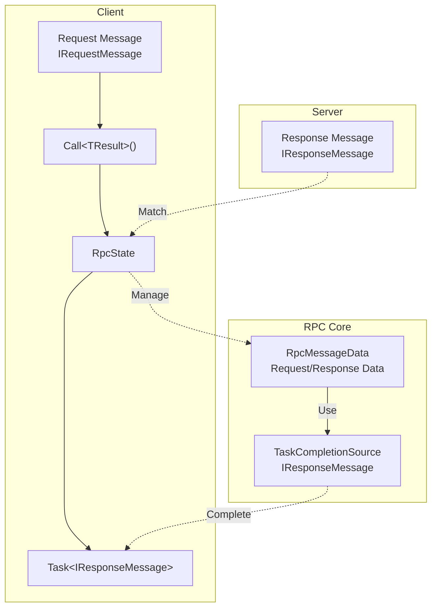
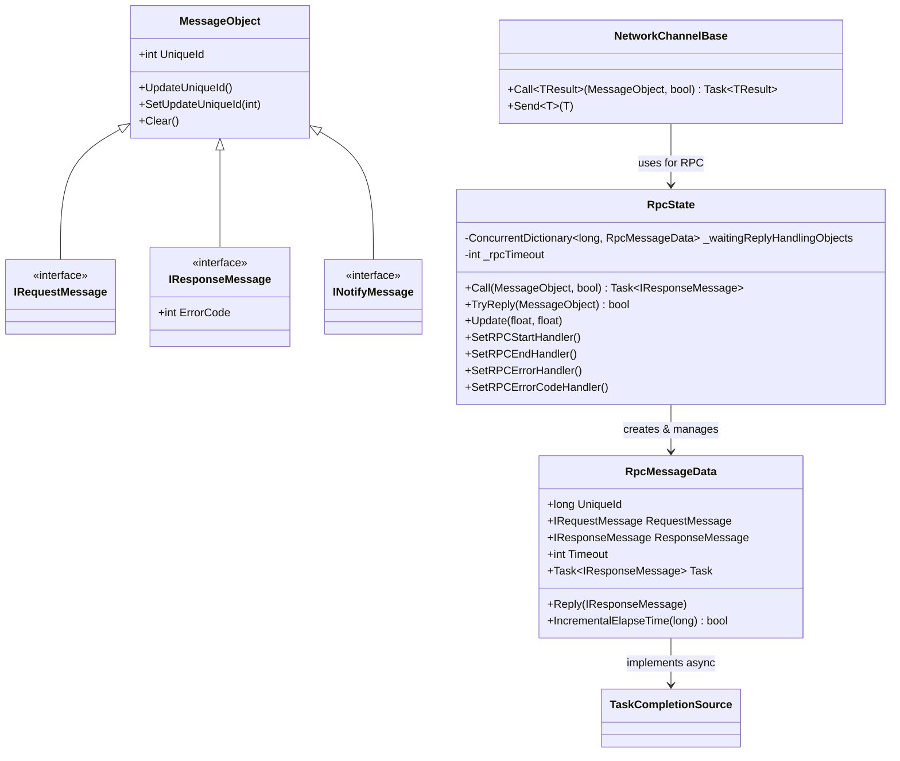
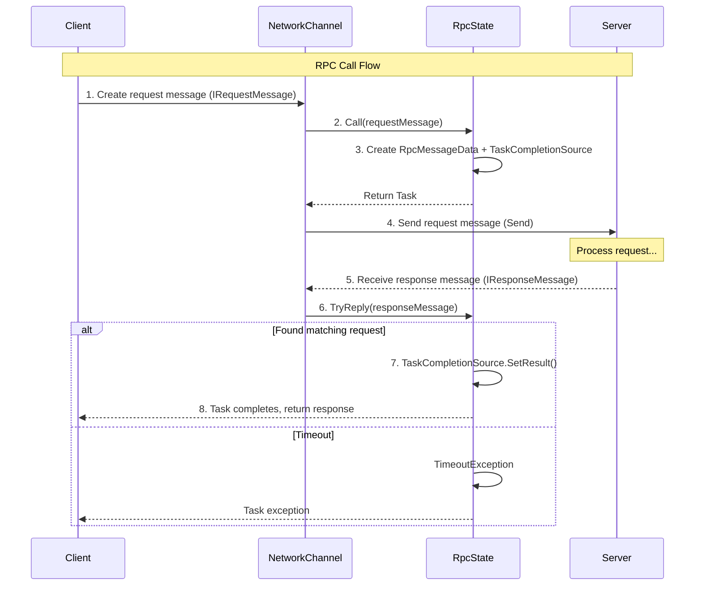

# RPC Remote Procedure Call

RPC (Remote Procedure Call) mechanism allows clients to send requests to servers and wait for responses, and is the most commonly used client-server communication method in online games.

## Overview

GameFrameX network library provides a complete RPC implementation, supporting:

- **Synchronous Call**: Block and wait for response after sending request
- **Asynchronous Call**: Use async/await pattern for asynchronous waiting for response
- **Timeout Processing**: Automatically detect and process RPC timeouts
- **Error Handling**: Supports error code callbacks and exception processing
- **Event Notification**: Full event monitoring for RPC start, complete, and errors

### Message Types

The system defines three message types for different communication scenarios:

| Type | Interface | Usage |
|------|------|------|
| Request Message | `IRequestMessage` | Requests sent by client to server |
| Response Message | `IResponseMessage` | Server's response to client, contains ErrorCode |
| Notify Message | `INotifyMessage` | Notifications sent by server to client, no response needed |

## Architecture

The RPC system consists of the following core components:



### Core Components



## Message Definition

In the GameFrameX network library, all network messages inherit from the `MessageObject` base class and implement corresponding interfaces:

### Request Message

```csharp
namespace GameFrameX.Network.Runtime
{
    /// <summary>
    /// Base interface for messages sent by client to server
    /// </summary>
    public interface IRequestMessage
    {
    }
}
```

> Source: [IRequestMessage.cs](https://github.com/GameFrameX/com.gameframex.unity.network/blob/main/Runtime/Network/Base/IRequestMessage.cs#L1-L9)

### Response Message

```csharp
namespace GameFrameX.Network.Runtime
{
    /// <summary>
    /// Base interface for messages returned by server to client
    /// </summary>
    public interface IResponseMessage
    {
        /// <summary>
        /// Error code, non-zero indicates error
        /// </summary>
        int ErrorCode { get; }
    }
}
```

> Source: [IResponseMessage.cs](https://github.com/GameFrameX/com.gameframex.unity.network/blob/main/Runtime/Network/Base/IResponseMessage.cs#L1-L13)

### Notify Message

```csharp
namespace GameFrameX.Network.Runtime
{
    /// <summary>
    /// Base interface for messages sent by server to client
    /// </summary>
    public interface INotifyMessage
    {
    }
}
```

> Source: [INotifyMessage.cs](https://github.com/GameFrameX/com.gameframex.unity.network/blob/main/Runtime/Network/Base/INotifyMessage.cs#L1-L9)

### Message Base Class

```csharp
namespace GameFrameX.Network.Runtime
{
    public class MessageObject : IReference
    {
        /// <summary>
        /// Message unique ID
        /// </summary>
        public int UniqueId { get; private set; }

        protected MessageObject()
        {
            UpdateUniqueId();
        }

        public void UpdateUniqueId()
        {
            UniqueId = Utility.IdGenerator.GetNextUniqueIntId();
        }

        public virtual void Clear()
        {
        }
    }
}
```

> Source: [MessageObject.cs](https://github.com/GameFrameX/com.gameframex.unity.network/blob/main/Runtime/Network/Base/MessageObject.cs#L1-L56)

## RPC Call Flow

The complete RPC call flow is as follows:



## Usage Examples

### Basic RPC Call

```csharp
using GameFrameX.Network.Runtime;

// Define request message
public class LoginRequest : MessageObject, IRequestMessage
{
    public string Username { get; set; }
    public string Password { get; set; }
}

// Define response message
public class LoginResponse : MessageObject, IResponseMessage
{
    public int ErrorCode { get; set; }
    public string Token { get; set; }
    public long UserId { get; set; }
}

// Call RPC
var channel = networkComponent.GetNetworkChannel("Game");
var request = new LoginRequest
{
    Username = "player1",
    Password = "password123"
};

// Async call
var response = await channel.Call<LoginResponse>(request);

if (response.ErrorCode == 0)
{
    Debug.Log($"Login successful, user ID: {response.UserId}");
}
else
{
    Debug.LogError($"Login failed, error code: {response.ErrorCode}");
}
```

> Sources:
> - [NetworkChannelBase.cs](https://github.com/GameFrameX/com.gameframex.unity.network/blob/main/Runtime/Network/Network/NetworkManager.NetworkChannelBase.cs#L765-L771)
> - [RpcState.cs](https://github.com/GameFrameX/com.gameframex.unity.network/blob/main/Runtime/Network/Network/NetworkManager.RpcState.cs#L125-L144)

### Handle Error Codes

```csharp
// Set error code callback
channel.SetRPCErrorCodeHandler((sender, message) =>
{
    var response = message as IResponseMessage;
    Debug.LogError($"RPC error code: {response?.ErrorCode}");
});

// Call ignoring error codes (won't throw exception)
var response = await channel.Call<LoginResponse>(request, isIgnoreErrorCode: true);
```

> Source: [NetworkChannelBase.cs](https://github.com/GameFrameX/com.gameframex.unity.network/blob/main/Runtime/Network/Network/NetworkManager.NetworkChannelBase.cs#L592-L629)

### Handle Timeout

```csharp
// Set RPC timeout error callback
channel.SetRPCErrorHandler((sender, message) =>
{
    Debug.LogError($"RPC timeout: {message.GetType().Name}");
});
```

> Source: [RpcState.cs](https://github.com/GameFrameX/com.gameframex.unity.network/blob/main/Runtime/Network/Network/NetworkManager.RpcState.cs#L195-L232)

### Listen for RPC Events

```csharp
// RPC starts sending
channel.SetRPCStartHandler((sender, message) =>
{
    Debug.Log($"RPC started: {message.GetType().Name}");
});

// RPC completed successfully
channel.SetRPCEndHandler((sender, message) =>
{
    Debug.Log($"RPC completed: {message.GetType().Name}");
});

// RPC timeout
channel.SetRPCErrorHandler((sender, message) =>
{
    Debug.LogError($"RPC error: {message.GetType().Name}");
});

// RPC returned error code
channel.SetRPCErrorCodeHandler((sender, message) =>
{
    var response = message as IResponseMessage;
    Debug.LogError($"RPC error code: {response?.ErrorCode}");
});
```

## Configuration Options

### NetworkComponent Configuration

You can configure RPC timeout time through NetworkComponent in Unity Editor:

| Property | Type | Default | Description |
|------|------|--------|------|
| m_rpcTimeout | int | 5000 | RPC timeout (milliseconds) |
| m_FocusHeartbeat | bool | false | Whether to continue sending heartbeats when application loses focus |

```csharp
// Apply configuration when creating network channel
public INetworkChannel CreateNetworkChannel(string channelName, INetworkChannelHelper networkChannelHelper)
{
    var networkChannel = m_NetworkManager.CreateNetworkChannel(channelName, networkChannelHelper, m_rpcTimeout);
    return networkChannel;
}
```

> Source: [NetworkComponent.cs](https://github.com/GameFrameX/com.gameframex.unity.network/blob/main/Runtime/Network/NetworkComponent.cs#L176-L182)

### RpcState Configuration

RpcState constructor requires timeout time to be no less than 3000 milliseconds:

```csharp
public RpcState(int timeout)
{
    _rpcTimeout = timeout;
    if (_rpcTimeout < 3000)
    {
        throw new ArgumentOutOfRangeException(nameof(timeout), "RPC timeout cannot be less than 3000 milliseconds");
    }
}
```

> Source: [RpcState.cs](https://github.com/GameFrameX/com.gameframex.unity.network/blob/main/Runtime/Network/Network/NetworkManager.RpcState.cs#L61-L68)

## API Reference

### INetworkChannel.Call<TResult>

```csharp
Task<TResult> Call<TResult>(MessageObject messageObject, bool isIgnoreErrorCode = false) where TResult : MessageObject, IResponseMessage
```

Send RPC request to remote host and wait for response.

**Generic Parameters:**
- `TResult` : Response message type, must inherit MessageObject and implement IResponseMessage

**Parameters:**
- `messageObject` (MessageObject): Request message object
- `isIgnoreErrorCode` (bool): Whether to ignore error codes, default is false

**Returns:**
- `Task<TResult>`: Asynchronous task containing response message

**Exceptions:**
- `ArgumentNullException`: messageObject is null
- `TimeoutException`: RPC timeout
- `GameFrameworkException`: Send failure

> Source: [NetworkChannelBase.cs](https://github.com/GameFrameX/com.gameframex.unity.network/blob/main/Runtime/Network/Network/NetworkManager.NetworkChannelBase.cs#L765-L771)

### INetworkChannel.SetRPCStartHandler

```csharp
void SetRPCStartHandler(EventHandler<MessageObject> handler)
```

Set callback function when RPC starts sending.

**Parameters:**
- `handler` (EventHandler<MessageObject>): Callback processing function

> Source: [NetworkChannelBase.cs](https://github.com/GameFrameX/com.gameframex.unity.network/blob/main/Runtime/Network/Network/NetworkManager.NetworkChannelBase.cs#L613-L618)

### INetworkChannel.SetRPCEndHandler

```csharp
void SetRPCEndHandler(EventHandler<MessageObject> handler)
```

Set callback function when RPC completes successfully.

**Parameters:**
- `handler` (EventHandler<MessageObject>): Callback processing function

> Source: [NetworkChannelBase.cs](https://github.com/GameFrameX/com.gameframex.unity.network/blob/main/Runtime/Network/Network/NetworkManager.NetworkChannelBase.cs#L624-L629)

### INetworkChannel.SetRPCErrorHandler

```csharp
void SetRPCErrorHandler(EventHandler<MessageObject> handler)
```

Set callback function for RPC errors (timeout).

**Parameters:**
- `handler` (EventHandler<MessageObject>): Callback processing function

> Source: [NetworkChannelBase.cs](https://github.com/GameFrameX/com.gameframex.unity.network/blob/main/Runtime/Network/Network/NetworkManager.NetworkChannelBase.cs#L602-L607)

### INetworkChannel.SetRPCErrorCodeHandler

```csharp
void SetRPCErrorCodeHandler(EventHandler<MessageObject> handler)
```

Set callback function when RPC returns error code.

**Parameters:**
- `handler` (EventHandler<MessageObject>): Callback processing function

> Source: [NetworkChannelBase.cs](https://github.com/GameFrameX/com.gameframex.unity.network/blob/main/Runtime/Network/Network/NetworkManager.NetworkChannelBase.cs#L591-L596)

## Message Handlers

For non-RPC type messages (notify messages), use `MessageHandlerAttribute` to register message handlers:

```csharp
public class GameMessageHandler : IMessageHandler
{
    [MessageHandler(typeof(ServerNotifyMessage), nameof(OnServerNotify))]
    private void OnServerNotify(MessageObject message)
    {
        var notify = message as ServerNotifyMessage;
        Debug.Log($"Received server notification: {notify.Content}");
    }
}

// Register message handler
ProtoMessageHandler.Add(new GameMessageHandler());
```

> Source: [MessageHandlerAttribute.cs](https://github.com/GameFrameX/com.gameframex.unity.network/blob/main/Runtime/Network/Base/MessageHandlerAttribute.cs#L1-L195)

## Best Practices

### 1. Set Timeout Reasonably

```csharp
// Set appropriate timeout based on business requirements
// Important business operations (login, payment): 10-30 seconds
// Normal game operations: 5-10 seconds
// High-frequency operations: 3-5 seconds
var channel = networkComponent.CreateNetworkChannel("Game", helper);
// Or set m_rpcTimeout in NetworkComponent
```

### 2. Use Error Code Callbacks

```csharp
// Unified error code handling
channel.SetRPCErrorCodeHandler((sender, message) =>
{
    var response = message as IResponseMessage;
    switch (response.ErrorCode)
    {
        case 1001:
            // Handle specific error
            break;
        default:
            // General error handling
            break;
    }
});
```

### 3. Avoid Duplicate Requests

```csharp
// Use CancellationToken to cancel duplicate requests
private CancellationTokenSource _loginCts;

async Task LoginAsync()
{
    // Cancel previous login request
    _loginCts?.Cancel();
    _loginCts = new CancellationTokenSource();

    try
    {
        var response = await channel.Call<LoginResponse>(request);
        // Handle response
    }
    catch (OperationCanceledException)
    {
        // Request was cancelled
    }
}
```

### 4. Separate Message Definitions

```csharp
// Recommended to separate message definitions by module
// Messages/LoginMessages.cs
public class LoginRequest : MessageObject, IRequestMessage { ... }
public class LoginResponse : MessageObject, IResponseMessage { ... }

// Messages/BattleMessages.cs
public class BattleStartRequest : MessageObject, IRequestMessage { ... }
public class BattleStartResponse : MessageObject, IResponseMessage { ... }
```

## Related Links

- [Message Types](./06.message-types.md)
- [Network Manager](./04.network-manager.md)
- [Network Channel](./05.network-channel.md)
- [Heartbeat Mechanism](./09.heartbeat.md)
- [Event System](./08.events.md)
- [Message Compression](./10.message-compression.md)