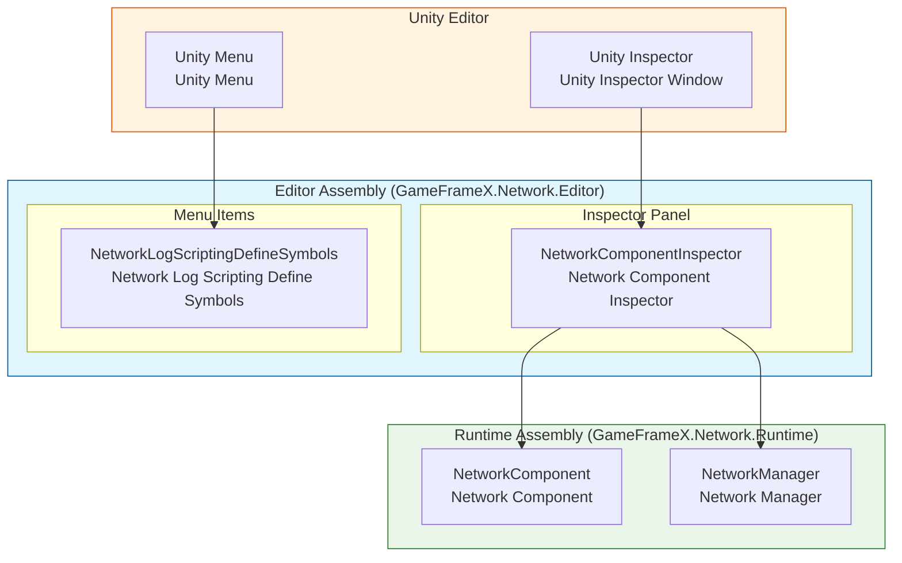
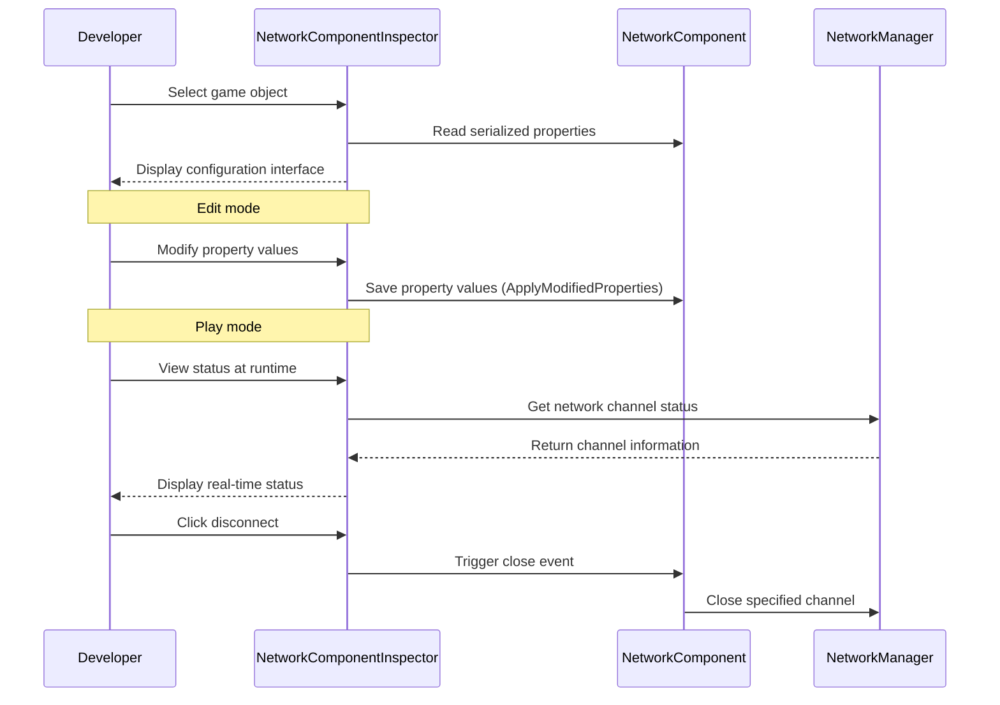
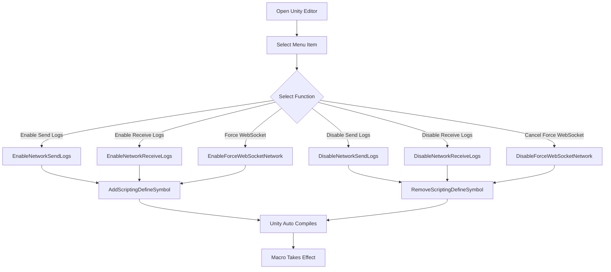

# Editor Configuration

GameFrameX Network plugin provides rich Unity Editor configuration functionality, allowing developers to flexibly configure various parameters of the network module through the Inspector panel and Menu Items.

## Overview

Editor configuration is an important part of the GameFrameX Network framework, mainly provided through the following two methods:

1. **Inspector Panel Configuration**: Provides real-time viewing and modification of NetworkComponent properties through custom Inspector panels
2. **Menu Items Configuration**: Provides quick toggles for Scripting Define Symbols through Unity menus, used for controlling network log output and behavior

These editor tools run throughout the entire development cycle, helping developers debug network functions, optimize performance, and provide real-time monitoring of runtime network status.

## Architecture

GameFrameX Network's editor module adopts a layered architecture design, with the following core components:



### Component Responsibilities

| Component | Responsibility | File Location |
|------|------|----------|
| NetworkComponentInspector | Provides NetworkComponent Inspector interface, supports property editing and runtime status display | Editor/Inspector/NetworkComponentInspector.cs |
| NetworkLogScriptingDefineSymbols | Provides menu items for managing Scripting Define Symbols, controls log output | Editor/NetworkLogScriptingDefineSymbols.cs |
| NetworkComponent | Network core component, stores configuration properties | Runtime/Network/NetworkComponent.cs |

### Assembly Configuration

Editor Assembly definition file defines the module's compilation environment and dependencies:

> Source: [GameFrameX.Network.Editor.asmdef](https://github.com/GameFrameX/com.gameframex.unity.network/blob/main/Editor/GameFrameX.Network.Editor.asmdef#L1-L19)

```json
{
    "name": "GameFrameX.Network.Editor",
    "references": [
        "GameFrameX.Network.Runtime",
        "GameFrameX.Editor",
        "GameFrameX.Runtime"
    ],
    "includePlatforms": [
        "Editor"
    ]
}
```

**Design Intent**: Editor assembly only compiles in Unity Editor environment, avoiding packing editor code into release builds and reducing release package size.

## Inspector Panel Configuration

NetworkComponentInspector is the custom Inspector panel for NetworkComponent, providing a visual configuration interface.

### Configuration Properties

| Property | Type | Default | Description |
|------|------|--------|------|
| RPC Timeout Time In Milliseconds | int | 5000 | RPC call timeout (milliseconds), range 3000-50000 |
| Focus Send Heartbeat | bool | false | Whether to send heartbeat packets when application has focus |
| Ignore Log Printing For Sent Message IDs | `List<int>` | Empty list | Message IDs to ignore log printing when sending |
| Ignore Log Printing Of Received Message IDs | `List<int>` | Empty list | Message IDs to ignore log printing when receiving |

### Property Details

#### RPC Timeout

```csharp
// Source: Runtime/Network/NetworkComponent.cs#L60-L63
// RPC timeout in milliseconds, default is 5 seconds
[SerializeField] private int m_rpcTimeout = 5000;
```

RPC timeout determines the maximum wait time for remote procedure calls (RPC). When calling a remote method, if no response is received within this time, the timeout callback will be triggered. Setting this value reasonably is crucial for user experience:

- **Too small**: Easy to trigger false timeouts in poor network environments
- **Too large**: User wait time is too long, poor experience
- **Recommended value**: Adjust according to network environment, can be set shorter in development environment, 5000-10000 milliseconds recommended for production environment

#### Focus Heartbeat

```csharp
// Source: Runtime/Network/NetworkComponent.cs#L65-L68
// Whether to send heartbeat packets when application has focus, default is false
[SerializeField] private bool m_FocusHeartbeat = false;
```

This option controls whether the application adjusts heartbeat strategy when gaining/losing focus. When the game switches to background:

- **Off (default)**: Keep original heartbeat strategy
- **On**: Resume heartbeat when gaining focus, pause heartbeat when losing focus (save resources)

#### Ignore Log Message IDs

```csharp
// Source: Runtime/Network/NetworkComponent.cs#L50-L58
// Ignore log printing for sent network message IDs
[SerializeField] private List<int> m_IgnoredSendNetworkIds = new List<int>();
// Ignore log printing for received network message IDs
[SerializeField] private List<int> m_IgnoredReceiveNetworkIds = new List<int>();
```

Network communication generates a large amount of logs. For high-frequency messages that do not need attention (such as heartbeat, frame sync), you can add message IDs to the ignore list to reduce log interference.

### Runtime Status Display

During game runtime, the Inspector panel displays real-time status of current network channels:

```csharp
// Source: Editor/Inspector/NetworkComponentInspector.cs#L95-L119
private void DrawNetworkChannel(INetworkChannel networkChannel)
{
    EditorGUILayout.BeginVertical("box");
    {
        EditorGUILayout.LabelField(networkChannel.Name, networkChannel.Connected ? "Connected" : "Disconnected");
        EditorGUILayout.LabelField("Address Family", networkChannel.AddressFamily.ToString());
        EditorGUILayout.LabelField("Local Address", networkChannel.Connected ? networkChannel.Socket.LocalEndPoint.ToString() : "Unavailable");
        EditorGUILayout.LabelField("Remote Address", networkChannel.Connected ? networkChannel.Socket.RemoteEndPoint.ToString() : "Unavailable");
        EditorGUILayout.LabelField("Send Packet", Utility.Text.Format("{0} / {1}", networkChannel.SendPacketCount, networkChannel.SentPacketCount));
        EditorGUILayout.LabelField("Miss Heart Beat Count", networkChannel.MissHeartBeatCount.ToString());
        EditorGUILayout.LabelField("Heart Beat", Utility.Text.Format("{0:F2} / {1:F2}", networkChannel.HeartBeatElapseSeconds, networkChannel.HeartBeatInterval));
        // ... Disconnect button
    }
    EditorGUILayout.EndVertical();
}
```

**Runtime display information includes:**

| Status Item | Description |
|--------|------|
| Connection Status | Whether currently connected |
| Address Family | Address type (IPv4/IPv6) |
| Local Address | Local endpoint address |
| Remote Address | Remote endpoint address |
| Send Packet | Send packet statistics |
| Miss Heart Beat Count | Heartbeat miss count |
| Heart Beat | Heartbeat interval and elapsed time |

### Usage Examples

After creating NetworkComponent in a Unity scene, you can configure it in the Inspector panel:

1. Select the GameObject containing NetworkComponent in the Hierarchy panel
2. View the Network component in the Inspector panel
3. Edit configuration properties (some properties are read-only at runtime)
4. View real-time network status during game runtime

```csharp
// NetworkComponent creation code example
// Source: Runtime/Network/NetworkComponent.cs#L42-L45
[AddComponentMenu("GameFrameX/Network")]
[UnityEngine.Scripting.Preserve]
public sealed class NetworkComponent : GameFrameworkComponent
```

## Scripting Define Symbols Configuration

NetworkLogScriptingDefineSymbols provides menu items to manage Scripting Define Symbols. These macro definitions are used for controlling compile-time behavior of the network module.

### Available Macro Definitions

| Macro | Menu Item Path | Usage |
|--------|------------|------|
| ENABLE_GAMEFRAMEX_NETWORK_SEND_LOG | GameFrameX/Scripting Define Symbols/Enable Network Send Logs | Enable network send log |
| ENABLE_GAMEFRAMEX_NETWORK_RECEIVE_LOG | GameFrameX/Scripting Define Symbols/Enable Network Receive Logs | Enable network receive log |
| FORCE_ENABLE_GAME_FRAME_X_WEB_SOCKET | GameFrameX/Scripting Define Symbols/Enable Force WebSocket | Force use WebSocket network |

### Menu Items Implementation

```csharp
// Source: Editor/NetworkLogScriptingDefineSymbols.cs#L42-L98
public static class NetworkLogScriptingDefineSymbols
{
    public const string EnableNetworkReceiveLogScriptingDefineSymbol = "ENABLE_GAMEFRAMEX_NETWORK_RECEIVE_LOG";
    public const string EnableNetworkSendLogScriptingDefineSymbol = "ENABLE_GAMEFRAMEX_NETWORK_SEND_LOG";
    public const string ForceEnableNetworkSendLogScriptingDefineSymbol = "FORCE_ENABLE_GAME_FRAME_X_WEB_SOCKET";

    /// <summary>
    /// Enable network send log scripting define symbol.
    /// </summary>
    [MenuItem("GameFrameX/Scripting Define Symbols/Enable Network Send Logs(开启网络发送日志打印)", false, 201)]
    public static void EnableNetworkSendLogs()
    {
        ScriptingDefineSymbols.AddScriptingDefineSymbol(EnableNetworkSendLogScriptingDefineSymbol);
    }

    /// <summary>
    /// Disable network send log scripting define symbol.
    /// </summary>
    [MenuItem("GameFrameX/Scripting Define Symbols/Disable Network Send Logs(关闭网络发送日志打印)", false, 200)]
    public static void DisableNetworkSendLogs()
    {
        ScriptingDefineSymbols.RemoveScriptingDefineSymbol(EnableNetworkSendLogScriptingDefineSymbol);
    }
    // ... Other methods are similar
}
```

### Usage Description

1. Open Unity Editor
2. Select **GameFrameX → Scripting Define Symbols** in the menu bar
3. Select the macro definition options to enable/disable
4. Unity will automatically recompile scripts

### Macro Definition Details

#### Network Log Macros

After enabling network log macros, the system will output detailed network communication logs to the console:

- **ENABLE_GAMEFRAMEX_NETWORK_SEND_LOG**: Output all sent network messages
- **ENABLE_GAMEFRAMEX_NETWORK_RECEIVE_LOG**: Output all received network messages

**Applicable scenarios:**
- Debug network communication during development
- Troubleshoot network connection issues
- Analyze message serialization and transmission efficiency

**Performance Note**: Enabling logs generates a large amount of output, affecting performance. It is recommended to only enable during development and debugging.

#### Force WebSocket Macro

- **FORCE_ENABLE_GAME_FRAME_X_WEB_SOCKET**: Force network module to use WebSocket protocol

**Applicable scenarios:**
- Server only supports WebSocket protocol
- Need to test through browser
- Bypass firewall restrictions

## Core Flow

### Inspector Configuration Flow



### Macro Definition Configuration Flow



## Related Links

- [Network Manager](./04.network-manager.md) - Network core management component
- [Network Channel](./05.network-channel.md) - Network communication channel
- [Heartbeat Mechanism](./09.heartbeat.md) - Heartbeat check configuration
- [Event System](./08.events.md) - Network event processing
- [Getting Started](./03.getting-started.md) - Quick start guide