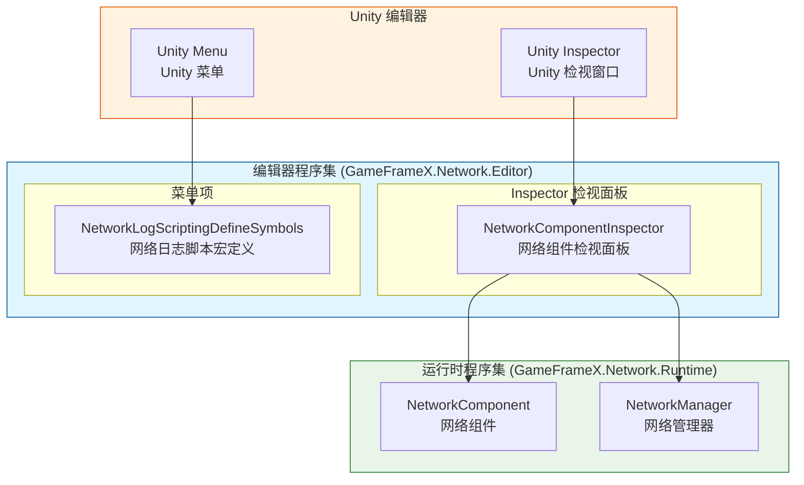
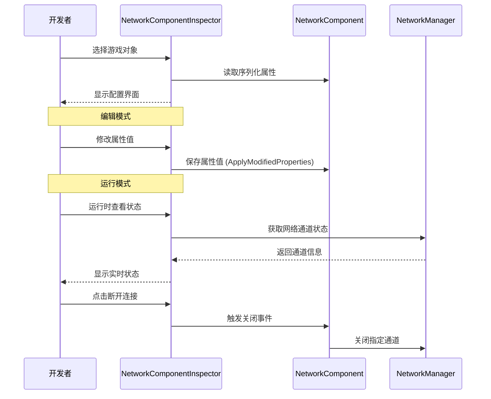
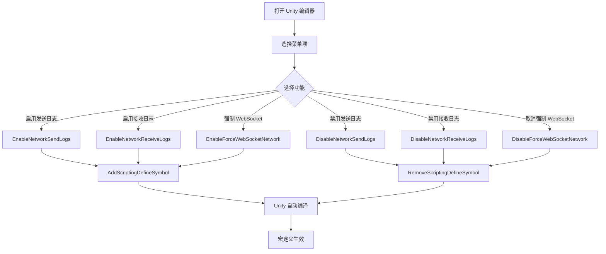

# Edit器configuration

GameFrameX Network 插件provides了丰富的 Unity Editorconfiguration功能，允许开发者through Inspector 面板和Menu Items灵活configuration网络模块的各项Parameters。

## 概述

Edit器configuration是 GameFrameX Network 框架的重要组成部分，主要through以下两种方式provides：

1. **Inspector 面板configuration**：through自定义检视面板（Inspector）实时查看和修改 NetworkComponent 的各项Property
2. **Menu Itemsconfiguration**：through Unity 菜单providesScripting Define Symbols的快速开关，used for控制网络log输出和行为

这些Edit器工具贯穿于整个开发周期，帮助开发者debug网络功能、优化性能，并provides运行时网络状态的实时monitor。

## 架构

GameFrameX Network 的Edit器模块adopts分层Architecture Design，核心组件如下：



### 组件Responsibility

| 组件 | Responsibility | 文件位置 |
|------|------|----------|
| NetworkComponentInspector | provides NetworkComponent 的 Inspector 界面，supportsPropertyEdit和运行时状态显示 | Editor/Inspector/NetworkComponentInspector.cs |
| NetworkLogScriptingDefineSymbols | providesMenu Itemsused forManagesScripting Define Symbols，控制log输出 | Editor/NetworkLogScriptingDefineSymbols.cs |
| NetworkComponent | 网络核心组件，存储configurationProperty | Runtime/Network/NetworkComponent.cs |

### 程序集configuration

Editor AssemblyConfig File定义了模块的编译环境和Dependencies：

> Source: [GameFrameX.Network.Editor.asmdef](https://github.com/GameFrameX/com.gameframex.unity.network/blob/main/Editor/GameFrameX.Network.Editor.asmdef#L1-L19)

```json
{
    "name": "GameFrameX.Network.Editor",
    "references": [
        "GameFrameX.Network.Runtime",
        "GameFrameX.Editor",
        "GameFrameX.Runtime"
    ],
    "includePlatforms": [
        "Editor"
    ]
}
```

**设计意图**：Editor Assembly仅在 Unity Editor环境下编译，避免将Edit器代码打包到发布版本中，减少发布包体积。

## Inspector 面板configuration

NetworkComponentInspector 是 NetworkComponent 的自定义检视面板，provides了可视化的configuration界面。

### configurationProperty

| Property | Type | Default | Description |
|------|------|--------|------|
| RPC Timeout Time In Milliseconds | int | 5000 | RPC 调用超时时间（毫秒），范围 3000-50000 |
| Focus Send Heartbeat | bool | false | Application获得焦点时是否send心跳包 |
| Ignore Log Printing For Sent Message IDs | List<int> | 空列表 | send时忽略log打印的消息ID列表 |
| Ignore Log Printing Of Received Message IDs | List<int> | 空列表 | receive时忽略log打印的消息ID列表 |

### Property详解

#### RPC 超时时间

```csharp
// Source: Runtime/Network/NetworkComponent.cs#L60-L63
// RPC超时时间，以毫秒为单位,默认为5秒
[SerializeField] private int m_rpcTimeout = 5000;
```

RPC 超时时间决定了远程过程调用（RPC）的最大等待时间。当调用远程Method时，如果在该时间内未收到响应，将触发超时回调。合理set此值对于用户体验至关重要：

- **值过小**：在网络环境较差时容易触发误超时
- **值过大**：用户等待时间过长，体验不佳
- **建议值**：根据网络环境调整，开发环境可set较短，生产环境建议 5000-10000 毫秒

#### 焦点心跳

```csharp
// Source: Runtime/Network/NetworkComponent.cs#L65-L68
// 是否在应用程序获得焦点时发送心跳包,默认为false
[SerializeField] private bool m_FocusHeartbeat = false;
```

此选项控制Application在获得/失去焦点时是否调整心跳策略。当游戏切换到后台时：

- **Closed时（默认）**：保持原有心跳策略
- **开启时**：获得焦点时restore心跳，失去焦点时pause心跳（节省资源）

#### 忽略log消息ID

```csharp
// Source: Runtime/Network/NetworkComponent.cs#L50-L58
// 忽略发送的网络消息ID的日志打印
[SerializeField] private List<int> m_IgnoredSendNetworkIds = new List<int>();
// 忽略接收的网络消息ID的日志打印
[SerializeField] private List<int> m_IgnoredReceiveNetworkIds = new List<int>();
```

网络通信会产生大量log，对于高频但不需要关注的（如心跳、序列帧synchronize）消息ID，可以add到忽略列表中，减少log干扰。

### 运行时状态显示

在Game Runtime，Inspector 面板会显示当前网络通道的实时状态：

```csharp
// Source: Editor/Inspector/NetworkComponentInspector.cs#L95-L119
private void DrawNetworkChannel(INetworkChannel networkChannel)
{
    EditorGUILayout.BeginVertical("box");
    {
        EditorGUILayout.LabelField(networkChannel.Name, networkChannel.Connected ? "Connected" : "Disconnected");
        EditorGUILayout.LabelField("Address Family", networkChannel.AddressFamily.ToString());
        EditorGUILayout.LabelField("Local Address", networkChannel.Connected ? networkChannel.Socket.LocalEndPoint.ToString() : "Unavailable");
        EditorGUILayout.LabelField("Remote Address", networkChannel.Connected ? networkChannel.Socket.RemoteEndPoint.ToString() : "Unavailable");
        EditorGUILayout.LabelField("Send Packet", Utility.Text.Format("{0} / {1}", networkChannel.SendPacketCount, networkChannel.SentPacketCount));
        EditorGUILayout.LabelField("Miss Heart Beat Count", networkChannel.MissHeartBeatCount.ToString());
        EditorGUILayout.LabelField("Heart Beat", Utility.Text.Format("{0:F2} / {1:F2}", networkChannel.HeartBeatElapseSeconds, networkChannel.HeartBeatInterval));
        // ... 断开连接按钮
    }
    EditorGUILayout.EndVertical();
}
```

**运行时显示的informationincluding：**

| 状态项 | Description |
|--------|------|
| connect状态 | 当前是否Connected |
| Address Family | 地址Type（IPv4/IPv6） |
| Local Address | 本地终端地址 |
| Remote Address | 远程终端地址 |
| Send Packet | send数据包统计 |
| Miss Heart Beat Count | Heartbeat Lost计数 |
| Heart Beat | 心跳间隔与已过时间 |

### Usage Examples

在 Unity 场景中Creates NetworkComponent 后，可以在 Inspector 面板中进行configuration：

1. 在 Hierarchy 面板中选择contains NetworkComponent 的游戏对象
2. 在 Inspector 面板中查看 Network 组件
3. EditconfigurationProperty（部分Property在运行时Read-only）
4. Game Runtime查看实时网络状态

```csharp
// NetworkComponent 创建代码示例
// Source: Runtime/Network/NetworkComponent.cs#L42-L45
[AddComponentMenu("GameFrameX/Network")]
[UnityEngine.Scripting.Preserve]
public sealed class NetworkComponent : GameFrameworkComponent
```

## Scripting Define Symbolsconfiguration

NetworkLogScriptingDefineSymbols provides了Menu Items来ManagesScripting Define Symbols，这些宏定义used for控制网络模块的编译时行为。

### 可用宏定义

| 宏定义 | Menu Items路径 | Usage |
|--------|------------|------|
| ENABLE_GAMEFRAMEX_NETWORK_SEND_LOG | GameFrameX/Scripting Define Symbols/Enable Network Send Logs | 启用网络sendlog |
| ENABLE_GAMEFRAMEX_NETWORK_RECEIVE_LOG | GameFrameX/Scripting Define Symbols/Enable Network Receive Logs | 启用网络receivelog |
| FORCE_ENABLE_GAME_FRAME_X_WEB_SOCKET | GameFrameX/Scripting Define Symbols/Enable Force WebSocket | 强制Uses WebSocket 网络 |

### Menu ItemsImplements

```csharp
// Source: Editor/NetworkLogScriptingDefineSymbols.cs#L42-L98
public static class NetworkLogScriptingDefineSymbols
{
    public const string EnableNetworkReceiveLogScriptingDefineSymbol = "ENABLE_GAMEFRAMEX_NETWORK_RECEIVE_LOG";
    public const string EnableNetworkSendLogScriptingDefineSymbol = "ENABLE_GAMEFRAMEX_NETWORK_SEND_LOG";
    public const string ForceEnableNetworkSendLogScriptingDefineSymbol = "FORCE_ENABLE_GAME_FRAME_X_WEB_SOCKET";

    /// <summary>
    /// 开启网络发送日志脚本宏定义。
    /// </summary>
    [MenuItem("GameFrameX/Scripting Define Symbols/Enable Network Send Logs(开启网络发送日志打印)", false, 201)]
    public static void EnableNetworkSendLogs()
    {
        ScriptingDefineSymbols.AddScriptingDefineSymbol(EnableNetworkSendLogScriptingDefineSymbol);
    }

    /// <summary>
    /// 禁用网络发送日志脚本宏定义。
    /// </summary>
    [MenuItem("GameFrameX/Scripting Define Symbols/Disable Network Send Logs(关闭网络发送日志打印)", false, 200)]
    public static void DisableNetworkSendLogs()
    {
        ScriptingDefineSymbols.RemoveScriptingDefineSymbol(EnableNetworkSendLogScriptingDefineSymbol);
    }
    // ... 其他方法类似
}
```

### UsesDescription

1. 打开 Unity Editor
2. 在菜单栏选择 **GameFrameX → Scripting Define Symbols**
3. 选择要启用/禁用的宏定义选项
4. Unity 会自动重新编译脚本

### 宏定义详解

#### 网络log宏

启用网络log宏后，系统会在控制台输出详细的网络通信log：

- **ENABLE_GAMEFRAMEX_NETWORK_SEND_LOG**：输出所有send的网络消息
- **ENABLE_GAMEFRAMEX_NETWORK_RECEIVE_LOG**：输出所有receive的网络消息

**适用场景**：
- 开发阶段debug网络通信
- 排查网络connect问题
- 分析消息serialize和传输效率

**性能注意**：启用log会产生大量输出，影响性能，建议仅在开发debug时开启。

#### 强制 WebSocket 宏

- **FORCE_ENABLE_GAME_FRAME_X_WEB_SOCKET**：强制网络模块Uses WebSocket 协议

**适用场景**：
- Server仅supports WebSocket 协议
- 需要through浏览器进行test
- 穿透防火墙限制

## 核心流程

### Inspector configuration流程



### 宏定义configuration流程



## Related Links

- [网络Manages器](./4-core-concepts.1-network-manager) - 网络核心Manages组件
- [Network Channel](./4-core-concepts.2-network-channel) - 网络通信通道
- [Heartbeat Mechanism](./5-heartbeat) - Heartbeat Checkconfiguration
- [Event System](./6-events) - 网络事件process
- [Getting Started](./3-getting-started) - 快速入门指南
