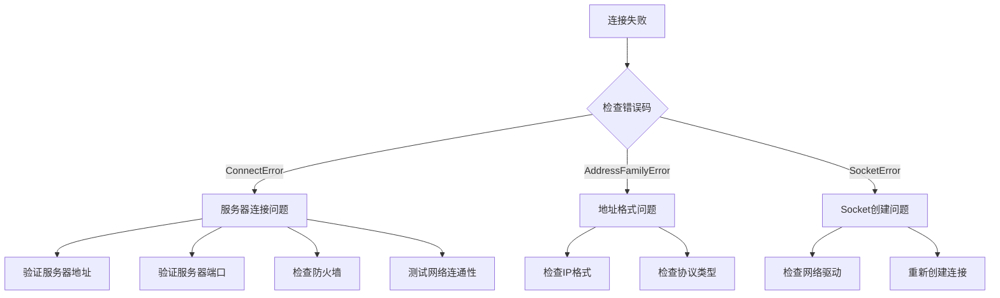

# Troubleshooting

This document summarizesUses GameFrameX Network 网络库过程中常见的error问题、原因分析and解决方案。

## 概述

GameFrameX Network 是 Unity 游戏引擎的长connectNetwork Component，provides TCP 和 WebSocket 两种网络协议supports。在实际Uses过程中，开发者可能遇到Connection Failed、消息processerror、心跳超时等问题。本文档旨在帮助开发者快速定位和解决这些Troubleshooting。

## 常见error码与原因分析

### 网络error码详解

> Source: [NetworkErrorCode.cs](https://github.com/GameFrameX/com.gameframex.unity.network/blob/main/Runtime/Network/Base/NetworkErrorCode.cs#L80-L136)

| error码 | Description | 常见原因 |
|--------|------|----------|
| `Unknown` | 未知error | 未知Exception或未捕获的error |
| `AddressFamilyError` | 地址族error | IP地址格式不正确或协议不匹配 |
| `SocketError` | Socket error | Network SocketCreates或操作failure |
| `ConnectError` | connecterror | Server未开启、防火墙阻止、网络不通 |
| `SendError` | senderror | 网络中断、缓冲区满、connect已Closed |
| `ReceiveError` | receiveerror | 网络中断、Server主动Closedconnect |
| `SerializeError` | serializeerror | 消息对象serializefailure |
| `DeserializePacketHeaderError` | 包头parseerror | 数据包格式不正确或被篡改 |
| `DeserializePacketError` | 包体parseerror | 消息体parsefailure |
| `MissHeartBeatError` | 心跳丢失error | 长时间未收到ServerHeartbeat Response |
| `DisposeError` | 资源releaseerror | 重复release或release时机不当 |

### 网络connectClosed原因

> Source: [NetworkErrorCode.cs](https://github.com/GameFrameX/com.gameframex.unity.network/blob/main/Runtime/Network/Base/NetworkErrorCode.cs#L38-L74)

| Closed原因 | Description | process建议 |
|----------|------|----------|
| `Normal` | 正常Closed | 无需process，正常业务流程 |
| `Timeout` | 超时Closed | check网络状况，调整超时set |
| `Dispose` | 主动release | check代码中是否有误调用 |
| `ConnectClose` | connect断开 | checkServer状态和网络connect |
| `ConnectAddressError` | 地址error | checkServer地址和端口configuration |
| `ConnectAddressExceptionError` | 地址Exception | checkDNSparse和Server可达性 |
| `MissHeartBeat` | 心跳丢失 | 见心跳问题章节 |

## connect问题

### 无法connect到Server

**症状**：调用connectMethod后，触发 `NetworkError` 事件但未触发 `NetworkConnected` 事件。

**可能原因**：

1. **Server地址error**
   - IP 地址或域名填写error
   - 端口号不正确
   - 防火墙阻止connect

2. **Server未start**
   - 后端服务未运行
   - 服务端口未正确监听

3. **网络环境问题**
   - Client网络不通
   - 代理或VPN干扰

**排查步骤**：



**解决方案**：

1. 确认Server地址和端口正确
2. Uses ping 或 telnet testServer可达性
3. check防火墙和安全组configuration
4. 确认Server端已正确start并监听相应端口

### connectsuccess后又立即断开

**症状**：触发 `NetworkConnected` 事件后，很快触发 `NetworkClosed` 事件。

**可能原因**：

1. Server主动断开connect（认证failure等）
2. Clientsend的数据格式error
3. 心跳configuration问题

**解决方案**：

1. checkServerlog，了解断开原因
2. verify消息协议格式是否与Server一致
3. check心跳configuration是否正确

## 消息process问题

### Message Handlersregisterfailure

**症状**：Applicationstart时抛出Exception，或消息无法被正确process。

> Source: [MessageHandlerAttribute.cs](https://github.com/GameFrameX/com.gameframex.unity.network/blob/main/Runtime/Network/Base/MessageHandlerAttribute.cs#L47-L63)

**常见error**：

1. **Message Types未Inherits MessageObject**

```csharp
// 错误示例
[MessageHandler(typeof(MyMessage), nameof(OnReceiveMyMessage))]
public class MyMessageHandler
{
    public void OnReceiveMyMessage(MyMessage msg) { }
}

// MyMessage 定义错误 - 未继承 MessageObject
public class MyMessage  // 错误：未继承 MessageObject
{
    public int Id;
}
```

```csharp
// 正确示例
public class MyMessage : MessageObject  // 必须继承 MessageObject
{
    public int Id;
}
```

2. **Message Types未Implements接口**

```csharp
// 错误示例
public class MyMessage : MessageObject  // 缺少接口实现
{
    public int Id;
}

// 正确示例 - 需要实现 INotifyMessage 或 IRequestMessage/IResponseMessage
public class MyMessage : MessageObject, INotifyMessage
{
    public int Id;
}
```

3. **processMethodParameterserror**

> Source: [MessageHandlerAttribute.cs](https://github.com/GameFrameX/com.gameframex.unity.network/blob/main/Runtime/Network/Base/MessageHandlerAttribute.cs#L136-L144)

```csharp
// 错误示例 1：参数个数不为1
[MessageHandler(typeof(MyMessage), nameof(OnReceiveMyMessage))]
public void OnReceiveMyMessage(MyMessage msg, string extra)  // 错误：参数个数为2
{
}

// 错误示例 2：参数类型不匹配
[MessageHandler(typeof(MyMessage), nameof(OnReceiveMyMessage))]
public void OnReceiveMyMessage(OtherMessage msg)  // 错误：参数类型不匹配
{
}

// 正确示例
[MessageHandler(typeof(MyMessage), nameof(OnReceiveMyMessage))]
public void OnReceiveMyMessage(MyMessage msg)  // 正确：参数个数为1，类型为 MyMessage
{
}
```

### Message HandlersMethod未找到

**症状**：运行时抛出Exception `未找到方法：xxx.请确认是否注册成功`

> Source: [MessageHandlerAttribute.cs](https://github.com/GameFrameX/com.gameframex.unity.network/blob/main/Runtime/Network/Base/MessageHandlerAttribute.cs#L77-L80)

**排查步骤**：

1. 确认Method名称与 `MessageHandlerAttribute` 中指定的一致
2. 确认MethodAccess修饰符正确（public 或 internal）
3. 确认Method在正确的类中
4. 确认Uses了 `[MessageHandler]` 特性

```csharp
// 确保方法名正确匹配
[MessageHandler(typeof(LoginResponse), nameof(OnLoginResponse))]  // 方法名必须完全匹配
public class PlayerHandler : IMessageHandler
{
    // 方法名必须与 nameof 中的名称完全一致
    public void OnLoginResponse(LoginResponse msg) { }
}
```

### 消息ID重复冲突

**症状**：start时抛出Exception `请求Id重复` 或 `返回Id重复`

> Source: [ProtoMessageIdHandler.cs](https://github.com/GameFrameX/com.gameframex.unity.network/blob/main/Runtime/Network/ProtoMessageIdHandler.cs#L140-L161)

**原因**：同一个Message TypesUses了重复的消息ID

**解决方案**：checkMessage Types定义，ensure每个Message Types的ID唯一

```csharp
// 错误示例 - ID重复
[MessageTypeHandler(MessageId = 1001)]
public class LoginRequest : MessageObject, IRequestMessage { }

[MessageTypeHandler(MessageId = 1001)]  // 错误：重复的ID
public class Login2Request : MessageObject, IRequestMessage { }

// 正确示例 - ID唯一
[MessageTypeHandler(MessageId = 1001)]
public class LoginRequest : MessageObject, IRequestMessage { }

[MessageTypeHandler(MessageId = 1002)]  // 正确：使用不同的ID
public class Login2Request : MessageObject, IRequestMessage { }
```

### 心跳消息重复

**症状**：start时抛出Exception `心跳消息重复`

> Source: [ProtoMessageIdHandler.cs](https://github.com/GameFrameX/com.gameframex.unity.network/blob/main/Runtime/Network/ProtoMessageIdHandler.cs#L126-L129)

**原因**：多个Message Types被标记为心跳消息

**解决方案**：ensure只有一个Message Types被标记为心跳消息

## 心跳问题

### 心跳超时断开connect

**症状**：触发 `NetworkMissHeartBeat` 事件后connect被Closed

**可能原因**：

1. 网络延迟过高
2. Server心跳间隔configuration与Client不一致
3. Server负载过高未能及时响应心跳
4. Client进入后台时心跳pause（如果未configuration `FocusHeartbeat`）

> Source: [NetworkComponent.cs](https://github.com/GameFrameX/com.gameframex.unity.network/blob/main/Runtime/Network/NetworkComponent.cs#L68-L91)

**解决方案**：

1. check网络环境，优化网络质量
2. 调整心跳超时configuration，增加容忍度
3. 如果游戏supports后台运行，启用 `FocusHeartbeat` 选项
4. 在Application切换到后台时pauseHeartbeat Check

```csharp
// 在 NetworkComponent 中启用焦点心跳
// 在 Unity 编辑器中: NetworkComponent -> Focus Send Heartbeat = true
// 或通过代码设置
networkChannel.SetEnableHeartbeat(true);
```

### 心跳消息未被正确process

**症状**：心跳正常send但Server未响应，或Client收到心跳但未正确process

**解决方案**：

1. 确认心跳Message TypesImplements了 `IHeartBeatMessage` 接口
2. 确认心跳消息ID与Server约定一致
3. check心跳process器Implements

> Source: [DefaultPacketHeartBeatHandler.cs](https://github.com/GameFrameX/com.gameframex.unity.network/blob/main/Runtime/Network/Helper/DefaultPacketHeartBeatHandler.cs#L22-L25)

```csharp
// 心跳处理器需要正确实现
public class HeartBeatHandler : IPacketHeartBeatHandler
{
    public MessageObject Handler()
    {
        // 返回心跳消息对象，不应抛出 NotImplementedException
        return new HeartBeatMessage();
    }
}
```

## RPC 调用问题

### RPC 超时

**症状**：RPC 调用未在预期时间内收到响应

**可能原因**：

1. 网络延迟过高
2. Serverprocess超时
3. 网络connect不稳定

> Source: [NetworkManager.RpcState.cs](https://github.com/GameFrameX/com.gameframex.unity.network/blob/main/Runtime/Network/Network/NetworkManager.RpcState.cs#L64-L67)

**重要提示**：RPC 超时时间最小值为 3000 毫秒（3秒）

```csharp
// 错误示例 - 超时时间小于3000ms
var channel = networkManager.CreateNetworkChannel("game", helper, 1000);  // 错误：小于最小值

// 正确示例 - 超时时间大于等于3000ms
var channel = networkManager.CreateNetworkChannel("game", helper, 5000);  // 正确：5000ms
```

**解决方案**：

1. 增加 RPC 超时时间configuration
2. 优化网络环境
3. checkServer响应时间

```csharp
// 在 NetworkComponent 中配置 RPC 超时
// 默认值: 5000ms (5秒)
// 范围: 3000ms - 50000ms
```

### RPC 响应未找到

**症状**：收到响应但无法匹配到对应的请求

**排查点**：

1. 确认请求消息的 `UniqueId` 正确set
2. 确认请求/响应消息ID匹配
3. check响应Message Types是否与请求Type对应

## serialize问题

### serializefailure

**症状**：Send Message时触发 `NetworkError` 事件，error码为 `SerializeError`

> Source: [NetworkManager.NetworkChannelBase.cs](https://github.com/GameFrameX/com.gameframex.unity.network/blob/main/Runtime/Network/Network/NetworkManager.NetworkChannelBase.cs#L867-L870)

**可能原因**：

1. 消息对象contains不可serialize的Field
2. 自定义serialize器Implementserror
3. 消息体过大超出缓冲区限制

**解决方案**：

1. check消息类的FieldType，ensure都是可serialize的
2. verify自定义serialize逻辑
3. check消息大小限制

### 反serializefailure

**症状**：Receive Message时触发 `NetworkError` 事件，error码为 `DeserializePacketError` 或 `DeserializePacketHeaderError`

**可能原因**：

1. Serversend的数据格式与Client预期不一致
2. 数据包被篡改或损坏
3. Client和服务端协议版本不匹配

**解决方案**：

1. 确认服务端和ClientUses相同的消息协议
2. check数据包完整性
3. ensure协议版本一致

## 平台相关问题

### WebGL 平台connect问题

**症状**：在 WebGL 平台无法建立connect

**原因**：WebGL 平台只supports WebSocket 协议，不supports原生 TCP connect

> Source: [NetworkManager.cs](https://github.com/GameFrameX/com.gameframex.unity.network/blob/main/Runtime/Network/Network/NetworkManager.cs#L212-L216)

**解决方案**：

```csharp
// WebGL 平台会自动使用 WebSocket
// 如需强制使用 WebSocket，可添加以下宏定义
// Unity 菜单: GameFrameX -> Scripting Define Symbols -> Enable Force WebSocket
```

### Edit器中connect问题

**症状**：在 Unity Editor中connect正常，但打包后无法connect

**可能原因**：

1. 打包后的平台与Edit器平台不同
2. 缺少相应的程序集定义
3. 网络权限未configuration

**解决方案**：

1. check目标平台的网络权限configuration
2. 确认相关程序集已正确引用
3. test不同网络环境

## Debugging Tips

### 启用网络log

> Source: [Editor/NetworkLogScriptingDefineSymbols.cs](https://github.com/GameFrameX/com.gameframex.unity.network/blob/main/Editor/NetworkLogScriptingDefineSymbols.cs)

through菜单启用网络debuglog：

```
GameFrameX -> Scripting Define Symbols -> Enable Network Send Log
GameFrameX -> Scripting Define Symbols -> Enable Network Receive Log
```

### 事件监听debug

监听所有网络事件进行debug：

```csharp
private void Start()
{
    var networkManager = GameEntry.GetComponent<NetworkManager>();
    
    networkManager.NetworkConnected += OnNetworkConnected;
    networkManager.NetworkClosed += OnNetworkClosed;
    networkManager.NetworkError += OnNetworkError;
    networkManager.NetworkMissHeartBeat += OnNetworkMissHeartBeat;
}

private void OnNetworkConnected(object sender, NetworkConnectedEventArgs e)
{
    UnityEngine.Debug.Log($"连接成功: {e.NetworkChannel.Name}");
}

private void OnNetworkClosed(object sender, NetworkClosedEventArgs e)
{
    UnityEngine.Debug.Log($"连接关闭: {e.NetworkChannel.Name}, 原因: {e.Reason}, 错误码: {e.ErrorCode}");
}

private void OnNetworkError(object sender, NetworkErrorEventArgs e)
{
    UnityEngine.Debug.LogError($"网络错误: {e.ErrorCode}, Socket错误: {e.SocketErrorCode}, 消息: {e.ErrorMessage}");
}

private void OnNetworkMissHeartBeat(object sender, NetworkMissHeartBeatEventArgs e)
{
    UnityEngine.Debug.LogWarning($"心跳丢失: {e.MissCount}次");
}
```

### 忽略特定消息log

> Source: [NetworkComponent.cs](https://github.com/GameFrameX/com.gameframex.unity.network/blob/main/Runtime/Network/NetworkComponent.cs#L73-L79)

对于高频消息，可以configuration忽略log打印：

```csharp
// 配置忽略发送日志的消息ID
networkChannel.SetIgnoreLogNetworkIds(new[] { 1001, 1002 }, new[] { 1003, 1004 });
```

## 常见error排查清单

| errorType | check项 |
|----------|--------|
| Connection Failed | Server地址、端口、防火墙、网络连通性 |
| connect断开 | 心跳configuration、网络质量、Server状态 |
| 消息process | Message TypesInherits、Implements接口、Method签名 |
| serializefailure | FieldType、协议版本、数据完整性 |
| RPC 超时 | 网络延迟、Server响应、超时configuration |
| 平台问题 | 网络权限、协议supports、程序集引用 |

## Related Links

- [网络Manages器](./4-core-concepts.1-network-manager)
- [Network Channel](./4-core-concepts.2-network-channel)
- [Message Types](./4-core-concepts.3-message-types)
- [Heartbeat Mechanism](./5-heartbeat)
- [Event System](./6-events)
- [RPC Remote Procedure Call](./8-rpc)
- [Edit器configuration](./9-editor-configuration)
