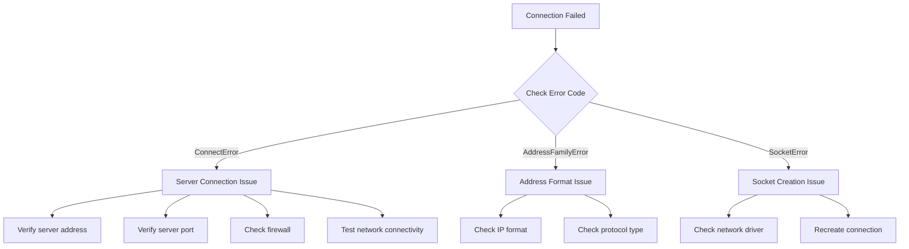

# Troubleshooting

This document summarizes common errors, cause analysis, and solutions when using GameFrameX Network library.

## Overview

GameFrameX Network is a long-connection Network Component for Unity game engine, providing TCP and WebSocket network protocol support. In actual use, developers may encounter issues such as connection failures, message processing errors, and heartbeat timeouts. This document aims to help developers quickly locate and resolve these issues.

## Common Error Codes and Cause Analysis

### Network Error Code Details

> Source: [NetworkErrorCode.cs](https://github.com/GameFrameX/com.gameframex.unity.network/blob/main/Runtime/Network/Base/NetworkErrorCode.cs#L80-L136)

| Error Code | Description | Common Causes |
|--------|------|----------|
| `Unknown` | Unknown error | Unknown exception or uncaught error |
| `AddressFamilyError` | Address family error | Incorrect IP address format or protocol mismatch |
| `SocketError` | Socket error | Network socket creation or operation failure |
| `ConnectError` | Connection error | Server not started, firewall blocking, network unreachable |
| `SendError` | Send error | Network interruption, buffer full, connection already closed |
| `ReceiveError` | Receive error | Network interruption, server actively closed connection |
| `SerializeError` | Serialization error | Message object serialization failure |
| `DeserializePacketHeaderError` | Packet header parsing error | Incorrect data packet format or tampering |
| `DeserializePacketError` | Packet body parsing error | Message body parsing failure |
| `MissHeartBeatError` | Heartbeat miss error | Long time without receiving server heartbeat response |
| `DisposeError` | Resource release error | Duplicate release or improper release timing |

### Network Connection Close Reasons

> Source: [NetworkErrorCode.cs](https://github.com/GameFrameX/com.gameframex.unity.network/blob/main/Runtime/Network/Base/NetworkErrorCode.cs#L38-L74)

| Close Reason | Description | Handling Suggestion |
|----------|------|----------|
| `Normal` | Normal close | No processing needed, normal business flow |
| `Timeout` | Timeout close | Check network conditions, adjust timeout settings |
| `Dispose` | Active release | Check if there are incorrect calls in code |
| `ConnectClose` | Connection disconnected | Check server status and network connection |
| `ConnectAddressError` | Address error | Check server address and port configuration |
| `ConnectAddressExceptionError` | Address exception | Check DNS parsing and server reachability |
| `MissHeartBeat` | Heartbeat miss | See heartbeat problem section |

## Connection Problems

### Unable to Connect to Server

**Symptom**: After calling the connect method, the `NetworkError` event is triggered but the `NetworkConnected` event is not triggered.

**Possible Causes**:

1. **Server address error**
   - IP address or domain name is incorrect
   - Port number is incorrect
   - Firewall blocking connection

2. **Server not started**
   - Backend service not running
   - Service port not correctly listening

3. **Network environment issues**
   - Client network unreachable
   - Proxy or VPN interference

**Troubleshooting Steps**:



**Solutions**:

1. Confirm server address and port are correct
2. Use ping or telnet to test server reachability
3. Check firewall and security group configuration
4. Confirm server has correctly started and is listening on the corresponding port

### Connection Succeeds but Then Immediately Disconnects

**Symptom**: The `NetworkConnected` event is triggered, but the `NetworkClosed` event is triggered shortly after.

**Possible Causes**:

1. Server actively disconnects connection (authentication failure, etc.)
2. Client sends data in incorrect format
3. Heartbeat configuration issue

**Solutions**:

1. Check server logs to understand disconnect reason
2. Verify message protocol format matches server
3. Check heartbeat configuration is correct

## Message Processing Problems

### Message Handler Registration Failure

**Symptom**: Exception thrown at application start, or message cannot be correctly processed.

> Source: [MessageHandlerAttribute.cs](https://github.com/GameFrameX/com.gameframex.unity.network/blob/main/Runtime/Network/Base/MessageHandlerAttribute.cs#L47-L63)

**Common Errors**:

1. **Message type does not inherit MessageObject**

```csharp
// Wrong example
[MessageHandler(typeof(MyMessage), nameof(OnReceiveMyMessage))]
public class MyMessageHandler
{
    public void OnReceiveMyMessage(MyMessage msg) { }
}

// MyMessage definition error - does not inherit MessageObject
public class MyMessage  // Error: does not inherit MessageObject
{
    public int Id;
}
```

```csharp
// Correct example
public class MyMessage : MessageObject  // Must inherit MessageObject
{
    public int Id;
}
```

2. **Message type does not implement interface**

```csharp
// Wrong example
public class MyMessage : MessageObject  // Missing interface implementation
{
    public int Id;
}

// Correct example - needs to implement INotifyMessage or IRequestMessage/IResponseMessage
public class MyMessage : MessageObject, INotifyMessage
{
    public int Id;
}
```

3. **Processing method parameter error**

> Source: [MessageHandlerAttribute.cs](https://github.com/GameFrameX/com.gameframex.unity.network/blob/main/Runtime/Network/Base/MessageHandlerAttribute.cs#L136-L144)

```csharp
// Wrong example 1: Parameter count is not 1
[MessageHandler(typeof(MyMessage), nameof(OnReceiveMyMessage))]
public void OnReceiveMyMessage(MyMessage msg, string extra)  // Error: parameter count is 2
{
}

// Wrong example 2: Parameter type does not match
[MessageHandler(typeof(MyMessage), nameof(OnReceiveMyMessage))]
public void OnReceiveMyMessage(OtherMessage msg)  // Error: parameter type does not match
{
}

// Correct example
[MessageHandler(typeof(MyMessage), nameof(OnReceiveMyMessage))]
public void OnReceiveMyMessage(MyMessage msg)  // Correct: parameter count is 1, type is MyMessage
{
}
```

### Message Handler Method Not Found

**Symptom**: Exception thrown at runtime `Method not found: xxx. Please confirm if registration was successful`

> Source: [MessageHandlerAttribute.cs](https://github.com/GameFrameX/com.gameframex.unity.network/blob/main/Runtime/Network/Base/MessageHandlerAttribute.cs#L77-L80)

**Troubleshooting Steps**:

1. Confirm method name matches what is specified in `MessageHandlerAttribute`
2. Confirm method access modifier is correct (public or internal)
3. Confirm method is in the correct class
4. Confirm `[MessageHandler]` attribute is used

```csharp
// Ensure method name matches correctly
[MessageHandler(typeof(LoginResponse), nameof(OnLoginResponse))]  // Method name must match exactly
public class PlayerHandler : IMessageHandler
{
    // Method name must exactly match the name in nameof
    public void OnLoginResponse(LoginResponse msg) { }
}
```

### Duplicate Message ID Conflict

**Symptom**: Exception thrown at start `Request ID duplicate` or `Response ID duplicate`

> Source: [ProtoMessageIdHandler.cs](https://github.com/GameFrameX/com.gameframex.unity.network/blob/main/Runtime/Network/ProtoMessageIdHandler.cs#L140-L161)

**Cause**: Same message ID is used for multiple message types

**Solution**: Check message type definition, ensure each message type has a unique ID

```csharp
// Wrong example - ID duplicate
[MessageTypeHandler(MessageId = 1001)]
public class LoginRequest : MessageObject, IRequestMessage { }

[MessageTypeHandler(MessageId = 1001)]  // Error: duplicate ID
public class Login2Request : MessageObject, IRequestMessage { }

// Correct example - unique ID
[MessageTypeHandler(MessageId = 1001)]
public class LoginRequest : MessageObject, IRequestMessage { }

[MessageTypeHandler(MessageId = 1002)]  // Correct: use different ID
public class Login2Request : MessageObject, IRequestMessage { }
```

### Duplicate Heartbeat Message

**Symptom**: Exception thrown at start `Heartbeat message duplicate`

> Source: [ProtoMessageIdHandler.cs](https://github.com/GameFrameX/com.gameframex.unity.network/blob/main/Runtime/Network/ProtoMessageIdHandler.cs#L126-L129)

**Cause**: Multiple message types are marked as heartbeat messages

**Solution**: Ensure only one message type is marked as heartbeat message

## Heartbeat Problems

### Heartbeat Timeout Disconnects Connection

**Symptom**: Connection is closed after `NetworkMissHeartBeat` event is triggered

**Possible Causes**:

1. Network latency too high
2. Server heartbeat interval configuration does not match client
3. Server load too high to respond to heartbeat in time
4. Client enters background and heartbeat is paused (if `FocusHeartbeat` is not configured)

> Source: [NetworkComponent.cs](https://github.com/GameFrameX/com.gameframex.unity.network/blob/main/Runtime/Network/NetworkComponent.cs#L68-L91)

**Solutions**:

1. Check network environment, optimize network quality
2. Adjust heartbeat timeout configuration, increase tolerance
3. If game supports background operation, enable `FocusHeartbeat` option
4. Pause heartbeat check when application switches to background

```csharp
// Enable focus heartbeat in NetworkComponent
// In Unity Editor: NetworkComponent -> Focus Send Heartbeat = true
// Or set via code
networkChannel.SetEnableHeartbeat(true);
```

### Heartbeat Message Not Correctly Processed

**Symptom**: Heartbeat sent normally but server does not respond, or client receives heartbeat but does not process correctly

**Solutions**:

1. Confirm heartbeat message type implements `IHeartBeatMessage` interface
2. Confirm heartbeat message ID matches server agreement
3. Check heartbeat processor implementation

> Source: [DefaultPacketHeartBeatHandler.cs](https://github.com/GameFrameX/com.gameframex.unity.network/blob/main/Runtime/Network/Helper/DefaultPacketHeartBeatHandler.cs#L22-L25)

```csharp
// Heartbeat processor needs correct implementation
public class HeartBeatHandler : IPacketHeartBeatHandler
{
    public MessageObject Handler()
    {
        // Return heartbeat message object, should not throw NotImplementedException
        return new HeartBeatMessage();
    }
}
```

## RPC Call Problems

### RPC Timeout

**Symptom**: RPC call does not receive response within expected time

**Possible Causes**:

1. Network latency too high
2. Server processing timeout
3. Network connection unstable

> Source: [NetworkManager.RpcState.cs](https://github.com/GameFrameX/com.gameframex.unity.network/blob/main/Runtime/Network/Network/NetworkManager.RpcState.cs#L64-L67)

**Important Note**: RPC timeout minimum value is 3000 milliseconds (3 seconds)

```csharp
// Wrong example - timeout less than 3000ms
var channel = networkManager.CreateNetworkChannel("game", helper, 1000);  // Error: less than minimum

// Correct example - timeout greater than or equal to 3000ms
var channel = networkManager.CreateNetworkChannel("game", helper, 5000);  // Correct: 5000ms
```

**Solutions**:

1. Increase RPC timeout configuration
2. Optimize network environment
3. Check server response time

```csharp
// Configure RPC timeout in NetworkComponent
// Default: 5000ms (5 seconds)
// Range: 3000ms - 50000ms
```

### RPC Response Not Found

**Symptom**: Response received but cannot be matched to corresponding request

**Troubleshooting Points**:

1. Confirm request message's `UniqueId` is correctly set
2. Confirm request/response message ID matches
3. Check if response message type corresponds to request type

## Serialization Problems

### Serialization Failure

**Symptom**: `NetworkError` event triggered when sending message, error code is `SerializeError`

> Source: [NetworkManager.NetworkChannelBase.cs](https://github.com/GameFrameX/com.gameframex.unity.network/blob/main/Runtime/Network/Network/NetworkManager.NetworkChannelBase.cs#L867-L870)

**Possible Causes**:

1. Message object contains non-serializable fields
2. Custom serializer implementation error
3. Message body too large exceeding buffer limit

**Solutions**:

1. Check message class field types, ensure all are serializable
2. Verify custom serialization logic
3. Check message size limit

### Deserialization Failure

**Symptom**: `NetworkError` event triggered when receiving message, error code is `DeserializePacketError` or `DeserializePacketHeaderError`

**Possible Causes**:

1. Server sends data format that does not match client expectation
2. Data packet tampered or corrupted
3. Client and server protocol version mismatch

**Solutions**:

1. Confirm server and client use the same message protocol
2. Check data packet integrity
3. Ensure protocol version matches

## Platform-Related Problems

### WebGL Platform Connection Problems

**Symptom**: Cannot establish connection on WebGL platform

**Cause**: WebGL platform only supports WebSocket protocol, does not support native TCP connection

> Source: [NetworkManager.cs](https://github.com/GameFrameX/com.gameframex.unity.network/blob/main/Runtime/Network/Network/NetworkManager.cs#L212-L216)

**Solutions**:

```csharp
// WebGL platform automatically uses WebSocket
// To force WebSocket usage, add the following macro definition
// Unity menu: GameFrameX -> Scripting Define Symbols -> Enable Force WebSocket
```

### Connection Problems in Editor

**Symptom**: Connection works in Unity Editor but fails after building

**Possible Causes**:

1. Built platform differs from editor platform
2. Missing corresponding assembly definitions
3. Network permissions not configured

**Solutions**:

1. Check target platform network permissions configuration
2. Confirm related assemblies are correctly referenced
3. Test in different network environments

## Debugging Tips

### Enable Network Logs

> Source: [Editor/NetworkLogScriptingDefineSymbols.cs](https://github.com/GameFrameX/com.gameframex.unity.network/blob/main/Editor/NetworkLogScriptingDefineSymbols.cs)

Enable network debug logs through menu:

```
GameFrameX -> Scripting Define Symbols -> Enable Network Send Log
GameFrameX -> Scripting Define Symbols -> Enable Network Receive Log
```

### Event Listener Debug

Listen to all network events for debugging:

```csharp
private void Start()
{
    var networkManager = GameEntry.GetComponent<NetworkManager>();

    networkManager.NetworkConnected += OnNetworkConnected;
    networkManager.NetworkClosed += OnNetworkClosed;
    networkManager.NetworkError += OnNetworkError;
    networkManager.NetworkMissHeartBeat += OnNetworkMissHeartBeat;
}

private void OnNetworkConnected(object sender, NetworkConnectedEventArgs e)
{
    UnityEngine.Debug.Log($"Connection successful: {e.NetworkChannel.Name}");
}

private void OnNetworkClosed(object sender, NetworkClosedEventArgs e)
{
    UnityEngine.Debug.Log($"Connection closed: {e.NetworkChannel.Name}, reason: {e.Reason}, error code: {e.ErrorCode}");
}

private void OnNetworkError(object sender, NetworkErrorEventArgs e)
{
    UnityEngine.Debug.LogError($"Network error: {e.ErrorCode}, Socket error: {e.SocketErrorCode}, message: {e.ErrorMessage}");
}

private void OnNetworkMissHeartBeat(object sender, NetworkMissHeartBeatEventArgs e)
{
    UnityEngine.Debug.LogWarning($"Heartbeat miss: {e.MissCount} times");
}
```

### Ignore Specific Message Logs

> Source: [NetworkComponent.cs](https://github.com/GameFrameX/com.gameframex.unity.network/blob/main/Runtime/Network/NetworkComponent.cs#L73-L79)

For high-frequency messages, configure to ignore log printing:

```csharp
// Configure ignored send log message IDs
networkChannel.SetIgnoreLogNetworkIds(new[] { 1001, 1002 }, new[] { 1003, 1004 });
```

## Common Error Troubleshooting Checklist

| Error Type | Check Items |
|----------|--------|
| Connection Failed | Server address, port, firewall, network connectivity |
| Connection Disconnected | Heartbeat configuration, network quality, server status |
| Message Processing | Message type inheritance, interface implementation, method signature |
| Serialization Failure | Field type, protocol version, data integrity |
| RPC Timeout | Network latency, server response, timeout configuration |
| Platform Issues | Network permissions, protocol support, assembly references |

## Related Links

- [Network Manager](./04.network-manager.md)
- [Network Channel](./05.network-channel.md)
- [Message Types](./06.message-types.md)
- [Heartbeat Mechanism](./09.heartbeat.md)
- [Event System](./08.events.md)
- [RPC Remote Procedure Call](./11.rpc.md)
- [Editor Configuration](./12.editor-configuration.md)