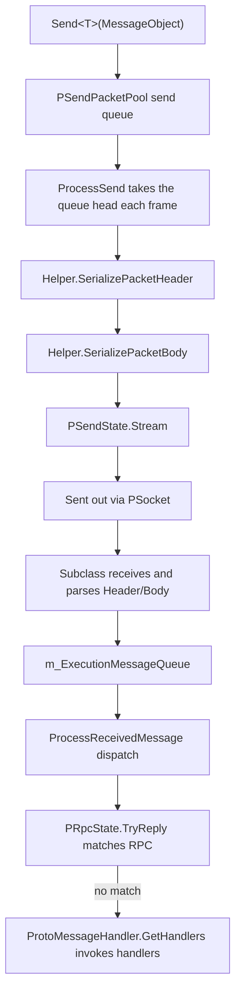

# How It Works: Network Channels and the Data Send/Receive Flow

A network channel (`NetworkChannelBase`) is the send/receive unit within `NetworkManager` responsible for a single connection: outgoing messages are first queued, then serialized and written out each frame by `Update`; incoming messages are parsed in subclasses (TCP / WebSocket), placed into a thread-safe queue, and then dispatched uniformly by the main thread to RPC or message handlers, with heartbeat and timeout-disconnect mechanisms built in.

## Overall Data Flow



Both sending and receiving converge in `NetworkChannelBase.Update`; subclass implementations are only responsible for the concrete Socket send/receive operations.

## Channel Polling: What Happens in a Single Update Frame

Each frame executes, in a fixed order: sending, receiving, heartbeat, message dispatch, and RPC timeout checks:

```csharp
public virtual void Update(float elapseSeconds, float realElapseSeconds)
{
    if (PSocket == null || !PActive)
    {
        return;
    }

    ProcessSend();
    ProcessReceive();
    if (PSocket == null || !PActive)
    {
        return;
    }

    ProcessHeartBeat(realElapseSeconds);
    ProcessReceivedMessage();
    PRpcState.Update(elapseSeconds, realElapseSeconds);
}
```

Source: [NetworkManager.NetworkChannelBase.cs](https://github.com/GameFrameX/com.gameframex.unity.network/blob/main/Runtime/Network/Network/NetworkManager.NetworkChannelBase.cs#L378-L395)

## Send Flow

1. After performing pre-checks, `Send<T>` puts the message into the send queue `PSendPacketPool` (`GameFrameworkLinkedList<MessageObject>`).
2. Each frame, `ProcessSend` takes the message from the head of the queue and calls `ProcessSendMessage`.
3. `ProcessSendMessage` calls the channel helper's `INetworkChannelHelper.SerializePacketHeader` and then `SerializePacketBody` in sequence, writes the serialized results into `PSendState.Stream`, and then calls `ReferencePool.Release(messageObject)` to recycle the message object.
4. If either serialization step fails, `NetworkChannelError` is triggered (`NetworkErrorCode.SerializeError`) or a `GameFrameworkException` is thrown.

```csharp
public void Send<T>(T messageObject) where T : MessageObject
{
    GameFrameworkGuard.NotNull(messageObject, nameof(messageObject));
    if (PSocket == null)
    {
        const string errorMessage = "You must connect first.";
        // ... trigger NetworkChannelError or throw an exception
    }

    if (!PActive)
    {
        const string errorMessage = "Socket is not active.";
        // ...
    }

    lock (PSendPacketPool)
    {
        PSendPacketPool.AddLast(messageObject);
    }
}
```

Source: [NetworkManager.NetworkChannelBase.cs](https://github.com/GameFrameX/com.gameframex.unity.network/blob/main/Runtime/Network/Network/NetworkManager.NetworkChannelBase.cs#L799-L830)

```csharp
protected virtual bool ProcessSendMessage(MessageObject messageObject)
{
    bool serializeResult = PNetworkChannelHelper.SerializePacketHeader(messageObject, PSendState.Stream, out var messageBodyBuffer);
    if (serializeResult)
    {
        serializeResult = PNetworkChannelHelper.SerializePacketBody(messageBodyBuffer, PSendState.Stream);
    }
    else
    {
        const string errorMessage = "Serialized packet failure.";
        throw new InvalidOperationException(errorMessage);
    }

    ReferencePool.Release(messageObject);
    return serializeResult;
}
```

Source: [NetworkManager.NetworkChannelBase.cs](https://github.com/GameFrameX/com.gameframex.unity.network/blob/main/Runtime/Network/Network/NetworkManager.NetworkChannelBase.cs#L867-L882)

## Receive Flow

Received message objects enter `m_ExecutionMessageQueue` (`ConcurrentQueue<MessageObject>`, written by subclasses on the receive thread); the main thread dispatches them in `ProcessReceivedMessage` each frame:

1. First, `PRpcState.TryReply(messageObject)` is called to try matching pending RPC calls; if the match succeeds, processing of this message ends immediately.
2. If the match fails, the registered handlers are retrieved by message type via `ProtoMessageHandler.GetHandlers(messageObject.GetType())`, and each one has `SetMessageObject` called followed by `Invoke()`.
3. Exceptions thrown by an individual handler are logged via `Log.Fatal(e)` and do not interrupt the dispatch of the remaining messages in the same frame.

```csharp
private void ProcessReceivedMessage()
{
    while (m_ExecutionMessageQueue.TryDequeue(out var messageObject))
    {
        try
        {
            // Perform RPC matching
            var replySuccess = PRpcState.TryReply(messageObject);
            if (replySuccess)
            {
                continue;
            }

            // Process notification messages
            var handlers = ProtoMessageHandler.GetHandlers(messageObject.GetType());
            foreach (var handler in handlers)
            {
                handler.SetMessageObject(messageObject);
                try
                {
                    handler.Invoke();
                }
                catch (Exception e)
                {
                    Log.Fatal(e);
                }
            }
        }
        catch (Exception e)
        {
            Log.Fatal(e);
        }
    }
}
```

Source: [NetworkManager.NetworkChannelBase.cs](https://github.com/GameFrameX/com.gameframex.unity.network/blob/main/Runtime/Network/Network/NetworkManager.NetworkChannelBase.cs#L400-L433)

`ProcessReceive()` in the base class is currently an empty implementation; the actual byte receiving and Header/Body parsing are done in the subclasses `SystemTcpNetworkChannel` and `WebSocketNetworkChannel`, and after successful parsing the results are written uniformly into `m_ExecutionMessageQueue`.

## RPC Calls

`Call<TResult>` is a "send + await response" combination: it first enqueues via `Send(messageObject)`, then `await PRpcState.Call(messageObject, isIgnoreErrorCode)` waits for the response to be matched by `TryReply` in the same channel's receive flow. If the return type does not match `TResult`, it throws:

```
RPC response type mismatch. Expected: {0}, Actual: {1}
```

Source: [NetworkManager.NetworkChannelBase.cs](https://github.com/GameFrameX/com.gameframex.unity.network/blob/main/Runtime/Network/Network/NetworkManager.NetworkChannelBase.cs#L777-L791)

## Heartbeat and Timeout Disconnect

Heartbeat defaults: an interval of `DefaultHeartBeatInterval = 30f` seconds, and a disconnect is triggered after more than `DefaultMissHeartBeatCountByClose = 10` missed heartbeats. These can be overridden via `RegisterHeartBeatHandler(IPacketHeartBeatHandler)` (takes effect when the handler's `HeartBeatInterval` and `MissHeartBeatCountByClose` are greater than 0).

The decision logic of `ProcessHeartBeat`:

- `HeartBeatElapseSeconds` accumulates `realElapseSeconds`; when it reaches `PHeartBeatInterval`, `sendHeartBeat` is set, the timer is reset to zero, and `MissHeartBeatCount++`.
- If sending the heartbeat (`PNetworkChannelHelper.SendHeartBeat()`) succeeds and a heartbeat had previously been missed, the `NetworkChannelMissHeartBeat` callback is triggered.
- When `MissHeartBeatCount > MissHeartBeatCountByClose`, `Close(NetworkCloseReason.MissHeartBeat, (ushort)NetworkErrorCode.MissHeartBeatError)` is called to actively disconnect.

Source: [NetworkManager.NetworkChannelBase.cs](https://github.com/GameFrameX/com.gameframex.unity.network/blob/main/Runtime/Network/Network/NetworkManager.NetworkChannelBase.cs#L439-L488)

## Connect and Close

`Connect(Uri address, object userData = null)` will: close the old connection → resolve the host into an `IPEndPoint` (on resolution failure, close with `NetworkCloseReason.ConnectAddressError` / `ConnectAddressExceptionError` and trigger the `NetworkChannelError` callback) → set `PAddressFamily` based on `AddressFamily` (IPv4/IPv6; unsupported types report `NetworkErrorCode.AddressFamilyError`) → `PSendState.Reset()` and `PReceiveState.PrepareForPacketHeader()` to prepare for receiving the packet header.

Inside a lock, `Close(string reason, ushort code = 0)` does the following in order: `PActive = false` → `PSocket.Shutdown()` / `Close()` → trigger the `NetworkChannelClosed` callback → clear the send queue, heartbeat state, RPC state, and the undispatched messages in `m_ExecutionMessageQueue`.

Source: [NetworkManager.NetworkChannelBase.cs](https://github.com/GameFrameX/com.gameframex.unity.network/blob/main/Runtime/Network/Network/NetworkManager.NetworkChannelBase.cs#L723-L768)

## Handler Registration on the Channel

| Method | Handler | Purpose |
|------|--------|------|
| `RegisterHandler(IPacketSendHeaderHandler)` | Send packet header | Serializes the message packet header |
| `RegisterHandler(IPacketSendBodyHandler)` | Send packet body | Serializes the message packet body |
| `RegisterHandler(IPacketReceiveHeaderHandler)` | Receive packet header | Parses the message packet header |
| `RegisterHandler(IPacketReceiveBodyHandler)` | Receive packet body | Parses the message packet body |
| `RegisterHeartBeatHandler(IPacketHeartBeatHandler)` | Heartbeat | Defines the heartbeat message and overrides the interval/disconnect count |
| `RegisterMessageCompressHandler(IMessageCompressHandler)` | Compression | Send-side message compression; pass null to disable |
| `RegisterMessageDecompressHandler(IMessageDecompressHandler)` | Decompression | Receive-side message decompression; pass null to disable |
| `SetRPCErrorHandler(EventHandler<MessageObject>)` | RPC | RPC error callback |

All registration methods internally perform a `GameFrameworkGuard.NotNull` validation; passing null throws an argument exception. See [DefaultNetworkChannelHelper.cs](https://github.com/GameFrameX/com.gameframex.unity.network/blob/main/Runtime/Network/Helper/DefaultNetworkChannelHelper.cs#L13) for a reference default implementation.

## Common Errors

| Symptom | Cause | Resolution |
|------|------|------|
| `You must connect first.` | `PSocket == null` at `Send` time; not yet connected | Call `Connect` first and wait for the connection to succeed |
| `Socket is not active.` | The connection was established but `PActive` is false | Check whether the channel was closed or set to inactive due to an error |
| `Serialized packet failure.` / `NetworkErrorCode.SerializeError` | Header or Body serialization failed | Check the serialization implementation of `INetworkChannelHelper` and the message definitions |
| No errors but no message callbacks received | The response was consumed by `PRpcState.TryReply`, or no handler is registered for the message type | Confirm the handler is registered via `ProtoMessageHandler` |
| Connection actively disconnected with error code `MissHeartBeatError` | Missed heartbeat count exceeded `MissHeartBeatCountByClose` | Adjust heartbeat handler parameters or investigate network quality |

## Related Links

- Channel subclass implementations: [NetworkManager.SystemTcpNetworkChannel.cs](https://github.com/GameFrameX/com.gameframex.unity.network/blob/main/Runtime/Network/Network/SystemSocket/NetworkManager.SystemTcpNetworkChannel.cs#L45), [NetworkManager.WebSocketNetworkChannel.cs](https://github.com/GameFrameX/com.gameframex.unity.network/blob/main/Runtime/Network/Network/WebSocket/NetworkManager.WebSocketNetworkChannel.cs#L48)
- Default channel helper: [DefaultNetworkChannelHelper.cs](https://github.com/GameFrameX/com.gameframex.unity.network/blob/main/Runtime/Network/Helper/DefaultNetworkChannelHelper.cs#L13)
- Heartbeat handler base class: [BasePacketHeartBeatHandler.cs](https://github.com/GameFrameX/com.gameframex.unity.network/blob/main/Runtime/Network/Helper/BasePacketHeartBeatHandler.cs)
- Error code definitions: [NetworkErrorCode.cs](https://github.com/GameFrameX/com.gameframex.unity.network/blob/main/Runtime/Network/Base/NetworkErrorCode.cs)