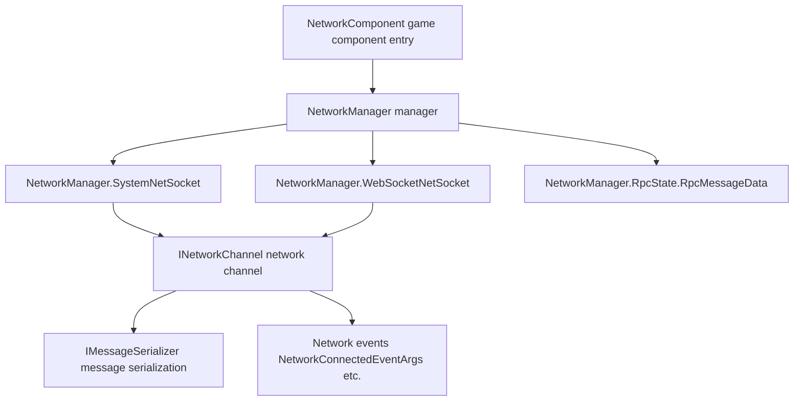

# Overview

Game Frame X Network is GameFrameX's **persistent connection network component** (package name `com.gameframex.unity.network`), providing Unity projects with TCP / WebSocket persistent connections, RPC calls, heartbeat keep-alive, pluggable message serialization, and network events, covering Windows, macOS, Linux, Android, iOS, and WebGL platforms.

## Quick Start

### Installation

Choose any one of the following methods (content taken from the official Chinese README):

1. Edit the Unity project's `Packages/manifest.json`, add `scopedRegistries` and declare the dependency:

```json
{
  "scopedRegistries": [
    {
      "name": "GameFrameX",
      "url": "https://gameframex.upm.alianblank.uk",
      "scopes": [
        "com.gameframex"
      ]
    }
  ],
  "dependencies": {
    "com.gameframex.unity.network": "2.6.6"
  }
}
```

Source: [README.zh-CN.md](https://github.com/GameFrameX/com.gameframex.unity.network/blob/main/README.zh-CN.md#L44-L59)

2. Add directly under the `dependencies` node in `manifest.json`:

```json
{
  "com.gameframex.unity.network": "https://github.com/gameframex/com.gameframex.unity.network.git"
}
```

Source: [README.zh-CN.md](https://github.com/GameFrameX/com.gameframex.unity.network/blob/main/README.zh-CN.md#L64-L69)

3. In Unity's `Package Manager`, add the repository URL using the `Git URL` method: `https://github.com/gameframex/com.gameframex.unity.network.git`.
4. Download the repository directly and place it in the Unity project's `Packages` directory; Unity will automatically load and recognize it.

After installation, you need to restart Unity or refresh the Package Manager for `scopedRegistries` to take effect; `scopes` only applies to packages starting with `com.gameframex`.

### Dependencies

| Dependency Package | Version |
|--------|------|
| `com.gameframex.unity` | 1.1.1 |
| `com.gameframex.unity.event` | 1.0.0 |

Source: [README.zh-CN.md](https://github.com/GameFrameX/com.gameframex.unity.network/blob/main/README.zh-CN.md#L97-L102)

### Key Features

| Feature | Description |
|------|------|
| Persistent Connection | Two Socket implementations: TCP (`SystemNetSocket`) and WebSocket (`WebSocketNetSocket`) |
| RPC Calls | RPC call mechanism and timeout handling (`RpcState` / `RpcMessageData`) |
| Heartbeat | Heartbeat keep-alive, with configurable sending when the application gains/loses focus |
| Pluggable Serialization | `IMessageSerializer` interface, supports two-level registration (global default + per-channel override) |
| Network Channel Management | Create and manage connections on a per-channel basis (`INetworkChannel`) |
| Network Events | Event arguments for connect / disconnect / error / heartbeat loss, etc. (`NetworkConnectedEventArgs` etc.) |

Source: [README.zh-CN.md](https://github.com/GameFrameX/com.gameframex.unity.network/blob/main/README.zh-CN.md#L28-L36)

## How It Works at a Glance

The component uses `NetworkComponent` (a `GameFrameworkComponent` attached to the Unity scene) as the unified entry point, internally delegating to multiple partial implementations of `NetworkManager` (`SystemNetSocket` / `WebSocketNetSocket` / `RpcState`) to handle different transport layers and RPC state management:



- Source entry point: [NetworkComponent.cs](https://github.com/GameFrameX/com.gameframex.unity.network/blob/main/Runtime/Network/NetworkComponent.cs#L45)(`public sealed class NetworkComponent : GameFrameworkComponent`)
- Channel interface: [INetworkChannel.cs](https://github.com/GameFrameX/com.gameframex.unity.network/blob/main/Runtime/Network/Interface/INetworkChannel.cs#L42)(`public interface INetworkChannel`)
- Channel helper interface: [INetworkChannelHelper.cs](https://github.com/GameFrameX/com.gameframex.unity.network/blob/main/Runtime/Network/Interface/INetworkChannelHelper.cs#L39)(`public interface INetworkChannelHelper`)
- TCP implementation: [NetworkManager.SystemNetSocket.cs](https://github.com/GameFrameX/com.gameframex.unity.network/blob/main/Runtime/Network/Network/SystemSocket/NetworkManager.SystemNetSocket.cs#L7)
- WebSocket implementation: [NetworkManager.WebSocketNetSocket.cs](https://github.com/GameFrameX/com.gameframex.unity.network/blob/main/Runtime/Network/Network/WebSocket/NetworkManager.WebSocketNetSocket.cs#L10)
- RPC state: [NetworkManager.RpcState.RpcMessageData.cs](https://github.com/GameFrameX/com.gameframex.unity.network/blob/main/Runtime/Network/Network/NetworkManager.RpcState.RpcMessageData.cs#L7)

## What's Next

- Official documentation: https://gameframex.doc.alianblank.com
- Changelog: see the repository's [CHANGELOG.md](https://github.com/GameFrameX/com.gameframex.unity.network/blob/main/CHANGELOG.md)
- Open source license: see [LICENSE.md](https://github.com/GameFrameX/com.gameframex.unity.network/blob/main/LICENSE.md)
- Community support: QQ groups 467608841 / 233840761 (join via [QR code](https://qm.qq.com/cgi-bin/qm/qr?k=ikT9gA5m2sKwOyNOfYmQvSAPK_c3GmD6))