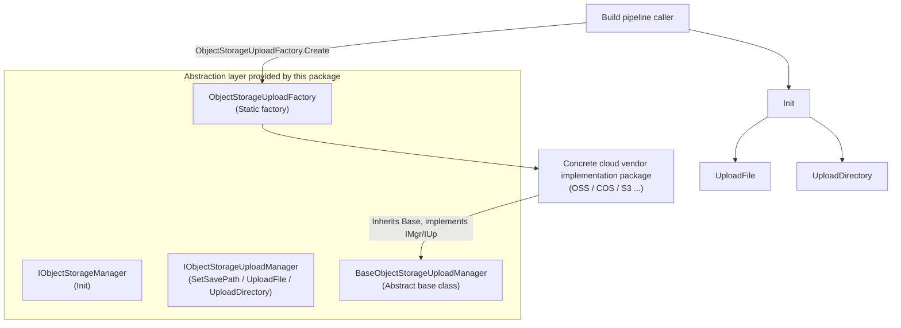

# Object Storage Component Overview

The GameFrameX Object Storage component (`com.gameframex.unity.objectstorage`) provides the base interfaces and abstractions for uploading files and directories to cloud object storage services in Unity projects. It is not bound to any specific cloud vendor; instead, it defines the core contracts through the `IObjectStorageManager` / `IObjectStorageUploadManager` interfaces, while concrete implementations for each provider (OSS, COS, S3, etc.) are provided as separate packages.

## Quick Start

1. **Install the package**. Add a dependency to `Packages/manifest.json` in the root of your Unity project (choose one of the following):
   - Via GameFrameX's scoped registry:
     ```json
     {
       "scopedRegistries": [
         {
           "name": "GameFrameX",
           "url": "https://gameframex.upm.alianblank.uk",
           "scopes": ["com.gameframex"]
         }
       ],
       "dependencies": {
         "com.gameframex.unity.objectstorage": "1.1.0"
       }
     }
     ```
   - Add it directly as a Git URL:
     ```json
     {
       "dependencies": {
         "com.gameframex.unity.objectstorage": "https://github.com/gameframex/com.gameframex.unity.objectstorage.git"
       }
     }
     ```
   - Or clone the repository into the `Packages/` directory, and Unity will load it automatically.

   Source: [README.md](https://github.com/GameFrameX/com.gameframex.unity.objectstorage/blob/main/README.md#L37-L68)

2. **Confirm the target platform is supported**:

   | Platform | Supported |
   |------|------|
   | Windows | Yes |
   | macOS | Yes |
   | Linux | Yes |
   | Android | Yes |
   | iOS | Yes |

   Source: [README.zh-CN.md](https://github.com/GameFrameX/com.gameframex.unity.objectstorage/blob/main/README.zh-CN.md#L69-L78)

3. **Choose a concrete implementation**. This package only provides abstractions and a default implementation. You need to install the corresponding implementation package for your cloud vendor, such as OSS, COS, MinIO, etc.

4. **Call the upload interface**. In the editor build pipeline, obtain an upload manager instance via `ObjectStorageUploadFactory`, call `Init` to configure credentials, and then call `UploadFile` / `UploadDirectory` to upload resources.

## How It Works at a Glance



- The `IObjectStorageManager` interface only exposes `Init`, which is responsible for configuring credentials and the bucket name;
- `IObjectStorageUploadManager` extends it with `SetSavePath`, `UploadFile`, `UploadDirectory`;
- `BaseObjectStorageUploadManager` is the abstract base class. Third-party implementation packages inherit from it, and instances are constructed by `ObjectStorageUploadFactory`.

Source: [IObjectStorageManager.cs](https://github.com/GameFrameX/com.gameframex.unity.objectstorage/blob/main/Editor/IObjectStorageManager.cs#L1-L14)、[IObjectStorageUploadManager.cs](https://github.com/GameFrameX/com.gameframex.unity.objectstorage/blob/main/Editor/IObjectStorageUploadManager.cs#L1-L22)、[ObjectStorageUploadFactory.cs](https://github.com/GameFrameX/com.gameframex.unity.objectstorage/blob/main/Editor/ObjectStorageUploadFactory.cs)

## Next Steps

- For interface contracts and signature details, see [Interface Reference](reference/interfaces).
- For how to integrate with a specific cloud vendor implementation and complete your first upload, see [How to Upload Files to Object Storage](tasks/upload-file).
- For troubleshooting when uploads fail, see [What to Do When Uploads Fail](troubleshooting/upload-failures).