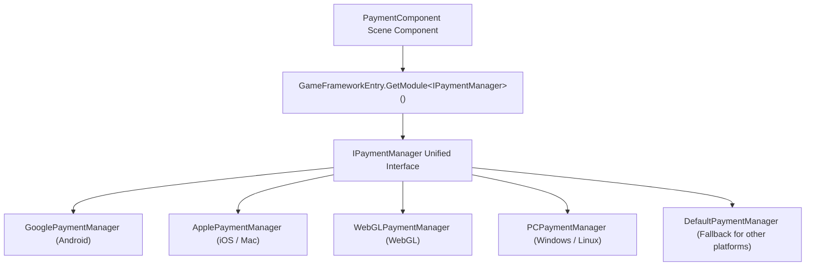

# Installation & Quick Start

Game Frame X Payment is a Unity payment package that provides a unified interface for in-app purchases and subscriptions, supporting both Google Play and Apple App Store. This page walks you through installing the package, attaching the component, and making your first purchase — getting the complete pipeline running in just a few minutes.

## Quick Start

### 1. Verify Your Environment

| Dependency | Version Requirement |
|--------|----------|
| Unity | 2019.4 and above |
| `com.gameframex.unity` | 2.5.1 |
| `com.gameframex.unity.payment.google` | 1.0.1 |

The dependency declarations above come from the package's `package.json` and are resolved automatically by UPM during installation.

Source: [package.json](https://github.com/GameFrameX/com.gameframex.unity.payment/blob/main/package.json#L24-L27)

### 2. Install the Package

Choose any one of the following methods:

**Method 1: scopedRegistries (Recommended)**

Edit your Unity project's `Packages/manifest.json` and add a `scopedRegistries` section:

```json
{
  "scopedRegistries": [
    {
      "name": "GameFrameX",
      "url": "https://gameframex.upm.alianblank.uk",
      "scopes": [
        "com.gameframex"
      ]
    }
  ],
  "dependencies": {
    "com.gameframex.unity.payment": "1.1.0"
  }
}
```

`scopes` controls which packages are resolved through this registry; only packages starting with `com.gameframex` will be fetched from this registry.

Source: [README.zh-CN.md](https://github.com/GameFrameX/com.gameframex.unity.payment/blob/main/README.zh-CN.md#L40-L58)

**Method 2: Add the Git URL Directly**

Add the following under the `dependencies` node in `manifest.json`:

```json
{
   "com.gameframex.unity.payment": "https://github.com/gameframex/com.gameframex.unity.payment.git"
}
```

Source: [README.zh-CN.md](https://github.com/GameFrameX/com.gameframex.unity.payment/blob/main/README.zh-CN.md#L60-L65)

**Method 3: Add a Git URL via Package Manager**

In the Unity menu, go to `Window > Package Manager > + > Add package from git URL`, and enter `https://github.com/gameframex/com.gameframex.unity.payment.git` as the URL.

**Method 4: Place the Source Code Directly**

Download the repository and place it in your Unity project's `Packages` directory; Unity will load and recognize it automatically.

Source: [README.zh-CN.md](https://github.com/GameFrameX/com.gameframex.unity.payment/blob/main/README.zh-CN.md#L66-L67)

### 3. Attach the PaymentComponent Component

Create a GameFrameX GameObject in the scene and add `PaymentComponent` via the `AddComponentMenu` path `GameFrameX/Payment`. The component is decorated with `[RequireComponent(typeof(GameFrameXPaymentCroppingHelper))]`, so it automatically carries the cropping helper component, and `[DisallowMultipleComponent]` restricts each GameObject to only one instance.

```csharp
[DisallowMultipleComponent]
[RequireComponent(typeof(GameFrameXPaymentCroppingHelper))]
[AddComponentMenu("GameFrameX/Payment")]
[UnityEngine.Scripting.Preserve]
public class PaymentComponent : GameFrameworkComponent
```

Source: [PaymentComponent.cs](https://github.com/GameFrameX/com.gameframex.unity.payment/blob/main/Runtime/PaymentComponent.cs#L17-L21)

In `Awake()`, the component automatically selects the platform-specific payment manager implementation based on the current build platform (Google for Android, Apple for iOS/Mac, separate implementations for WebGL and PC, with `DefaultPaymentManager` as the fallback for all other platforms) — no manual configuration required:

```csharp
#if UNITY_ANDROID
    componentType = m_componentAndroidType;
#elif UNITY_IOS
    componentType = m_componentIOSType;
#elif UNITY_WEBGL
    componentType = m_componentWebGLType;
#elif UNITY_STANDALONE_WIN || UNITY_STANDALONE_LINUX
    componentType = m_componentPCType;
#elif UNITY_STANDALONE_OSX
    componentType = m_componentMacType;
#else
    componentType = typeof(DefaultPaymentManager).FullName;
#endif
    ImplementationComponentType = Utility.Assembly.GetType(componentType);
    InterfaceComponentType = typeof(IPaymentManager);
    base.Awake();
```

Source: [PaymentComponent.cs](https://github.com/GameFrameX/com.gameframex.unity.payment/blob/main/Runtime/PaymentComponent.cs#L69-L86)

### 4. Initialize the Payment System

Call `Init` at startup; the `isDebug` parameter controls sandbox mode, and `isClientVerify` controls whether client-side purchase verification is performed:

```csharp
public void Init(bool isDebug = false, bool isClientVerify = true)
{
    _paymentManager.Init(isDebug, isClientVerify);
}
```

Source: [PaymentComponent.cs](https://github.com/GameFrameX/com.gameframex.unity.payment/blob/main/Runtime/PaymentComponent.cs#L102-L105)

To preload product information, call `SetPredefinedProductIds` before initialization (the source comments explicitly require this method to be called before `Initialize()`), passing in the list of in-app product IDs and the list of subscription product IDs respectively:

```csharp
public void SetPredefinedProductIds(List<string> inAppProductIds, List<string> subsProductIds)
{
    _paymentManager.SetPredefinedProductIds(inAppProductIds, subsProductIds);
}
```

Source: [PaymentComponent.cs](https://github.com/GameFrameX/com.gameframex.unity.payment/blob/main/Runtime/PaymentComponent.cs#L122-L126)

After initialization, you can use `IsReady()` to check whether the payment system is ready; it returns a `bool`.

### 5. Subscribe to Events and Initiate a Purchase

First subscribe to the result events (the component directly exposes four events: `OnPurchaseSuccess`, `OnPurchaseFailed`, `OnQueryPurchasesResult`, and `OnConsumePurchaseResult`, all of type `EventHandler<PaymentEventArgs>`), then initiate a purchase using the recommended `Buy(PurchaseParams)`:

```csharp
public void Buy(PurchaseParams purchaseParams)
```

Source: [PaymentComponent.cs](https://github.com/GameFrameX/com.gameframex.unity.payment/blob/main/Runtime/PaymentComponent.cs#L233-L238)

`PurchaseParams` carries parameters such as the product ID and order ID; each payment channel can use its corresponding subclass to pass in channel-specific parameters. Note that the legacy `BuyInApp` / `BuySubs` / `Buy(productId, productType, ...)` methods are marked `[Obsolete("请使用 Buy(PurchaseParams) 替代")]` and should not be used in new code.

Source: [PaymentComponent.cs](https://github.com/GameFrameX/com.gameframex.unity.payment/blob/main/Runtime/PaymentComponent.cs#L161-L163)

### 6. Handle the Purchase Result and Consume It

After a successful purchase, call `ConsumePurchase(purchaseToken)` to consume the purchase for one-time products (if `purchaseToken` is null or empty, the component logs `Log.Warning("Purchase token is null or empty.")` and returns immediately); use `QueryPurchases(PaymentProductType)` to query purchase history, where `productType` takes the inapp or subs value of the `PaymentProductType` enum.

Source: [PaymentComponent.cs](https://github.com/GameFrameX/com.gameframex.unity.payment/blob/main/Runtime/PaymentComponent.cs#L133-L151)

## How It Works at a Glance

The component itself is just a thin wrapper: in `Awake()`, `PaymentComponent` resolves the implementation class type based on the platform, then obtains the current platform's payment manager via `GameFrameworkEntry.GetModule<IPaymentManager>()`, and all subsequent API calls are forwarded to it.



## Next Steps

- Complete API documentation and parameter details: see the repository's [README.zh-CN.md](https://github.com/GameFrameX/com.gameframex.unity.payment/blob/main/README.zh-CN.md#L68-L126)
- Version history: [CHANGELOG.md](https://github.com/GameFrameX/com.gameframex.unity.payment/blob/main/CHANGELOG.md)
- Official documentation and support: [https://gameframex.doc.alianblank.com](https://gameframex.doc.alianblank.com), QQ groups 467608841 / 233840761