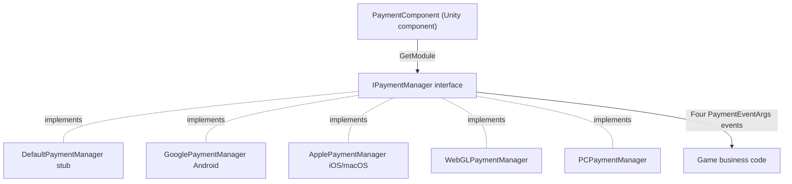

# Payment Component Overview

The Payment component is GameFrameX's Unity in-app purchase package, providing the unified interface `IPaymentManager` for in-app purchases and subscriptions. You attach a `PaymentComponent` to your scene, and at runtime the corresponding channel implementation is automatically assembled based on the platform (Android → Google Play, iOS/macOS → App Store, etc.); business code only targets the same set of `Init` / `Buy` / `QueryPurchases` / `ConsumePurchase` APIs.

## Quick Start

### 1. Install the Package

Edit the Unity project's `Packages/manifest.json`, using either of the following approaches:

```json
{
  "scopedRegistries": [
    {
      "name": "GameFrameX",
      "url": "https://gameframex.upm.alianblank.uk",
      "scopes": [
        "com.gameframex"
      ]
    }
  ],
  "dependencies": {
    "com.gameframex.unity.payment": "1.1.0"
  }
}
```

You can also write the Git URL `https://github.com/gameframex/com.gameframex.unity.payment.git` directly under `dependencies`, or add it via Package Manager's Add package from git URL.

Source: [README.zh-CN.md](https://github.com/GameFrameX/com.gameframex.unity.payment/blob/main/README.zh-CN.md#L40-L66)

### 2. Attach the Payment Component

Select `GameFrameX/Payment` from the Unity menu to add the component; it forcibly includes the cropping helper component:

```csharp
[DisallowMultipleComponent]
[RequireComponent(typeof(GameFrameXPaymentCroppingHelper))]
[AddComponentMenu("GameFrameX/Payment")]
[UnityEngine.Scripting.Preserve]
public class PaymentComponent : GameFrameworkComponent
```

Source: [PaymentComponent.cs](https://github.com/GameFrameX/com.gameframex.unity.payment/blob/main/Runtime/PaymentComponent.cs#L17-L21)

In `Awake`, the component selects the implementation type based on the compilation platform and retrieves `IPaymentManager` from the framework module system:

```csharp
#if UNITY_ANDROID
    componentType = m_componentAndroidType;
#elif UNITY_IOS
    componentType = m_componentIOSType;
#elif UNITY_WEBGL
    componentType = m_componentWebGLType;
#elif UNITY_STANDALONE_WIN || UNITY_STANDALONE_LINUX
    componentType = m_componentPCType;
#elif UNITY_STANDALONE_OSX
    componentType = m_componentMacType;
#else
    componentType = typeof(DefaultPaymentManager).FullName;
#endif
    ImplementationComponentType = Utility.Assembly.GetType(componentType);
    InterfaceComponentType = typeof(IPaymentManager);
    base.Awake();

    _paymentManager = GameFrameworkEntry.GetModule<IPaymentManager>();
```

Source: [PaymentComponent.cs](https://github.com/GameFrameX/com.gameframex.unity.payment/blob/main/Runtime/PaymentComponent.cs#L71-L93)

Mapping of platforms to default implementations:

| Platform | Default implementation type (modifiable in Inspector) |
|------|------------------------------------|
| UNITY_ANDROID | `GameFrameX.Payment.Google.Runtime.GooglePaymentManager` |
| UNITY_IOS / UNITY_STANDALONE_OSX | `GameFrameX.Payment.Apple.Runtime.ApplePaymentManager` |
| UNITY_WEBGL | `GameFrameX.Payment.WebGL.Runtime.WebGLPaymentManager` |
| UNITY_STANDALONE_WIN / LINUX | `GameFrameX.Payment.PC.Runtime.PCPaymentManager` |
| Other platforms | `DefaultPaymentManager` (stub, warnings only) |

### 3. Initialize and Preload Products

`SetPredefinedProductIds` must be called before `Init` to preload the product cache:

```csharp
public void Init(bool isDebug = false, bool isClientVerify = true)
{
    _paymentManager.Init(isDebug, isClientVerify);
}
```

Source: [PaymentComponent.cs](https://github.com/GameFrameX/com.gameframex.unity.payment/blob/main/Runtime/PaymentComponent.cs#L102-L105)

`isDebug` toggles sandbox mode; `isClientVerify` controls whether purchases are verified on the client — it should be set to `false` when using server-side verification (always-online) (note: the default value of the component-level `Init` is `true`, while the default value of the interface `IPaymentManager.Init` is `false`).

### 4. Subscribe to Payment Events

The component exposes four events, forwarded directly to the current platform's `IPaymentManager` implementation: `OnPurchaseSuccess`, `OnPurchaseFailed`, `OnQueryPurchasesResult`, and `OnConsumePurchaseResult`, all with `PaymentEventArgs` parameters.

Source: [PaymentComponent.cs](https://github.com/GameFrameX/com.gameframex.unity.payment/blob/main/Runtime/PaymentComponent.cs#L33-L64)

### 5. Initiate a Purchase

Using `Buy(PurchaseParams)` is recommended; each channel passes channel-specific parameters via its corresponding subclass, and the component layer performs parameter validation first (prints `Log.Warning` and returns directly when `ProductId` or `OrderId` is empty):

```csharp
public void Buy(PurchaseParams purchaseParams)
{
    if (purchaseParams == null)
    {
        Log.Warning("Purchase params is null.");
        return;
    }

    if (string.IsNullOrEmpty(purchaseParams.ProductId))
    {
        Log.Warning("Product ID is null or empty.");
        return;
    }

    if (string.IsNullOrEmpty(purchaseParams.OrderId))
    {
        Log.Warning("Order ID is null or empty.");
        return;
    }

    _paymentManager.Buy(purchaseParams);
}
```

Source: [PaymentComponent.cs](https://github.com/GameFrameX/com.gameframex.unity.payment/blob/main/Runtime/PaymentComponent.cs#L238-L259)

The legacy `BuyInApp` / `BuySubs` / `Buy(productId, productType, orderId, ...)` are all marked `[Obsolete("请使用 Buy(PurchaseParams) 替代")]`; they still work but are not recommended for new code.

Source: [IPaymentManager.cs](https://github.com/GameFrameX/com.gameframex.unity.payment/blob/main/Runtime/IPaymentManager.cs#L79-L105)

### 6. Query and Consume

- `QueryPurchases(PaymentProductType productType)`: Queries purchase records by product type; results are delivered via the `OnQueryPurchasesResult` event.
- `ConsumePurchase(string purchaseToken)`: Consumes a purchase; prints `Purchase token is null or empty.` and returns when `purchaseToken` is empty.
- `IsReady()`: Whether the payment system has finished initializing; it is recommended to check this before making a purchase.

Source: [PaymentComponent.cs](https://github.com/GameFrameX/com.gameframex.unity.payment/blob/main/Runtime/PaymentComponent.cs#L112-L152)

## How It Works at a Glance

`PaymentComponent` only handles platform routing and parameter validation; the actual payment logic lives in each channel's `IPaymentManager` implementation; `DefaultPaymentManager` is an empty stub, and calling its methods only outputs the message "You are using DefaultPaymentManager which is a stub. Please integrate a channel-specific implementation (e.g. Google, Apple).".



Source: [PaymentComponent.cs](https://github.com/GameFrameX/com.gameframex.unity.payment/blob/main/Runtime/PaymentComponent.cs#L23-L28), [DefaultPaymentManager.cs](https://github.com/GameFrameX/com.gameframex.unity.payment/blob/main/Runtime/DefaultPaymentManager.cs#L17-L27)

## Next Steps

- Interface contract and event definitions: [IPaymentManager.cs](https://github.com/GameFrameX/com.gameframex.unity.payment/blob/main/Runtime/IPaymentManager.cs#L16-L113)
- All public APIs and validation logic at the component layer: [PaymentComponent.cs](https://github.com/GameFrameX/com.gameframex.unity.payment/blob/main/Runtime/PaymentComponent.cs)
- Inspector customization in the Editor: [PaymentComponentInspector.cs](https://github.com/GameFrameX/com.gameframex.unity.payment/blob/main/Editor/PaymentComponentInspector.cs)
- Version history: [CHANGELOG.md](https://github.com/GameFrameX/com.gameframex.unity.payment/blob/main/CHANGELOG.md)
- Official documentation site: <https://gameframex.doc.alianblank.com>