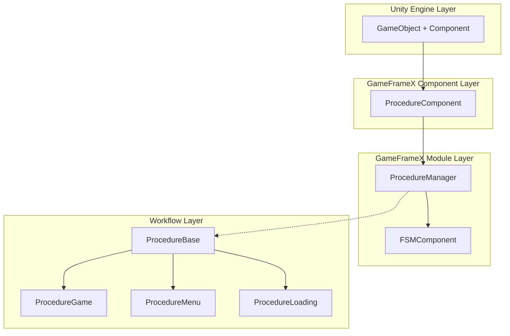
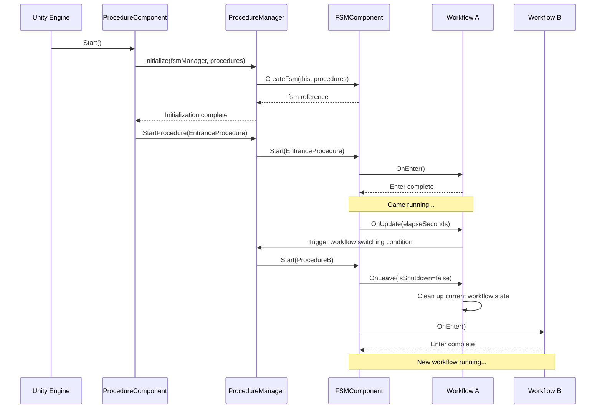

# Features

GameFrameX Procedure workflow management component provides a complete game workflow state management solution for Unity games, supporting workflow management through Finite State Machine (FSM) for various stages of the game.

## Overview

The Procedure workflow management component is one of the core modules of the GameFrameX framework, specifically used for managing game business workflows and state transitions. This component is designed based on Finite State Machine (FSM), allowing developers to divide games into multiple independent workflow stages, such as startup workflow, loading workflow, main menu workflow, game workflow, pause workflow, and end workflow.

Each workflow is an independent state with a complete lifecycle management, including initialization, enter, update, leave, and destroy stages. This design makes game logic more modular, easier to maintain and extend, and also provides clear division boundaries for team collaboration.

## Core Features

### Workflow State Management

The component provides complete workflow state management capability, supporting dynamic switching between different workflow states during game runtime. Developers can implement smooth transitions from loading screen to game main menu to specific game gameplay through simple API calls. The workflow manager maintains references to all available workflows and provides practical functions such as querying the current workflow and getting workflow duration.

```csharp
// Check if specified workflow exists
bool hasProcedure = procedureComponent.HasProcedure<ProcedureGame>();

// Get the workflow currently executing
ProcedureBase current = procedureComponent.CurrentProcedure;

// Get the time the current workflow has been running
float elapsedTime = procedureComponent.CurrentProcedureTime;
```

> Source: [ProcedureComponent.cs](https://github.com/GameFrameX/com.gameframex.unity.procedure/blob/main/Runtime/Procedure/ProcedureComponent.cs#L114-L147)

### Automatic Workflow Initialization

The component automatically completes the creation and initialization of all workflows when the game starts. Developers only need to configure the available workflow types in the Unity Editor. The component automatically uses reflection mechanism to create Procedure instances and automatically starts the Entrance Procedure after the game frame loads complete. This design greatly simplifies game startup logic, allowing developers to focus on implementing business logic.

```csharp
// ProcedureComponent automatically completes workflow initialization in Start method
private IEnumerator Start()
{
    ProcedureBase[] procedures = new ProcedureBase[m_AvailableProcedureTypeNames.Length];
    for (int i = 0; i < m_AvailableProcedureTypeNames.Length; i++)
    {
        Type procedureType = Utility.Assembly.GetType(m_AvailableProcedureTypeNames[i]);
        procedures[i] = (ProcedureBase)Activator.CreateInstance(procedureType);
    }
    m_ProcedureManager.Initialize(GameFrameworkEntry.GetModule<IFsmManager>(), procedures);
    yield return new WaitForEndOfFrame();
    m_ProcedureManager.StartProcedure(m_EntranceProcedure.GetType());
}
```

> Source: [ProcedureComponent.cs](https://github.com/GameFrameX/com.gameframex.unity.procedure/blob/main/Runtime/Procedure/ProcedureComponent.cs#L71-L107)

### Workflow Lifecycle Hooks

Each custom procedure can implement specific business logic by overriding base class methods. The component provides complete lifecycle hooks covering the entire process from workflow creation to destruction. These hooks include: `OnInit` (called during initialization), `OnEnter` (called when entering procedure), `OnUpdate` (called during each frame update), `OnFixedUpdate` (called during fixed frame rate update), `OnLeave` (called when leaving procedure), and `OnDestroy` (called when workflow is destroyed).

```csharp
public abstract class ProcedureBase : FsmState<IProcedureManager>
{
    // Called when state is initialized
    protected override void OnInit(IFsm<IProcedureManager> procedureOwner) { }

    // Called when entering state
    protected override void OnEnter(IFsm<IProcedureManager> procedureOwner) { }

    // Called during state polling
    protected override void OnUpdate(IFsm<IProcedureManager> procedureOwner, float elapseSeconds, float realElapseSeconds) { }

    // Called during fixed frame rate update
    protected override void OnFixedUpdate(IFsm<IProcedureManager> procedureOwner, float elapseSeconds, float realElapseSeconds) { }

    // Called when leaving state
    protected override void OnLeave(IFsm<IProcedureManager> procedureOwner, bool isShutdown) { }

    // Called when state is destroyed
    protected override void OnDestroy(IFsm<IProcedureManager> procedureOwner) { }
}
```

> Source: [ProcedureBase.cs](https://github.com/GameFrameX/com.gameframex.unity.procedure/blob/main/Runtime/Procedure/ProcedureBase.cs#L16-L76)

### Workflow Query and Get

Provides flexible programmatic query interfaces, supporting checking if workflows exist and getting specific workflow instance references through type or type name. These features enable game code to dynamically interact with the workflow system at runtime, for example checking the current game state or getting specific workflows for data exchange in non-workflow classes.

```csharp
// Check and get workflow through generic methods
if (procedureComponent.HasProcedure<ProcedureMenu>())
{
    var menuProcedure = procedureComponent.GetProcedure<ProcedureMenu>();
}

// Check and get workflow through Type object
Type menuType = typeof(ProcedureMenu);
if (procedureComponent.HasProcedure(menuType))
{
    var menuProcedure = (ProcedureMenu)procedureComponent.GetProcedure(menuType);
}
```

> Source: [IProcedureManager.cs](https://github.com/GameFrameX/com.gameframex.unity.procedure/blob/main/Runtime/Procedure/IProcedureManager.cs#L47-L73)

### Editor Visual Configuration

The component provides a custom Unity Editor inspector, supporting intuitive configuration of available workflow list and entrance workflow in the Inspector panel. Checkboxes can be used to conveniently select workflow types to be included in the workflow system, and dropdown menus can be used to set the first workflow when the game starts. During runtime, the inspector also displays the name of the currently executing workflow for easy debugging.

```csharp
// Editor inspector core logic
foreach (string procedureTypeName in m_ProcedureTypeNames)
{
    bool selected = m_CurrentAvailableProcedureTypeNames.Contains(procedureTypeName);
    if (selected != EditorGUILayout.ToggleLeft(procedureTypeName, selected))
    {
        // Handle workflow selection state change
    }
}

// Display current workflow during runtime
if (EditorApplication.isPlaying)
{
    EditorGUILayout.LabelField("Current Procedure", t.CurrentProcedure == null ? "None" : t.CurrentProcedure.GetType().ToString());
}
```

> Source: [ProcedureComponentInspector.cs](https://github.com/GameFrameX/com.gameframex.unity.procedure/blob/main/Editor/Inspector/ProcedureComponentInspector.cs#L46-L96)

## System Architecture



As shown above, the system adopts a layered architecture design. `ProcedureComponent` serves as the Unity Component Layer, responsible for interacting with the Unity engine and exposing public interfaces. `ProcedureManager` serves as the core module, responsible for actual workflow management logic, and depends on the finite state machine functionality provided by `FSMComponent`. `ProcedureBase` is the base class for all custom procedures, providing a unified abstraction for lifecycle.

## Workflow Switching Mechanism



Workflow switching is managed uniformly by the FSM component. When calling `StartProcedure` method, FSM first triggers the current workflow's `OnLeave` callback to perform cleanup work, then triggers the target workflow's `OnEnter` callback to complete initialization. This design ensures state consistency during workflow switching, avoiding resource leaks and data confusion.

## Typical Usage Scenarios

### Game Startup Workflow

A typical game startup workflow usually contains multiple stages: resource loading, data initialization, configuration reading, login verification, etc. Each stage can be implemented as an independent workflow, switched in sequence through the workflow manager. This design makes startup logic clear and controllable, and also facilitates displaying different loading interfaces at each stage.

### Game State Management

During gameplay, the workflow system can be used to manage different game states. For example: game ready state, in-game state, game pause state, game settlement state, etc. Workflow switching conditions can be player operations, timer expiration, or triggering of certain game events.

### Scene Switching Management

When the game needs to switch between different scenes, the workflow system can well coordinate loading and initialization work. For example: when entering a game scene from the main menu, you can first switch to the loading workflow, display a loading progress bar, complete scene resource loading and initialization in the background, and then switch to the game workflow after completion.

## Dependencies

This component depends on other core modules of the GameFrameX framework:

| Dependency Component | Description |
|---------|------|
| FSMComponent | Provides finite state machine functionality, used for implementing workflow state transitions |
| GameFrameworkEntry | Framework entry, used for getting and registering modules |
| GameFrameworkComponent | Component base class, provides common component functionality |
| GameFrameworkModule | Module base class, provides common module functionality |

## Platform Support

This component is developed based on Unity engine and supports the following platforms:

- **iOS**: Using IL2CPP or Mono script backend
- **Android**: Using IL2CPP or Mono script backend
- **Windows**: Editor and standalone versions
- **macOS**: Editor and standalone versions
- **Linux**: Standalone version
- **WebGL**: Based on WebGL build target

## Notes

1. **Procedure Base Inheritance**: All custom procedures must inherit from `ProcedureBase` base class
2. **Entrance Workflow Configuration**: Entrance workflow must be configured in the Inspector, otherwise the game cannot start normally
3. **Workflow Type Registration**: All available workflow types need to be added to the `m_AvailableProcedureTypeNames` array
4. **Single Component Limit**: Only one `ProcedureComponent` can be added to the same GameObject (restricted by `[DisallowMultipleComponent]` attribute)
5. **FSM Dependency**: The component requires FSMComponent to be correctly configured and initialized for normal operation

## Related Links

- [Plugin Introduction](./01.overview.md) - Learn about basic concepts and usage prerequisites
- [Installation Guide](./02.installation.md) - Detailed installation and configuration steps
- [ProcedureComponent](./06.procedure-component.md) - Detailed component API documentation
- [ProcedureBase](./06.procedure-base.md) - Detailed description of Procedure Base
- [IProcedureManager](./05.iprocedure-manager.md) - Workflow manager interface
- [ProcedureManager](./07.procedure-manager.md) - Workflow manager implementation
- [Custom Procedures](./09.custom-procedures.md) - How to create custom procedures
- [Editor Usage](./10.editor-usage.md) - Editor configuration guide