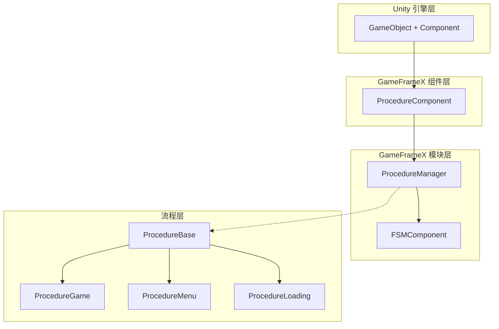
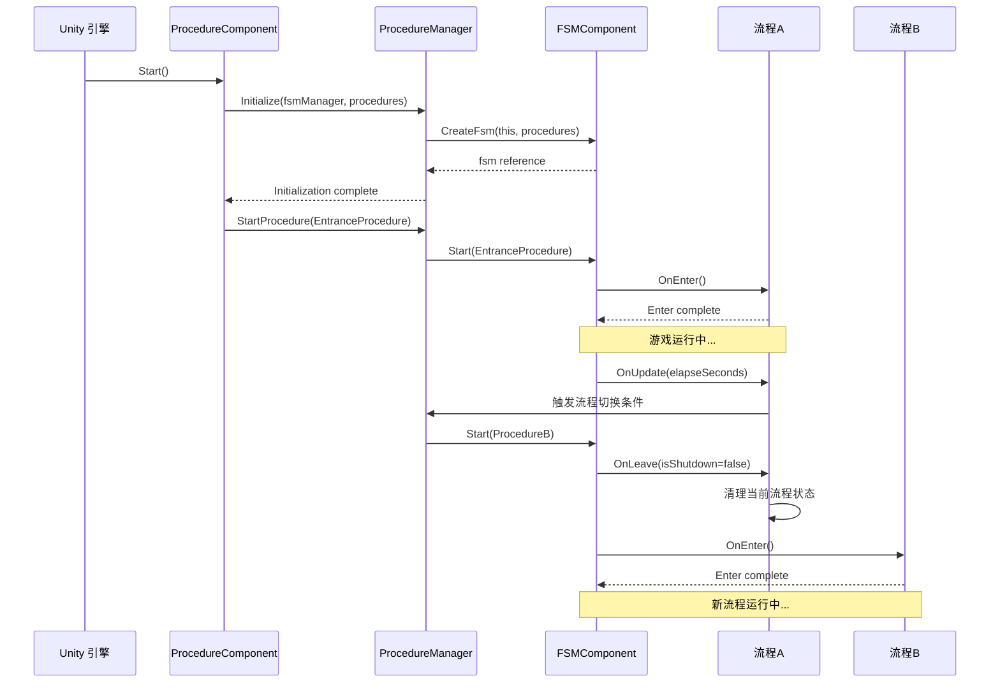

# Features

GameFrameX Procedure 流程Manages组件为 Unity 游戏provides了一套完整的游戏流程状态Manages解决方案，supportsthrough有限状态机（FSM）Manages游戏的各个阶段。

## 概述

Procedure 流程Manages组件是 GameFrameX 框架的核心模块之一，专门used forManages游戏的业务流程和状态切换。该组件基于有限状态机（FSM）设计，允许开发者将游戏划分为多个独立的流程阶段，如start流程、load流程、主菜单流程、游戏流程、pause流程和结束流程等。

每个流程都是一个独立的状态，拥有完整的生命周期Manages，includingInitialize、进入、update、离开和destroy等阶段。这种设计使得Game Logic更加模块化，便于维护和扩展，同时也为团队协作provides了清晰的分工边界。

## Core Features

### 流程状态Manages

组件provides了完整的流程状态Manages能力，supports在Game Runtime动态切换不同的流程状态。开发者可以through简单的 API 调用Implements从load界面到游戏主菜单、再到具体游戏玩法的平滑过渡。流程Manages器维护了所有可用流程的引用，并provides了查询当前流程、get流程持续时间等实用功能。

```csharp
// 检查是否存在指定流程
bool hasProcedure = procedureComponent.HasProcedure<ProcedureGame>();

// 获取当前正在执行的流程
ProcedureBase current = procedureComponent.CurrentProcedure;

// 获取当前流程已持续的时间
float elapsedTime = procedureComponent.CurrentProcedureTime;
```

> Source: [ProcedureComponent.cs](https://github.com/GameFrameX/com.gameframex.unity.procedure/blob/main/Runtime/Procedure/ProcedureComponent.cs#L114-L147)

### 自动流程Initialize

组件在游戏start时自动complete所有流程的Creates和Initialize工作。开发者只需要在 Unity Editor中configuration好可用的流程Type，组件会自动Uses反射机制Create Procedure Instance，并在游戏帧loadcomplete后自动Start Entrance Procedure。这种设计大大简化了游戏的start逻辑，开发者可以专注于业务逻辑的Implements。

```csharp
// ProcedureComponent 在 Start 方法中自动完成流程初始化
private IEnumerator Start()
{
    ProcedureBase[] procedures = new ProcedureBase[m_AvailableProcedureTypeNames.Length];
    for (int i = 0; i < m_AvailableProcedureTypeNames.Length; i++)
    {
        Type procedureType = Utility.Assembly.GetType(m_AvailableProcedureTypeNames[i]);
        procedures[i] = (ProcedureBase)Activator.CreateInstance(procedureType);
    }
    m_ProcedureManager.Initialize(GameFrameworkEntry.GetModule<IFsmManager>(), procedures);
    yield return new WaitForEndOfFrame();
    m_ProcedureManager.StartProcedure(m_EntranceProcedure.GetType());
}
```

> Source: [ProcedureComponent.cs](https://github.com/GameFrameX/com.gameframex.unity.procedure/blob/main/Runtime/Procedure/ProcedureComponent.cs#L71-L107)

### 流程生命周期钩子

每个Custom Procedures都可以through重写基类Method来Implements特定的业务逻辑。组件provides了完整的生命周期钩子，覆盖了流程从Creates到destroy的全过程。这些钩子including：`OnInit`（Initialize时调用）、`OnEnter`（Enter Procedure时调用）、`OnUpdate`（每帧update时调用）、`OnFixedUpdate`（固定帧率update时调用）、`OnLeave`（离开流程时调用）和`OnDestroy`（流程destroy时调用）。

```csharp
public abstract class ProcedureBase : FsmState<IProcedureManager>
{
    // 状态初始化时调用
    protected override void OnInit(IFsm<IProcedureManager> procedureOwner) { }

    // 进入状态时调用
    protected override void OnEnter(IFsm<IProcedureManager> procedureOwner) { }

    // 状态轮询时调用
    protected override void OnUpdate(IFsm<IProcedureManager> procedureOwner, float elapseSeconds, float realElapseSeconds) { }

    // 固定帧率更新时调用
    protected override void OnFixedUpdate(IFsm<IProcedureManager> procedureOwner, float elapseSeconds, float realElapseSeconds) { }

    // 离开状态时调用
    protected override void OnLeave(IFsm<IProcedureManager> procedureOwner, bool isShutdown) { }

    // 状态销毁时调用
    protected override void OnDestroy(IFsm<IProcedureManager> procedureOwner) { }
}
```

> Source: [ProcedureBase.cs](https://github.com/GameFrameX/com.gameframex.unity.procedure/blob/main/Runtime/Procedure/ProcedureBase.cs#L16-L76)

### 流程查询与get

provides了灵活的程序化查询接口，supportsthroughType或Type名称check流程Whether exists，andget特定流程的实例引用。这些功能使得游戏代码可以在运行时动态与流程系统交互，for example在非流程类中check当前游戏状态或get特定流程进行数据交换。

```csharp
// 通过泛型方法检查和获取流程
if (procedureComponent.HasProcedure<ProcedureMenu>())
{
    var menuProcedure = procedureComponent.GetProcedure<ProcedureMenu>();
}

// 通过 Type 对象检查和获取流程
Type menuType = typeof(ProcedureMenu);
if (procedureComponent.HasProcedure(menuType))
{
    var menuProcedure = (ProcedureMenu)procedureComponent.GetProcedure(menuType);
}
```

> Source: [IProcedureManager.cs](https://github.com/GameFrameX/com.gameframex.unity.procedure/blob/main/Runtime/Procedure/IProcedureManager.cs#L47-L73)

### Edit器可视化configuration

组件provides了自定义 Unity Editorcheck器，supports在 Inspector 面板中直观地configuration可用流程列表和入口流程。through勾选框可以方便地选择需要contains在流程系统中的流程Type，并through下拉菜单set游戏start时的首个流程。运行状态下，check器还会显示当前正在执行的流程名称，便于debug。

```csharp
// 编辑器检查器核心逻辑
foreach (string procedureTypeName in m_ProcedureTypeNames)
{
    bool selected = m_CurrentAvailableProcedureTypeNames.Contains(procedureTypeName);
    if (selected != EditorGUILayout.ToggleLeft(procedureTypeName, selected))
    {
        // 处理流程选择状态变更
    }
}

// 运行状态下显示当前流程
if (EditorApplication.isPlaying)
{
    EditorGUILayout.LabelField("Current Procedure", t.CurrentProcedure == null ? "None" : t.CurrentProcedure.GetType().ToString());
}
```

> Source: [ProcedureComponentInspector.cs](https://github.com/GameFrameX/com.gameframex.unity.procedure/blob/main/Editor/Inspector/ProcedureComponentInspector.cs#L46-L96)

## 系统架构



如上图所示，系统adopts分层Architecture Design。`ProcedureComponent` 作为 Unity Component Layer，responsible for与 Unity 引擎交互并暴露公共接口。`ProcedureManager` 作为核心模块，responsible for实际的流程Manages逻辑，并Depends on于 `FSMComponent` provides的有限状态机功能。`ProcedureBase` 是Base class for all custom procedures，provides了生命周期的统一抽象。

## 流程切换机制



流程切换由 FSM 组件统一Manages。当调用 `StartProcedure` Method时，FSM 会先触发当前流程的 `OnLeave` 回调，执行cleanup工作，然后触发目标流程的 `OnEnter` 回调，completeInitialize。这种设计ensure了流程切换时的状态一致性，避免了资源泄漏和数据混乱。

## 典型Uses场景

### 游戏start流程

典型的游戏start流程通常contains多个阶段：资源load、数据Initialize、configurationread、登录verify等。每个阶段都可以作为一个独立的流程Implements，through流程Manages器按sequential切换。这种设计使得start逻辑清晰可控，也便于在每个阶段显示不同的load界面。

### 游戏状态Manages

在游戏进行过程中，可以Uses流程系统Manages不同的游戏状态。for example：游戏准备状态、游戏中状态、游戏pause状态、游戏结算状态等。流程之间的切换条件可以是玩家操作、计时器到期、或者某些游戏事件的触发。

### 场景切换Manages

当游戏需要在不同场景之间切换时，流程系统可以很好地协调load和Initialize工作。for example：从主菜单进入游戏场景时，可以先切换到load流程，显示load进度条，后台complete场景资源load和Initialize，complete后再切换到游戏流程。

## Dependencies

该组件Depends on于 GameFrameX 框架的其他核心模块：

| Depends on组件 | Description |
|---------|------|
| FSMComponent | provides有限状态机功能，used forImplements流程的状态convert |
| GameFrameworkEntry | 框架入口，used forget和register各模块 |
| GameFrameworkComponent | 组件基类，provides组件通用功能 |
| GameFrameworkModule | 模块基类，provides模块通用功能 |

## Platform Support

该组件基于 Unity 引擎开发，supports以下平台：

- **iOS**：Uses IL2CPP 或 Mono 脚本后端
- **Android**：Uses IL2CPP 或 Mono 脚本后端
- **Windows**：Editor 和独立运行版本
- **macOS**：Editor 和独立运行版本
- **Linux**：独立运行版本
- **WebGL**：基于 WebGL 构建目标

## Notes

1. **Procedure BaseInherits**：所有Custom Procedures必须Inherits自 `ProcedureBase` 基类
2. **入口流程configuration**：必须在 Inspector 中configuration入口流程，否则游戏无法正常start
3. **流程Typeregister**：需要在 `m_AvailableProcedureTypeNames` 数组中add所有可用的流程Type
4. **单组件限制**：同一个 GameObject 上只能add一个 `ProcedureComponent`（由 `[DisallowMultipleComponent]` Property限制）
5. **FSM Depends on**：组件正常工作需要先正确configuration和Initialize FSMComponent

## Related Links

- [Plugin Introduction](./1-overview.introduction) - 了解组件的基本概念和Uses前提
- [Installation Guide](./2-installation) - 详细的installation和configuration步骤
- [ProcedureComponent](./3-core-concepts.procedure-component) - 组件的详细 API 文档
- [ProcedureBase](./3-core-concepts.procedure-base) - Procedure Base的Detailed Description
- [IProcedureManager](./3-core-concepts.iprocedure-manager) - 流程Manages器接口
- [ProcedureManager](./3-core-concepts.procedure-manager) - 流程Manages器Implements
- [Custom Procedures](./4-custom-procedures) - 如何CreatesCustom Procedures
- [Edit器Uses](./5-editor-usage) - Edit器configuration指南
