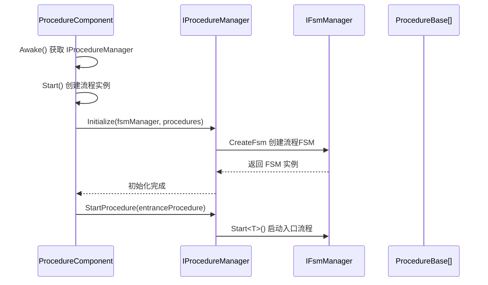
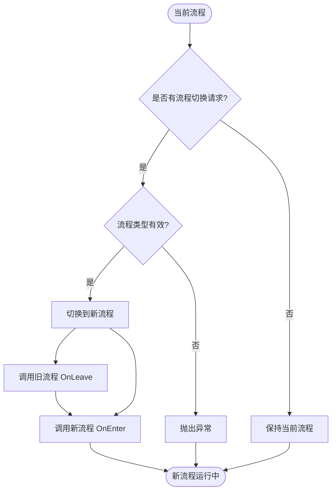

# IProcedureManager

流程Manages器接口，定义了流程Manages的基本操作，used forManages游戏中的各种流程状态convert。

## 概述

IProcedureManager 是 GameFrameX 流程系统的核心接口，responsible forManages游戏中的各种流程（如登录流程、主菜单流程、游戏流程等）。它基于有限状态机（FSM）模式Implements，provides了流程的Initialize、切换、查询等功能。

**设计意图：**
- provides统一的流程Manages接口，屏蔽底层Implements细节
- 基于 FSM 模式Implements，ensure流程状态convert的可靠性和可追踪性
- supports泛型和非泛型两种 API，满足不同的Uses场景

## 架构

```mermaid
flowchart TD
    subgraph External["外部调用者"]
        User[用户代码]
    end

    subgraph Component["Unity组件层"]
        PC[ProcedureComponent]
    end

    subgraph Interface["接口层"]
        IPM[IProcedureManager]
    end

    subgraph Implementation["实现层"]
        PM[ProcedureManager]
    end

    subgraph FSM["FSM子系统"]
        FSM[IFsmManager]
        FSMState[IFsm&lt;IProcedureManager&gt;]
    end

    subgraph Procedure["流程层"]
        PB1[ProcedureBase - 登录流程]
        PB2[ProcedureBase - 主菜单流程]
        PB3[ProcedureBase - 游戏流程]
    end

    User --> PC
    PC --> IPM
    IPM <|.. PM
    PM --> FSM
    FSM --> FSMState
    FSMState --> PB1
    FSMState --> PB2
    FSMState --> PB3
```

**架构Description：**

| 组件 | Responsibility |
|------|------|
| **ProcedureComponent** | Unity Component，作为入口点get IProcedureManager 实例 |
| **IProcedureManager** | 定义流程Manages的公共接口 |
| **ProcedureManager** | 接口的具体Implements，内部Uses FSM Manages流程状态 |
| **IFsmManager** | 有限状态机Manages器，由外部注入 |
| **ProcedureBase** | 所有具体流程的基类，表示一个流程状态 |

## 核心流程

### Initialize流程



### 流程切换流程



## API Reference

### Property

#### `CurrentProcedure: ProcedureBase`

get当前正在执行的流程实例。

**返回：** 当前流程对象，如果未Initialize则抛出Exception

---

#### `CurrentProcedureTime: float`

get当前流程已持续的时间（秒）。

**返回：** 流程持续时间，如果未Initialize则抛出Exception

---

### Method

### `Initialize(fsmManager: IFsmManager, procedures: ProcedureBase[]): void`

Initialize流程Manages器。

**Parameters：**
- `fsmManager` (IFsmManager): 有限状态机Manages器，不能为空
- `procedures` (params ProcedureBase[]): 要Manages的流程数组

**Description：** 
- 必须在调用其他Method之前调用此Method
- 该Method会Creates一个内部 FSM 来Manages所有流程状态

> Source: [IProcedureManager.cs](https://github.com/GameFrameX/com.gameframex.unity.procedure/blob/main/Runtime/Procedure/IProcedureManager.cs#L28-L33)

---

### `StartProcedure<T>(): void` (泛型版本)

开始指定Type的流程。

**TypeParameters：**
- `T`: 要开始的流程Type，必须Inherits自 ProcedureBase

**Description：**
- 泛型版本provides编译时Typecheck
- 如果流程Manages器未Initialize，抛出 GameFrameworkException

> Source: [IProcedureManager.cs](https://github.com/GameFrameX/com.gameframex.unity.procedure/blob/main/Runtime/Procedure/IProcedureManager.cs#L35-L39)

---

### `StartProcedure(procedureType: Type): void` (非泛型版本)

开始指定Type的流程。

**Parameters：**
- `procedureType` (Type): 要开始的流程Type

**Description：**
- 非泛型版本supports运行时动态指定流程Type
- 如果流程Manages器未Initialize，抛出 GameFrameworkException

> Source: [IProcedureManager.cs](https://github.com/GameFrameX/com.gameframex.unity.procedure/blob/main/Runtime/Procedure/IProcedureManager.cs#L41-L45)

---

### `HasProcedure<T>(): bool` (泛型版本)

Check if exists指定Type的流程。

**TypeParameters：**
- `T`: 要check的流程Type

**返回：** Whether exists该流程

> Source: [IProcedureManager.cs](https://github.com/GameFrameX/com.gameframex.unity.procedure/blob/main/Runtime/Procedure/IProcedureManager.cs#L47-L52)

---

### `HasProcedure(procedureType: Type): bool` (非泛型版本)

Check if exists指定Type的流程。

**Parameters：**
- `procedureType` (Type): 要check的流程Type

**返回：** Whether exists该流程

> Source: [IProcedureManager.cs](https://github.com/GameFrameX/com.gameframex.unity.procedure/blob/main/Runtime/Procedure/IProcedureManager.cs#L54-L59)

---

### `GetProcedure<T>(): ProcedureBase` (泛型版本)

get指定Type的流程实例。

**TypeParameters：**
- `T`: 要get的流程Type

**返回：** 流程实例，如果不存在则抛出Exception

> Source: [IProcedureManager.cs](https://github.com/GameFrameX/com.gameframex.unity.procedure/blob/main/Runtime/Procedure/IProcedureManager.cs#L61-L66)

---

### `GetProcedure(procedureType: Type): ProcedureBase` (非泛型版本)

get指定Type的流程实例。

**Parameters：**
- `procedureType` (Type): 要get的流程Type

**返回：** 流程实例，如果不存在则抛出Exception

> Source: [IProcedureManager.cs](https://github.com/GameFrameX/com.gameframex.unity.procedure/blob/main/Runtime/Procedure/IProcedureManager.cs#L68-L73)

---

## Usage Examples

### 基本Uses

through ProcedureComponent get IProcedureManager 并切换流程：

```csharp
// 获取流程组件
var procedureComponent = UnityEngine.Object.FindObjectOfType<ProcedureComponent>();

// 获取当前流程
var currentProcedure = procedureComponent.CurrentProcedure;

// 获取流程管理器
var procedureManager = procedureComponent.Procedure;

// 检查是否存在某个流程
if (procedureManager.HasProcedure<MenuProcedure>())
{
    // 切换到菜单流程
    procedureManager.StartProcedure<MenuProcedure>();
}
```

> Source: [ProcedureComponent.cs](https://github.com/GameFrameX/com.gameframex.unity.procedure/blob/main/Runtime/Procedure/ProcedureComponent.cs#L42-L52)

### Initialize流程

IProcedureManager 的Initialize由 ProcedureComponent 自动complete：

```csharp
// ProcedureComponent.Start() 方法中
IEnumerator Start()
{
    // ... 创建流程实例 ...
    
    // 初始化流程管理器
    m_ProcedureManager.Initialize(
        GameFrameworkEntry.GetModule<IFsmManager>(), 
        procedures
    );
    
    yield return new WaitForEndOfFrame();
    
    // 启动入口流程
    m_ProcedureManager.StartProcedure(m_EntranceProcedure.GetType());
}
```

> Source: [ProcedureComponent.cs](https://github.com/GameFrameX/com.gameframex.unity.procedure/blob/main/Runtime/Procedure/ProcedureComponent.cs#L102-L106)

## Notes

1. **Initializesequential**：必须在 IFsmManager Initialize之后才能调用 Initialize Method
2. **入口流程**：需要指定一个入口流程（Entrance Procedure），游戏start时自动开始执行
3. **Exceptionprocess**：大部分Method在未Initialize时会抛出 GameFrameworkException
4. **Thread Safety**：流程Manages器不是Thread Safety的，应在主线程中操作
5. **FSM Depends on**：IProcedureManager 内部Depends on IFsmManager，需要ensure FsmModule 已register

## Related Links

- [ProcedureComponent](./3-core-concepts.procedure-component) - Procedure Component
- [ProcedureBase](./3-core-concepts.procedure-base) - Procedure Base
- [ProcedureManager](./3-core-concepts.procedure-manager) - 流程Manages器Implements
- [Custom Procedures](./4-custom-procedures) - 如何CreatesCustom Procedures
