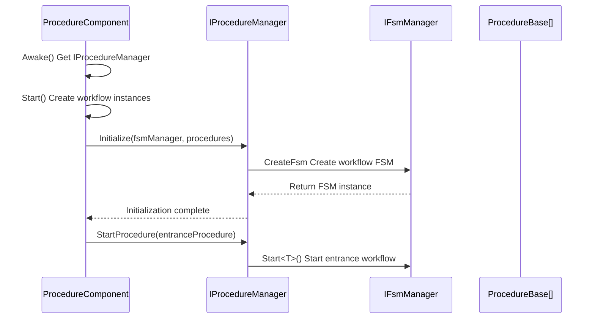
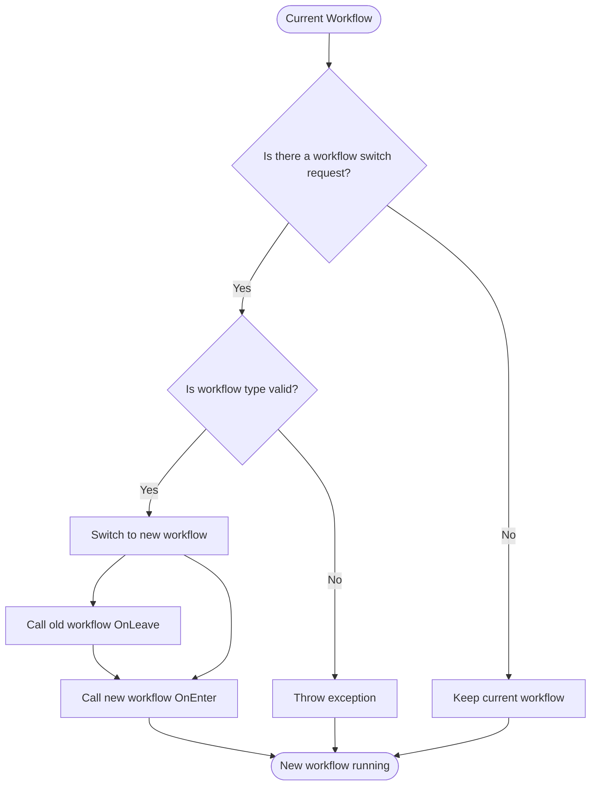

# IProcedureManager

Workflow manager interface, defining basic operations for workflow management, used for managing various workflow state transitions in games.

## Overview

IProcedureManager is the core interface of the GameFrameX workflow system, responsible for managing various workflows in the game (such as login workflow, main menu workflow, game workflow, etc.). It is implemented based on the Finite State Machine (FSM) pattern, providing workflow initialization, switching, and query functionality.

**Design Intent:**
- Provides a unified workflow management interface, hiding underlying implementation details
- Implemented based on FSM pattern, ensuring reliability and traceability of workflow state transitions
- Supports both generic and non-generic APIs to meet different usage scenarios

## Architecture

```mermaid
flowchart TD
    subgraph External["External Callers"]
        User[User Code]
    end

    subgraph Component["Unity Component Layer"]
        PC[ProcedureComponent]
    end

    subgraph Interface["Interface Layer"]
        IPM[IProcedureManager]
    end

    subgraph Implementation["Implementation Layer"]
        PM[ProcedureManager]
    end

    subgraph FSM["FSM Subsystem"]
        FSM[IFsmManager]
        FSMState[IFsm&lt;IProcedureManager&gt;]
    end

    subgraph Procedure["Workflow Layer"]
        PB1[ProcedureBase - Login Workflow]
        PB2[ProcedureBase - Main Menu Workflow]
        PB3[ProcedureBase - Game Workflow]
    end

    User --> PC
    PC --> IPM
    IPM <|.. PM
    PM --> FSM
    FSM --> FSMState
    FSMState --> PB1
    FSMState --> PB2
    FSMState --> PB3
```

**Architecture Description:**

| Component | Responsibility |
|------|------|
| **ProcedureComponent** | Unity Component, serving as entry point to get IProcedureManager instance |
| **IProcedureManager** | Defines public interface for workflow management |
| **ProcedureManager** | Concrete implementation of the interface, internally uses FSM to manage workflow states |
| **IFsmManager** | Finite state machine manager, injected from external |
| **ProcedureBase** | Base class for all concrete workflows, representing a workflow state |

## Core Flow

### Initialization Flow



### Workflow Switching Flow



## API Reference

### Property

#### `CurrentProcedure: ProcedureBase`

Gets the currently executing workflow instance.

**Returns:** Current workflow object, throws exception if not initialized

---

#### `CurrentProcedureTime: float`

Gets the time the current workflow has been running (seconds).

**Returns:** Workflow duration, throws exception if not initialized

---

### Method

### `Initialize(fsmManager: IFsmManager, procedures: ProcedureBase[]): void`

Initializes the workflow manager.

**Parameters:**
- `fsmManager` (IFsmManager): Finite state machine manager, cannot be null
- `procedures` (params ProcedureBase[]): Workflow array to manage

**Description:**
- This method must be called before calling other methods
- This method creates an internal FSM to manage all workflow states

> Source: [IProcedureManager.cs](https://github.com/GameFrameX/com.gameframex.unity.procedure/blob/main/Runtime/Procedure/IProcedureManager.cs#L28-L33)

---

### `StartProcedure<T>(): void` (Generic Version)

Starts the specified type workflow.

**TypeParameters:**
- `T`: Workflow type to start, must inherit from ProcedureBase

**Description:**
- Generic version provides compile-time type checking
- Throws GameFrameworkException if workflow manager is not initialized

> Source: [IProcedureManager.cs](https://github.com/GameFrameX/com.gameframex.unity.procedure/blob/main/Runtime/Procedure/IProcedureManager.cs#L35-L39)

---

### `StartProcedure(procedureType: Type): void` (Non-Generic Version)

Starts the specified type workflow.

**Parameters:**
- `procedureType` (Type): Workflow type to start

**Description:**
- Non-generic version supports runtime dynamic workflow type specification
- Throws GameFrameworkException if workflow manager is not initialized

> Source: [IProcedureManager.cs](https://github.com/GameFrameX/com.gameframex.unity.procedure/blob/main/Runtime/Procedure/IProcedureManager.cs#L41-L45)

---

### `HasProcedure<T>(): bool` (Generic Version)

Checks if a workflow of the specified type exists.

**TypeParameters:**
- `T`: Workflow type to check

**Returns:** Whether the workflow exists

> Source: [IProcedureManager.cs](https://github.com/GameFrameX/com.gameframex.unity.procedure/blob/main/Runtime/Procedure/IProcedureManager.cs#L47-L52)

---

### `HasProcedure(procedureType: Type): bool` (Non-Generic Version)

Checks if a workflow of the specified type exists.

**Parameters:**
- `procedureType` (Type): Workflow type to check

**Returns:** Whether the workflow exists

> Source: [IProcedureManager.cs](https://github.com/GameFrameX/com.gameframex.unity.procedure/blob/main/Runtime/Procedure/IProcedureManager.cs#L54-L59)

---

### `GetProcedure<T>(): ProcedureBase` (Generic Version)

Gets the workflow instance of the specified type.

**TypeParameters:**
- `T`: Workflow type to get

**Returns:** Workflow instance, throws exception if not exists

> Source: [IProcedureManager.cs](https://github.com/GameFrameX/com.gameframex.unity.procedure/blob/main/Runtime/Procedure/IProcedureManager.cs#L61-L66)

---

### `GetProcedure(procedureType: Type): ProcedureBase` (Non-Generic Version)

Gets the workflow instance of the specified type.

**Parameters:**
- `procedureType` (Type): Workflow type to get

**Returns:** Workflow instance, throws exception if not exists

> Source: [IProcedureManager.cs](https://github.com/GameFrameX/com.gameframex.unity.procedure/blob/main/Runtime/Procedure/IProcedureManager.cs#L68-L73)

---

## Usage Examples

### Basic Usage

Get IProcedureManager through ProcedureComponent and switch workflows:

```csharp
// Get workflow component
var procedureComponent = UnityEngine.Object.FindObjectOfType<ProcedureComponent>();

// Get current workflow
var currentProcedure = procedureComponent.CurrentProcedure;

// Get workflow manager
var procedureManager = procedureComponent.Procedure;

// Check if a workflow exists
if (procedureManager.HasProcedure<MenuProcedure>())
{
    // Switch to menu workflow
    procedureManager.StartProcedure<MenuProcedure>();
}
```

> Source: [ProcedureComponent.cs](https://github.com/GameFrameX/com.gameframex.unity.procedure/blob/main/Runtime/Procedure/ProcedureComponent.cs#L42-L52)

### Initialize Workflow

IProcedureManager initialization is automatically completed by ProcedureComponent:

```csharp
// In ProcedureComponent.Start() method
IEnumerator Start()
{
    // ... Create workflow instances ...

    // Initialize workflow manager
    m_ProcedureManager.Initialize(
        GameFrameworkEntry.GetModule<IFsmManager>(),
        procedures
    );

    yield return new WaitForEndOfFrame();

    // Start entrance workflow
    m_ProcedureManager.StartProcedure(m_EntranceProcedure.GetType());
}
```

> Source: [ProcedureComponent.cs](https://github.com/GameFrameX/com.gameframex.unity.procedure/blob/main/Runtime/Procedure/ProcedureComponent.cs#L102-L106)

## Notes

1. **Initialization Sequence**: Initialize method can only be called after IFsmManager is initialized
2. **Entrance Workflow**: An entrance workflow (Entrance Procedure) needs to be specified, it automatically starts executing when the game starts
3. **Exception Handling**: Most methods throw GameFrameworkException when not initialized
4. **Thread Safety**: Workflow manager is not thread-safe, should be operated in the main thread
5. **FSM Dependency**: IProcedureManager internally depends on IFsmManager, need to ensure FsmModule is registered

## Related Links

- [ProcedureComponent](./06.procedure-component.md) - Procedure Component
- [ProcedureBase](./06.procedure-base.md) - Procedure Base
- [ProcedureManager](./07.procedure-manager.md) - Workflow manager implementation
- [Custom Procedures](./09.custom-procedures.md) - How to create custom procedures