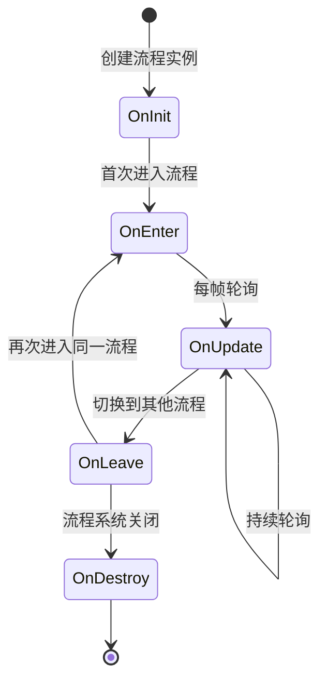

# ProcedureBase

Procedure Base，used for定义游戏中的各个流程状态。

## 概述

`ProcedureBase` 是 GameFrameX 流程Manages系统的核心抽象类，Inherits自 `FsmState<IProcedureManager>`。它provides了游戏流程生命周期的完整模板Method，开发者可以throughInherits该类来Creates自定义的游戏流程，如start流程、主菜单流程、游戏流程、pause流程、结算流程等。

**设计意图：**
GameFrameX 的流程Manages系统adopts有限状态机（FSM）模式设计。`ProcedureBase` 作为状态基类，为每个流程状态定义了一套标准的生命周期钩子Method。这种设计使得游戏流程的Manages变得清晰、可控，便于在不同流程之间平滑切换，同时supports流程间的数据传递和状态保持。

**Core Features：**
- 完整的流程生命周期Manages（Initialize → 进入 → update → 离开 → destroy）
- supports帧update（Update）和固定帧update（FixedUpdate）
- 基于有限状态机的流程切换机制
- 与 ProcedureManager 无缝集成

## 架构

```mermaid
graph TD
    subgraph GameFrameX 核心模块
        FsmState[FsmState&lt;IProcedureManager&gt;]
    end

    subgraph Procedure 流程模块
        ProcedureBase["ProcedureBase<br/>(抽象基类)"]
        IProcedureManager[IProcedureManager<br/>(接口)]
        ProcedureManager["ProcedureManager<br/>(流程管理器)"]
    end

    subgraph Unity 集成层
        ProcedureComponent["ProcedureComponent<br/>(流程组件)"]
    end

    subgraph 自定义流程
        CustomProcedure1["自定义流程 A<br/>(继承 ProcedureBase)"]
        CustomProcedure2["自定义流程 B<br/>(继承 ProcedureBase)"]
        CustomProcedureN["自定义流程 N<br/>(继承 ProcedureBase)"]
    end

    FsmState <|-- ProcedureBase
    ProcedureBase <|-- CustomProcedure1
    ProcedureBase <|-- CustomProcedure2
    ProcedureBase <|-- CustomProcedureN
    
    IProcedureManager <|.. ProcedureManager
    ProcedureManager --> ProcedureBase
    ProcedureComponent --> ProcedureManager
```

**架构Description：**

| 组件 | 角色 | Responsibility |
|------|------|------|
| `FsmState<IProcedureManager>` | 基类 | provides有限状态机的基础功能 |
| `ProcedureBase` | Abstract Base Class | 定义流程的标准生命周期模板 |
| `IProcedureManager` | 接口 | 定义流程Manages器的标准操作 |
| `ProcedureManager` | Implements类 | Manages和调度所有流程状态 |
| `ProcedureComponent` | Unity组件 | 在 Unity 环境中Initialize流程系统 |
| Custom Procedures | 具体Implements | Inherits ProcedureBase Implements具体业务逻辑 |

## 生命周期



**生命周期阶段Description：**

| 阶段 | Method | 调用时机 | 典型Usage |
|------|------|----------|----------|
| Initialize | `OnInit` | 流程实例Creates后首次进入前 | Initialize流程数据、loadconfiguration |
| 进入 | `OnEnter` | Enter Procedure状态时 | 准备流程资源、显示界面 |
| update | `OnUpdate` | 每帧调用（逻辑帧） | 业务逻辑process、状态check |
| 固定update | `OnFixedUpdate` | 固定时间间隔调用 | 物理相关逻辑 |
| 离开 | `OnLeave` | 离开流程状态时 | release临时资源、save状态 |
| destroy | `OnDestroy` | Procedure System Shutdown时 | cleanup所有资源 |

## 核心Method

### OnInit - 流程Initialize

```csharp
protected override void OnInit(IFsm<IProcedureManager> procedureOwner)
```
> Source: [ProcedureBase.cs](https://github.com/GameFrameX/com.gameframex.unity.procedure/blob/main/Runtime/Procedure/ProcedureBase.cs#L22-L25)

在流程状态首次Initialize时调用。此Method在流程实例Creates后、First Entry to Procedure前被调用。

**设计意图：**
provides一次性的Initialize机会，used forload流程所需的静态数据、configurationinformation或预Creates游戏对象。此Method在整个流程生命周期中只会被调用一次。

**Parameters：**
- `procedureOwner` (IFsm<IProcedureManager>)：流程持有者的有限状态机

---

### OnEnter - Enter Procedure

```csharp
protected override void OnEnter(IFsm<IProcedureManager> procedureOwner)
```
> Source: [ProcedureBase.cs](https://github.com/GameFrameX/com.gameframex.unity.procedure/blob/main/Runtime/Procedure/ProcedureBase.cs#L31-L34)

当流程状态从其他状态切换到当前状态时调用。

**设计意图：**
每次Enter Procedure时都会调用，适合used for准备流程所需的资源、显示对应的 UI 界面、开始特定的声音或动画等。每次流程被激活时都会触发。

**Parameters：**
- `procedureOwner` (IFsm<IProcedureManager>)：流程持有者的有限状态机

---

### OnUpdate - 流程update

```csharp
protected override void OnUpdate(IFsm<IProcedureManager> procedureOwner, float elapseSeconds, float realElapseSeconds)
```
> Source: [ProcedureBase.cs](https://github.com/GameFrameX/com.gameframex.unity.procedure/blob/main/Runtime/Procedure/ProcedureBase.cs#L42-L45)

在流程状态处于活动状态时每帧调用。

**设计意图：**
这是Implements流程核心业务逻辑的主要钩子。可以在这里检测流程切换条件、update游戏状态、process用户输入等。

**Parameters：**
- `procedureOwner` (IFsm<IProcedureManager>)：流程持有者的有限状态机
- `elapseSeconds` (float)：逻辑流逝时间，以秒为单位（受时间缩放影响）
- `realElapseSeconds` (float)：真实流逝时间，以秒为单位（不受时间缩放影响）

---

### OnFixedUpdate - 固定频率update

```csharp
protected override void OnFixedUpdate(IFsm<IProcedureManager> procedureOwner, float elapseSeconds, float realElapseSeconds)
```
> Source: [ProcedureBase.cs](https://github.com/GameFrameX/com.gameframex.unity.procedure/blob/main/Runtime/Procedure/ProcedureBase.cs#L53-L56)

以固定时间间隔调用，used for物理相关的逻辑process。

**设计意图：**
Unity 的 FixedUpdate 以固定时间间隔（默认 0.02 秒）调用，适合process物理引擎相关逻辑，ensure逻辑的确定性。

**Parameters：**
- `procedureOwner` (IFsm<IProcedureManager>)：流程持有者的有限状态机
- `elapseSeconds` (float)：逻辑流逝时间，以秒为单位
- `realElapseSeconds` (float)：真实流逝时间，以秒为单位

---

### OnLeave - 离开流程

```csharp
protected override void OnLeave(IFsm<IProcedureManager> procedureOwner, bool isShutdown)
```
> Source: [ProcedureBase.cs](https://github.com/GameFrameX/com.gameframex.unity.procedure/blob/main/Runtime/Procedure/ProcedureBase.cs#L63-L66)

当流程状态从当前状态切换到其他状态时调用。

**设计意图：**
used forcleanup当前流程的临时资源、save状态数据、隐藏 UI 界面等。注意：如果 `isShutdown` 为 true，表示是Closed整个流程系统而非切换流程。

**Parameters：**
- `procedureOwner` (IFsm<IProcedureManager>)：流程持有者的有限状态机
- `isShutdown` (bool)：是否是Closed状态机时触发

---

### OnDestroy - 流程destroy

```csharp
protected override void OnDestroy(IFsm<IProcedureManager> procedureOwner)
```
> Source: [ProcedureBase.cs](https://github.com/GameFrameX/com.gameframex.unity.procedure/blob/main/Runtime/Procedure/ProcedureBase.cs#L72-L75)

当流程状态被destroy时调用。

**设计意图：**
在整个Procedure System Shutdown时调用，used for执行最终的cleanup工作，release所有资源。这是流程生命周期的最后一个阶段。

**Parameters：**
- `procedureOwner` (IFsm<IProcedureManager>)：流程持有者的有限状态机

## Usage Examples

### 基本Custom Procedures

Creates一个简单的start流程：

```csharp
using GameFrameX.Procedure.Runtime;
using GameFrameX.Fsm.Runtime;

public class ProcedureLaunch : ProcedureBase
{
    protected override void OnInit(IFsm<IProcedureManager> procedureOwner)
    {
        base.OnInit(procedureOwner);
        // 初始化启动数据
    }

    protected override void OnEnter(IFsm<IProcedureManager> procedureOwner)
    {
        base.OnEnter(procedureOwner);
        // 显示启动界面
    }

    protected override void OnUpdate(IFsm<IProcedureManager> procedureOwner, float elapseSeconds, float realElapseSeconds)
    {
        base.OnUpdate(procedureOwner, elapseSeconds, realElapseSeconds);
        
        // 检查是否完成启动，可以切换到下一个流程
        // procedureOwner.Owner.StartProcedure<ProcedureMenu>();
    }

    protected override void OnLeave(IFsm<IProcedureManager> procedureOwner, bool isShutdown)
    {
        base.OnLeave(procedureOwner, isShutdown);
        // 隐藏启动界面
    }
}
```

### 流程切换示例

在流程中切换到另一个流程：

```csharp
protected override void OnUpdate(IFsm<IProcedureManager> procedureOwner, float elapseSeconds, float realElapseSeconds)
{
    base.OnUpdate(procedureOwner, elapseSeconds, realElapseSeconds);
    
    // 假设满足某个条件后切换到菜单流程
    if (someCondition)
    {
        // 获取流程管理器并启动下一个流程
        procedureOwner.Owner.StartProcedure<ProcedureMenu>();
    }
}
```

### get当前流程information

```csharp
// 在任意位置获取当前流程和持续时间
var procedureComponent = UnityEngine.Object.FindObjectOfType<ProcedureComponent>();
var currentProcedure = procedureComponent.CurrentProcedure;
var elapsedTime = procedureComponent.CurrentProcedureTime;
```

## 与其他组件的关系

| 组件 | 关系 | Description |
|------|------|------|
| ProcedureComponent | Uses | Unity Component，used forInitialize流程系统 |
| ProcedureManager | Manages | 实际Manages ProcedureBase 状态convert的类 |
| IProcedureManager | Implements | ProcedureManager Implements的接口 |
| FsmState | Inherits | 来自 GameFrameX.Fsm 的基类 |

## Troubleshooting

### Q: 为什么不直接在 Update 中process逻辑？

**A:** `ProcedureBase` provides了结构化的生命周期Method，这种设计：
- 使代码更清晰，每个阶段Responsibility明确
- 便于debug和维护
- supports状态的正确进入/退出process
- 与其他系统（如 UI 系统、资源系统）更好地集成

### Q: 如何在流程间传递数据？

**A:** 可以through以下方式：
1. Uses静态变量（不推荐，可能导致内存泄漏）
2. 将数据存储在独立的configuration类中，through `procedureOwner.Owner` get ProcedureManager Access
3. Uses游戏框架的数据库或Config System

### Q: OnInit 和 OnEnter 有什么区别？

**A:** 
- `OnInit`：只在流程实例Creates后调用一次，整个生命周期中不会再调用
- `OnEnter`：每次进入该流程状态时都会调用，可能被调用多次

## Related Links

- [ProcedureComponent](./3-core-concepts.procedure-component) - Procedure Component
- [IProcedureManager](./3-core-concepts.iprocedure-manager) - 流程Manages器接口
- [ProcedureManager](./3-core-concepts.procedure-manager) - 流程Manages器Implements
- [Custom Procedures](./4-custom-procedures) - CreatesCustom Procedures
