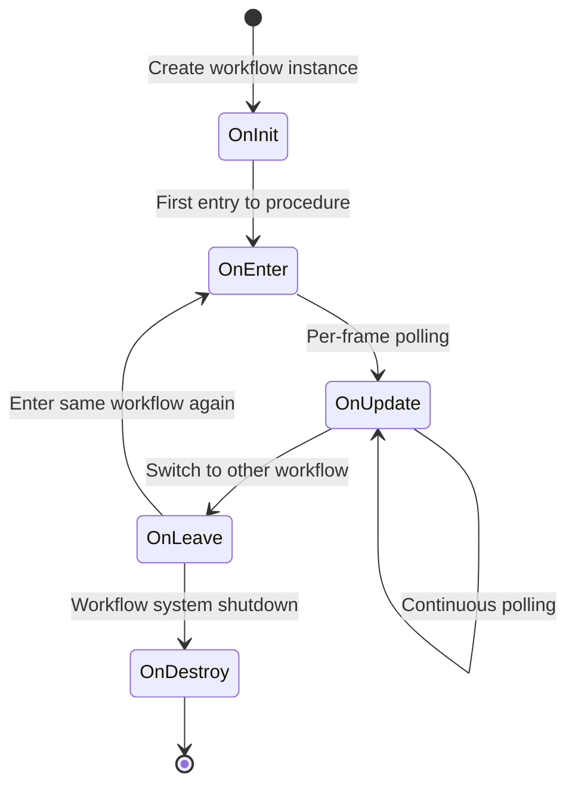

# ProcedureBase

Procedure Base class, used for defining various workflow states in games.

## Overview

`ProcedureBase` is the core abstract class of the GameFrameX workflow management system, inheriting from `FsmState<IProcedureManager>`. It provides a complete template of game workflow lifecycle methods. Developers can create custom game workflows by inheriting this class, such as startup workflow, main menu workflow, game workflow, pause workflow, settlement workflow, etc.

**Design Intent:**
The GameFrameX workflow management system adopts Finite State Machine (FSM) pattern design. `ProcedureBase` serves as the state base class, defining a set of standard lifecycle hook methods for each workflow state. This design makes game workflow management clear and controllable, facilitating smooth transitions between different workflows, while supporting data passing and state preservation between workflows.

**Core Features:**
- Complete workflow lifecycle management (Initialize → Enter → Update → Leave → Destroy)
- Supports frame update (Update) and fixed frame update (FixedUpdate)
- FSM-based workflow switching mechanism
- Seamless integration with ProcedureManager

## Architecture

```mermaid
graph TD
    subgraph GameFrameX Core Module
        FsmState[FsmState&lt;IProcedureManager&gt;]
    end

    subgraph Procedure Module
        ProcedureBase["ProcedureBase<br/>(Abstract Base Class)"]
        IProcedureManager[IProcedureManager<br/>(Interface)]
        ProcedureManager["ProcedureManager<br/>(Workflow Manager)"]
    end

    subgraph Unity Integration Layer
        ProcedureComponent["ProcedureComponent<br/>(Workflow Component)"]
    end

    subgraph Custom Workflows
        CustomProcedure1["Custom Workflow A<br/>(Inherits ProcedureBase)"]
        CustomProcedure2["Custom Workflow B<br/>(Inherits ProcedureBase)"]
        CustomProcedureN["Custom Workflow N<br/>(Inherits ProcedureBase)"]
    end

    FsmState <|-- ProcedureBase
    ProcedureBase <|-- CustomProcedure1
    ProcedureBase <|-- CustomProcedure2
    ProcedureBase <|-- CustomProcedureN

    IProcedureManager <|.. ProcedureManager
    ProcedureManager --> ProcedureBase
    ProcedureComponent --> ProcedureManager
```

**Architecture Description:**

| Component | Role | Responsibility |
|------|------|------|
| `FsmState<IProcedureManager>` | Base Class | Provides finite state machine basic functionality |
| `ProcedureBase` | Abstract Base Class | Defines standard lifecycle template for workflows |
| `IProcedureManager` | Interface | Defines standard operations for workflow manager |
| `ProcedureManager` | Implementation Class | Manages and schedules all workflow states |
| `ProcedureComponent` | Unity Component | Initializes workflow system in Unity environment |
| Custom Procedures | Concrete Implementation | Inherit ProcedureBase to implement specific business logic |

## Lifecycle



**Lifecycle Stage Description:**

| Stage | Method | Call Timing | Typical Usage |
|------|------|----------|----------|
| Initialize | `OnInit` | After workflow instance created, before first entry | Initialize workflow data, load configuration |
| Enter | `OnEnter` | When entering procedure state | Prepare workflow resources, display interface |
| Update | `OnUpdate` | Called every frame (logic frame) | Business logic processing, state checking |
| Fixed Update | `OnFixedUpdate` | Called at fixed time intervals | Physics-related logic |
| Leave | `OnLeave` | When leaving workflow state | Release temporary resources, save state |
| Destroy | `OnDestroy` | When Procedure System shuts down | Clean up all resources |

## Core Methods

### OnInit - Workflow Initialization

```csharp
protected override void OnInit(IFsm<IProcedureManager> procedureOwner)
```
> Source: [ProcedureBase.cs](https://github.com/GameFrameX/com.gameframex.unity.procedure/blob/main/Runtime/Procedure/ProcedureBase.cs#L22-L25)

Called when the workflow state is initialized for the first time. This method is called after the workflow instance is created and before the first entry to procedure.

**Design Intent:**
Provides a one-time initialization opportunity, used for loading static data, configuration information, or pre-creating game objects required by the workflow. This method is only called once during the entire workflow lifecycle.

**Parameters:**
- `procedureOwner` (IFsm<IProcedureManager>): Finite state machine of the workflow owner

---

### OnEnter - Enter Procedure

```csharp
protected override void OnEnter(IFsm<IProcedureManager> procedureOwner)
```
> Source: [ProcedureBase.cs](https://github.com/GameFrameX/com.gameframex.unity.procedure/blob/main/Runtime/Procedure/ProcedureBase.cs#L31-L34)

Called when the workflow state transitions from another state to the current state.

**Design Intent:**
Called every time a procedure is entered, suitable for preparing resources required by the workflow, displaying corresponding UI, starting specific sounds or animations, etc. Triggered every time a workflow is activated.

**Parameters:**
- `procedureOwner` (IFsm<IProcedureManager>): Finite state machine of the workflow owner

---

### OnUpdate - Workflow Update

```csharp
protected override void OnUpdate(IFsm<IProcedureManager> procedureOwner, float elapseSeconds, float realElapseSeconds)
```
> Source: [ProcedureBase.cs](https://github.com/GameFrameX/com.gameframex.unity.procedure/blob/main/Runtime/Procedure/ProcedureBase.cs#L42-L45)

Called every frame while the workflow state is active.

**Design Intent:**
This is the main hook for implementing the core business logic of the workflow. You can check workflow switching conditions, update game state, and process user input here.

**Parameters:**
- `procedureOwner` (IFsm<IProcedureManager>): Finite state machine of the workflow owner
- `elapseSeconds` (float): Logical elapsed time in seconds (affected by time scale)
- `realElapseSeconds` (float): Real elapsed time in seconds (not affected by time scale)

---

### OnFixedUpdate - Fixed Rate Update

```csharp
protected override void OnFixedUpdate(IFsm<IProcedureManager> procedureOwner, float elapseSeconds, float realElapseSeconds)
```
> Source: [ProcedureBase.cs](https://github.com/GameFrameX/com.gameframex.unity.procedure/blob/main/Runtime/Procedure/ProcedureBase.cs#L53-L56)

Called at fixed time intervals, used for physics-related logic processing.

**Design Intent:**
Unity's FixedUpdate is called at fixed time intervals (default 0.02 seconds), suitable for processing physics engine-related logic, ensuring logical determinism.

**Parameters:**
- `procedureOwner` (IFsm<IProcedureManager>): Finite state machine of the workflow owner
- `elapseSeconds` (float): Logical elapsed time in seconds
- `realElapseSeconds` (float): Real elapsed time in seconds

---

### OnLeave - Leave Workflow

```csharp
protected override void OnLeave(IFsm<IProcedureManager> procedureOwner, bool isShutdown)
```
> Source: [ProcedureBase.cs](https://github.com/GameFrameX/com.gameframex.unity.procedure/blob/main/Runtime/Procedure/ProcedureBase.cs#L63-L66)

Called when the workflow state transitions from the current state to another state.

**Design Intent:**
Used for cleaning up temporary resources of the current workflow, saving state data, hiding UI, etc. Note: If `isShutdown` is true, it means shutting down the entire workflow system rather than switching workflows.

**Parameters:**
- `procedureOwner` (IFsm<IProcedureManager>): Finite state machine of the workflow owner
- `isShutdown` (bool): Whether the state machine is being shut down

---

### OnDestroy - Workflow Destroy

```csharp
protected override void OnDestroy(IFsm<IProcedureManager> procedureOwner)
```
> Source: [ProcedureBase.cs](https://github.com/GameFrameX/com.gameframex.unity.procedure/blob/main/Runtime/Procedure/ProcedureBase.cs#L72-L75)

Called when the workflow state is destroyed.

**Design Intent:**
Called when the entire Procedure System shuts down, used for performing final cleanup work and releasing all resources. This is the last stage of the workflow lifecycle.

**Parameters:**
- `procedureOwner` (IFsm<IProcedureManager>): Finite state machine of the workflow owner

## Usage Examples

### Basic Custom Procedure

Create a simple startup workflow:

```csharp
using GameFrameX.Procedure.Runtime;
using GameFrameX.Fsm.Runtime;

public class ProcedureLaunch : ProcedureBase
{
    protected override void OnInit(IFsm<IProcedureManager> procedureOwner)
    {
        base.OnInit(procedureOwner);
        // Initialize startup data
    }

    protected override void OnEnter(IFsm<IProcedureManager> procedureOwner)
    {
        base.OnEnter(procedureOwner);
        // Display startup interface
    }

    protected override void OnUpdate(IFsm<IProcedureManager> procedureOwner, float elapseSeconds, float realElapseSeconds)
    {
        base.OnUpdate(procedureOwner, elapseSeconds, realElapseSeconds);

        // Check if startup is complete, can switch to next workflow
        // procedureOwner.Owner.StartProcedure<ProcedureMenu>();
    }

    protected override void OnLeave(IFsm<IProcedureManager> procedureOwner, bool isShutdown)
    {
        base.OnLeave(procedureOwner, isShutdown);
        // Hide startup interface
    }
}
```

### Workflow Switching Example

Switch to another workflow within a workflow:

```csharp
protected override void OnUpdate(IFsm<IProcedureManager> procedureOwner, float elapseSeconds, float realElapseSeconds)
{
    base.OnUpdate(procedureOwner, elapseSeconds, realElapseSeconds);

    // Assume switch to menu workflow after some condition is met
    if (someCondition)
    {
        // Get workflow manager and start next workflow
        procedureOwner.Owner.StartProcedure<ProcedureMenu>();
    }
}
```

### Get Current Workflow Information

```csharp
// Get current workflow and duration anywhere
var procedureComponent = UnityEngine.Object.FindObjectOfType<ProcedureComponent>();
var currentProcedure = procedureComponent.CurrentProcedure;
var elapsedTime = procedureComponent.CurrentProcedureTime;
```

## Relationship with Other Components

| Component | Relationship | Description |
|------|------|------|
| ProcedureComponent | Uses | Unity Component, used for initializing workflow system |
| ProcedureManager | Manages | Class that actually manages ProcedureBase state transitions |
| IProcedureManager | Implements | Interface implemented by ProcedureManager |
| FsmState | Inherits | Base class from GameFrameX.Fsm |

## Troubleshooting

### Q: Why not process logic directly in Update?

**A:** `ProcedureBase` provides structured lifecycle methods, this design:
- Makes code clearer, each stage has clear responsibility
- Easier to debug and maintain
- Supports correct enter/exit processing of states
- Better integration with other systems (like UI system, resource system)

### Q: How to pass data between workflows?

**A:** You can through the following methods:
1. Use static variables (not recommended, may cause memory leaks)
2. Store data in an independent configuration class, access through `procedureOwner.Owner` to get ProcedureManager
3. Use the game's database or Config System

### Q: What is the difference between OnInit and OnEnter?

**A:**
- `OnInit`: Only called once after the workflow instance is created, will not be called again during the lifecycle
- `OnEnter`: Called every time entering that workflow state, may be called multiple times

## Related Links

- [ProcedureComponent](./06.procedure-component.md) - Procedure Component
- [IProcedureManager](./05.iprocedure-manager.md) - Workflow manager interface
- [ProcedureManager](./07.procedure-manager.md) - Workflow manager implementation
- [Custom Procedures](./09.custom-procedures.md) - Create custom procedures