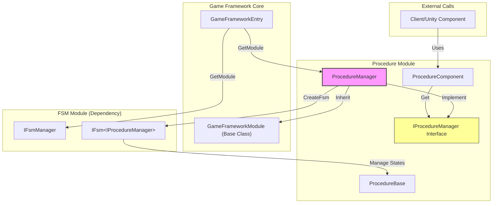

# ProcedureManager

ProcedureManager is the core implementation class of the GameFrameX workflow management system, responsible for managing various workflow states in games and their transitions.

## Overview

ProcedureManager implements the `IProcedureManager` interface, inherits from `GameFrameworkModule` base class, and is the main implementation of the workflow management module. It uses Finite State Machine (FSM) to implement workflow creation, switching, and management functionality.

**Design Intent:**
- Provides a unified workflow management mechanism, supporting smooth transitions between different game stages (such as startup, menu, in-game, pause, settlement, etc.)
- Utilizing FSM features, ensures reliability and traceability of workflow transitions
- As a core module of GameFramework, supports hot updates and modular expansion

## Architecture



### Component Responsibilities

| Component | Responsibility |
|------|------|
| **ProcedureManager** | Core implementation class, manages workflow creation, switching, querying |
| **IProcedureManager** | Interface definition, abstracts workflow management operations |
| **ProcedureComponent** | Unity Component, used for configuring and initializing workflows in scene |
| **ProcedureBase** | Procedure Base, each specific workflow inherits from this class |
| **IFsmManager** | Finite state machine manager (external dependency) |

## Core Features

### 1. Initialize Workflow Manager

Before using the workflow manager, initialization is required. During initialization, FSM manager and all available workflow types need to be provided.

```csharp
public void Initialize(IFsmManager fsmManager, params ProcedureBase[] procedures)
```

> Source: [ProcedureManager.cs](https://github.com/GameFrameX/com.gameframex.unity.procedure/blob/main/Runtime/Procedure/ProcedureManager.cs#L104-L110)

**Parameters Description:**
- `fsmManager`: Finite state machine manager, responsible for creating and managing FSM instances
- `procedures`: Array of available workflow instances

### 2. Start Workflow

After initialization is complete, an entrance workflow needs to be specified to start the workflow manager.

```csharp
// Generic method
public void StartProcedure<T>() where T : ProcedureBase

// Type method
public void StartProcedure(Type procedureType)
```

> Source: [ProcedureManager.cs](https://github.com/GameFrameX/com.gameframex.unity.procedure/blob/main/Runtime/Procedure/ProcedureManager.cs#L116-L138)

### 3. Query Workflow State

Provides multiple ways to query current workflow information and check if specific workflows exist.

```csharp
// Get current workflow
public ProcedureBase CurrentProcedure { get; }

// Get current workflow duration
public float CurrentProcedureTime { get; }

// Check if specified workflow exists (generic)
public bool HasProcedure<T>() where T : ProcedureBase

// Check if specified workflow exists (Type)
public bool HasProcedure(Type procedureType)
```

> Source: [ProcedureManager.cs](https://github.com/GameFrameX/com.gameframex.unity.procedure/blob/main/Runtime/Procedure/ProcedureManager.cs#L44-L71), [L145-L168](https://github.com/GameFrameX/com.gameframex.unity.procedure/blob/main/Runtime/Procedure/ProcedureManager.cs#L145-L168)

### 4. Get Workflow Instance

Can get any registered workflow instance for operations at runtime.

```csharp
// Get via generic method
public ProcedureBase GetProcedure<T>() where T : ProcedureBase

// Get via Type method
public ProcedureBase GetProcedure(Type procedureType)
```

> Source: [ProcedureManager.cs](https://github.com/GameFrameX/com.gameframex.unity.procedure/blob/main/Runtime/Procedure/ProcedureManager.cs#L175-L198)

## Workflow Switching Flow

```mermaid
sequenceDiagram
    participant Unity as Unity Engine
    participant PC as ProcedureComponent
    participant PM as ProcedureManager
    participant FSM as IFsmManager
    participant PB as ProcedureBase

    Unity->>PC: Awake()
    PC->>PM: GameFrameworkEntry.GetModule&lt;IProcedureManager&gt;()
    PC->>PC: Start() coroutine
    PC->>PM: Initialize(fsmManager, procedures)
    PM->>FSM: CreateFsm(this, procedures)
    FSM-->>PM: IFsm&lt;IProcedureManager&gt;
    PM-->>PC: Initialization complete
    PC->>PM: StartProcedure&lt;T&gt;()
    PM->>FSM: Start&lt;T&gt;()
    FSM->>PB: OnEnter() - Enter workflow
    Note over FSM,PB: Workflow running...
    PB->>FSM: Trigger workflow switch
    FSM->>PB: OnLeave() - Leave old workflow
    FSM->>PB: OnEnter() - Enter new workflow
```

## Usage Examples

### Basic Workflow Usage

1. **Create Custom Procedure Classes**

```csharp
using GameFrameX.Procedure.Runtime;

public class LoginProcedure : ProcedureBase
{
    protected override void OnEnter(IFsm<IProcedureManager> procedureOwner)
    {
        base.OnEnter(procedureOwner);
        // Initialize login workflow
    }

    protected override void OnUpdate(IFsm<IProcedureManager> procedureOwner, float elapseSeconds, float realElapseSeconds)
    {
        base.OnUpdate(procedureOwner, elapseSeconds, realElapseSeconds);
        // Check if switch conditions are met
        // If met, switch to next workflow
    }
}

public class GameProcedure : ProcedureBase
{
    protected override void OnEnter(IFsm<IProcedureManager> procedureOwner)
    {
        base.OnEnter(procedureOwner);
        // Start game
    }
}
```

2. **Configure ProcedureComponent**

Add `ProcedureComponent` component in Unity scene and configure:
- `Available Procedure Type Names`: Add type names of all workflows
- `Entrance Procedure Type Name`: Set entrance workflow type name

3. **Switch Workflow in Code**

```csharp
// Assume switching to next workflow in some Procedure
public class LoginProcedure : ProcedureBase
{
    protected override void OnUpdate(IFsm<IProcedureManager> procedureOwner, float elapseSeconds, float realElapseSeconds)
    {
        base.OnUpdate(procedureOwner, elapseSeconds, realElapseSeconds);

        // After login is complete, switch to game workflow
        if (IsLoginSuccess)
        {
            procedureOwner.ChangeState<GameProcedure>();
        }
    }
}
```

> Source: [ProcedureBase.cs](https://github.com/GameFrameX/com.gameframex.unity.procedure/blob/main/Runtime/Procedure/ProcedureBase.cs#L1-L77)

### Use ProcedureManager Directly

If you need to use ProcedureManager directly instead of through ProcedureComponent:

```csharp
// Get workflow manager
IProcedureManager procedureManager = GameFrameworkEntry.GetModule<IProcedureManager>();

// Get FSM manager
IFsmManager fsmManager = GameFrameworkEntry.GetModule<IFsmManager>();

// Initialize
procedureManager.Initialize(fsmManager, new LoginProcedure(), new GameProcedure());

// Start entrance workflow
procedureManager.StartProcedure<LoginProcedure>();

// Query during game loop
ProcedureBase current = procedureManager.CurrentProcedure;
float time = procedureManager.CurrentProcedureTime;
```

## API Reference

### Property

| Property | Type | Description |
|------|------|------|
| **CurrentProcedure** | `ProcedureBase` | Gets the currently executing workflow instance |
| **CurrentProcedureTime** | `float` | Gets the time the current workflow has been running (seconds) |

### Method

#### `Initialize(IFsmManager fsmManager, params ProcedureBase[] procedures)`

Initializes the workflow manager.

**Parameters:**
- `fsmManager` (IFsmManager): Finite state machine manager
- `procedures` (params ProcedureBase[]): Array of available workflow instances

**Exception:**
- `GameFrameworkException`: Thrown when fsmManager is null

---

#### `StartProcedure<T>() where T : ProcedureBase`

Starts the specified workflow (generic method).

**Parameters:**
- None

**Exception:**
- `GameFrameworkException`: Thrown when workflow manager is not initialized

---

#### `StartProcedure(Type procedureType)`

Starts the specified workflow (Type method).

**Parameters:**
- `procedureType` (Type): Workflow type to start

**Exception:**
- `GameFrameworkException`: Thrown when workflow manager is not initialized

---

#### `HasProcedure<T>() where T : ProcedureBase`

Checks if the specified workflow exists.

**Returns:**
- `bool`: Returns true if it exists; otherwise returns false

**Exception:**
- `GameFrameworkException`: Thrown when workflow manager is not initialized

---

#### `GetProcedure<T>() where T : ProcedureBase`

Gets the workflow instance of the specified type.

**Returns:**
- `ProcedureBase`: Workflow instance

**Exception:**
- `GameFrameworkException`: Thrown when workflow manager is not initialized

---

### Lifecycle Methods

ProcedureManager inherits from `GameFrameworkModule`, main lifecycle methods:

| Method | Description |
|------|------|
| `Update(elapseSeconds, realElapseSeconds)` | Polling method, current implementation is empty (processed by FSM) |
| `Shutdown()` | Closes and cleans up workflow manager, destroys FSM |

> Source: [ProcedureManager.cs](https://github.com/GameFrameX/com.gameframex.unity.procedure/blob/main/Runtime/Procedure/ProcedureManager.cs#L78-L97)

## Dependencies

ProcedureManager depends on the following components:

| Dependency Item | Description | Source |
|--------|------|------|
| **IFsmManager** | Finite state machine manager | GameFrameX.Fsm.Runtime |
| **IFsm\<IProcedureManager\>** | Workflow state machine instance | GameFrameX.Fsm.Runtime |
| **GameFrameworkModule** | GameFramework module base class | GameFrameX.Runtime |
| **ProcedureBase** | Procedure Base | This module |

## Related Links

- [IProcedureManager](./05.iprocedure-manager.md) - Workflow manager interface definition
- [ProcedureBase](./06.procedure-base.md) - Procedure Base
- [ProcedureComponent](./06.procedure-component.md) - Unity Procedure Component
- [FSM Module](https://github.com/GameFrameX/com.alianblank.gameframex.unity.fsm) - Finite state machine module
- [Custom Procedures](./09.custom-procedures.md) - How to create custom procedures