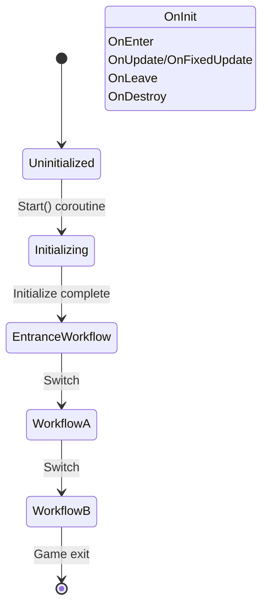

# ProcedureComponent

ProcedureComponent is the core Unity Component of the GameFrameX workflow system, responsible for managing and coordinating various workflow states in games.

## Overview

ProcedureComponent is a Unity MonoBehaviour component, serving as the entry point for game workflow management. It encapsulates the IProcedureManager interface, providing Unity-oriented component interfaces for convenient configuration and management in the Unity Editor.

The main responsibilities of this component include:
- Initialize workflow manager when game starts
- Create all available workflow instances through reflection
- Automatically start Entrance Procedure
- Provide public interfaces for workflow query and get

### Core Concepts

| Concept | Description |
|------|------|
| **Workflow (Procedure)** | Different stages or states in a game, such as startup workflow, menu workflow, game workflow, etc. |
| **Entrance Procedure** | The first workflow to execute when the game starts |
| **Workflow Manager (ProcedureManager)** | Responsible for managing creation, switching, and destruction of all workflows |

## Architecture

```mermaid
flowchart TD
    subgraph Unity["Unity Layer"]
        PC[ProcedureComponent]
        Inspector[ProcedureComponentInspector]
    end

    subgraph GameFramework["Game Framework Core"]
        GFC[GameFrameworkComponent]
        GFE[GameFrameworkEntry]
    end

    subgraph Procedure["Workflow System"]
        IPM[IProcedureManager]
        PM[ProcedureManager]
        PB[ProcedureBase]
    end

    subgraph FSM["State Machine System"]
        FSMComp[FSMComponent]
        FSM[IFsmManager]
    end

    PC -->|Inherit| GFC
    PC -->|Get Module| GFE
    GFE -->|Return| IPM
    IPM -->|Implement| PM
    PM -->|Use| FSM
    FSM -->|Depends on| FSMComp
    PB -->|State| PM
    Inspector -->|Edit| PC
```

### Component Relationship Description

- **ProcedureComponent**: Inherits from GameFrameworkComponent, is the Unity layer entry component
- **IProcedureManager**: Defines procedure management interface, encapsulates all procedure operations
- **ProcedureManager**: Concrete IProcedureManager implementation, uses FSM internally to manage procedures
- **ProcedureBase**: Base class for all custom procedures, inherits from `FsmState<IProcedureManager>`
- **FSMComponent**: Provides underlying FSM functionality, is a dependency of the procedure system

## Core Features

### Initialize Workflow

ProcedureComponent completes initialization during component Awake and Start stages:

```csharp
protected override void Awake()
{
    ImplementationComponentType = Utility.Assembly.GetType(componentType);
    InterfaceComponentType = typeof(IProcedureManager);
    base.Awake();
    m_ProcedureManager = GameFrameworkEntry.GetModule<IProcedureManager>();
    // ...
}
```

> Source: [ProcedureComponent.cs](https://github.com/GameFrameX/com.gameframex.unity.procedure/blob/main/Runtime/Procedure/ProcedureComponent.cs#L58-L69)

```csharp
private IEnumerator Start()
{
    ProcedureBase[] procedures = new ProcedureBase[m_AvailableProcedureTypeNames.Length];
    for (int i = 0; i < m_AvailableProcedureTypeNames.Length; i++)
    {
        Type procedureType = Utility.Assembly.GetType(m_AvailableProcedureTypeNames[i]);
        // ... Error checking ...
        procedures[i] = (ProcedureBase)Activator.CreateInstance(procedureType);
        // ... Record entrance workflow ...
    }

    m_ProcedureManager.Initialize(GameFrameworkEntry.GetModule<IFsmManager>(), procedures);
    yield return new WaitForEndOfFrame();
    m_ProcedureManager.StartProcedure(m_EntranceProcedure.GetType());
}
```

> Source: [ProcedureComponent.cs](https://github.com/GameFrameX/com.gameframex.unity.procedure/blob/main/Runtime/Procedure/ProcedureComponent.cs#L71-L107)

**Design Intent**: Using Start() coroutine ensures that after all component Awakes are complete, workflow initialization and start can proceed. WaitForEndOfFrame ensures workflow starts after Unity is fully initialized.

### Workflow Query

ProcedureComponent provides multiple interfaces for querying current workflow state:

```csharp
/// <summary>
/// Gets the current workflow manager.
/// </summary>
public IProcedureManager Procedure
{
    get { return m_ProcedureManager; }
}

/// <summary>
/// Gets the workflow currently executing.
/// </summary>
public ProcedureBase CurrentProcedure
{
    get { return m_ProcedureManager.CurrentProcedure; }
}

/// <summary>
/// Gets the time the current workflow has been running.
/// </summary>
public float CurrentProcedureTime
{
    get { return m_ProcedureManager.CurrentProcedureTime; }
}
```

> Source: [ProcedureComponent.cs](https://github.com/GameFrameX/com.gameframex.unity.procedure/blob/main/Runtime/Procedure/ProcedureComponent.cs#L31-L53)

### Workflow Existence Check

```csharp
/// <summary>
/// Checks if a workflow of the specified type exists.
/// </summary>
public bool HasProcedure<T>() where T : ProcedureBase
{
    return m_ProcedureManager.HasProcedure<T>();
}

public bool HasProcedure(Type procedureType)
{
    return m_ProcedureManager.HasProcedure(procedureType);
}
```

> Source: [ProcedureComponent.cs](https://github.com/GameFrameX/com.gameframex.unity.procedure/blob/main/Runtime/Procedure/ProcedureComponent.cs#L109-L127)

### Get Workflow Instance

```csharp
/// <summary>
/// Gets the workflow instance of the specified type.
/// </summary>
public ProcedureBase GetProcedure<T>() where T : ProcedureBase
{
    return m_ProcedureManager.GetProcedure<T>();
}

public ProcedureBase GetProcedure(Type procedureType)
{
    return m_ProcedureManager.GetProcedure(procedureType);
}
```

> Source: [ProcedureComponent.cs](https://github.com/GameFrameX/com.gameframex.unity.procedure/blob/main/Runtime/Procedure/ProcedureComponent.cs#L129-L147)

## Workflow Lifecycle



### Workflow Callback Methods

ProcedureBase provides complete lifecycle callbacks:

| Callback Method | Call Timing | Usage |
|----------|----------|----------|
| OnInit | When workflow state is initialized | Initialize workflow data |
| OnEnter | When entering procedure | Prepare workflow resources |
| OnUpdate | During per-frame update | Workflow logic update |
| OnFixedUpdate | During physics update | Physics-related logic |
| OnLeave | When leaving workflow | Clean up workflow resources |
| OnDestroy | When workflow is destroyed | Release all resources |

> Source: [ProcedureBase.cs](https://github.com/GameFrameX/com.gameframex.unity.procedure/blob/main/Runtime/Procedure/ProcedureBase.cs#L16-L76)

## Usage Examples

### Configuration in Unity Editor

1. Create an empty GameObject in the scene
2. Add `Procedure` component (menu: `GameFramework` → `Procedure`)
3. Configure in Inspector panel:
   - **Available Procedures**: Select workflow types to manage
   - **Entrance Procedure**: Select entrance workflow when game starts

### Get Current Workflow in Code

```csharp
// Get ProcedureComponent instance
var procedureComponent = UnityEngine.Object.FindObjectOfType<ProcedureComponent>();

// Get current workflow
var currentProcedure = procedureComponent.CurrentProcedure;

// Get current workflow duration
float elapsedTime = procedureComponent.CurrentProcedureTime;

// Check if specified workflow exists
if (procedureComponent.HasProcedure<MenuProcedure>())
{
    // Get specified workflow instance
    var menuProcedure = procedureComponent.GetProcedure<MenuProcedure>();
}
```

### Workflow Switching

Workflow switching is usually done in ProcedureBase's OnUpdate method based on condition judgment:

```csharp
public class MenuProcedure : ProcedureBase
{
    protected override void OnUpdate(IFsm<IProcedureManager> procedureOwner,
        float elapseSeconds, float realElapseSeconds)
    {
        base.OnUpdate(procedureOwner, elapseSeconds, realElapseSeconds);

        // Assume switch to game workflow after clicking start button
        if (Input.GetMouseButtonUp(0))
        {
            // Get workflow manager and switch workflow
            procedureOwner.GetComponent<ProcedureManager>()
                .StartProcedure<GameProcedure>();
        }
    }
}
```

> Source: [ProcedureManager.cs](https://github.com/GameFrameX/com.gameframex.unity.procedure/blob/main/Runtime/Procedure/ProcedureManager.cs#L112-L138)

## Configuration Description

| Property | Type | Description |
|------|------|------|
| m_AvailableProcedureTypeNames | string[] | Array of available workflow type names |
| m_EntranceProcedureTypeName | string | Type name of entrance workflow |

### Configuration Constraints

- `[DisallowMultipleComponent]`: Only one ProcedureComponent can be added per GameObject
- `[AddComponentMenu("Game Framework/Procedure")]`: Can be quickly added in Unity menu

## Notes

1. **Execution Sequence**: ProcedureComponent depends on FSMComponent, ensure FSMComponent is correctly configured
2. **Entrance Workflow**: Must set a valid entrance workflow, otherwise the game cannot start
3. **Workflow Types**: All workflow classes must inherit from ProcedureBase
4. **Editor Configuration**: Available workflow list cannot be modified in Play mode

## Related Links

- [ProcedureBase](./06.procedure-base.md) - Procedure Base
- [IProcedureManager](./05.iprocedure-manager.md) - Workflow manager interface
- [ProcedureManager](./07.procedure-manager.md) - Workflow manager implementation
- [Custom Procedures](./09.custom-procedures.md) - How to create custom procedures
- [Editor Usage](./10.editor-usage.md) - Editor configuration guide