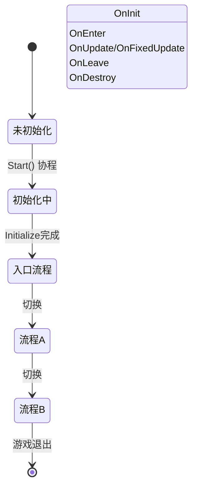

# ProcedureComponent

 ProcedureComponent 是 GameFrameX 流程系统的核心 Unity Component，responsible forManages和协调游戏中的各种流程状态。

## 概述

ProcedureComponent 是一个 Unity MonoBehaviour 组件，作为游戏流程Manages的入口点。它封装了 IProcedureManager 接口，provides了面向 Unity 的组件化接口，方便在 Unity Editor中进行configuration和Manages。

该组件的主要Responsibilityincluding：
- 在游戏start时Initialize流程Manages器
- through反射Creates所有可用的流程实例
- 自动Start Entrance Procedure
- provides流程查询和get的公共接口

### Core Concepts

| 概念 | Description |
|------|------|
| **流程 (Procedure)** | 游戏中的不同阶段或状态，如start流程、菜单流程、游戏流程等 |
| **入口流程 (Entrance Procedure)** | 游戏start时首先执行的流程 |
| **流程Manages器 (ProcedureManager)** | responsible forManages所有流程的Creates、切换和destroy |

## 架构

```mermaid
flowchart TD
    subgraph Unity["Unity 层面"]
        PC[ProcedureComponent]
        Inspector[ProcedureComponentInspector]
    end

    subgraph GameFramework["Game Framework 核心"]
        GFC[GameFrameworkComponent]
        GFE[GameFrameworkEntry]
    end

    subgraph Procedure["流程系统"]
        IPM[IProcedureManager]
        PM[ProcedureManager]
        PB[ProcedureBase]
    end

    subgraph FSM["状态机系统"]
        FSMComp[FSMComponent]
        FSM[IFsmManager]
    end

    PC -->|继承| GFC
    PC -->|获取模块| GFE
    GFE -->|返回| IPM
    IPM -->|实现| PM
    PM -->|使用| FSM
    FSM -->|依赖| FSMComp
    PB -->|状态| PM
    Inspector -->|编辑| PC
```

### 组件关系Description

- **ProcedureComponent**: Inherits from GameFrameworkComponent，是 Unity Layer面的入口组件
- **IProcedureManager**: Defines procedure management interface, encapsulates all procedure operations
- **ProcedureManager**: Concrete IProcedureManager implementation, uses FSM internally to manage procedures
- **ProcedureBase**: Base class for all custom procedures，Inherits from FsmState<IProcedureManager>
- **FSMComponent**: Provides underlying FSM functionality, is a dependency of the procedure system

## Core Features

### Initialize流程

ProcedureComponent 在组件Awake和Start阶段completeInitialize：

```csharp
protected override void Awake()
{
    ImplementationComponentType = Utility.Assembly.GetType(componentType);
    InterfaceComponentType = typeof(IProcedureManager);
    base.Awake();
    m_ProcedureManager = GameFrameworkEntry.GetModule<IProcedureManager>();
    // ...
}
```

> Source: [ProcedureComponent.cs](https://github.com/GameFrameX/com.gameframex.unity.procedure/blob/main/Runtime/Procedure/ProcedureComponent.cs#L58-L69)

```csharp
private IEnumerator Start()
{
    ProcedureBase[] procedures = new ProcedureBase[m_AvailableProcedureTypeNames.Length];
    for (int i = 0; i < m_AvailableProcedureTypeNames.Length; i++)
    {
        Type procedureType = Utility.Assembly.GetType(m_AvailableProcedureTypeNames[i]);
        // ... 错误检查 ...
        procedures[i] = (ProcedureBase)Activator.CreateInstance(procedureType);
        // ... 记录入口流程 ...
    }
    
    m_ProcedureManager.Initialize(GameFrameworkEntry.GetModule<IFsmManager>(), procedures);
    yield return new WaitForEndOfFrame();
    m_ProcedureManager.StartProcedure(m_EntranceProcedure.GetType());
}
```

> Source: [ProcedureComponent.cs](https://github.com/GameFrameX/com.gameframex.unity.procedure/blob/main/Runtime/Procedure/ProcedureComponent.cs#L71-L107)

**设计意图**: Uses Start() 协程ensure在所有组件Awakecomplete后，再进行流程的Initialize和start。WaitForEndOfFrame ensureUnity完全Initialize后再start流程。

### 流程查询

ProcedureComponent provides了多种查询当前流程状态的接口：

```csharp
/// <summary>
/// 获取当前流程管理器。
/// </summary>
public IProcedureManager Procedure
{
    get { return m_ProcedureManager; }
}

/// <summary>
/// 获取当前正在执行的流程。
/// </summary>
public ProcedureBase CurrentProcedure
{
    get { return m_ProcedureManager.CurrentProcedure; }
}

/// <summary>
/// 获取当前流程已持续的时间。
/// </summary>
public float CurrentProcedureTime
{
    get { return m_ProcedureManager.CurrentProcedureTime; }
}
```

> Source: [ProcedureComponent.cs](https://github.com/GameFrameX/com.gameframex.unity.procedure/blob/main/Runtime/Procedure/ProcedureComponent.cs#L31-L53)

### 流程存在性check

```csharp
/// <summary>
/// 检查是否存在指定类型的流程。
/// </summary>
public bool HasProcedure<T>() where T : ProcedureBase
{
    return m_ProcedureManager.HasProcedure<T>();
}

public bool HasProcedure(Type procedureType)
{
    return m_ProcedureManager.HasProcedure(procedureType);
}
```

> Source: [ProcedureComponent.cs](https://github.com/GameFrameX/com.gameframex.unity.procedure/blob/main/Runtime/Procedure/ProcedureComponent.cs#L109-L127)

### get流程实例

```csharp
/// <summary>
/// 获取指定类型的流程实例。
/// </summary>
public ProcedureBase GetProcedure<T>() where T : ProcedureBase
{
    return m_ProcedureManager.GetProcedure<T>();
}

public ProcedureBase GetProcedure(Type procedureType)
{
    return m_ProcedureManager.GetProcedure(procedureType);
}
```

> Source: [ProcedureComponent.cs](https://github.com/GameFrameX/com.gameframex.unity.procedure/blob/main/Runtime/Procedure/ProcedureComponent.cs#L129-L147)

## 流程生命周期



### 流程回调Method

ProcedureBase provides了完整的生命周期回调：

| 回调Method | 调用时机 | Usage |
|----------|----------|------|
| OnInit | 流程状态Initialize时 | Initialize流程数据 |
| OnEnter | Enter Procedure时 | 准备流程资源 |
| OnUpdate | 每帧update时 | 流程逻辑update |
| OnFixedUpdate | 物理update时 | 物理相关逻辑 |
| OnLeave | 离开流程时 | cleanup流程资源 |
| OnDestroy | 流程destroy时 | release所有资源 |

> Source: [ProcedureBase.cs](https://github.com/GameFrameX/com.gameframex.unity.procedure/blob/main/Runtime/Procedure/ProcedureBase.cs#L16-L76)

## Usage Examples

### 在 Unity Editor中configuration

1. 在场景中Creates一个空的 GameObject
2. add `Procedure` 组件（菜单：`Game Framework` → `Procedure`）
3. 在 Inspector 面板中configuration：
   - **Available Procedures**: 选择需要Manages的流程Type
   - **Entrance Procedure**: 选择游戏start时的入口流程

### 代码中get当前流程

```csharp
// 获取 ProcedureComponent 实例
var procedureComponent = UnityEngine.Object.FindObjectOfType<ProcedureComponent>();

// 获取当前流程
var currentProcedure = procedureComponent.CurrentProcedure;

// 获取当前流程持续时间
float elapsedTime = procedureComponent.CurrentProcedureTime;

// 检查是否存在指定流程
if (procedureComponent.HasProcedure<MenuProcedure>())
{
    // 获取指定流程实例
    var menuProcedure = procedureComponent.GetProcedure<MenuProcedure>();
}
```

### 流程切换

流程的切换通常在 ProcedureBase 的 OnUpdate Method中根据条件判断：

```csharp
public class MenuProcedure : ProcedureBase
{
    protected override void OnUpdate(IFsm<IProcedureManager> procedureOwner, 
        float elapseSeconds, float realElapseSeconds)
    {
        base.OnUpdate(procedureOwner, elapseSeconds, realElapseSeconds);
        
        // 假设点击开始按钮后切换到游戏流程
        if (Input.GetMouseButtonUp(0))
        {
            // 获取流程管理器并切换流程
            procedureOwner.GetComponent<ProcedureManager>()
                .StartProcedure<GameProcedure>();
        }
    }
}
```

> Source: [ProcedureManager.cs](https://github.com/GameFrameX/com.gameframex.unity.procedure/blob/main/Runtime/Procedure/ProcedureManager.cs#L112-L138)

## configurationDescription

| Property | Type | Description |
|------|------|------|
| m_AvailableProcedureTypeNames | string[] | 可用流程的Type名称数组 |
| m_EntranceProcedureTypeName | string | 入口流程的Type名称 |

### configuration约束

- `[DisallowMultipleComponent]`: 每个 GameObject 只能add一个 ProcedureComponent
- `[AddComponentMenu("Game Framework/Procedure")]`：在 Unity 菜单中可快速add

## Notes

1. **执行sequential**: ProcedureComponent Depends on FSMComponent，ensure FSMComponent 已正确configuration
2. **入口流程**: 必须set有效的入口流程，否则游戏无法start
3. **流程Type**: 所有流程类必须Inherits自 ProcedureBase
4. **Edit器configuration**: 在 Play 模式下无法修改可用流程列表

## Related Links

- [ProcedureBase](./3-core-concepts.procedure-base) - Procedure Base
- [IProcedureManager](./3-core-concepts.iprocedure-manager) - 流程Manages器接口
- [ProcedureManager](./3-core-concepts.procedure-manager) - 流程Manages器Implements
- [Custom Procedures](./4-custom-procedures) - 如何CreatesCustom Procedures
- [Edit器Uses](./5-editor-usage) - Edit器configuration指南
