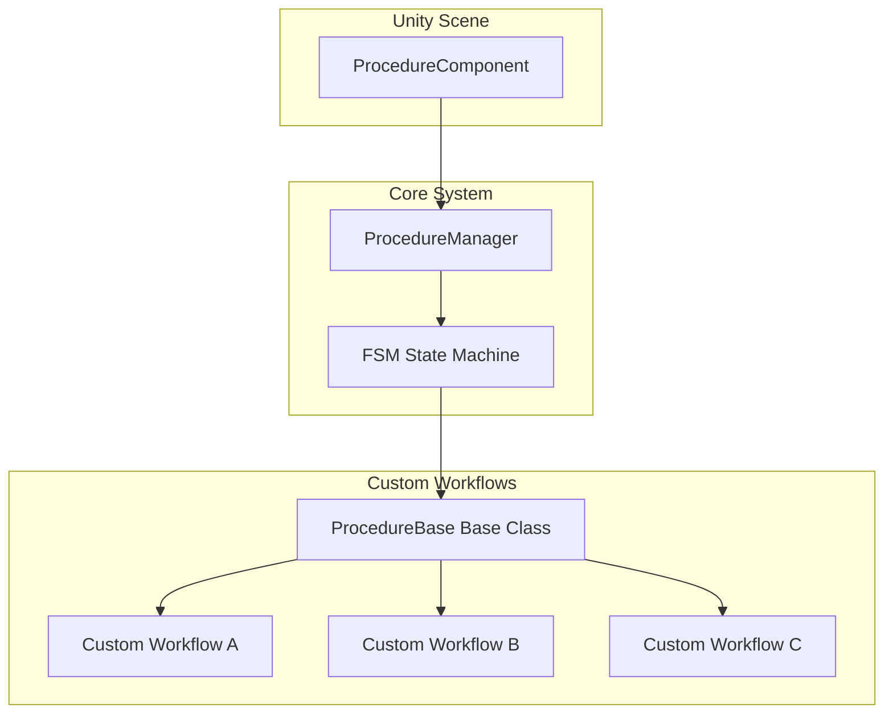
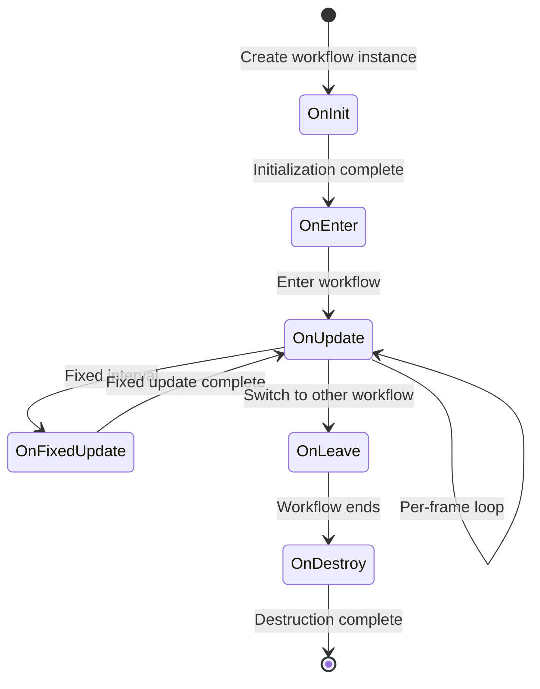

# Custom Procedures

Custom Procedures are the core extension mechanism of the GameFrameX workflow system. By inheriting the `ProcedureBase` base class and overriding corresponding lifecycle methods, developers can create custom procedures suitable for various stages of the game, such as startup workflow, menu workflow, game workflow, etc.

## Overview

The GameFrameX workflow system is designed based on Finite State Machine (FSM). Each workflow (Procedure) represents an independent state or stage in the game. The system manages all workflows through the `ProcedureComponent` component in Unity scenes, while specific workflow logic is implemented through custom classes.



### Design Intent

Advantages of using FSM mode to manage workflows:
- **Clear States**: Each workflow represents a clear stage of the game, easy to manage and debug
- **Decoupled Logic**: Workflows are independent of each other, easy to develop and test separately
- **Smooth Transitions**: Supports smooth transitions and transition animations between workflows
- **Extensibility**: Adding new workflows only requires creating new classes, no need to modify existing code

## Create Custom Procedures

### Basic Structure

Creating custom procedures requires inheriting the `ProcedureBase` class and overriding required lifecycle methods.

```csharp
using GameFrameX.Procedure.Runtime;
using GameFrameX.Fsm.Runtime;

namespace MyGame.Procedure
{
    /// <summary>
    /// Example custom procedure.
    /// </summary>
    public class DemoProcedure : ProcedureBase
    {
        /// <summary>
        /// Called when workflow is initialized.
        /// </summary>
        protected override void OnInit(IFsm<IProcedureManager> procedureOwner)
        {
            base.OnInit(procedureOwner);
            // Initialization code, such as loading configuration, preloading resources, etc.
        }

        /// <summary>
        /// Called when entering workflow.
        /// </summary>
        protected override void OnEnter(IFsm<IProcedureManager> procedureOwner)
        {
            base.OnEnter(procedureOwner);
            // Logic for entering workflow, such as displaying interface, playing music, etc.
        }

        /// <summary>
        /// Called every frame during workflow update.
        /// </summary>
        protected override void OnUpdate(IFsm<IProcedureManager> procedureOwner, float elapseSeconds, float realElapseSeconds)
        {
            base.OnUpdate(procedureOwner, elapseSeconds, realElapseSeconds);
            // Logic executed every frame

            // Example: Switch to next workflow after condition is met
            // if (someCondition)
            // {
            //     ChangeState<NextProcedure>(procedureOwner);
            // }
        }

        /// <summary>
        /// Called during fixed workflow update.
        /// </summary>
        protected override void OnFixedUpdate(IFsm<IProcedureManager> procedureOwner, float elapseSeconds, float realElapseSeconds)
        {
            base.OnFixedUpdate(procedureOwner, elapseSeconds, realElapseSeconds);
            // Physics-related fixed update logic
        }

        /// <summary>
        /// Called when leaving workflow.
        /// </summary>
        protected override void OnLeave(IFsm<IProcedureManager> procedureOwner, bool isShutdown)
        {
            base.OnLeave(procedureOwner, isShutdown);
            // Cleanup work when leaving workflow, such as hiding interface, stopping sound effects, etc.
        }

        /// <summary>
        /// Called when workflow is destroyed.
        /// </summary>
        protected override void OnDestroy(IFsm<IProcedureManager> procedureOwner)
        {
            base.OnDestroy(procedureOwner);
            // Resource release, memory cleanup, etc.
        }
    }
}
```
> Source: [ProcedureBase.cs](https://github.com/GameFrameX/com.gameframex.unity.procedure/blob/main/Runtime/Procedure/ProcedureBase.cs#L1-L77)

## Lifecycle Details

### Workflow State Flow



### Each Lifecycle Method Description

| Method | Call Timing | Typical Usage |
|------|----------|----------|
| `OnInit` | When workflow state is first created | Preload data, initialize data structures |
| `OnEnter` | When entering this workflow state | Display interface, play sound effects, load resources |
| `OnUpdate` | During per-frame update | Business logic check, timeout detection, condition checking |
| `OnFixedUpdate` | During fixed time interval update | Physics calculations, input processing |
| `OnLeave` | When leaving this workflow state | Hide interface, save state, cleanup resources |
| `OnDestroy` | When workflow state is destroyed | Release references, memory cleanup |

### Workflow Parameters Description

`OnUpdate` and `OnFixedUpdate` methods provide two time parameters:

- **`elapseSeconds`**: Logical elapsed time (affected by game pause, time scale)
- **`realElapseSeconds`**: Real elapsed time (not affected by game pause)

```csharp
protected override void OnUpdate(IFsm<IProcedureManager> procedureOwner, float elapseSeconds, float realElapseSeconds)
{
    base.OnUpdate(procedureOwner, elapseSeconds, realElapseSeconds);

    // Use elapseSeconds to calculate time affected by time scale
    // Use realElapseSeconds to calculate real timeout
}
```

## Workflow Transitions

### Switch to Next Workflow

Switch workflows based on business conditions in the `OnUpdate` method:

```csharp
using GameFrameX.Fsm.Runtime;

protected override void OnUpdate(IFsm<IProcedureManager> procedureOwner, float elapseSeconds, float realElapseSeconds)
{
    base.OnUpdate(procedureOwner, elapseSeconds, realElapseSeconds);

    // Example: Auto-switch on timeout
    if (procedureOwner.CurrentStateTime >= 3.0f)
    {
        // Switch to next workflow
        ChangeState<MenuProcedure>(procedureOwner);
    }
}
```

### Get Current Workflow Information

```csharp
protected override void OnUpdate(IFsm<IProcedureManager> procedureOwner, float elapseSeconds, float realElapseSeconds)
{
    base.OnUpdate(procedureOwner, elapseSeconds, realElapseSeconds);

    // Get current workflow
    ProcedureBase current = procedureOwner.CurrentState;

    // Get current workflow elapsed time
    float time = procedureOwner.CurrentStateTime;

    // Example: Switch after running for 5 seconds
    if (time > 5.0f)
    {
        ChangeState<NextProcedure>(procedureOwner);
    }
}
```

## Register Custom Procedures

### Register through Editor

1. Create or select a GameObject with `ProcedureComponent` in Unity scene
2. In the Inspector panel, you can see the "Available Procedures" list
3. Check the custom procedure types to include
4. Select entrance workflow in the "Entrance Procedure" dropdown menu

```csharp
// Configuration in Unity editor for ProcedureComponent
// Source location: Runtime/Procedure/ProcedureComponent.cs
[SerializeField] private string[] m_AvailableProcedureTypeNames = null;
[SerializeField] private string m_EntranceProcedureTypeName = null;
```
> Source: [ProcedureComponent.cs](https://github.com/GameFrameX/com.gameframex.unity.procedure/blob/main/Runtime/Procedure/ProcedureComponent.cs#L27-L29)

### Register at Runtime

If you need to dynamically register workflows at runtime, you can use reflection or direct code:

```csharp
// Initialize workflow manager through code
IProcedureManager procedureManager = GameFrameworkEntry.GetModule<IProcedureManager>();
procedureManager.Initialize(fsmManager,
    new ProcedureA(),
    new ProcedureB(),
    new ProcedureC());

// Start entrance workflow
procedureManager.StartProcedure<EntranceProcedure>();
```
> Source: [ProcedureManager.cs](https://github.com/GameFrameX/com.gameframex.unity.procedure/blob/main/Runtime/Procedure/ProcedureManager.cs#L104-L124)

## Complete Example

The following is a typical game workflow implementation example:

```csharp
using GameFrameX.Procedure.Runtime;
using GameFrameX.Fsm.Runtime;
using UnityEngine;

namespace MyGame.Procedure
{
    /// <summary>
    /// Launch procedure - responsible for game initialization and resource loading.
    /// </summary>
    public class LaunchProcedure : ProcedureBase
    {
        private float _loadingDuration = 2.0f; // Simulated loading time

        protected override void OnEnter(IFsm<IProcedureManager> procedureOwner)
        {
            base.OnEnter(procedureOwner);
            Debug.Log("Entering launch procedure, starting initialization...");
            // Display loading interface
        }

        protected override void OnUpdate(IFsm<IProcedureManager> procedureOwner, float elapseSeconds, float realElapseSeconds)
        {
            base.OnUpdate(procedureOwner, elapseSeconds, realElapseSeconds);

            // Simulate loading progress
            float progress = procedureOwner.CurrentStateTime / _loadingDuration;

            if (procedureOwner.CurrentStateTime >= _loadingDuration)
            {
                Debug.Log("Loading complete, switching to menu procedure");
                ChangeState<MenuProcedure>(procedureOwner);
            }
        }

        protected override void OnLeave(IFsm<IProcedureManager> procedureOwner, bool isShutdown)
        {
            base.OnLeave(procedureOwner, isShutdown);
            // Hide loading interface
            Debug.Log("Leaving launch procedure");
        }
    }

    /// <summary>
    /// Menu procedure - responsible for displaying main menu and handling menu interactions.
    /// </summary>
    public class MenuProcedure : ProcedureBase
    {
        private bool _startGameRequested = false;

        protected override void OnEnter(IFsm<IProcedureManager> procedureOwner)
        {
            base.OnEnter(procedureOwner);
            Debug.Log("Entering menu procedure");
            // Display main menu interface
            // Bind start game button events
        }

        protected override void OnUpdate(IFsm<IProcedureManager> procedureOwner, float elapseSeconds, float realElapseSeconds)
        {
            base.OnUpdate(procedureOwner, elapseSeconds, realElapseSeconds);

            // Check if game start is requested
            if (_startGameRequested)
            {
                ChangeState<GameProcedure>(procedureOwner);
            }
        }

        protected override void OnLeave(IFsm<IProcedureManager> procedureOwner, bool isShutdown)
        {
            base.OnLeave(procedureOwner, isShutdown);
            // Hide menu interface
            Debug.Log("Leaving menu procedure");
        }

        // Method for external calls
        public void RequestStartGame()
        {
            _startGameRequested = true;
        }
    }

    /// <summary>
    /// Game procedure - responsible for core game logic.
    /// </summary>
    public class GameProcedure : ProcedureBase
    {
        protected override void OnEnter(IFsm<IProcedureManager> procedureOwner)
        {
            base.OnEnter(procedureOwner);
            Debug.Log("Entering game procedure");
            // Initialize game scene, load game data, etc.
        }

        protected override void OnUpdate(IFsm<IProcedureManager> procedureOwner, float elapseSeconds, float realElapseSeconds)
        {
            base.OnUpdate(procedureOwner, elapseSeconds, realElapseSeconds);

            // Main game loop logic
            // Check if game is over, if paused, etc.

            // Example: Press ESC to return to menu
            // if (Input.GetKeyDown(KeyCode.Escape))
            // {
            //     ChangeState<MenuProcedure>(procedureOwner);
            // }
        }

        protected override void OnLeave(IFsm<IProcedureManager> procedureOwner, bool isShutdown)
        {
            base.OnLeave(procedureOwner, isShutdown);
            // Save game data, clean up game scene
            Debug.Log("Leaving game procedure");
        }
    }
}
```

## Best Practices

### 1. Single Responsibility Principle

Each workflow should only be responsible for one clear game stage. Do not mix multiple functions in one workflow:

```csharp
// ✅ Good design
public class LoadingProcedure : ProcedureBase { /* Responsible for loading */ }
public class MenuProcedure : ProcedureBase { /* Responsible for menu */ }
public class GameProcedure : ProcedureBase { /* Responsible for game logic */ }

// ❌ Design to avoid
public class LoadingAndMenuAndGameProcedure : ProcedureBase { /* Mix multiple functions */ }
```

### 2. Workflow Communication

Use events or data containers for data passing between workflows:

```csharp
// Pass data through custom data class
public class ProcedureData
{
    public string PlayerName;
    public int LevelId;
}

// Get data in workflow
protected override void OnEnter(IFsm<IProcedureManager> procedureOwner)
{
    base.OnEnter(procedureOwner);

    // Get passed data
    var data = procedureOwner.GetData<ProcedureData>("Key");
    if (data != null)
    {
        Debug.Log($"Player: {data.PlayerName}, Level: {data.LevelId}");
    }
}
```

### 3. Resource Management

Correctly clean up resources in `OnLeave` and `OnDestroy`:

```csharp
protected override void OnLeave(IFsm<IProcedureManager> procedureOwner, bool isShutdown)
{
    base.OnLeave(procedureOwner, isShutdown);

    // Cancel all async loading
    // Release resources used by this workflow
}

protected override void OnDestroy(IFsm<IProcedureManager> procedureOwner)
{
    base.OnDestroy(procedureOwner);

    // Thoroughly clean up references
}
```

### 4. Debugging Tips

Use `CurrentStateTime` for timeout detection and progress display:

```csharp
protected override void OnUpdate(IFsm<IProcedureManager> procedureOwner, float elapseSeconds, float realElapseSeconds)
{
    base.OnUpdate(procedureOwner, elapseSeconds, realElapseSeconds);

    // Display loading progress
    float progress = Mathf.Clamp01(procedureOwner.CurrentStateTime / 3.0f);
    Debug.Log($"Loading progress: {progress * 100}%");
}
```

## Related Links

- [ProcedureComponent](./08.procedure-component.md) - Procedure Component
- [ProcedureBase](./06.procedure-base.md) - Procedure Base
- [IProcedureManager](./05.iprocedure-manager.md) - Interface
- [ProcedureManager](./07.procedure-manager.md) - Manager
- [Editor Usage](./10.editor-usage.md) - Editor usage guide
- [Installation Guide](./02.installation.md)