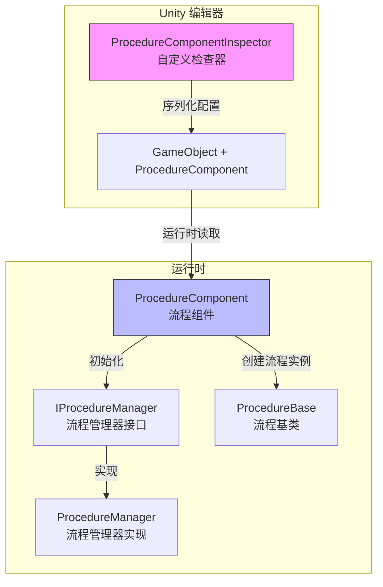
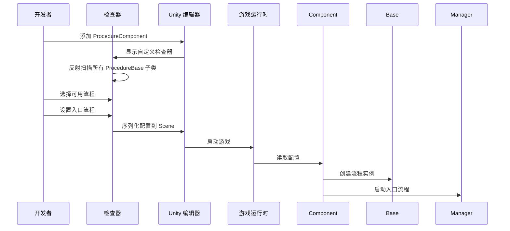

# Edit器Uses

This document introduces如何在 Unity Editor中configuration和Uses Procedure 流程Manages组件。

## 概述

`ProcedureComponentInspector` 是 GameFrameX Procedure 流程Manages系统的Edit器扩展，provides了可视化的流程configuration界面。through该check器，开发者可以：

- 自动发现项目中所有Inherits自 `ProcedureBase` 的流程类
- 可视化选择游戏可用的流程
- configuration游戏start时的入口流程
- 在运行时查看当前执行的流程

## 架构



### Workflow



## 在场景中addProcedure Component

### 步骤 1：add组件

在 Unity 场景中Creates一个空物体或选择现有物体，然后add `Procedure` 组件：

1. 在 Hierarchy 面板中选择目标 GameObject
2. 在 Inspector 面板中点击 **Add Component** 按钮
3. search **Game Framework / Procedure** 并add

> Source: [ProcedureComponent.cs](https://github.com/GameFrameX/com.gameframex.unity.procedure/blob/main/Runtime/Procedure/ProcedureComponent.cs#L20-L21)

```csharp
[DisallowMultipleComponent]
[AddComponentMenu("Game Framework/Procedure")]
public sealed class ProcedureComponent : GameFrameworkComponent
```

**注意：** 该组件Uses了 `[DisallowMultipleComponent]` Property，意味着每个 GameObject 只能add一个 `ProcedureComponent`。

### 步骤 2：Config Component

add组件后，check器界面会自动显示以下内容：

| 区域 | Description |
|------|------|
| **Available Procedures** | 列出所有可用的流程Type（自动发现） |
| **Entrance Procedure** | set游戏start时的第一个流程 |

## check器界面详解

### 运行时information显示

在Game Runtime（Play 模式下），check器会额外显示：

- **Current Procedure**: 当前正在执行的流程Type名称

```csharp
if (EditorApplication.isPlaying)
{
    EditorGUILayout.LabelField("Current Procedure", t.CurrentProcedure == null ? "None" : t.CurrentProcedure.GetType().ToString());
}
```
> Source: [ProcedureComponentInspector.cs](https://github.com/GameFrameX/com.gameframex.unity.procedure/blob/main/Editor/Inspector/ProcedureComponentInspector.cs#L39-L42)

### 可用流程列表

check器会自动扫描所有Inherits自 `ProcedureBase` 的Type：

```csharp
m_ProcedureTypeNames = Type.GetRuntimeTypeNames(typeof(ProcedureBase));
```
> Source: [ProcedureComponentInspector.cs](https://github.com/GameFrameX/com.gameframex.unity.procedure/blob/main/Editor/Inspector/ProcedureComponentInspector.cs#L121)

开发者可以through复选框选择需要contains在游戏中的流程。

### 入口流程configuration

入口流程是游戏start时首先执行的流程，必须从已选择的可用流程中选择：

```csharp
int selectedIndex = EditorGUILayout.Popup("Entrance Procedure", m_EntranceProcedureIndex, m_CurrentAvailableProcedureTypeNames.ToArray());
```
> Source: [ProcedureComponentInspector.cs](https://github.com/GameFrameX/com.gameframex.unity.procedure/blob/main/Editor/Inspector/ProcedureComponentInspector.cs#L80)

## configuration示例

### 基本configuration流程

1. **CreatesCustom Procedures类**

   首先，CreatesInherits自 `ProcedureBase` 的流程类：

   ```csharp
   public class ProcedureLaunch : ProcedureBase
   {
       protected override void OnEnter(IFsm<IProcedureManager> procedureOwner)
       {
           base.OnEnter(procedureOwner);
           // 初始化操作
       }

       protected override void OnUpdate(IFsm<IProcedureManager> procedureOwner, float elapseSeconds, float realElapseSeconds)
       {
           base.OnUpdate(procedureOwner, elapseSeconds, realElapseSeconds);
           // 切换到下一个流程
       }
   }
   ```

   > Source: [ProcedureBase.cs](https://github.com/GameFrameX/com.gameframex.unity.procedure/blob/main/Runtime/Procedure/ProcedureBase.cs#L16)

2. **在场景中configuration ProcedureComponent**

   - add ProcedureComponent 到场景
   - 在check器中勾选 `ProcedureLaunch` 作为可用流程
   - 将 `ProcedureLaunch` set为入口流程

3. **运行游戏**

   游戏start后会自动执行 `ProcedureLaunch` 流程。

### 流程切换

在Custom Procedures中，可以Uses `IProcedureManager` Switch to Other Procedure：

```csharp
// 获取流程管理器
var procedureManager = Owner.GetComponent<ProcedureComponent>().Procedure;

// 切换到下一个流程
procedureManager.StartProcedure<ProcedureMenu>();
```

## 组件PropertyDescription

| Property | Type | Description |
|------|------|------|
| m_AvailableProcedureTypeNames | string[] | 可用的流程Type名称数组 |
| m_EntranceProcedureTypeName | string | 入口流程的Type名称 |

> Source: [ProcedureComponent.cs](https://github.com/GameFrameX/com.gameframex.unity.procedure/blob/main/Runtime/Procedure/ProcedureComponent.cs#L27-L29)

## Troubleshooting

### check器显示"没有可用流程"

**原因**：项目中没有Inherits自 `ProcedureBase` 的类

**解决Method**：ensure已Creates至少一个Inherits自 `ProcedureBase` 的流程类，并且该类编译无误。

### 入口流程显示无效

**原因**：入口流程未set或set的流程不在可用流程列表中

**解决Method**：在check器中先选择可用流程，然后从下拉菜单中选择入口流程。

### 运行时不显示当前流程

**原因**：游戏未正确start或 ProcedureComponent 未正确Initialize

**解决Method**：ensure ProcedureComponent 已add到场景中，且在 Start() Method中已正确Initialize。

## Related Links

- [Plugin Introduction](./1-overview.introduction)
- [Features](./1-overview.features)
- [Installation Guide](./2-installation)
- [ProcedureComponent Core Concepts](./3-core-concepts.procedure-component)
- [ProcedureBase Core Concepts](./3-core-concepts.procedure-base)
- [IProcedureManager Core Concepts](./3-core-concepts.iprocedure-manager)
- [ProcedureManager Core Concepts](./3-core-concepts.procedure-manager)
- [Custom Procedures](./4-custom-procedures)
- [Troubleshooting](./6-troubleshooting)
