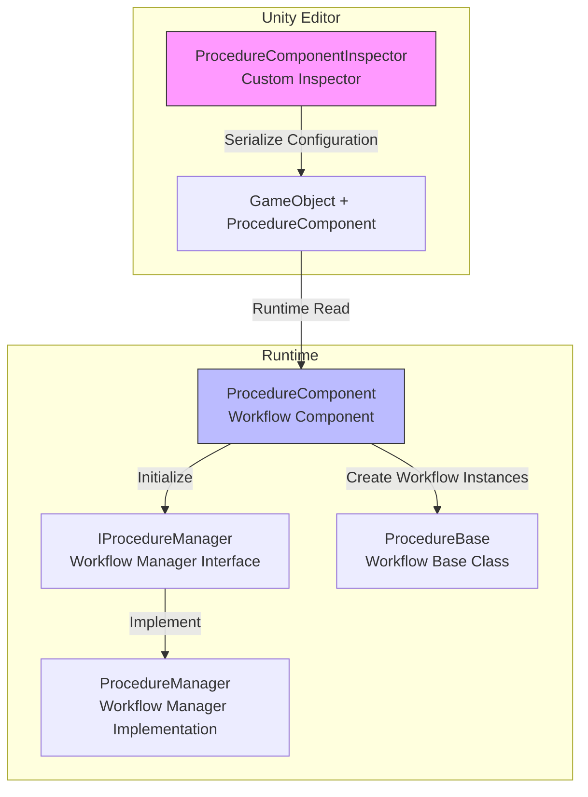
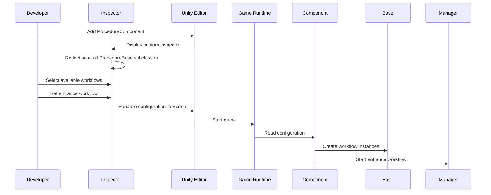

# Editor Usage

This document introduces how to configure and use the Procedure workflow management component in the Unity Editor.

## Overview

`ProcedureComponentInspector` is the editor extension of the GameFrameX Procedure workflow management system, providing a visual workflow configuration interface. Through this inspector, developers can:

- Automatically discover all workflow classes inheriting from `ProcedureBase` in the project
- Visually select workflows available to the game
- Configure the entrance workflow when the game starts
- View the currently executing workflow at runtime

## Architecture



### Workflow



## Add Procedure Component in Scene

### Step 1: Add Component

Create an empty object or select an existing object in the Unity scene, then add the `Procedure` component:

1. Select the target GameObject in the Hierarchy panel
2. Click **Add Component** button in the Inspector panel
3. Search **Game Framework / Procedure** and add

> Source: [ProcedureComponent.cs](https://github.com/GameFrameX/com.gameframex.unity.procedure/blob/main/Runtime/Procedure/ProcedureComponent.cs#L20-L21)

```csharp
[DisallowMultipleComponent]
[AddComponentMenu("Game Framework/Procedure")]
public sealed class ProcedureComponent : GameFrameworkComponent
```

**Note:** This component uses the `[DisallowMultipleComponent]` attribute, meaning only one `ProcedureComponent` can be added per GameObject.

### Step 2: Configure Component

After adding the component, the inspector interface will automatically display:

| Area | Description |
|------|------|
| **Available Procedures** | Lists all available workflow types (auto-discovered) |
| **Entrance Procedure** | Set the first workflow when the game starts |

## Inspector Interface Details

### Runtime Information Display

During game runtime (Play mode), the inspector additionally displays:

- **Current Procedure**: Type name of the workflow currently executing

```csharp
if (EditorApplication.isPlaying)
{
    EditorGUILayout.LabelField("Current Procedure", t.CurrentProcedure == null ? "None" : t.CurrentProcedure.GetType().ToString());
}
```
> Source: [ProcedureComponentInspector.cs](https://github.com/GameFrameX/com.gameframex.unity.procedure/blob/main/Editor/Inspector/ProcedureComponentInspector.cs#L39-L42)

### Available Workflow List

The inspector automatically scans all types inheriting from `ProcedureBase`:

```csharp
m_ProcedureTypeNames = Type.GetRuntimeTypeNames(typeof(ProcedureBase));
```
> Source: [ProcedureComponentInspector.cs](https://github.com/GameFrameX/com.gameframex.unity.procedure/blob/main/Editor/Inspector/ProcedureComponentInspector.cs#L121)

Developers can select workflows to include in the game through checkboxes.

### Entrance Workflow Configuration

The entrance workflow is the first workflow to execute when the game starts. It must be selected from the available workflows:

```csharp
int selectedIndex = EditorGUILayout.Popup("Entrance Procedure", m_EntranceProcedureIndex, m_CurrentAvailableProcedureTypeNames.ToArray());
```
> Source: [ProcedureComponentInspector.cs](https://github.com/GameFrameX/com.gameframex.unity.procedure/blob/main/Editor/Inspector/ProcedureComponentInspector.cs#L80)

## Configuration Examples

### Basic Configuration Workflow

1. **Create Custom Procedure Class**

   First, create a workflow class inheriting from `ProcedureBase`:

   ```csharp
   public class ProcedureLaunch : ProcedureBase
   {
       protected override void OnEnter(IFsm<IProcedureManager> procedureOwner)
       {
           base.OnEnter(procedureOwner);
           // Initialization operations
       }

       protected override void OnUpdate(IFsm<IProcedureManager> procedureOwner, float elapseSeconds, float realElapseSeconds)
       {
           base.OnUpdate(procedureOwner, elapseSeconds, realElapseSeconds);
           // Switch to next workflow
       }
   }
   ```

   > Source: [ProcedureBase.cs](https://github.com/GameFrameX/com.gameframex.unity.procedure/blob/main/Runtime/Procedure/ProcedureBase.cs#L16)

2. **Configure ProcedureComponent in Scene**

   - Add ProcedureComponent to the scene
   - Check `ProcedureLaunch` as available workflow in inspector
   - Set `ProcedureLaunch` as entrance workflow

3. **Run Game**

   The game will automatically execute `ProcedureLaunch` workflow after starting.

### Workflow Switching

In custom procedures, you can use `IProcedureManager` to switch to other procedures:

```csharp
// Get workflow manager
var procedureManager = Owner.GetComponent<ProcedureComponent>().Procedure;

// Switch to next workflow
procedureManager.StartProcedure<ProcedureMenu>();
```

## Component Property Description

| Property | Type | Description |
|------|------|------|
| m_AvailableProcedureTypeNames | string[] | Array of available workflow type names |
| m_EntranceProcedureTypeName | string | Type name of entrance workflow |

> Source: [ProcedureComponent.cs](https://github.com/GameFrameX/com.gameframex.unity.procedure/blob/main/Runtime/Procedure/ProcedureComponent.cs#L27-L29)

## Troubleshooting

### Inspector shows "No Available Workflows"

**Cause**: No class inheriting from `ProcedureBase` exists in the project

**Solution**: Ensure at least one workflow class inheriting from `ProcedureBase` has been created and compiles without errors.

### Entrance Workflow Shows Invalid

**Cause**: Entrance workflow is not set or the set workflow is not in the available workflow list

**Solution**: First select available workflows in the inspector, then select the entrance workflow from the dropdown menu.

### Current Workflow Not Displayed at Runtime

**Cause**: Game did not start correctly or ProcedureComponent was not properly initialized

**Solution**: Ensure ProcedureComponent has been added to the scene and has been correctly initialized in the Start() method.

## Related Links

- [Plugin Introduction](./01.overview.md)
- [Features](./04.features.md)
- [Installation Guide](./02.installation.md)
- [ProcedureComponent](./08.procedure-component.md)
- [ProcedureBase](./06.procedure-base.md)
- [IProcedureManager](./05.iprocedure-manager.md)
- [ProcedureManager](./07.procedure-manager.md)
- [Custom Procedures](./09.custom-procedures.md)
- [Troubleshooting](./11.troubleshooting.md)