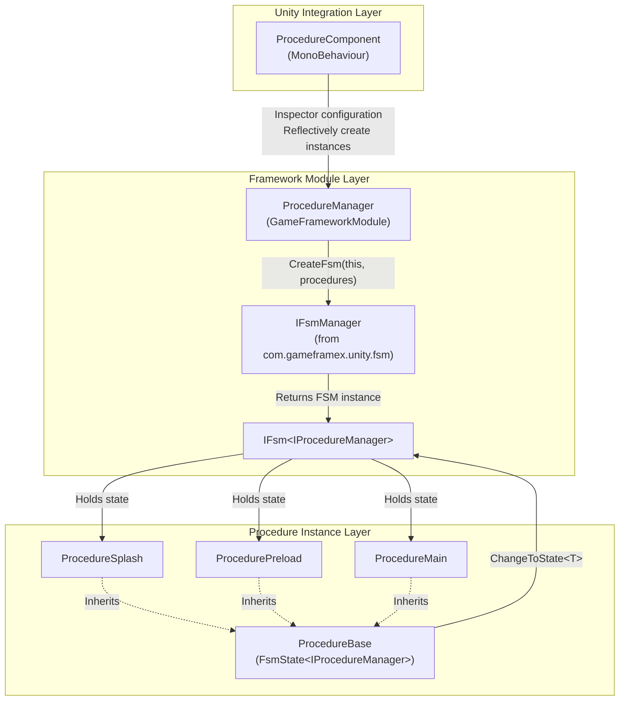

# How It Works at a Glance

GameFrameX Procedure is a Unity game flow management package based on a finite state machine (FSM). It drives game lifecycle stages (splash screen, preload, login, main menu, etc.) through switchable "procedure states" and provides complete lifecycle callbacks at each stage. The underlying dependency is [com.gameframex.unity.fsm](https://github.com/GameFrameX/com.gameframex.unity.fsm); this package is only responsible for wrapping the FSM into "procedure" semantics and integrating it into the GameFrameX framework.

## Quick Start

A minimal usable procedure consists of three steps:

1. **Inherit `ProcedureBase` to write the procedure class**, placing business logic in lifecycle callbacks.

   ```csharp
   using GameFrameX.Fsm.Runtime;
   using GameFrameX.Procedure.Runtime;

   public class ProcedurePreload : ProcedureBase
   {
       protected internal override void OnEnter(IFsm<IProcedureManager> procedureOwner)
       {
           // Load resources, configurations, etc.
       }

       protected internal override void OnUpdate(IFsm<IProcedureManager> procedureOwner, float elapseSeconds, float realElapseSeconds)
       {
           // Check loading progress, then switch to the next procedure when complete
           ChangeToState<ProcedureMain>(procedureOwner);
       }
   }

   public class ProcedureMain : ProcedureBase
   {
       protected internal override void OnEnter(IFsm<IProcedureManager> procedureOwner)
       {
           // Show the main menu
       }
   }
   ```

   Source: [README.zh-CN.md](https://github.com/GameFrameX/com.gameframex.unity.procedure/blob/main/README.zh-CN.md#L88-L110)

2. **Attach `ProcedureComponent`**: Add the `GameFrameX/Procedure` component to a GameObject (via the menu `GameFrameX > Procedure`). Source: [ProcedureComponent.cs](https://github.com/GameFrameX/com.gameframex.unity.procedure/blob/main/Runtime/Procedure/ProcedureComponent.cs#L43-L46)

3. **Configure `Available Procedures` (array of available procedure type names) and `Entrance Procedure` (entry procedure) in the Inspector**. Run the game and it will automatically advance starting from the entry procedure. Source: [ProcedureComponent.cs](https://github.com/GameFrameX/com.gameframex.unity.procedure/blob/main/Runtime/Procedure/ProcedureComponent.cs#L51-L53)

## How It Works at a Glance

The entire mechanism consists of three layers: `ProcedureComponent` (Unity integration layer) → `ProcedureManager` (framework module layer) → `ProcedureBase` (procedure instance layer). After the component reads the procedure type list from the Inspector, it reflectively creates instances and hands them to the manager for initialization; the manager internally creates a state machine through the FSM manager, where each procedure corresponds to an FSM state, and state transitions are triggered by `ChangeToState<T>`.



Key facts:

- **Integration entry point**: `ProcedureComponent` is annotated with `[GameFrameXAutoComponent(-1000)]`, and is automatically mounted by the framework according to priority. Source: [ProcedureComponent.cs](https://github.com/GameFrameX/com.gameframex.unity.procedure/blob/main/Runtime/Procedure/ProcedureComponent.cs#L43-L46)
- **Manager instance**: `ProcedureManager` is a `GameFrameworkModule` with a `Priority` of `-2`; it is polled before all ordinary business modules and shut down last. Source: [ProcedureManager.cs](https://github.com/GameFrameX/com.gameframex.unity.procedure/blob/main/Runtime/Procedure/ProcedureManager.cs#L59-L62)
- **State machine creation**: `Initialize` passes all procedures as states to `IFsmManager.CreateFsm`, resulting in an FSM owned by `IProcedureManager`. Source: [ProcedureManager.cs](https://github.com/GameFrameX/com.gameframex.unity.procedure/blob/main/Runtime/Procedure/ProcedureManager.cs#L130-L141)
- **Procedure base class**: `ProcedureBase : FsmState<IProcedureManager>` directly reuses the FSM's six lifecycle callbacks: `OnInit` / `OnEnter` / `OnUpdate` / `OnFixedUpdate` / `OnLeave` / `OnDestroy`. Source: [ProcedureBase.cs](https://github.com/GameFrameX/com.gameframex.unity.procedure/blob/main/Runtime/Procedure/ProcedureBase.cs#L38-L79)
- **State transition entry point**: `ProcedureBase` exposes `ChangeToState<T>(procedureOwner)` to trigger state migration within the same FSM; the FSM automatically calls `OnLeave` on the old state and `OnEnter` on the new state. Source: [ProcedureManager.cs](https://github.com/GameFrameX/com.gameframex.unity.procedure/blob/main/Runtime/Procedure/ProcedureManager.cs#L130-L156)

## Startup and Runtime Flow

1. During the component's `Awake`/`Start` phase, it reads `m_AvailableProcedureTypeNames` and `m_EntranceProcedureTypeName`, and reflectively obtains the `ProcedureBase` array. Source: [ProcedureComponent.cs](https://github.com/GameFrameX/com.gameframex.unity.procedure/blob/main/Runtime/Procedure/ProcedureComponent.cs#L51-L53)
2. Internally, the framework retrieves `IFsmManager` from `GameEntry` and calls `ProcedureManager.Initialize(fsmManager, procedures)`. Source: [ProcedureManager.cs](https://github.com/GameFrameX/com.gameframex.unity.procedure/blob/main/Runtime/Procedure/ProcedureManager.cs#L130-L141)
3. Call `StartProcedure<T>()`, the FSM switches the current state to the entry procedure, triggering the first `OnEnter`. Source: [ProcedureManager.cs](https://github.com/GameFrameX/com.gameframex.unity.procedure/blob/main/Runtime/Procedure/ProcedureManager.cs#L148-L156)
4. During runtime, the FSM polls `OnUpdate` / `OnFixedUpdate` of the current procedure each frame, and each procedure calls `ChangeToState<T>` to drive state migration when conditions are met.
5. On shutdown, `ProcedureManager.Shutdown` destroys the FSM and releases references. Source: [ProcedureManager.cs](https://github.com/GameFrameX/com.gameframex.unity.procedure/blob/main/Runtime/Procedure/ProcedureManager.cs#L110-L122)

### `UseStartupRunner` Mode

By default (`m_UseStartupRunner = false`), `ProcedureComponent.Start` reads the Inspector configuration and starts procedures on its own. When checked:

- The component only registers `IProcedureManager` in `Awake`, and **no longer automatically initializes or starts** procedures.
- Startup is taken over by `ApplicationStartupEntry` through `StartupRunner.Run`, suitable for unified multi-module startup sequences, or scenarios where other initialization needs to complete before procedures start. Source: [ProcedureComponent.cs](https://github.com/GameFrameX/com.gameframex.unity.procedure/blob/main/Runtime/Procedure/ProcedureComponent.cs#L56-L66)

## What's Next

- To write your own procedure and integrate it: start by defining a `ProcedureBase` subclass, and refer to the "Usage Example" section of the README.
- To learn the details of each lifecycle callback: refer to the semantics of the six callbacks of `ProcedureBase` (`OnInit` → `OnEnter` → `OnUpdate` / `OnFixedUpdate` → `OnLeave` → `OnDestroy`).
- To troubleshoot issues like "FSM already exists / duplicate startup": check whether `UseStartupRunner` mode and the default mode are being used simultaneously.
- To learn about the underlying FSM behavior: refer to the dependency package [com.gameframex.unity.fsm](https://github.com/GameFrameX/com.gameframex.unity.fsm).