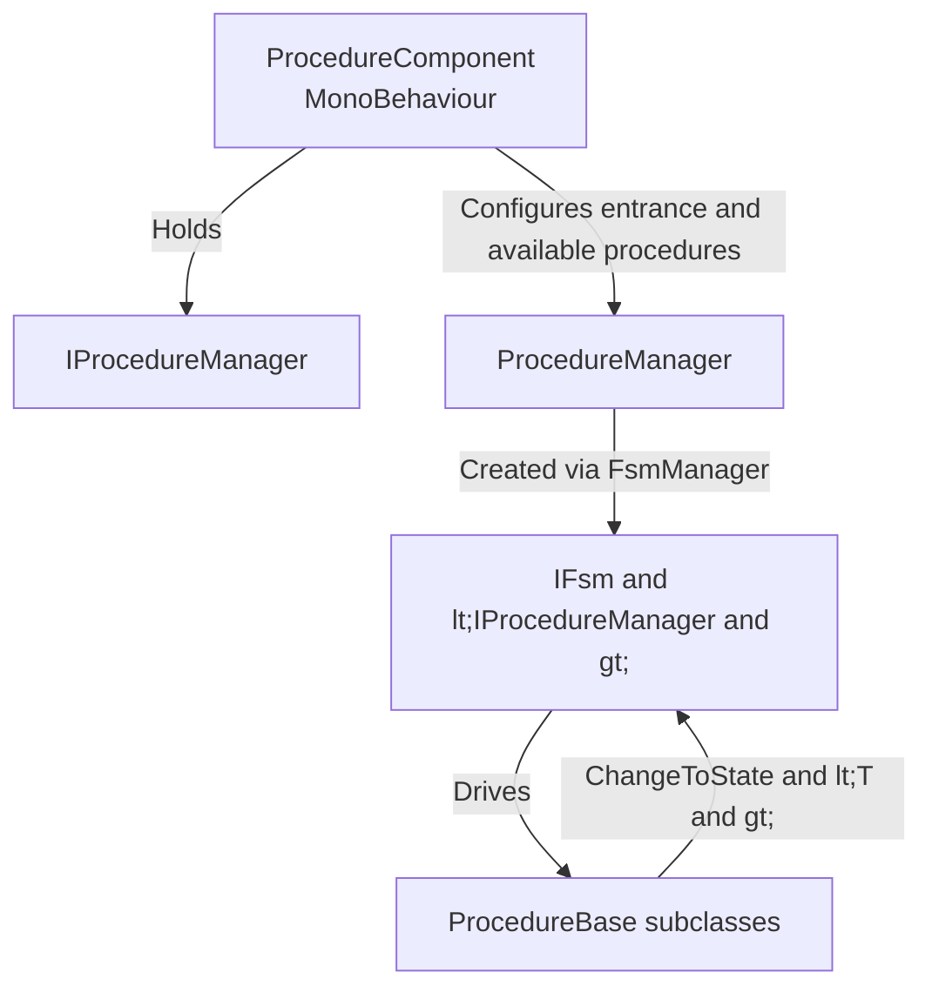

# What is Procedure

Procedure is a Finite State Machine (FSM)-based game flow management solution provided by GameFrameX for Unity. It breaks down the game lifecycle into a set of switchable "flow states" (splash screen, preload, login, main menu, etc.), driven by `ProcedureComponent` which controls the FSM inside `ProcedureManager` to automatically transition between states. This allows startup ordering, resource loading, and scene transitions to be controlled by code rather than scattered `MonoBehaviour` scripts.

## Quick Start

1. Add the dependency to `Packages/manifest.json` in your Unity project (choose either):
   - Via scoped registry: `https://gameframex.upm.alianblank.uk`, scope `com.gameframex`, dependency `com.gameframex.unity.procedure`.
   - Direct Git URL: `https://github.com/gameframex/com.gameframex.unity.procedure.git`.
2. Create your own procedure class, inherit from [ProcedureBase.cs](https://github.com/GameFrameX/com.gameframex.unity.procedure/blob/main/Runtime/Procedure/ProcedureBase.cs#L38-L99) and override the lifecycle callbacks.
3. Add `ProcedureComponent` to a scene via the `GameFrameX/Procedure` menu, fill the procedure class names into *Available Procedures* in the Inspector, and specify the *Entrance Procedure*.
4. Run the game; the framework will start with the entrance procedure and switch to the next phase in `OnUpdate` via `ChangeToState<T>`.

Below is a minimal three-stage "Splash → Preload → Main Menu" procedure example:

```csharp
using GameFrameX.Procedure.Runtime;
using GameFrameX.Fsm.Runtime;

public class ProcedureSplash : ProcedureBase
{
    protected internal override void OnEnter(IFsm<IProcedureManager> procedureOwner)
    {
        // Show splash screen
    }

    protected internal override void OnUpdate(IFsm<IProcedureManager> procedureOwner, float elapseSeconds, float realElapseSeconds)
    {
        ChangeToState<ProcedurePreload>(procedureOwner);
    }
}

public class ProcedurePreload : ProcedureBase
{
    protected internal override void OnEnter(IFsm<IProcedureManager> procedureOwner)
    {
        // Load game resources
    }

    protected internal override void OnUpdate(IFsm<IProcedureManager> procedureOwner, float elapseSeconds, float realElapseSeconds)
    {
        ChangeToState<ProcedureMain>(procedureOwner);
    }
}

public class ProcedureMain : ProcedureBase
{
    protected internal override void OnEnter(IFsm<IProcedureManager> procedureOwner)
    {
        // Show main menu
    }
}
```

Source: [README.zh-CN.md](https://github.com/GameFrameX/com.gameframex.unity.procedure/blob/main/README.zh-CN.md#L86-L110)

## How It Works

The Procedure package revolves around the collaboration of three core types:



- **ProcedureComponent** — The entry point attached to a GameObject, responsible for registering `IProcedureManager`, reading Inspector configuration, and triggering startup; see [ProcedureComponent.cs](https://github.com/GameFrameX/com.gameframex.unity.procedure/blob/main/Runtime/Procedure/ProcedureComponent.cs#L46-L99).
- **ProcedureManager** — The actual owner of the FSM, managing all procedure instances and state transitions.
- **ProcedureBase** — Inherits from `FsmState<IProcedureManager>`, providing six lifecycle callbacks: `OnInit / OnEnter / OnUpdate / OnFixedUpdate / OnLeave / OnDestroy`.

Each procedure class uses `ChangeToState<T>(procedureOwner)` to actively declare "where to jump next once the condition is met," consolidating transition logic within the procedure itself and avoiding scattered transitions across UI/resource scripts.

## Next Steps

- To learn about the complete list of lifecycle callbacks and typical usage, see "Procedure Lifecycle".
- To insert custom logic during the initialization phase or avoid `Already exist FSM` conflicts, see "UseStartupRunner Pattern".
- To browse all public APIs (properties, method signatures), see "API Reference".
- When encountering `Procedure not found` or procedures not switching issues, see "Common Errors and Troubleshooting".