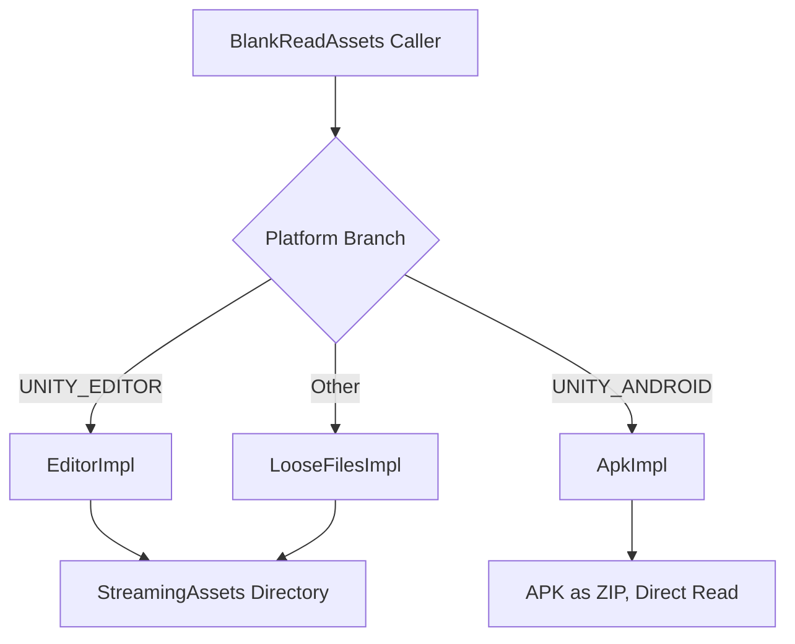

# How It Works: StreamingAssets and APK Unified Access

GameFrameX.ReadAssets provides a unified `System.IO`-style API that simultaneously supports two scenarios: "reading the StreamingAssets directory on regular platforms" and "reading `assets/` directly inside the APK on Android." The implementation is automatically switched at runtime based on the platform, and it auto-initializes on the first API call.

## Quick Start

1. Install via UPM:
   ```json
   {
     "scopedRegistries": [
       {
         "name": "GameFrameX",
         "url": "https://gameframex.upm.alianblank.uk",
         "scopes": ["com.gameframex"]
       }
     ],
     "dependencies": {
       "com.gameframex.unity.readassets": "1.2.0"
     }
   }
   ```
2. Call the static APIs directly in code without manually calling `Initialize` (auto-initializes on first access):
   ```csharp
   using GameFrameX.ReadAssets.Runtime;
   using System.IO;

   // Read text
   string text = BlankReadAssets.ReadAllText("config/game.json");

   // Read via stream
   using (Stream s = BlankReadAssets.OpenRead("data/level1.bin"))
   {
       // ...
   }

   // Load AssetBundle directly (no need to unzip APK first)
   var ab = BlankReadAssets.LoadAssetBundle("bundles/ui.ab");
   ```

> All public APIs are annotated with `[Preserve]`, making them safe for IL2CPP / AOT builds.

## How It Works

The entry point `BlankReadAssets` is a `partial class` that uses `using` aliases to select the internal implementation class based on the platform, thereby deciding at compile time which set of logic to call:

```csharp
#if UNITY_EDITOR
using BlankReadAssetsImpl = GameFrameX.ReadAssets.Runtime.BlankReadAssets.EditorImpl;
#elif UNITY_ANDROID
using BlankReadAssetsImpl = GameFrameX.ReadAssets.Runtime.BlankReadAssets.ApkImpl;
#else
using BlankReadAssetsImpl = GameFrameX.ReadAssets.Runtime.BlankReadAssets.LooseFilesImpl;
#endif
```

Source: [BlankReadAssets.cs](https://github.com/GameFrameX/com.gameframex.unity.readassets/blob/main/Runtime/BlankReadAssets.cs#L11-L17)

The three implementations are responsible for:

| Implementation | Platform | Reading Method |
|--------|------|----------|
| `EditorImpl` | Unity Editor | Goes through the real `StreamingAssets` directory |
| `ApkImpl` | Android (and Editor for debugging APK) | Opens the APK file directly, locates entries under `assets/` via ZIP local file headers and reads them |
| `LooseFilesImpl` | Other platforms (PC, iOS, WebGL, etc.) | Goes through the file system |



### Key Approach to Reading Android APK

On Android, `StreamingAssets` is actually located at the `assets/` path inside the APK. `ApkImpl` parses the ZIP central directory of the APK during initialization, sorts all entries under `assets/` by path, and caches them into two arrays: `s_paths` and `s_streamingAssets`:

```csharp
public static void Initialize(string dataPath, string streamingAssetsPath)
{
    s_root = dataPath;
    // ...
    GetStreamingAssetsInfoFromJar(s_root, paths, parts);
    s_paths = paths.ToArray();
    s_streamingAssets = parts.ToArray();
}
```

Source: [BlankReadAssets.ApkImpl.cs](https://github.com/GameFrameX/com.gameframex.unity.readassets/blob/main/Runtime/BlankReadAssets.ApkImpl.cs#L27-L56)

When reading, `TryGetInfo` uses binary search to locate the entry, obtaining the file's `offset` / `size` / `crc32`. It then opens the APK file via `File.OpenRead`, and uses `SubReadOnlyStream` to expose the `offset` / `size` range as a read-only sub-stream:

```csharp
public static Stream OpenRead(string path)
{
    ReadInfo info;
    if (!TryGetInfo(path, out info))
    {
        ThrowFileNotFound(path);
    }

    Stream fileStream = File.OpenRead(info.readPath);
    try
    {
        return new SubReadOnlyStream(fileStream, info.offset, info.size, leaveOpen: false);
    }
    catch (System.Exception)
    {
        fileStream.Dispose();
        throw;
    }
}
```

Source: [BlankReadAssets.ApkImpl.cs](https://github.com/GameFrameX/com.gameframex.unity.readassets/blob/main/Runtime/BlankReadAssets.ApkImpl.cs#L208-L226)

> This is why `AssetBundle.LoadFromFileAsync` works on Android: it only needs "readable + known offset," and `ApkImpl` obtains the offset in advance via the ZIP central directory, eliminating the need to unzip the entire APK.

### Lazy Initialization and Thread Safety

`BlankReadAssets` uses the `s_initialized` flag to ensure that `Initialize` runs only once:

```csharp
private static void EnsureInitialized()
{
    if (!s_initialized)
    {
        Initialize();
        s_initialized = true;
    }
}
```

Source: [BlankReadAssets.cs](https://github.com/GameFrameX/com.gameframex.unity.readassets/blob/main/Runtime/BlankReadAssets.cs#L37-L44)

All reading-related APIs (`FileExists` / `OpenRead` / `ReadAllBytes` / `GetFiles`, etc.) call `EnsureInitialized()` first before delegating to `BlankReadAssetsImpl`, so in most scenarios callers don't need to worry about initialization timing.

## Next Steps

- To read files or text directly, see "How to Read StreamingAssets Text and Binary"
- To load AssetBundles directly, see "How to Load AssetBundles from StreamingAssets"
- For issues like "file not found" or "compressed resources cannot be read," see "FAQ and Troubleshooting"