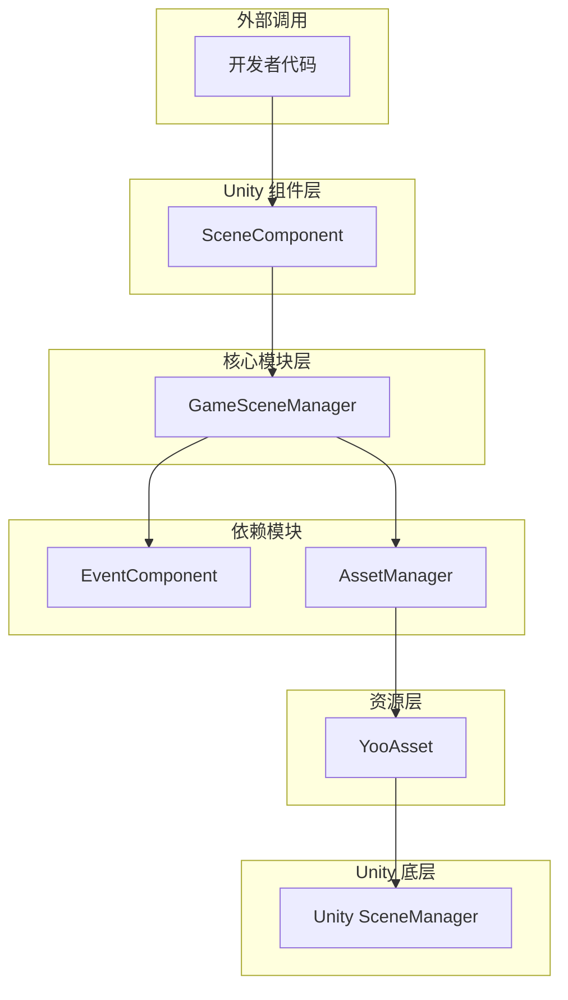
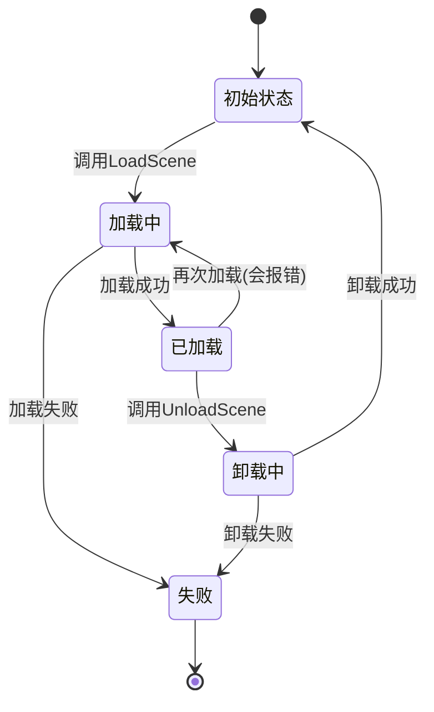
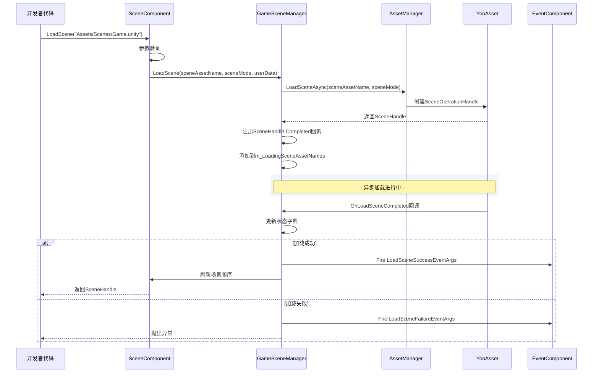

# 概述

GameFrameX Scene 场景管理组件是 GameFrameX 游戏框架的核心模块之一，提供了一套完整的 Unity 场景管理解决方案。该组件支持异步场景加载与卸载、加载进度跟踪、场景状态查询以及事件回调等功能。

## 概述

Scene 场景管理组件是 GameFrameX 框架中专门负责处理 Unity 场景加载与卸载的模块。它封装了底层的资源加载机制，通过 YooAsset 资源管理系统实现高效的异步场景加载，同时提供了完善的事件机制用于监听场景状态变化。

### 核心职责

Scene 组件的主要职责包括：

- **异步场景加载**：支持异步加载 Unity 场景，不阻塞主线程
- **场景卸载管理**：安全卸载已加载的场景资源
- **状态追踪**：维护所有场景的加载状态（已加载、加载中、卸载中）
- **事件通知**：通过事件系统通知场景状态变化
- **主摄像机管理**：自动追踪和管理主摄像机
- **场景顺序控制**：支持设置场景激活顺序

### 设计意图

该组件采用分层架构设计，将场景管理的核心逻辑与 Unity 组件进行分离。`GameSceneManager` 作为核心模块处理所有场景操作，而 `SceneComponent` 作为 Unity 组件提供面向开发者的便捷接口。这种设计使得核心逻辑更加清晰，便于单元测试和模块复用。

组件使用 YooAsset 作为底层资源加载系统，这保证了场景加载的高效性和可靠性。同时，通过事件系统与其他 GameFrameX 组件（如 EventComponent、AssetComponent）进行解耦，实现了良好的模块化设计。

## 架构



### 组件层级说明

**Unity 组件层（SceneComponent）**

`SceneComponent` 是继承自 `GameFrameworkComponent` 的 Unity 组件，挂在到 GameObject 上即可使用。它负责初始化 `GameSceneManager` 模块，并将场景事件转发给 `EventComponent`。

> Source: [SceneComponent.cs](https://github.com/GameFrameX/com.gameframex.unity.scene/blob/main/Runtime/Scene/SceneComponent.cs#L49-L50)

**核心模块层（GameSceneManager）**

`GameSceneManager` 是继承自 `GameFrameworkModule` 的核心模块，实现了 `IGameSceneManager` 接口。它负责所有场景管理相关的核心逻辑，包括场景加载、卸载、状态追踪等。

> Source: [GameSceneManager.cs](https://github.com/GameFrameX/com.gameframex.unity.scene/blob/main/Runtime/Scene/Scene/GameSceneManager.cs#L47-L47)

**依赖模块**

- **EventComponent**：负责事件的发送和接收
- **AssetManager（IAssetManager）**：资源管理接口，由 YooAsset 实现

## 核心概念

### 场景加载模式

组件支持两种 Unity 场景加载模式：

| 模式 | 说明 | 使用场景 |
|------|------|----------|
| `LoadSceneMode.Single` | 单一模式，加载新场景时自动卸载当前场景 | 主场景切换 |
| `LoadSceneMode.Additive` | 叠加模式，新场景与现有场景共存 | 多人游戏子场景、UI 层叠 |

### 场景状态

组件通过三个字典维护场景状态：



### 事件系统

组件定义了五个核心事件用于监听场景状态变化：

| 事件 | 说明 | 触发时机 |
|------|------|----------|
| `LoadSceneSuccess` | 加载成功事件 | 场景成功加载完成后 |
| `LoadSceneFailure` | 加载失败事件 | 场景加载失败时 |
| `LoadSceneUpdate` | 加载进度更新事件 | 场景加载过程中 |
| `UnloadSceneSuccess` | 卸载成功事件 | 场景成功卸载后 |
| `UnloadSceneFailure` | 卸载失败事件 | 场景卸载失败时 |

## 场景加载流程



## 核心功能特性

### 1. 异步场景加载

组件完全基于异步设计，所有场景加载操作都返回 `Task<SceneHandle>`，不会阻塞主线程。这对于需要展示加载界面的游戏尤为重要。

```csharp
// 异步加载场景
var handle = await sceneComponent.LoadScene("Assets/Scenes/Main.unity");
```
> Source: [SceneComponent.cs#L280-L283](https://github.com/GameFrameX/com.gameframex.unity.scene/blob/main/Runtime/Scene/SceneComponent.cs#L280-L283)

### 2. 场景状态查询

开发者可以随时查询场景的当前状态：

```csharp
// 检查场景是否已加载
if (sceneComponent.SceneIsLoaded("Assets/Scenes/Main.unity"))
{
    // 场景已加载
}

// 检查场景是否正在加载
if (sceneComponent.SceneIsLoading("Assets/Scenes/Main.unity"))
{
    // 场景正在加载
}

// 获取所有已加载场景
var loadedScenes = sceneComponent.GetLoadedSceneAssetNames();
```
> Source: [SceneComponent.cs#L174-L186](https://github.com/GameFrameX/com.gameframex.unity.scene/blob/main/Runtime/Scene/SceneComponent.cs#L174-L186)

### 3. 场景顺序管理

组件支持设置场景的激活顺序，确保多个叠加场景按照正确的顺序激活：

```csharp
// 设置场景顺序，数值越大越优先激活
sceneComponent.SetSceneOrder("Assets/Scenes/Game.unity", 100);
```
> Source: [SceneComponent.cs#L338-L367](https://github.com/GameFrameX/com.gameframex.unity.scene/blob/main/Runtime/Scene/SceneComponent.cs#L338-L367)

### 4. 主摄像机管理

组件自动追踪当前激活场景中的主摄像机：

```csharp
// 刷新主摄像机引用
sceneComponent.RefreshMainCamera();

// 获取当前主摄像机
var mainCamera = sceneComponent.MainCamera;
```
> Source: [SceneComponent.cs#L369-L375](https://github.com/GameFrameX/com.gameframex.unity.scene/blob/main/Runtime/Scene/SceneComponent.cs#L369-L375)

### 5. 事件监听

开发者可以订阅场景事件来响应状态变化：

```csharp
// 订阅场景加载成功事件
sceneComponent.LoadSceneSuccess += OnLoadSceneSuccess;

private void OnLoadSceneSuccess(object sender, LoadSceneSuccessEventArgs e)
{
    Debug.Log($"场景 {e.SceneAssetName} 加载成功，耗时 {e.Duration} 秒");
}
```
> Source: [SceneComponent.cs#L89-L95](https://github.com/GameFrameX/com.gameframex.unity.scene/blob/main/Runtime/Scene/SceneComponent.cs#L89-L95)

## 依赖关系

Scene 组件依赖于以下 GameFrameX 模块：

| 依赖模块 | 说明 | 依赖类型 |
|----------|------|----------|
| GameFrameX.Runtime | 框架核心运行时 | 强依赖 |
| GameFrameX.Event.Runtime | 事件系统 | 强依赖 |
| GameFrameX.Asset.Runtime | 资源管理系统 | 强依赖 |
| YooAsset | 资源加载底层实现 | 强依赖 |

> Source: [GameFrameX.Scene.Runtime.asmdef](https://github.com/GameFrameX/com.gameframex.unity.scene/blob/main/Runtime/GameFrameX.Scene.Runtime.asmdef#L3-L8)

## 版本信息

| 版本 | 发布日期 | 主要变更 |
|------|----------|----------|
| 2.1.2 | 2026-03-16 | 修复加载成功回调参数 |
| 2.1.1 | 2026-03-13 | 修复场景加载状态判断 |
| 2.1.0 | 2025-12-23 | 更新场景管理器 |
| 2.0.0 | 2025-10-25 | 架构重大升级 |

> Source: [CHANGELOG.md](https://github.com/GameFrameX/com.gameframex.unity.scene/blob/main/CHANGELOG.md)

## 相关链接

- [安装指南](./02.installation)
- [快速入门](./03.getting-started)
- [核心功能](./04.core-features)
- [API 参考](./05.api-reference)
- [事件系统](./06.events)
<!-- - [常见问题](./07.troubleshooting) -->
- [GitHub 仓库](https://github.com/GameFrameX/com.gameframex.unity.scene.git)
- [官方文档](https://gameframex.doc.alianblank.com/)
