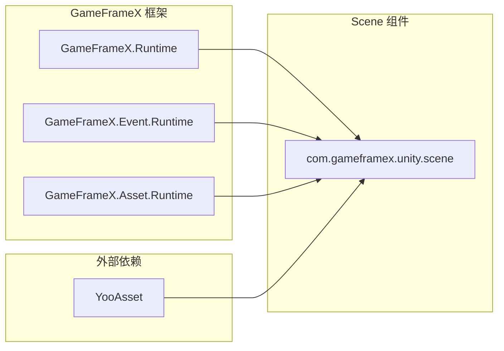
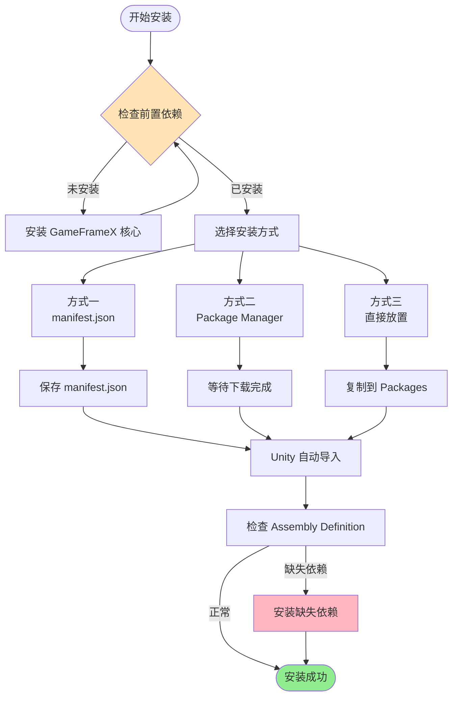

# 安装

GameFrameX Scene 场景管理组件的安装指南。

## 概述

GameFrameX Scene 是 GameFrameX 框架的场景管理组件，提供统一的场景加载、卸载和管理功能。在使用本组件前，需要先完成安装配置。本文档将介绍三种推荐的安装方式以及依赖项配置。

> 当前版本：2.1.2
> 最低 Unity 版本：2017.1

## 前置要求

在安装 Scene 组件前，请确保您的项目满足以下要求：

| 要求 | 说明 |
|------|------|
| Unity 版本 | 2017.1 或更高版本 |
| GameFrameX 核心 | 需要先安装 GameFrameX.Runtime |
| YooAsset | 需要安装 YooAsset 资源管理系统 |

### 依赖项说明

Scene 组件依赖于以下核心模块：



**核心依赖**：
- **GameFrameX.Runtime**: 框架核心运行时
- **GameFrameX.Event.Runtime**: 事件系统运行时
- **GameFrameX.Asset.Runtime**: 资源管理运行时
- **YooAsset**: 资源打包和管理解决方案

## 安装方式

### 方式一：通过 manifest.json 安装（推荐）

这是最推荐的安装方式，方便版本管理和更新。

1. 打开 Unity 项目中的 `Packages/manifest.json` 文件
2. 在 `dependencies` 节点下添加以下内容：

```json
{
  "dependencies": {
    "com.gameframex.unity.scene": "https://github.com/GameFrameX/com.gameframex.unity.scene.git"
  }
}
```

3. 保存文件后，Unity 会自动下载并导入包

> Source: [README.md](https://github.com/GameFrameX/com.gameframex.unity.scene/blob/main/README.md#L11-L14)

### 方式二：通过 Unity Package Manager 安装

1. 打开 Unity 编辑器
2. 选择 **Window > Package Manager** 打开包管理器
3. 点击左上角的 **+** 按钮
4. 选择 **Add package from git URL**
5. 输入以下 Git URL：
   ```
   https://github.com/GameFrameX/com.gameframex.unity.scene.git
   ```
6. 点击 **Add** 按钮等待安装完成

> Source: [README.md](https://github.com/GameFrameX/com.gameframex.unity.scene/blob/main/README.md#L15-L15)

### 方式三：直接放置到 Packages 文件夹

1. 克隆或下载本仓库：
   ```
   https://github.com/GameFrameX/com.gameframex.unity.scene.git
   ```
2. 将整个仓库文件夹复制到您 Unity 项目的 `Packages` 目录下
3. Unity 会自动识别并加载包

> Source: [README.md](https://github.com/GameFrameX/com.gameframex.unity.scene/blob/main/README.md#L16-L16)

## 安装流程



## 验证安装

安装完成后，可以通过以下方式验证：

1. **检查 Package Manager**：在 Package Manager 中确认 `com.gameframex.unity.scene` 已显示
2. **检查程序集**：确认 `GameFrameX.Scene.Runtime` 和 `GameFrameX.Scene.Editor` 程序集已生成
3. **检查菜单**：确认 Unity 菜单中出现了 Scene 相关的功能菜单

## 依赖项安装

Scene 组件需要预先安装以下依赖包，请按顺序安装：

1. **GameFrameX.Runtime** - 核心运行时
2. **GameFrameX.Event.Runtime** - 事件系统
3. **GameFrameX.Asset.Runtime** - 资源管理
4. **YooAsset** - 资源打包系统

这些依赖项可以通过相同的方式安装：

```json
{
  "dependencies": {
    "com.gameframex.unity.core": "https://github.com/GameFrameX/com.gameframex.unity.core.git",
    "com.gameframex.unity.event": "https://github.com/GameFrameX/com.gameframex.unity.event.git",
    "com.gameframex.unity.asset": "https://github.com/GameFrameX/com.gameframex.unity.asset.git",
    "com.yooasset.rm": "https://github.com/yoopackage/yoosee.git"
  }
}
```

## 包信息

| 属性 | 值 |
|------|------|
| 包名 | com.gameframex.unity.scene |
| 显示名称 | Game Frame X Scene |
| 版本 | 2.1.2 |
| 分类 | Game Framework X |
| 仓库 | https://github.com/GameFrameX/com.gameframex.unity.scene.git |

> Source: [package.json](https://github.com/GameFrameX/com.gameframex.unity.scene/blob/main/package.json#L2-L8)

## 相关链接

- [概述](./1-overview) - 了解 Scene 组件的核心功能
- [快速入门](./3-getting-started) - 开始使用 Scene 组件
- [核心功能](./4-core-features) - 了解更多功能特性
- [API 参考](./5-api-reference) - 完整的 API 文档
- [GitHub 仓库](https://github.com/GameFrameX/com.gameframex.unity.scene.git) - 源码和更新日志
