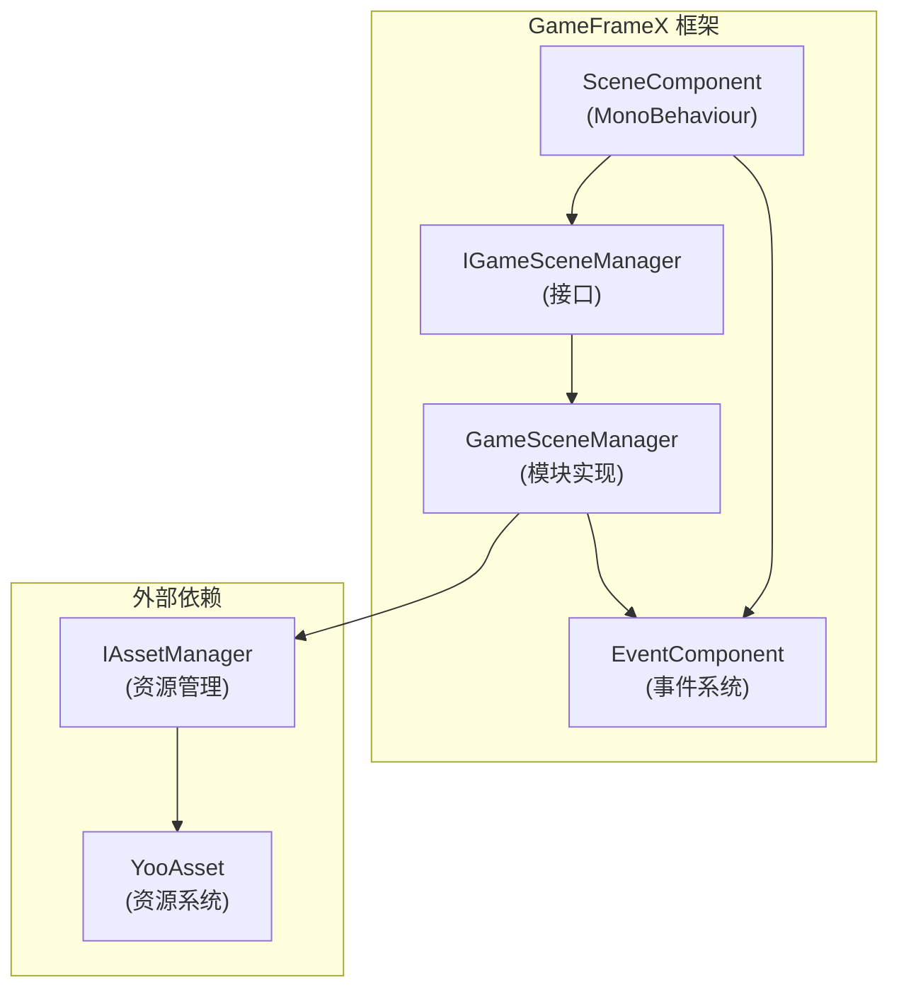
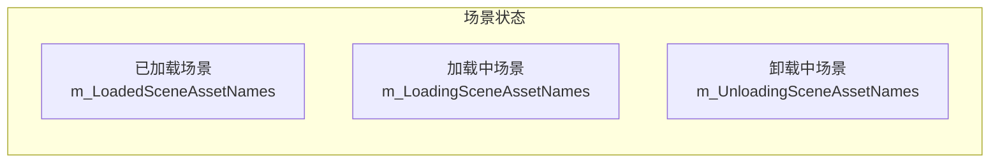
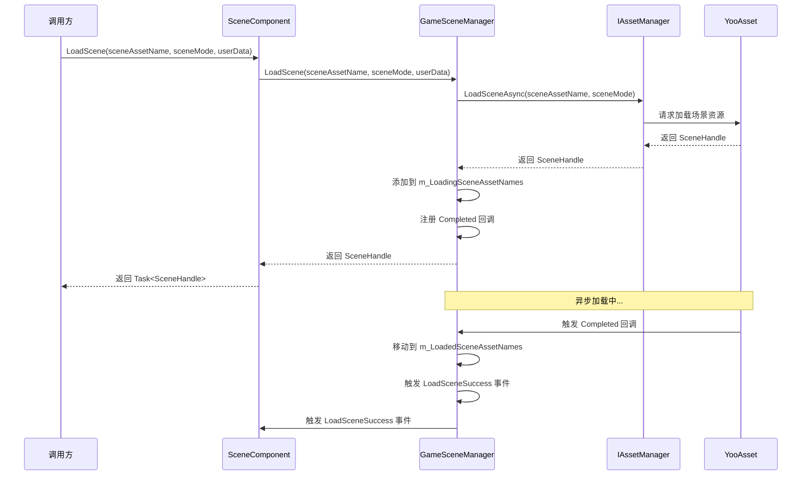
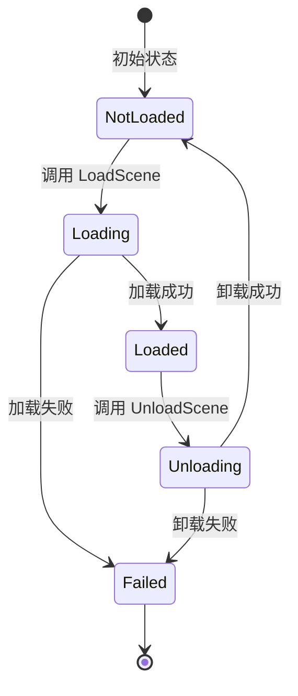
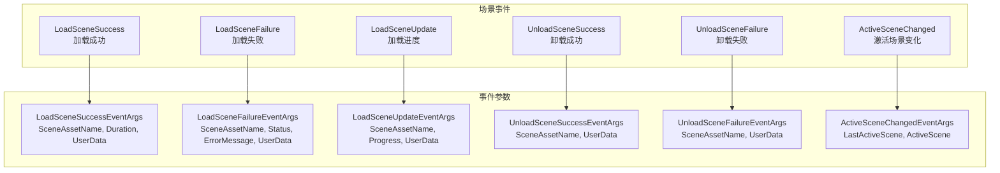

# 核心功能

GameFrameX Scene 场景管理组件提供了完整的异步场景加载、卸载、状态查询和事件通知功能，是游戏开发中管理多个场景的核心模块。

## 概述

Scene 组件是 GameFrameX 框架的核心模块之一，专门用于管理 Unity 游戏中的场景资源。该组件基于 YooAsset 资源管理系统构建，提供了以下核心能力：

- **异步场景加载**：支持异步加载场景资源，无需阻塞主线程
- **场景状态管理**：查询场景的加载、卸载状态
- **场景激活控制**：管理当前激活的场景和主摄像机
- **事件驱动**：完整的事件系统用于监听场景状态变化
- **场景优先级**：支持设置场景加载优先级，控制激活顺序

### 核心设计理念

Scene 组件采用模块化设计，将业务逻辑与 Unity 组件分离。`SceneComponent` 作为 Unity 组件挂载到 GameObject 上，而核心逻辑由 `GameSceneManager` 模块处理。这种设计使得代码更加清晰，便于测试和维护。



## 场景状态管理

Scene 组件维护了三个内部字典来追踪场景状态，这种设计确保了高效的状态查询：



### 状态查询方法

Scene 组件提供了完整的场景状态查询 API，可以准确获取任意场景的当前状态：

```csharp
// 检查场景是否已加载
bool isLoaded = sceneComponent.SceneIsLoaded("Assets/Scenes/MainMenu.unity");

// 检查场景是否正在加载
bool isLoading = sceneComponent.SceneIsLoading("Assets/Scenes/GamePlay.unity");

// 检查场景是否正在卸载
bool isUnloading = sceneComponent.SceneIsUnloading("Assets/Scenes/MainMenu.unity");

// 获取所有已加载场景的名称
string[] loadedScenes = sceneComponent.GetLoadedSceneAssetNames();

// 获取所有正在加载的场景名称
string[] loadingScenes = sceneComponent.GetLoadingSceneAssetNames();

// 获取所有正在卸载的场景名称
string[] unloadingScenes = sceneComponent.GetUnloadingSceneAssetNames();
```
> Source: [SceneComponent.cs](https://github.com/GameFrameX/com.gameframex.unity.scene/blob/main/Runtime/Scene/SceneComponent.cs#L174-L251)

### 场景存在性检查

在加载场景前，可以先检查场景资源是否存在：

```csharp
// 检查场景资源是否存在
bool hasScene = sceneComponent.HasScene("Assets/Scenes/GamePlay.unity");
```
> Source: [SceneComponent.cs](https://github.com/GameFrameX/com.gameframex.unity.scene/blob/main/Runtime/Scene/SceneComponent.cs#L258-L274)

## 场景加载与卸载

### 加载场景

Scene 组件支持多种加载模式，可以根据游戏需求选择合适的加载方式：



#### 基础加载

最简单的场景加载方式，无需指定加载模式：

```csharp
// 加载单个场景（使用默认的 Additive 模式）
var handle = await sceneComponent.LoadScene("Assets/Scenes/GamePlay.unity");
```
> Source: [SceneComponent.cs](https://github.com/GameFrameX/com.gameframex.unity.scene/blob/main/Runtime/Scene/SceneComponent.cs#L280-L283)

#### 带模式的加载

可以指定加载模式（Single 或 Additive）和用户自定义数据：

```csharp
// 使用 Single 模式加载（替换当前场景）
var handle = await sceneComponent.LoadScene(
    "Assets/Scenes/GamePlay.unity", 
    LoadSceneMode.Single, 
    null  // 用户自定义数据
);

// 使用 Additive 模式加载（叠加场景）
var handle = await sceneComponent.LoadScene(
    "Assets/Scenes/GamePlay.unity", 
    LoadSceneMode.Additive, 
    new { level = 1 }  // 自定义数据
);
```
> Source: [SceneComponent.cs](https://github.com/GameFrameX/com.gameframex.unity.scene/blob/main/Runtime/Scene/SceneComponent.cs#L291-L307)

**LoadSceneMode 说明：**
- **Single**：替换当前活动场景，加载完成后只保留新场景
- **Additive**：将新场景叠加到当前场景，保留所有已加载的场景

### 卸载场景

卸载场景是将已加载的场景从内存中移除的过程：

```csharp
// 卸载指定场景
sceneComponent.UnloadScene("Assets/Scenes/MainMenu.unity");

// 卸载场景并传递用户自定义数据
sceneComponent.UnloadScene("Assets/Scenes/MainMenu.unity", new { reason = "quit" });
```
> Source: [SceneComponent.cs](https://github.com/GameFrameX/com.gameframex.unity.scene/blob/main/Runtime/Scene/SceneComponent.cs#L314-L331)

### 加载流程详解

场景加载过程中，组件会经历多个状态转换。理解这些状态有助于更好地处理异步加载逻辑：

1. **初始状态**：场景不在任何字典中
2. **加载中**：场景添加到 `m_LoadingSceneAssetNames`，触发 `LoadSceneUpdate` 事件
3. **加载完成**：场景移动到 `m_LoadedSceneAssetNames`，触发 `LoadSceneSuccess` 事件
4. **卸载中**：场景添加到 `m_UnloadingSceneAssetNames`
5. **卸载完成**：场景从所有字典中移除，触发 `UnloadSceneSuccess` 事件



## 场景激活与主摄像机管理

### 活动场景管理

Scene 组件支持设置场景的加载顺序，并根据顺序自动激活最优先的场景：

```csharp
// 设置场景加载优先级（数值越大优先级越高）
sceneComponent.SetSceneOrder("Assets/Scenes/MainMenu.unity", 1);
sceneComponent.SetSceneOrder("Assets/Scenes/GamePlay.unity", 10);
```
> Source: [SceneComponent.cs](https://github.com/GameFrameX/com.gameframex.unity.scene/blob/main/Runtime/Scene/SceneComponent.cs#L338-L367)

当多个场景叠加加载时，优先级最高的场景会自动成为活动场景。

### 主摄像机刷新

组件会自动追踪当前活动场景的主摄像机：

```csharp
// 刷新主摄像机引用
sceneComponent.RefreshMainCamera();

// 获取当前主摄像机
Camera mainCam = sceneComponent.MainCamera;
```
> Source: [SceneComponent.cs](https://github.com/GameFrameX/com.gameframex.unity.scene/blob/main/Runtime/Scene/SceneComponent.cs#L372-L375)

### 激活场景变化事件

当活动场景发生变化时，会触发相应事件：

```csharp
m_EventComponent.Fire(this, ActiveSceneChangedEventArgs.Create(lastActiveScene, activeScene));
```
> Source: [SceneComponent.cs](https://github.com/GameFrameX/com.gameframex.unity.scene/blob/main/Runtime/Scene/SceneComponent.cs#L431)

## 事件系统

Scene 组件提供了完善的事件系统，开发者可以通过订阅事件来响应场景状态变化。这种设计实现了松耦合的通信方式，使得不同模块可以独立响应场景事件。



### 订阅场景事件

在 `SceneComponent` 初始化时，会自动订阅内部事件并转发给 `EventComponent`：

```csharp
_gameSceneManager.LoadSceneSuccess += OnLoadGameSceneSuccess;
_gameSceneManager.LoadSceneFailure += OnLoadGameSceneFailure;
_gameSceneManager.LoadSceneUpdate += OnLoadGameSceneUpdate;
_gameSceneManager.UnloadSceneSuccess += OnUnloadGameSceneSuccess;
_gameSceneManager.UnloadSceneFailure += OnUnloadGameSceneFailure;
```
> Source: [SceneComponent.cs](https://github.com/GameFrameX/com.gameframex.unity.scene/blob/main/Runtime/Scene/SceneComponent.cs#L89-L103)

### 事件使用示例

```csharp
// 订阅加载成功事件
EventComponent.Subscribe<LoadSceneSuccessEventArgs>(OnLoadSceneSuccess);

private void OnLoadSceneSuccess(object sender, LoadSceneSuccessEventArgs e)
{
    Debug.Log($"场景加载成功: {e.SceneAssetName}, 耗时: {e.Duration}秒");
}

// 订阅加载进度事件
EventComponent.Subscribe<LoadSceneUpdateEventArgs>(OnLoadSceneUpdate);

private void OnLoadSceneUpdate(object sender, LoadSceneUpdateEventArgs e)
{
    Debug.Log($"加载进度: {e.SceneAssetName}, {e.Progress * 100}%");
}

// 订阅卸载成功事件
EventComponent.Subscribe<UnloadSceneSuccessEventArgs>(OnUnloadSceneSuccess);

private void OnUnloadSceneSuccess(object sender, UnloadSceneSuccessEventArgs e)
{
    Debug.Log($"场景卸载成功: {e.SceneAssetName}");
}
```

## 组件配置

### SceneComponent 属性

`SceneComponent` 继承自 `GameFrameworkComponent`，挂载到 Unity 场景中时会自动初始化：

```csharp
[DisallowMultipleComponent]
[AddComponentMenu("GameFrameX/Scene")]
public sealed class SceneComponent : GameFrameworkComponent
{
    [SerializeField] private bool m_EnableLoadSceneUpdateEvent = true;
    [SerializeField] private bool m_EnableLoadSceneDependencyAssetEvent = true;
}
```
> Source: [SceneComponent.cs](https://github.com/GameFrameX/com.gameframex.unity.scene/blob/main/Runtime/Scene/SceneComponent.cs#L47-L64)

### 配置说明

| 属性 | 类型 | 默认值 | 说明 |
|------|------|--------|------|
| `m_EnableLoadSceneUpdateEvent` | bool | true | 是否启用场景加载进度更新事件 |
| `m_EnableLoadSceneDependencyAssetEvent` | bool | true | 是否启用依赖资源加载事件 |

### 编辑器 Inspector

在 Unity 编辑器中，可以查看当前场景状态：

```csharp
// Inspector 中显示的信息
EditorGUILayout.LabelField("Loaded Scene Asset Names", GetSceneNameString(t.GetLoadedSceneAssetNames()));
EditorGUILayout.LabelField("Loading Scene Asset Names", GetSceneNameString(t.GetLoadingSceneAssetNames()));
EditorGUILayout.LabelField("Unloading Scene Asset Names", GetSceneNameString(t.GetUnloadingSceneAssetNames()));
EditorGUILayout.ObjectField("Main Camera", t.MainCamera, typeof(Camera), true);
```
> Source: [SceneComponentInspector.cs](https://github.com/GameFrameX/com.gameframex.unity.scene/blob/main/Editor/Inspector/SceneComponentInspector.cs#L64-L67)

## 核心流程

### 完整的场景切换流程

以下是一个完整的场景切换示例，展示了各个组件的协作过程：

```csharp
public class GameSceneController : MonoBehaviour
{
    private SceneComponent _sceneComponent;
    private EventComponent _eventComponent;

    private void Start()
    {
        _sceneComponent = GameEntry.GetComponent<SceneComponent>();
        _eventComponent = GameEntry.GetComponent<EventComponent>();
        
        // 订阅事件
        _eventComponent.Subscribe<LoadSceneSuccessEventArgs>(OnLoadSceneSuccess);
        _eventComponent.Subscribe<LoadSceneFailureEventArgs>(OnLoadSceneFailure);
    }

    // 切换到游戏场景
    public async void SwitchToGameScene()
    {
        try
        {
            // 设置场景优先级
            _sceneComponent.SetSceneOrder("Assets/Scenes/GamePlay.unity", 10);
            
            // 异步加载场景
            var handle = await _sceneComponent.LoadScene(
                "Assets/Scenes/GamePlay.unity",
                LoadSceneMode.Additive,
                new { timestamp = Time.time }
            );
            
            Debug.Log($"场景加载完成: {handle.Scene.name}");
        }
        catch (Exception ex)
        {
            Debug.LogError($"场景加载失败: {ex.Message}");
        }
    }

    private void OnLoadSceneSuccess(object sender, LoadSceneSuccessEventArgs e)
    {
        Debug.Log($"场景 {e.SceneAssetName} 加载成功，耗时 {e.Duration} 秒");
    }

    private void OnLoadSceneFailure(object sender, LoadSceneFailureEventArgs e)
    {
        Debug.LogError($"场景 {e.SceneAssetName} 加载失败: {e.ErrorMessage}");
    }
}
```

### 错误处理

`GameSceneManager` 在加载和卸载场景时会进行多重状态检查，防止重复操作：

```csharp
if (SceneIsUnloading(sceneAssetName))
{
    throw new GameFrameworkException(Utility.Text.Format("Scene asset '{0}' is being unloaded.", sceneAssetName));
}

if (SceneIsLoading(sceneAssetName))
{
    throw new GameFrameworkException(Utility.Text.Format("Scene asset '{0}' is being loaded.", sceneAssetName));
}

if (SceneIsLoaded(sceneAssetName))
{
    throw new GameFrameworkException(Utility.Text.Format("Scene asset '{0}' is already loaded.", sceneAssetName));
}
```
> Source: [GameSceneManager.cs](https://github.com/GameFrameX/com.gameframex.unity.scene/blob/main/Runtime/Scene/Scene/GameSceneManager.cs#L360-L373)

## 相关链接

- [快速入门](./3-getting-started) - 了解如何快速集成 Scene 组件
- [API 参考](./5-api-reference) - 完整的 API 接口文档
- [事件系统](./6-events) - 详细的事件系统说明
- [常见问题](./7-troubleshooting) - 常见问题与解决方案
- [GameFrameX 官网](https://gameframex.doc.alianblank.com/) - 官方文档
- [GitHub 仓库](https://github.com/GameFrameX/com.gameframex.unity.scene.git) - 项目源码
