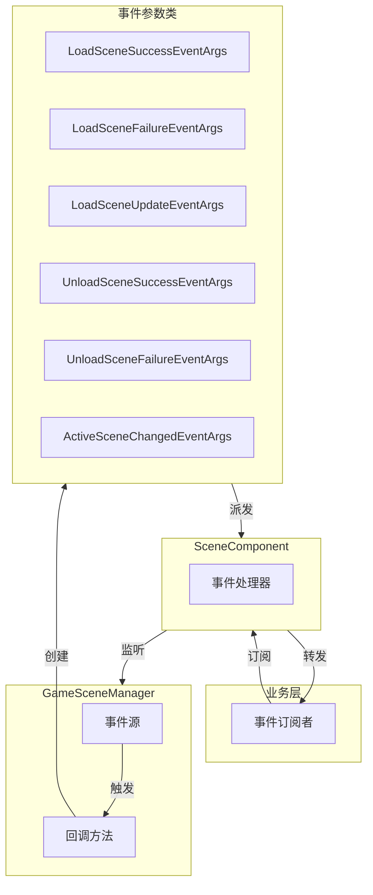
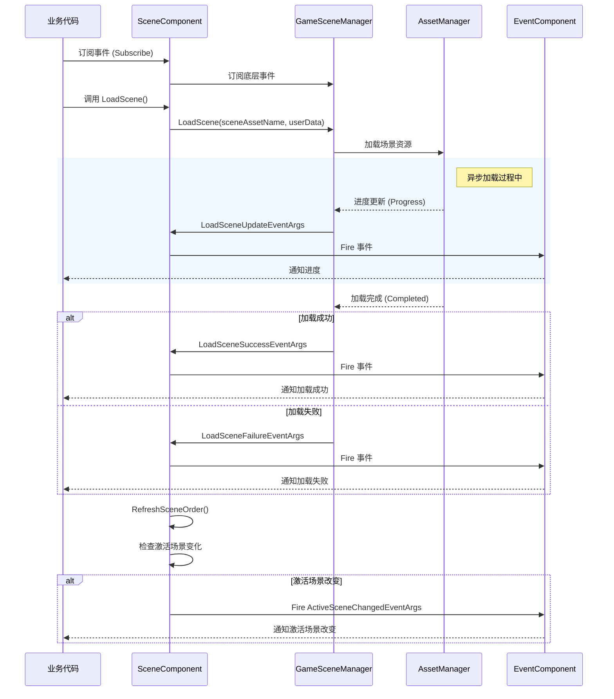

# 事件系统

GameFrameX Scene 场景管理模块提供了完善的事件系统，用于通知场景加载、卸载和激活状态的变化。本文档详细介绍 Scene 模块的事件类型、事件流程以及如何在项目中使用这些事件。

## 概述

事件系统是 Scene 模块的核心组成部分，它采用观察者模式（Observer Pattern）实现，允许开发者在场景状态发生变化时接收通知并执行相应的逻辑。通过事件系统，可以实现：

- **解耦**：场景管理器与业务逻辑通过事件进行通信，降低模块间的耦合度
- **异步支持**：场景加载是异步操作，事件系统提供了进度回调和完成通知
- **状态追踪**：实时了解场景的加载、卸载、激活状态
- **对象池优化**：使用 `ReferencePool` 对事件参数进行复用，减少内存分配

Scene 模块定义了 6 种事件类型，涵盖场景操作的完整生命周期：

| 事件类型 | 说明 | 触发时机 |
|---------|------|---------|
| `LoadSceneSuccessEventArgs` | 加载场景成功事件 | 场景成功加载完成后 |
| `LoadSceneFailureEventArgs` | 加载场景失败事件 | 场景加载失败时 |
| `LoadSceneUpdateEventArgs` | 加载场景更新事件 | 场景加载过程中（进度更新） |
| `UnloadSceneSuccessEventArgs` | 卸载场景成功事件 | 场景成功卸载完成后 |
| `UnloadSceneFailureEventArgs` | 卸载场景失败事件 | 场景卸载失败时 |
| `ActiveSceneChangedEventArgs` | 激活场景改变事件 | 当前激活的场景发生变化时 |

## 架构

Scene 模块的事件系统采用分层架构设计，包含以下几个关键组件：



### 事件流程

场景事件的发生遵循以下典型流程：



### 事件参数类层次结构

所有场景事件参数类都继承自 `GameEventArgs` 基类（来自 GameFrameX.Event 模块），并实现了对象池化机制：

```mermaid
classDiagram
    class GameEventArgs {
        <<abstract>>
        +Id: string { get; }
        +Clear() void
    }
    
    class LoadSceneSuccessEventArgs {
        +EventId: string
        +SceneAssetName: string
        +Duration: float
        +UserData: object
        +Create() LoadSceneSuccessEventArgs
    }
    
    class LoadSceneFailureEventArgs {
        +EventId: string
        +SceneAssetName: string
        +ErrorMessage: string
        +Status: EOperationStatus
        +UserData: object
        +Create() LoadSceneFailureEventArgs
    }
    
    class LoadSceneUpdateEventArgs {
        +EventId: string
        +SceneAssetName: string
        +Progress: float
        +UserData: object
        +Create() LoadSceneUpdateEventArgs
    }
    
    class UnloadSceneSuccessEventArgs {
        +EventId: string
        +SceneAssetName: string
        +UserData: object
        +Create() UnloadSceneSuccessEventArgs
    }
    
    class UnloadSceneFailureEventArgs {
        +EventId: string
        +SceneAssetName: string
        +UserData: object
        +Create() UnloadSceneFailureEventArgs
    }
    
    class ActiveSceneChangedEventArgs {
        +EventId: string
        +LastActiveScene: Scene
        +ActiveScene: Scene
        +Create() ActiveSceneChangedEventArgs
    }
    
    GameEventArgs <|-- LoadSceneSuccessEventArgs
    GameEventArgs <|-- LoadSceneFailureEventArgs
    GameEventArgs <|-- LoadSceneUpdateEventArgs
    GameEventArgs <|-- UnloadSceneSuccessEventArgs
    GameEventArgs <|-- UnloadSceneFailureEventArgs
    GameEventArgs <|-- ActiveSceneChangedEventArgs
```

## 事件详解

### 加载场景成功事件 (LoadSceneSuccessEventArgs)

场景成功加载完成后触发，包含加载耗时信息。

> Source: [LoadSceneSuccessEventArgs.cs](https://github.com/GameFrameX/com.gameframex.unity.scene/blob/main/Runtime/EventArgs/LoadSceneSuccessEventArgs.cs#L40-L105)

**属性说明：**

| 属性 | 类型 | 说明 |
|-----|------|------|
| `SceneAssetName` | string | 场景资源名称 |
| `Duration` | float | 加载持续时间（秒） |
| `UserData` | object | 用户自定义数据 |

### 加载场景失败事件 (LoadSceneFailureEventArgs)

场景加载失败时触发，包含错误信息。

> Source: [LoadSceneFailureEventArgs.cs](https://github.com/GameFrameX/com.gameframex.unity.scene/blob/main/Runtime/EventArgs/LoadSceneFailureEventArgs.cs#L41-L113)

**属性说明：**

| 属性 | 类型 | 说明 |
|-----|------|------|
| `SceneAssetName` | string | 场景资源名称 |
| `ErrorMessage` | string | 错误信息 |
| `Status` | EOperationStatus | 操作状态 |
| `UserData` | object | 用户自定义数据 |

### 加载场景更新事件 (LoadSceneUpdateEventArgs)

场景加载过程中持续触发，用于显示加载进度。

> Source: [LoadSceneUpdateEventArgs.cs](https://github.com/GameFrameX/com.gameframex.unity.scene/blob/main/Runtime/EventArgs/LoadSceneUpdateEventArgs.cs#L40-L105)

**属性说明：**

| 属性 | 类型 | 说明 |
|-----|------|------|
| `SceneAssetName` | string | 场景资源名称 |
| `Progress` | float | 加载进度（0.0 - 1.0） |
| `UserData` | object | 用户自定义数据 |

### 卸载场景成功事件 (UnloadSceneSuccessEventArgs)

场景成功卸载完成后触发。

> Source: [UnloadSceneSuccessEventArgs.cs](https://github.com/GameFrameX/com.gameframex.unity.scene/blob/main/Runtime/EventArgs/UnloadSceneSuccessEventArgs.cs#L40-L96)

**属性说明：**

| 属性 | 类型 | 说明 |
|-----|------|------|
| `SceneAssetName` | string | 场景资源名称 |
| `UserData` | object | 用户自定义数据 |

### 卸载场景失败事件 (UnloadSceneFailureEventArgs)

场景卸载失败时触发。

> Source: [UnloadSceneFailureEventArgs.cs](https://github.com/GameFrameX/com.gameframex.unity.scene/blob/main/Runtime/EventArgs/UnloadSceneFailureEventArgs.cs#L40-L96)

**属性说明：**

| 属性 | 类型 | 说明 |
|-----|------|------|
| `SceneAssetName` | string | 场景资源名称 |
| `UserData` | object | 用户自定义数据 |

### 激活场景改变事件 (ActiveSceneChangedEventArgs)

当前激活的场景发生变化时触发。

> Source: [ActiveSceneChangedEventArgs.cs](https://github.com/GameFrameX/com.gameframex.unity.scene/blob/main/Runtime/EventArgs/ActiveSceneChangedEventArgs.cs#L40-L96)

**属性说明：**

| 属性 | 类型 | 说明 |
|-----|------|------|
| `LastActiveScene` | Scene | 上一个被激活的场景 |
| `ActiveScene` | Scene | 当前被激活的场景 |

## 使用示例

### 基础用法：订阅场景事件

在游戏中，通常需要在游戏入口或特定的管理器中订阅场景事件。以下示例展示如何订阅加载成功和失败事件：

```csharp
using GameFrameX.Scene.Runtime;
using GameFrameX.Runtime;
using UnityEngine;

// 继承自 MonoBehaviour 的脚本
public class SceneEventExample : MonoBehaviour
{
    private SceneComponent _sceneComponent;

    private void Start()
    {
        // 获取 SceneComponent 实例
        _sceneComponent = GameEntry.GetComponent<SceneComponent>();
        
        // 订阅加载成功事件
        _sceneComponent.LoadSceneSuccess += OnLoadSceneSuccess;
        
        // 订阅加载失败事件
        _sceneComponent.LoadSceneFailure += OnLoadSceneFailure;
        
        // 订阅卸载成功事件
        _sceneComponent.UnloadSceneSuccess += OnUnloadSceneSuccess;
        
        // 订阅卸载失败事件
        _sceneComponent.UnloadSceneFailure += OnUnloadSceneFailure;
        
        // 订阅激活场景改变事件
        _sceneComponent.ActiveSceneChanged += OnActiveSceneChanged;
    }

    private void OnLoadSceneSuccess(object sender, LoadSceneSuccessEventArgs e)
    {
        Debug.Log($"场景加载成功: {e.SceneAssetName}, 耗时: {e.Duration:F2}秒");
        
        // 可以通过 UserData 传递自定义数据
        if (e.UserData != null)
        {
            Debug.Log($"用户数据: {e.UserData}");
        }
    }

    private void OnLoadSceneFailure(object sender, LoadSceneFailureEventArgs e)
    {
        Debug.LogError($"场景加载失败: {e.SceneAssetName}, 错误: {e.ErrorMessage}");
    }

    private void OnUnloadSceneSuccess(object sender, UnloadSceneSuccessEventArgs e)
    {
        Debug.Log($"场景卸载成功: {e.SceneAssetName}");
    }

    private void OnUnloadSceneFailure(object sender, UnloadSceneFailureEventArgs e)
    {
        Debug.LogError($"场景卸载失败: {e.SceneAssetName}");
    }

    private void OnActiveSceneChanged(object sender, ActiveSceneChangedEventArgs e)
    {
        Debug.Log($"激活场景改变: {e.LastActiveScene.name} -> {e.ActiveScene.name}");
    }

    private void OnDestroy()
    {
        // 记得在组件销毁时取消订阅，避免内存泄漏
        if (_sceneComponent != null)
        {
            _sceneComponent.LoadSceneSuccess -= OnLoadSceneSuccess;
            _sceneComponent.LoadSceneFailure -= OnLoadSceneFailure;
            _sceneComponent.UnloadSceneSuccess -= OnUnloadSceneSuccess;
            _sceneComponent.UnloadSceneFailure -= OnUnloadSceneFailure;
            _sceneComponent.ActiveSceneChanged -= OnActiveSceneChanged;
        }
    }
}
```
> Source: [SceneComponent.cs](https://github.com/GameFrameX/com.gameframex.unity.scene/blob/main/Runtime/Scene/SceneComponent.cs#L89-L103)

### 高级用法：使用进度事件实现加载界面

在实际项目中，通常需要显示加载界面来反馈加载进度：

```csharp
using UnityEngine;
using UnityEngine.UI;
using GameFrameX.Scene.Runtime;
using GameFrameX.Runtime;

public class LoadingSceneExample : MonoBehaviour
{
    [SerializeField] private Slider _progressSlider;
    [SerializeField] private Text _progressText;
    [SerializeField] private GameObject _loadingPanel;

    private SceneComponent _sceneComponent;

    private void Awake()
    {
        _loadingPanel.SetActive(false);
    }

    public void LoadSceneWithProgress(string sceneAssetName)
    {
        _sceneComponent = GameEntry.GetComponent<SceneComponent>();
        
        // 订阅加载进度更新事件
        _sceneComponent.LoadSceneUpdate += OnLoadSceneUpdate;
        
        // 显示加载界面
        _loadingPanel.SetActive(true);
        
        // 开始加载场景，传入自定义数据
        var userData = new LoadSceneData { SceneName = sceneAssetName };
        _ = _sceneComponent.LoadScene(sceneAssetName, UnityEngine.SceneManagement.LoadSceneMode.Single, userData);
    }

    private void OnLoadSceneUpdate(object sender, LoadSceneUpdateEventArgs e)
    {
        // 更新 UI 显示加载进度
        float progress = e.Progress * 100f;
        _progressSlider.value = e.Progress;
        _progressText.text = $"{progress:F1}%";
        
        Debug.Log($"加载进度: {e.SceneAssetName} - {progress:F1}%");
    }

    private void OnLoadSceneSuccess(object sender, LoadSceneSuccessEventArgs e)
    {
        Debug.Log($"场景加载完成: {e.SceneAssetName}");
        
        // 取消订阅进度事件
        _sceneComponent.LoadSceneUpdate -= OnLoadSceneUpdate;
        
        // 隐藏加载界面
        _loadingPanel.SetActive(false);
    }

    // 自定义数据类
    public class LoadSceneData
    {
        public string SceneName;
    }
}
```

### 事件启用配置

SceneComponent 提供了配置选项来控制事件的触发：

```csharp
public sealed class SceneComponent : GameFrameworkComponent
{
    // 是否启用加载场景更新事件
    [SerializeField] private bool m_EnableLoadSceneUpdateEvent = true;
    
    // 是否启用加载场景依赖资源事件
    [SerializeField] private bool m_EnableLoadSceneDependencyAssetEvent = true;
}
```

> Source: [SceneComponent.cs](https://github.com/GameFrameX/com.gameframex.unity.scene/blob/main/Runtime/Scene/SceneComponent.cs#L62-L64)

通过 Inspector 面板或代码可以禁用不需要的事件，以优化性能。

## API 参考

### SceneComponent 事件

> Source: [SceneComponent.cs](https://github.com/GameFrameX/com.gameframex.unity.scene/blob/main/Runtime/Scene/SceneComponent.cs#L89-L103)

#### `LoadSceneSuccess` 事件

```csharp
public event EventHandler<LoadSceneSuccessEventArgs> LoadSceneSuccess;
```

场景加载成功时触发。

**事件参数：**
- `SceneAssetName` (string): 场景资源名称
- `Duration` (float): 加载持续时间
- `UserData` (object): 用户自定义数据

---

#### `LoadSceneFailure` 事件

```csharp
public event EventHandler<LoadSceneFailureEventArgs> LoadSceneFailure;
```

场景加载失败时触发。

**事件参数：**
- `SceneAssetName` (string): 场景资源名称
- `ErrorMessage` (string): 错误信息
- `Status` (EOperationStatus): 操作状态
- `UserData` (object): 用户自定义数据

---

#### `LoadSceneUpdate` 事件

```csharp
public event EventHandler<LoadSceneUpdateEventArgs> LoadSceneUpdate;
```

场景加载过程中持续触发。

**事件参数：**
- `SceneAssetName` (string): 场景资源名称
- `Progress` (float): 加载进度 (0.0 - 1.0)
- `UserData` (object): 用户自定义数据

---

#### `UnloadSceneSuccess` 事件

```csharp
public event EventHandler<UnloadSceneSuccessEventArgs> UnloadSceneSuccess;
```

场景卸载成功时触发。

**事件参数：**
- `SceneAssetName` (string): 场景资源名称
- `UserData` (object): 用户自定义数据

---

#### `UnloadSceneFailure` 事件

```csharp
public event EventHandler<UnloadSceneFailureEventArgs> UnloadSceneFailure;
```

场景卸载失败时触发。

**事件参数：**
- `SceneAssetName` (string): 场景资源名称
- `UserData` (object): 用户自定义数据

---

#### `ActiveSceneChanged` 事件

```csharp
public event EventHandler<ActiveSceneChangedEventArgs> ActiveSceneChanged;
```

激活场景发生改变时触发。

**事件参数：**
- `LastActiveScene` (Scene): 上一个激活的场景
- `ActiveScene` (Scene): 当前激活的场景

### IGameSceneManager 事件

> Source: [IGameSceneManager.cs](https://github.com/GameFrameX/com.gameframex.unity.scene/blob/main/Runtime/Scene/Scene/IGameSceneManager.cs#L44-L70)

IGameSceneManager 接口定义了与 SceneComponent 相同的事件集，这些事件在 GameSceneManager 内部触发，随后被 SceneComponent 转发到全局事件系统。

### 事件参数创建方法

所有事件参数类都提供了静态的 `Create` 方法用于创建事件实例，以及 `Clear` 方法用于清理数据（供对象池回收使用）。

```csharp
// 创建 LoadSceneSuccessEventArgs
LoadSceneSuccessEventArgs.Create(string sceneAssetName, float duration, object userData)

// 创建 LoadSceneFailureEventArgs
LoadSceneFailureEventArgs.Create(string sceneAssetName, EOperationStatus status, string errorMessage, object userData)

// 创建 LoadSceneUpdateEventArgs
LoadSceneUpdateEventArgs.Create(string sceneAssetName, float progress, object userData)

// 创建 UnloadSceneSuccessEventArgs
UnloadSceneSuccessEventArgs.Create(string sceneAssetName, object userData)

// 创建 UnloadSceneFailureEventArgs
UnloadSceneFailureEventArgs.Create(string sceneAssetName, object userData)

// 创建 ActiveSceneChangedEventArgs
ActiveSceneChangedEventArgs.Create(Scene lastActiveScene, Scene activeScene)
```

> Source: [LoadSceneSuccessEventArgs.cs](https://github.com/GameFrameX/com.gameframex.unity.scene/blob/main/Runtime/EventArgs/LoadSceneSuccessEventArgs.cs#L87-L94)

## 最佳实践

### 1. 及时取消订阅

在 MonoBehaviour 的 `OnDestroy` 或组件禁用时及时取消事件订阅，避免内存泄漏：

```csharp
private void OnDestroy()
{
    if (_sceneComponent != null)
    {
        _sceneComponent.LoadSceneSuccess -= OnLoadSceneSuccess;
        // 取消其他所有订阅...
    }
}
```

### 2. 使用 UserData 传递上下文

通过 `userData` 参数在场景加载时传递上下文信息，避免使用全局变量：

```csharp
// 加载场景时传递数据
await sceneComponent.LoadScene("Assets/Scenes/Game.unity", LoadSceneMode.Single, new GameLoadData { LevelId = 1 });

// 在事件中接收数据
private void OnLoadSceneSuccess(object sender, LoadSceneSuccessEventArgs e)
{
    if (e.UserData is GameLoadData data)
    {
        Debug.Log($"加载关卡: {data.LevelId}");
    }
}
```

### 3. 合理选择事件类型

- **需要显示进度条**：订阅 `LoadSceneUpdate` 事件
- **只需要结果**：订阅 `LoadSceneSuccess` / `LoadSceneFailure` 事件
- **需要响应场景切换**：订阅 `ActiveSceneChanged` 事件

### 4. 禁用不需要的事件

如果不需要加载进度更新事件，可以在 Inspector 中禁用以提升性能：

```csharp
// 通过代码禁用
sceneComponent.m_EnableLoadSceneUpdateEvent = false;
```

## 相关链接

- [核心功能](./4-core-features) - 了解更多 Scene 模块的核心功能
- [API 参考](./5-api-reference) - 完整的 API 接口文档
- [快速入门](./3-getting-started) - 快速上手 Scene 模块
- [常见问题](./7-troubleshooting) - 常见问题与解决方案
- [GameFrameX 官网](https://gameframex.doc.alianblank.com/) - 官方文档
- [GitHub 仓库](https://github.com/GameFrameX/com.gameframex.unity.scene) - 源代码
