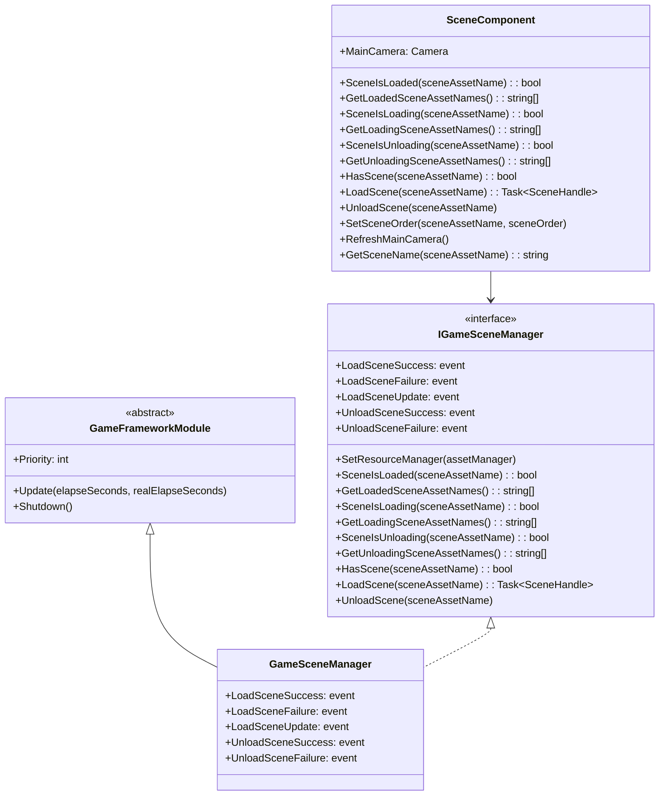
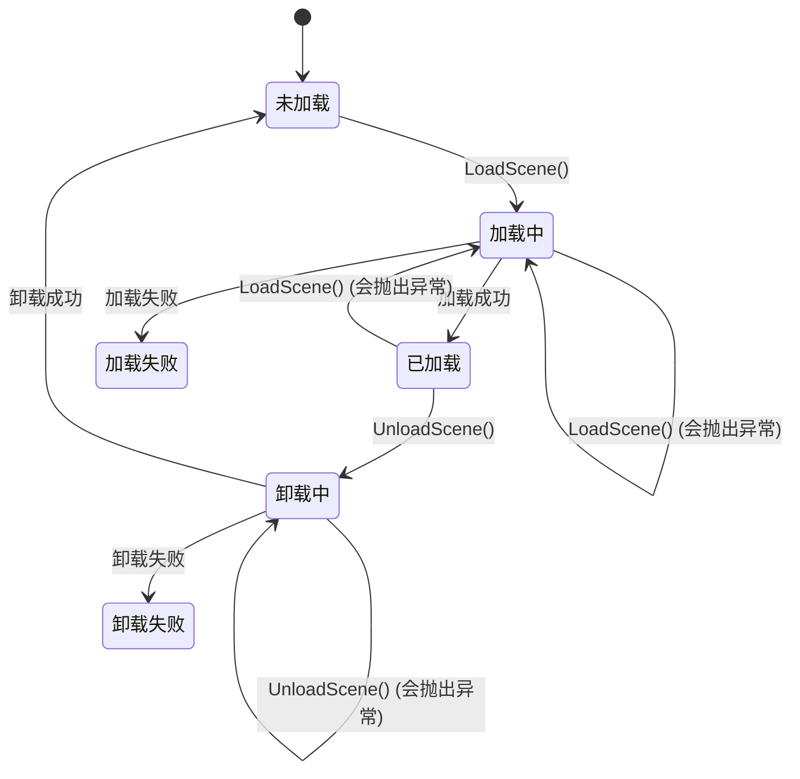

# API 参考

本文档详细介绍 GameFrameX Scene 场景管理组件提供的所有公共 API，包括接口定义、方法签名、参数说明以及返回值类型。

## 概述

GameFrameX Scene 组件提供了一套完整的场景管理解决方案，主要包含两个核心类：

- **IGameSceneManager** - 场景管理器的抽象接口，定义了场景操作的标准契约
- **GameSceneManager** - IGameSceneManager 的具体实现，继承自 GameFrameworkModule
- **SceneComponent** - Unity 组件封装，提供 Unity 集成和场景激活顺序管理

组件依赖 YooAsset 资源管理系统进行场景资源的异步加载和卸载。

## 类图



## IGameSceneManager 接口

`IGameSceneManager` 是场景管理器的核心接口，定义了所有场景操作的标准方法。

> Source: [IGameSceneManager.cs](https://github.com/GameFrameX/com.gameframex.unity.scene/blob/main/Runtime/Scene/Scene/IGameSceneManager.cs#L1-L175)

### 事件定义

| 事件名称 | 事件类型 | 描述 |
|---------|---------|------|
| LoadSceneSuccess | EventHandler~LoadSceneSuccessEventArgs~ | 场景加载成功时触发 |
| LoadSceneFailure | EventHandler~LoadSceneFailureEventArgs~ | 场景加载失败时触发 |
| LoadSceneUpdate | EventHandler~LoadSceneUpdateEventArgs~ | 场景加载进度更新时触发 |
| UnloadSceneSuccess | EventHandler~UnloadSceneSuccessEventArgs~ | 场景卸载成功时触发 |
| UnloadSceneFailure | EventHandler~UnloadSceneFailureEventArgs~ | 场景卸载失败时触发 |

### `SetResourceManager(assetManager: IAssetManager): void`

设置资源管理器。在使用场景管理器之前必须先调用此方法设置 IAssetManager 实现。

**参数：**
- `assetManager` (IAssetManager): 资源管理器实例，不能为 null

**抛出：**
- `GameFrameworkException`: 当 assetManager 为 null 时抛出

---

### `SceneIsLoaded(sceneAssetName: string): bool`

检查指定场景是否已加载。

**参数：**
- `sceneAssetName` (string): 场景资源名称

**返回：** 
- (bool): 场景已加载返回 true，否则返回 false

**抛出：**
- `GameFrameworkException`: 当 sceneAssetName 为空或 null 时抛出

---

### `GetLoadedSceneAssetNames(): string[]`

获取所有已加载场景的资源名称。

**返回：** 
- (string[]): 已加载场景的资源名称数组

---

### `GetLoadedSceneAssetNames(results: List<string>): void`

获取所有已加载场景的资源名称（使用列表参数避免内存分配）。

**参数：**
- `results` (`List<string>`): 用于存储结果的列表，不能为 null

**抛出：**
- `GameFrameworkException`: 当 results 为 null 时抛出

---

### `SceneIsLoading(sceneAssetName: string): bool`

检查指定场景是否正在加载。

**参数：**
- `sceneAssetName` (string): 场景资源名称

**返回：** 
- (bool): 场景正在加载返回 true，否则返回 false

**抛出：**
- `GameFrameworkException`: 当 sceneAssetName 为空或 null 时抛出

---

### `GetLoadingSceneAssetNames(): string[]`

获取所有正在加载场景的资源名称。

**返回：** 
- (string[]): 正在加载场景的资源名称数组

---

### `GetLoadingSceneAssetNames(results: List<string>): void`

获取所有正在加载场景的资源名称（使用列表参数避免内存分配）。

**参数：**
- `results` (`List<string>`): 用于存储结果的列表，不能为 null

**抛出：**
- `GameFrameworkException`: 当 results 为 null 时抛出

---

### `SceneIsUnloading(sceneAssetName: string): bool`

检查指定场景是否正在卸载。

**参数：**
- `sceneAssetName` (string): 场景资源名称

**返回：** 
- (bool): 场景正在卸载返回 true，否则返回 false

**抛出：**
- `GameFrameworkException`: 当 sceneAssetName 为空或 null 时抛出

---

### `GetUnloadingSceneAssetNames(): string[]`

获取所有正在卸载场景的资源名称。

**返回：** 
- (string[]): 正在卸载场景的资源名称数组

---

### `GetUnloadingSceneAssetNames(results: List<string>): void`

获取所有正在卸载场景的资源名称（使用列表参数避免内存分配）。

**参数：**
- `results` (`List<string>`): 用于存储结果的列表，不能为 null

**抛出：**
- `GameFrameworkException`: 当 results 为 null 时抛出

---

### `HasScene(sceneAssetName: string): bool`

检查场景资源是否存在。

**参数：**
- `sceneAssetName` (string): 要检查的场景资源名称

**返回：** 
- (bool): 场景资源存在返回 true，否则返回 false

---

### `LoadScene(sceneAssetName: string): Task<SceneHandle>`

加载场景（使用默认参数）。以 Single 模式加载场景，不携带用户数据。

**参数：**
- `sceneAssetName` (string): 场景资源名称

**返回：** 
- (Task~SceneHandle~): 异步操作任务，完成后返回 SceneHandle

**重载方法：**
```csharp
Task<SceneHandle> LoadScene(string sceneAssetName, object userData)
Task<SceneHandle> LoadScene(string sceneAssetName, LoadSceneMode sceneMode, object userData)
```

**参数说明：**
- `sceneAssetName` (string): 场景资源名称（如 "Assets/Scenes/Game.unity"）
- `sceneMode` (LoadSceneMode): 加载模式，Single 或 Additive
- `userData` (object): 用户自定义数据，会在事件中回传

**抛出：**
- `GameFrameworkException`: 当 sceneAssetName 为空或 null 时抛出
- `GameFrameworkException`: 当未设置资源管理器时抛出
- `GameFrameworkException`: 当场景正在卸载时抛出
- `GameFrameworkException`: 当场景正在加载时抛出
- `GameFrameworkException`: 当场景已加载时抛出

---

### `UnloadScene(sceneAssetName: string): void`

卸载场景（使用默认参数）。不携带用户数据。

**参数：**
- `sceneAssetName` (string): 场景资源名称

**重载方法：**
```csharp
void UnloadScene(string sceneAssetName, object userData)
```

**参数说明：**
- `sceneAssetName` (string): 场景资源名称
- `userData` (object): 用户自定义数据，会在事件中回传

**抛出：**
- `GameFrameworkException`: 当 sceneAssetName 为空或 null 时抛出
- `GameFrameworkException`: 当未设置资源管理器时抛出
- `GameFrameworkException`: 当场景正在卸载时抛出
- `GameFrameworkException`: 当场景正在加载时抛出
- `GameFrameworkException`: 当场景未加载时抛出

---

## SceneComponent 类

SceneComponent 是 Unity 组件封装，继承自 GameFrameworkComponent，提供与 Unity 生态系统的集成。

> Source: [SceneComponent.cs](https://github.com/GameFrameX/com.gameframex.unity.scene/blob/main/Runtime/Scene/SceneComponent.cs#L1-L472)

### 属性

| 属性名 | 类型 | 描述 |
|-------|------|------|
| MainCamera | Camera | 获取当前场景的主摄像机 |

### 序列化字段

| 字段名 | 类型 | 默认值 | 描述 |
|-------|------|--------|------|
| m_EnableLoadSceneUpdateEvent | bool | true | 是否启用场景加载更新事件 |
| m_EnableLoadSceneDependencyAssetEvent | bool | true | 是否启用场景依赖资源加载事件 |

---

### `GetSceneName(sceneAssetName: string): string`

从场景资源路径中提取场景名称。

**参数：**
- `sceneAssetName` (string): 场景资源路径（如 "Assets/Scenes/Game.unity"）

**返回：** 
- (string): 场景名称（如 "Game"），无效输入返回 null

**示例：**
```csharp
// 输入: "Assets/Scenes/MainMenu.unity"
// 输出: "MainMenu"
string sceneName = SceneComponent.GetSceneName("Assets/Scenes/MainMenu.unity");
```
> Source: [SceneComponent.cs](https://github.com/GameFrameX/com.gameframex.unity.scene/blob/main/Runtime/Scene/SceneComponent.cs#L144-L167)

---

### `LoadScene(sceneAssetName: string): Task<SceneHandle>`

加载场景（使用默认参数）。以 Additive 模式加载场景。

> 注意：SceneComponent 的默认加载模式为 Additive，与 IGameSceneManager 的默认模式（Single）不同。

**参数：**
- `sceneAssetName` (string): 场景资源名称

**返回：** 
- (Task~SceneHandle~): 异步操作任务，完成后返回 SceneHandle

**重载方法：**
```csharp
Task<SceneHandle> LoadScene(string sceneAssetName, LoadSceneMode sceneMode, object userData = null)
```

**验证规则：**
- sceneAssetName 必须以 "Assets/" 开头
- sceneAssetName 必须以 ".unity" 结尾

**示例：**
```csharp
// 异步加载场景
var sceneComponent = GameEntry.GetComponent<SceneComponent>();
var handle = await sceneComponent.LoadScene("Assets/Scenes/Game.unity", LoadSceneMode.Additive);
Debug.Log($"场景加载完成，耗时: {handle.Duration}");
```
> Source: [SceneComponent.cs](https://github.com/GameFrameX/com.gameframex.unity.scene/blob/main/Runtime/Scene/SceneComponent.cs#L280-L307)

---

### `UnloadScene(sceneAssetName: string, userData: object = null): void`

卸载场景。

**参数：**
- `sceneAssetName` (string): 场景资源名称
- `userData` (object): 用户自定义数据（可选）

**验证规则：**
- sceneAssetName 必须以 "Assets/" 开头
- sceneAssetName 必须以 ".unity" 结尾

**示例：**
```csharp
var sceneComponent = GameEntry.GetComponent<SceneComponent>();
sceneComponent.UnloadScene("Assets/Scenes/MainMenu.unity");
```
> Source: [SceneComponent.cs](https://github.com/GameFramex.unity.scene/blob/main/Runtime/Scene/SceneComponent.cs#L314-L331)

---

### `SetSceneOrder(sceneAssetName: string, sceneOrder: int): void`

设置场景的激活顺序。该方法用于管理多个 Additive 加载场景时的活动场景优先级。

**参数：**
- `sceneAssetName` (string): 场景资源名称
- `sceneOrder` (int): 场景顺序，数值越大优先级越高

**行为说明：**
- 如果场景正在加载，将场景顺序记录到内部字典，待加载完成后应用
- 如果场景已加载，立即刷新场景顺序
- 如果场景未加载也未加载中，记录错误日志

**示例：**
```csharp
var sceneComponent = GameEntry.GetComponent<SceneComponent>();
// 设置 Main 场景的优先级最高
sceneComponent.SetSceneOrder("Assets/Scenes/Main.unity", 100);
sceneComponent.SetSceneOrder("Assets/Scenes/UI.unity", 50);
```
> Source: [SceneComponent.cs](https://github.com/GameFrameX/com.gameframex.unity.scene/blob/main/Runtime/Scene/SceneComponent.cs#L338-L367)

---

### `RefreshMainCamera(): void`

刷新当前场景的主摄像机引用。通常在场景加载或激活场景变更后调用。

> Source: [SceneComponent.cs](https://github.com/GameFrameX/com.gameframex.unity.scene/blob/main/Runtime/Scene/SceneComponent.cs#L372-L375)

---

## 事件参数类

所有场景事件参数类都继承自 GameEventArgs，并实现了 Create 工厂方法和 Clear 方法用于对象池管理。

> Source: [LoadSceneSuccessEventArgs.cs](https://github.com/GameFrameX/com.gameframex.unity.scene/blob/main/Runtime/EventArgs/LoadSceneSuccessEventArgs.cs#L1-L106)

### LoadSceneSuccessEventArgs

场景加载成功事件参数。

| 属性名 | 类型 | 描述 |
|-------|------|------|
| SceneAssetName | string | 场景资源名称 |
| Duration | float | 加载持续时间（秒） |
| UserData | object | 用户自定义数据 |

**事件 ID:** `GameFrameX.Scene.Runtime.LoadSceneSuccessEventArgs`

---

### LoadSceneFailureEventArgs

场景加载失败事件参数。

| 属性名 | 类型 | 描述 |
|-------|------|------|
| SceneAssetName | string | 场景资源名称 |
| ErrorMessage | string | 错误信息 |
| UserData | object | 用户自定义数据 |
| Status | EOperationStatus | 操作状态 |

**事件 ID:** `GameFrameX.Scene.Runtime.LoadSceneFailureEventArgs`

> Source: [LoadSceneFailureEventArgs.cs](https://github.com/GameFrameX/com.gameframex.unity.scene/blob/main/Runtime/EventArgs/LoadSceneFailureEventArgs.cs#L1-L114)

---

### LoadSceneUpdateEventArgs

场景加载进度更新事件参数。

| 属性名 | 类型 | 描述 |
|-------|------|------|
| SceneAssetName | string | 场景资源名称 |
| Progress | float | 加载进度（0.0 - 1.0） |
| UserData | object | 用户自定义数据 |

**事件 ID:** `GameFrameX.Scene.Runtime.LoadSceneUpdateEventArgs`

> Source: [LoadSceneUpdateEventArgs.cs](https://github.com/GameFrameX/com.gameframex.unity.scene/blob/main/Runtime/EventArgs/LoadSceneUpdateEventArgs.cs#L1-L106)

---

### UnloadSceneSuccessEventArgs

场景卸载成功事件参数。

| 属性名 | 类型 | 描述 |
|-------|------|------|
| SceneAssetName | string | 场景资源名称 |
| UserData | object | 用户自定义数据 |

**事件 ID:** `GameFrameX.Scene.Runtime.UnloadSceneSuccessEventArgs`

> Source: [UnloadSceneSuccessEventArgs.cs](https://github.com/GameFrameX/com.gameframex.unity.scene/blob/main/Runtime/EventArgs/UnloadSceneSuccessEventArgs.cs#L1-L97)

---

### UnloadSceneFailureEventArgs

场景卸载失败事件参数。

| 属性名 | 类型 | 描述 |
|-------|------|------|
| SceneAssetName | string | 场景资源名称 |
| UserData | object | 用户自定义数据 |

**事件 ID:** `GameFrameX.Scene.Runtime.UnloadSceneFailureEventArgs`

> Source: [UnloadSceneFailureEventArgs.cs](https://github.com/GameFrameX/com.gameframex.unity.scene/blob/main/Runtime/EventArgs/UnloadSceneFailureEventArgs.cs#L1-L97)

---

### ActiveSceneChangedEventArgs

激活场景变更事件参数。

| 属性名 | 类型 | 描述 |
|-------|------|------|
| LastActiveScene | UnityEngine.SceneManagement.Scene | 上一个激活的场景 |
| ActiveScene | UnityEngine.SceneManagement.Scene | 当前激活的场景 |

**事件 ID:** `GameFrameX.Scene.Runtime.ActiveSceneChangedEventArgs`

> Source: [ActiveSceneChangedEventArgs.cs](https://github.com/GameFrameX/com.gameframex.unity.scene/blob/main/Runtime/EventArgs/ActiveSceneChangedEventArgs.cs#L1-L97)

---

## 场景状态流程



---

## 常见使用模式

### 1. 通过 SceneComponent 加载和卸载场景

```csharp
// 获取 SceneComponent 实例
var sceneComponent = GameEntry.GetComponent<SceneComponent>();

// 订阅场景加载成功事件
sceneComponent.LoadSceneSuccess += OnLoadSceneSuccess;

// 加载场景
await sceneComponent.LoadScene("Assets/Scenes/Game.unity", LoadSceneMode.Additive);

private void OnLoadSceneSuccess(object sender, LoadSceneSuccessEventArgs e)
{
    Debug.Log($"场景 {e.SceneAssetName} 加载成功，耗时: {e.Duration}秒");
}
```

> Source: [SceneComponent.cs](https://github.com/GameFrameX/com.gameframex.unity.scene/blob/main/Runtime/Scene/SceneComponent.cs#L437-L446)

---

### 2. 场景切换（单场景模式）

```csharp
var sceneComponent = GameEntry.GetComponent<SceneComponent>();

// 卸载当前场景
sceneComponent.UnloadScene(currentSceneName);

// 加载新场景
await sceneComponent.LoadScene(newSceneName, LoadSceneMode.Single);
```

---

### 3. 多场景管理（ additive 模式）

```csharp
var sceneComponent = GameEntry.GetComponent<SceneComponent>();

// 加载基础场景
await sceneComponent.LoadScene("Assets/Scenes/Base.unity", LoadSceneMode.Additive);

// 加载游戏玩法场景
await sceneComponent.LoadScene("Assets/Scenes/Gameplay.unity", LoadSceneMode.Additive);

// 加载 UI 场景（优先级最高）
sceneComponent.SetSceneOrder("Assets/Scenes/UI.unity", 100);
await sceneComponent.LoadScene("Assets/Scenes/UI.unity", LoadSceneMode.Additive);
```

---

### 4. 处理场景加载失败

```csharp
var sceneComponent = GameEntry.GetComponent<SceneComponent>();

sceneComponent.LoadSceneFailure += OnLoadSceneFailure;

try 
{
    await sceneComponent.LoadScene("Assets/Scenes/Game.unity");
}
catch (Exception ex)
{
    Debug.LogError($"场景加载异常: {ex.Message}");
}

private void OnLoadSceneFailure(object sender, LoadSceneFailureEventArgs e)
{
    Debug.LogError($"场景加载失败: {e.ErrorMessage}");
    // 可以在这里显示错误 UI 或执行其他恢复逻辑
}
```

---

### 5. 监听活动场景变化

```csharp
var sceneComponent = GameEntry.GetComponent<SceneComponent>();

// 注意：ActiveSceneChangedEventArgs 通过 EventComponent 触发
// 需要通过事件系统订阅
```

> 关于事件系统的详细使用，请参见 [事件系统](./6-events) 文档。

---

## 错误处理

场景管理器在以下情况会抛出 GameFrameworkException：

| 错误场景 | 异常消息 |
|---------|---------|
| sceneAssetName 为空 | "Scene asset name is invalid." |
| assetManager 未设置 | "You must set resource manager first." |
| 场景正在卸载 | "Scene asset '{0}' is being unloaded." |
| 场景正在加载 | "Scene asset '{0}' is being loaded." |
| 场景已加载 | "Scene asset '{0}' is already loaded." |
| 场景未加载 | "Scene asset '{0}' is not loaded yet." |

> Source: [GameSceneManager.cs](https://github.com/GameFrameX/com.gameframex.unity.scene/blob/main/Runtime/Scene/Scene/GameSceneManager.cs#L350-L373)

---

## 相关链接

- [核心功能](./4-core-features) - 了解场景管理的核心功能设计
- [事件系统](./6-events) - 了解事件系统的详细使用
- [快速入门](./3-getting-started) - 快速开始使用场景组件
- [常见问题](./7-troubleshooting) - 常见问题与解决方案
