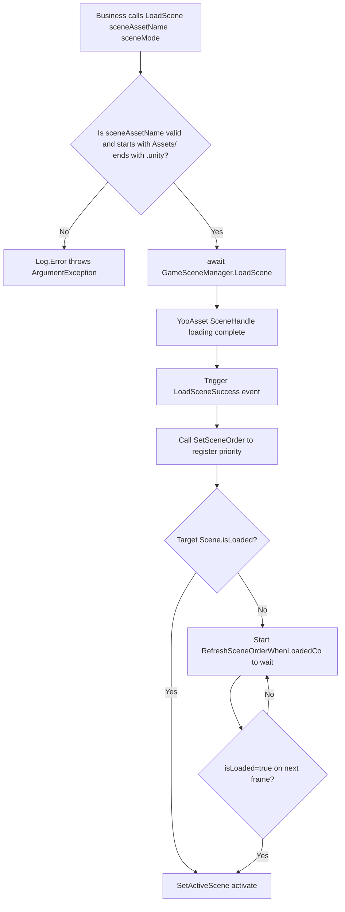

# How It Works: Async Loading and Active Scene Ordering

`SceneComponent` implements **async loading** based on YooAsset's `SceneHandle`, and when multiple scenes are stacked (Additive), it selects the current active scene through the `m_SceneOrder` sorted dictionary and `RefreshSceneOrder()`. This article explains the key flow from calling `LoadScene` to Unity's `SetActiveScene`.

## Key Fields Overview

| Field | Type | Purpose |
|------|------|---------|
| `m_SceneOrder` | `SortedDictionary<string,int>` | Records the active priority of each `sceneAssetName` (higher value = higher priority) |
| `m_GameFrameworkScene` | `UnityEngine.SceneManagement.Scene` | Framework's built-in scene; falls back to this scene when no business scenes are loaded |
| `m_RefreshSceneOrderCo` | `Coroutine` | Retry coroutine for when YooAsset has completed but Unity's `isLoaded` is not yet `true` |
| `DefaultPriority` | `const int = 0` | Default priority constant |
| `m_EnableLoadSceneUpdateEvent` | `bool` | Whether to enable the `LoadSceneUpdate` progress event (default `true`) |

See the field definitions at [SceneComponent.cs](https://github.com/GameFrameX/com.gameframex.unity.scene/blob/main/Runtime/Scene/SceneComponent.cs#L51-L65).

## Async Loading Flow

`SceneComponent.LoadScene` returns `Task<YooAsset.SceneHandle>` and internally forwards the request to `GameSceneManager`. The latter maintains three dictionaries to distinguish loading states:

| Dictionary | Meaning |
|------------|---------|
| `m_LoadedSceneAssetNames` | Successfully loaded scene resources |
| `m_LoadingSceneAssetNames` | Scenes currently being loaded (holds `SceneHandleData`) |
| `m_UnloadingSceneAssetNames` | Scenes currently being unloaded |

See the dictionaries and initialization logic at [GameSceneManager.cs](https://github.com/GameFrameX/com.gameframex.unity.scene/blob/main/Runtime/Scene/Scene/GameSceneManager.cs#L59-L84).

`SceneComponent.Awake()` subscribes to five events on `GameSceneManager`: `LoadSceneSuccess`, `LoadSceneFailure`, `LoadSceneUpdate` (enabled by default), `UnloadSceneSuccess`, and `UnloadSceneFailure`. Subscription code:

```csharp
_gameSceneManager.LoadSceneSuccess += OnLoadGameSceneSuccess;
_gameSceneManager.LoadSceneFailure += OnLoadGameSceneFailure;
if (m_EnableLoadSceneUpdateEvent)
{
    _gameSceneManager.LoadSceneUpdate += OnLoadGameSceneUpdate;
}
_gameSceneManager.UnloadSceneSuccess += OnUnloadGameSceneSuccess;
_gameSceneManager.UnloadSceneFailure += OnUnloadGameSceneFailure;
```

Source: [SceneComponent.cs](https://github.com/GameFrameX/com.gameframex.unity.scene/blob/main/Runtime/Scene/SceneComponent.cs#L91-L105)

The public signature of `LoadScene` looks like:

```csharp
public async Task<YooAsset.SceneHandle> LoadScene(
    string sceneAssetName,
    UnityEngine.SceneManagement.LoadSceneMode sceneMode,
    object userData = null);
```

It validates that `sceneAssetName` must start with `Assets/` and end with `.unity`, then `await`s the underlying `GameSceneManager.LoadScene`.

Source: [SceneComponent.cs](https://github.com/GameFrameX/com.gameframex.unity.scene/blob/main/Runtime/Scene/SceneComponent.cs#L306-L322)

## Active Scene Ordering Mechanism

The core entry points for ordering and activation are `SetSceneOrder` and `RefreshSceneOrder`.

```csharp
public void SetSceneOrder(string sceneAssetName, int sceneOrder)
{
    // ... validate that sceneAssetName is legal ...
    if (SceneIsLoading(sceneAssetName))
    {
        m_SceneOrder[sceneAssetName] = sceneOrder;
        return;
    }
    if (SceneIsLoaded(sceneAssetName))
    {
        m_SceneOrder[sceneAssetName] = sceneOrder;
        RefreshSceneOrder();
        return;
    }
    Log.Error("Scene '{0}' is not loaded or loading.", sceneAssetName);
}
```

Source: [SceneComponent.cs](https://github.com/GameFrameX/com.gameframex.unity.scene/blob/main/Runtime/Scene/SceneComponent.cs#L352-L381)

How `RefreshSceneOrder` works:

1. Iterate over `m_SceneOrder`, skip scenes that are still loading (`SceneIsLoading`), and pick the one with the largest `sceneOrder.Value` as the candidate active scene.
2. If all scenes are still loading or the dictionary is empty, `SetActiveScene(m_GameFrameworkScene)` falls back to the framework scene.
3. Obtain the Unity scene object via `SceneManager.GetSceneByName(GetSceneName(maxSceneName))`. If `scene.isLoaded == false` — YooAsset's `await` completion timing is usually **earlier than** Unity's `isLoaded=true` — calling `SetActiveScene` directly would throw an `ArgumentException`.

At this point, `RefreshSceneOrder` will start the coroutine `RefreshSceneOrderWhenLoadedCo`, waiting for `isLoaded` to become `true` on the next frame before activating. It also `StopCoroutine`s the old coroutine of the same name to avoid contention with the new coroutine over the activation order.

Source: [SceneComponent.cs](https://github.com/GameFrameX/com.gameframex.unity.scene/blob/main/Runtime/Scene/SceneComponent.cs#L392-L437)



## Event Payloads (EventArgs)

The async loading process dispatches events through `GameFrameX.Runtime`'s object pool. All payloads are `GameEventArgs` subclasses, which are explicitly referenced by the AOT cropping helper in [GameFrameXSceneCroppingHelper.cs](https://github.com/GameFrameX/com.gameframex.unity.scene/blob/main/Runtime/GameFrameXSceneCroppingHelper.cs#L10-L21) to prevent being incorrectly stripped.

| Event | Payload Class | Purpose |
|-------|---------------|---------|
| `LoadSceneSuccess` | `LoadSceneSuccessEventArgs` | Load success |
| `LoadSceneFailure` | `LoadSceneFailureEventArgs` | Load failure (includes `Status`, `ErrorMessage`) |
| `LoadSceneUpdate` | `LoadSceneUpdateEventArgs` | Progress update |
| `UnloadSceneSuccess` | `UnloadSceneSuccessEventArgs` | Unload success |
| `UnloadSceneFailure` | `UnloadSceneFailureEventArgs` | Unload failure |
| `ActiveSceneChanged` | `ActiveSceneChangedEventArgs` | Unity active scene change |

## Related Links

- [SceneComponent.cs](https://github.com/GameFrameX/com.gameframex.unity.scene/blob/main/Runtime/Scene/SceneComponent.cs#L294-L343) — `LoadScene`/`UnloadScene`/`SetSceneOrder` entry points
- [GameSceneManager.cs](https://github.com/GameFrameX/com.gameframex.unity.scene/blob/main/Runtime/Scene/Scene/GameSceneManager.cs#L145-L164) — Async loading implementation, Update, Shutdown reclaims all loaded scenes
- [IGameSceneManager.cs](https://github.com/GameFrameX/com.gameframex.unity.scene/blob/main/Runtime/Scene/Scene/IGameSceneManager.cs) — Manager interface contract
- [GameFrameXSceneCroppingHelper.cs](https://github.com/GameFrameX/com.gameframex.unity.scene/blob/main/Runtime/GameFrameXSceneCroppingHelper.cs) — AOT cropping helper class
- Related EventArgs: `LoadSceneSuccessEventArgs`, `LoadSceneFailureEventArgs`, `LoadSceneUpdateEventArgs`, `UnloadSceneSuccessEventArgs`, `UnloadSceneFailureEventArgs`, `ActiveSceneChangedEventArgs` (all located in `Runtime/EventArgs/`)